# semstrait

A **manifest compiler + semantic query engine** written in Rust.

semstrait resolves semantic models (defined in YAML) into engine-executable plans by:
1. Compiling YAML model files into a validated `CompiledManifest` artifact (offline)
2. Planning `QueryRequest`s against that manifest into a `LogicalPlan` IR (online)
3. Emitting the plan as dialect-specific SQL or Substrait bytes (online)
4. Optionally executing against a compute engine (DataFusion, DuckDB, etc.)

---

## Architecture

The system is organized as a layered crate workspace. Each layer depends only on the layers below it.

### Diagram: Crate Layer Architecture


### Diagram: System Pipeline


### Crate Map

```
semstrait/                       Cargo workspace root
├── crates/
│   ├── semstrait-core/          Foundation — shared primitives, zero internal deps
│   ├── semstrait-model/         YAML model parsing and ref resolution
│   ├── semstrait-catalog/       CatalogProvider trait + Iceberg REST catalog
│   ├── semstrait-manifest/      ManifestCompiler pipeline (parse → validate → compile)
│   ├── semstrait-ir/            PlanNode IR + Substrait bridge
│   ├── semstrait-planner/       SemanticPlanner + KindPlanners + Optimizer
│   ├── semstrait-sql/           SqlEmitter trait + dialect implementations
│   ├── semstrait-connectors/    Compute traits + feature-gated engine impls
│   ├── semstrait-api/           REST + CLI + gRPC transports (feature-gated)
│   └── semstrait/               Facade — builder, public API, feature flags
├── tests/
│   ├── fixtures/models/         Shared YAML model fixtures for integration tests
│   ├── e2e_pipeline_test.rs     Workspace-level E2E tests
│   └── test_helpers.rs          Fixture loading utilities
└── docs/                        Architecture diagrams and design documents
```

### Dependency Graph

```
semstrait-core                    (zero internal deps — foundation)
    ├── semstrait-model           (YAML types, ref resolution)
    ├── semstrait-catalog         (CatalogProvider trait)
    └── semstrait-ir              (PlanNode, Substrait bridge)
            │
semstrait-manifest                (core + model + catalog)
            │
    ├── semstrait-planner         (core + ir + manifest)
    └── semstrait-sql             (core + ir)
            │
semstrait-connectors              (core + ir + sql)
            │
    ├── semstrait-api             (planner + manifest + connectors + sql)
    └── semstrait (facade)        (all crates, re-exports)
```

Dependencies flow strictly downward. No cycles.

---

## Core Concepts

### Semantic Model

A semantic model is a YAML file that declares a queryable interface over physical data:

```yaml
semantic_model:
  name: sales
  kinds:
    - name: orders
      type:
        grainset:
      dimensions:
        - name: order_date
          data_type: date
          type:
            temporal:
              grains: [day, month, year]
        - name: region
          data_type: string
          type:
            categorical:
      measures:
        - name: revenue
          data_type: float64
          expr: "SUM(amount)"
      metrics:
        - name: avg_order_value
          data_type: float64
          expr: "revenue / COUNT(order_id)"
      datasets:
        - name: orders_daily
          extras:
            column_mapping:
              order_date: created_at
              region: region_code
              revenue: total_amount
            storage:
              path: warehouse.fact_orders_daily
```

### Kind Types

Kinds define how datasets relate to each other:

| Kind | Strategy | Use Case |
|------|----------|----------|
| **Grainset** | Route to cheapest covering dataset | Multiple aggregation levels of the same data |
| **Unionset** | UNION ALL with NULL-fill | Same schema across multiple sources |
| **Joinset** | BFS join chain from anchor | Related datasets with different schemas |

### Additional Architecture Diagrams

| Diagram | Description |
|---------|-------------|
| [D3 - Planner Evaluation Order](docs/D3_planner_evaluation_order.svg) | Steps within SemanticPlanner.plan() |
| [D4 - PlanNode Substrait Map](docs/D4_plannode_substrait_map.svg) | PlanNode variant to Substrait Rel correspondence |
| [D5 - Kind Interface Binding](docs/D5_kind_interface_binding.svg) | Three layers of Kind: interface, strategy, binding |
| [D6 - Connector Architecture](docs/D6_connector_architecture.svg) | Compute emit/adapt/execute pipeline |

---

## Compilation Pipeline

```
QueryRequest + CompiledManifest
       │  ConstraintEvaluator    step 0: pre-resolution validity gate
       ▼
 SemanticPlanner
       │  KindPlanner dispatch   Grainset | Unionset | Joinset
       │  AdditivityResolver     semi/non-additive measure handling
       │  Filter injection       dataset → measure (conditional agg) → user
       ▼
 LogicalPlan (PlanNode IR)
       │
       ├─ SqlEmitter           → String  (dialect-specific via sqlparser-rs AST)
       └─ SubstraitSerializer  → substrait::proto::Plan → Vec<u8>
       ▼
 ComputeConnector (optional)  → ComputeResult (Arrow RecordBatches or JSON)
```

---

## DSL Expressions

All computations are expressed via a typed DSL — raw SQL strings are rejected at compile time:

```yaml
# Aggregations
expr: "SUM(amount)"
expr: "COUNT(DISTINCT customer_id)"
expr: "AVG(price)"

# Arithmetic (metrics)
expr: "revenue / order_count"

# Safe division (NULL when divisor is 0)
expr: "SAFE_DIVIDE(revenue, order_count)"

# Conditional
expr: "CASE WHEN status = 'active' THEN amount END"

# Date truncation
expr: "DATE_TRUNC('month', order_date)"
```

---

## Quick Start

### Library Usage

```rust
use semstrait::SemstraitBuilder;

let sem = SemstraitBuilder::new()
    .with_manifest_yaml(yaml_str)
    .build()
    .await?;

let sql = sem.explain(&request).await?;
println!("SQL: {}", sql);
```

### SemstraitEngine (API layer)

```rust
use semstrait_api::{SemstraitEngine, RawQueryRequest};

let engine = SemstraitEngine::with_manifest_yaml(yaml).await?;

let result = engine.explain(&RawQueryRequest {
    kind: "orders".into(),
    dimensions: vec!["region".into()],
    measures: vec!["revenue".into()],
    ..Default::default()
}).await?;

println!("SQL: {}", result.sql.unwrap());
```

---

## Feature Flags

| Crate | Feature | Adds |
|-------|---------|------|
| `semstrait-connectors` | `datafusion` | DataFusion SQL execution connector |
| `semstrait-connectors` | `duckdb` | DuckDB embedded connector (v1.3.2, Arrow 55) |
| `semstrait-connectors` | `trino` | Trino connector (stub) |
| `semstrait-catalog` | `iceberg` | Iceberg REST catalog client (OAuth2, Polaris) |
| `semstrait-api` | `cli` | CLI transport via clap |
| `semstrait-api` | `rest` | REST transport via axum |
| `semstrait-api` | `grpc` | gRPC transport via tonic |

---

## Development

```bash
# Build all crates
cargo build --workspace

# Run all tests (239 tests)
cargo test --workspace

# Run with DataFusion connector
cargo test --workspace --features semstrait-connectors/datafusion

# Run with Iceberg catalog
cargo test --workspace --features semstrait-catalog/iceberg
```

---

## Test Fixtures

Integration tests load YAML model definitions from `tests/fixtures/models/` rather than inline strings. Available fixtures:

| Fixture | Description |
|---------|-------------|
| `orders_basic` | 3 dims, 2 measures, 1 metric — full-featured model |
| `orders_constrained` | Measure with `one_of` dimension constraint |
| `orders_3dim` | 3 dims (date/region/customer), 1 measure |
| `orders_simple` | Minimal: 1 dim, 1 measure |
| `orders_with_metrics` | 2 dims, 1 measure — for API engine tests |
| `products` | 2 dims, 1 measure — for filter/order tests |
| `transactions_multi_measure` | 1 dim, 3 measures |
| `sales_constrained` | Sales kind with dimension constraint |
| `raw_sql_invalid` | Raw SQL in expr — compile rejection test |

---

## License

Apache 2.0. See [LICENSE](LICENSE).
