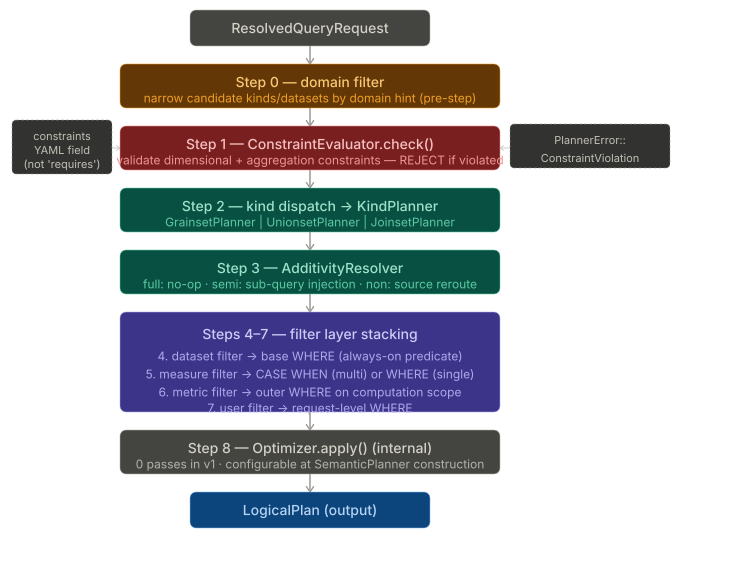
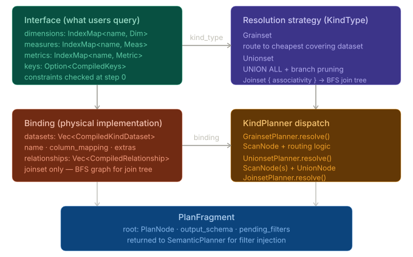

# semstrait-planner

Semantic query planner with kind-specific planning strategies.

Builds a `LogicalPlan` from a `ResolvedQueryRequest` + `CompiledManifest` by dispatching to the appropriate kind planner, resolving additivity, injecting filters, and applying the optimizer.

---

## Planning Pipeline

The planner follows a 12-step pipeline (synchronous, not async):

```
ResolvedQueryRequest + CompiledManifest
       |
  1. ConstraintEvaluator::check()     pre-resolution validity gate
  2. Kind lookup                       resolve entity_name -> CompiledKind
  3. Domain filter                     narrow datasets by domain_hint
  4. KindPlannerRegistry::dispatch()   route to Grainset|Unionset|Joinset planner
  5. PlannerContext                    manifest + profile + catalog + session
  6. KindPlanner::resolve()           build PlanFragment
  7. AdditivityResolver               semi/non-additive measure handling
  8. Filter injection                 kind-level -> user filters
  9. ORDER BY                         SortNode from request.order_by
 10. LIMIT                            FetchNode from request.limit
 11. Build LogicalPlan                root + output_names
 12. Optimizer::apply()               identity in v1 (zero passes)
       |
       v
  LogicalPlan
```

### Diagram: Planner Evaluation Order



Shows the step-by-step evaluation within `SemanticPlanner::plan()` -- constraint checks, kind dispatch, additivity resolution, filter stacking, and optimizer application.

---

## Kind Planners

Each `KindType` has a dedicated planner that builds the initial `PlanFragment`:

| Kind | Strategy | Planner |
|------|----------|---------|
| **Grainset** | Route to cheapest covering dataset | `GrainsetPlanner` |
| **Unionset** | UNION ALL with NULL-fill for missing columns | `UnionsetPlanner` |
| **Joinset** | BFS join chain from anchor dataset | `JoinsetPlanner` |

### Diagram: Kind Interface Binding



Shows the three layers of a Kind: the **interface** (dimensions, measures, metrics, constraints) that users query; the **strategy** (`KindType`) that determines plan structure; and the **binding** (datasets, column mappings, relationships) that connects to physical data.

---

## Key Types

```rust
// The main entry point.
pub struct SemanticPlanner { .. }

impl SemanticPlanner {
    pub fn builder() -> SemanticPlannerBuilder;
    pub fn plan(&self, request: &ResolvedQueryRequest, manifest: &CompiledManifest)
        -> Result<LogicalPlan, PlannerError>;
}

// Resolved query request (produced by RequestParser).
pub struct ResolvedQueryRequest {
    pub entity_name: String,
    pub dimensions: Vec<String>,
    pub measures: Vec<String>,
    pub filters: Vec<QueryFilter>,
    pub order_by: Vec<OrderByClause>,
    pub limit: Option<u64>,
    pub grain: Option<String>,
    pub domain_hint: Option<String>,
    pub session_variables: SessionVariables,
}
```

---

## Filter Injection Order

Filters are layered in a specific order (inner to outer):

1. **Dataset filters** -- from dataset binding (v1: skipped)
2. **Measure filters** -- conditional aggregation (`CASE WHEN filter THEN expr ELSE NULL END`), applied inside KindPlanner
3. **Metric filters** -- same conditional aggregation pattern, applied during expression lowering
4. **Kind-level filters** -- injected before user filters, apply to all queries against the kind
5. **User filters** -- from the request, outermost `FilterNode`s

---

## Dependencies

- `semstrait-core` -- `ConsumerProfile`, `Expr`, `DataType`
- `semstrait-ir` -- `PlanNode`, `LogicalPlan`, `NodeMeta`
- `semstrait-manifest` -- `CompiledManifest`, `CompiledKind`, model types
- `semstrait-catalog` -- `CatalogProvider` (optional, for schema checks)
