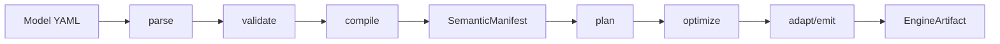

# semstrait Design — Overview

Status: **Ratified (compressed contract edition)**

This document is the contract for the semstrait design tree. It defines vocabulary, layering rules, invariants, and document ownership boundaries used by all other docs under `docs/design/`.

---

## 1. Purpose and Scope

`semstrait` is a semantic modeling and planning layer:

- authors declare Semantics over DataKinds in YAML;
- semstrait compiles YAML into an engine-agnostic `SemanticManifest`;
- query-time planning turns a `Request` into a canonical `SemanticPlan`;
- adapters emit engine-native artifacts (SQL text or structured engine plans).

This design tree specifies **target-state behavior**. Current code is the pre-migration baseline.

Scope boundary:

- **In scope:** canonical model, compile/plan pipeline, API contracts, adapter/catalog seams.
- **Out of scope:** runtime execution inside engines, access control systems, storage lifecycle management.

---

## 2. Audience

- Contributors and reviewers working on semantic architecture and crate contracts.
- AI coding agents operating in spec-driven mode.
- Not an end-user authoring manual; this is an engineering specification.

Required session start for design/spec work:

1. `00_overview.md` (this file)
2. `[STATUS.md](STATUS.md)`

For fast navigation, use `[INDEX.md](INDEX.md)`.

---

## 3. Approach: Canonical-First

semstrait has two conversion boundaries:

1. **YAML -> canonical** at compile time.
2. **canonical -> engine** at adapt time.

Rules:

- Engine vocabulary never leaks into canonical layers.
- Metadata-provider specifics never leak above catalog/provider traits.
- Planner/adapters consume canonical types, not YAML and not engine-specific authoring forms.

Engines and metadata sources are independent axes:

- engines via `semstrait-adapter`;
- metadata sources via `semstrait-catalog`.

---

## 4. Canonical Vocabulary

Detailed semantics live in owning docs. This section is a compact term map; the rightmost column is authoritative.

### 4.1 Core nouns

| Term                        | Meaning (short)                                      | Authoritative doc                                                     |
| --------------------------- | ---------------------------------------------------- | --------------------------------------------------------------------- |
| `DataKind`                  | Queryable unit abstraction, split by structural axes | `data-kinds/20_taxonomy.md`                                           |
| `Dataset`                   | Leaf/simple data kind                                | `data-kinds/21_dataset.md`                                            |
| `Grainset`                  | Grain-aware complex composition                      | `data-kinds/22_grainset.md`                                           |
| `Unionset`                  | Union-composed complex kind                          | `data-kinds/23_unionset.md`                                           |
| `Joinset`                   | Relationship-composed complex kind                   | `data-kinds/24_joinset.md`                                            |
| `SemanticInterface`         | Per-kind Semantics surface                           | `foundations/11_names_and_scopes.md`                                  |
| `ComposedSemanticInterface` | Unified Semantics surface over multiple kinds        | `foundations/16_composition.md`                                       |
| `Relationship`              | Top-level relation between kinds                     | `foundations/16_composition.md`                                       |
| `JoinType`                  | Canonical join kind set                              | `foundations/18_entities.md`                                          |
| `TemporalShape`             | Temporal classification of data behavior             | `foundations/17_temporal_shape.md`                                    |
| `Model` / `SemanticModel`   | YAML source / parsed typed model                     | `apis/32_semstrait_model.md`                                          |
| `SemanticManifest`          | Compile output consumed by planner                   | `apis/33_semstrait_manifest.md`                                       |
| `Request`                   | Query-time semantic request                          | `apis/34_semstrait_planner.md`                                        |
| `SemanticPlan`              | Canonical plan tree                                  | `apis/35_semstrait_ir.md`                                             |
| `EngineArtifact`            | Adapter output artifact                              | `apis/36_semstrait_adapter.md`                                        |
| `Expr`                      | Canonical expression AST (shared trait surface)      | `foundations/14_expressions.md`, `foundations/19_expression_flow.md`  |
| `SemanticExpr` / `PhysicalExpr` | Two-form expression types (Phase A → Phase B)    | `foundations/19_expression_flow.md`                                   |
| `Accessor` / `Parameter`    | Per-entity sugar accessor / compile-emitted placeholder | `foundations/19_expression_flow.md`                                |
| `DimensionRef`              | Structured Request Dimension (name + variation)      | `foundations/19_expression_flow.md`, `apis/34_semstrait_planner.md`   |
| `Additivity`                | Function-tag axis for aggregate composition          | `foundations/19_expression_flow.md`, `foundations/14a_function_catalog.md`, `foundations/18_entities.md` |
| `CanonicalFn`               | Stable canonical function identity                   | `foundations/14a_function_catalog.md`                                 |
| `SemanticMapping`           | Semantics-to-physical mapping contract               | `foundations/15_mapping_and_binding.md`, `foundations/18_entities.md` |
| `Diagnostic<K>`             | Typed diagnostic carrier by stage kind               | `apis/31_semstrait_common.md`, `apis/30_api_contracts.md`               |
| `SemStraitErrorKind`        | Unified API-level kind sum                           | `apis/38_semstrait_api.md`                                            |

### 4.2 Core verbs

| Verb             | Meaning                                     | Authoritative doc                       |
| ---------------- | ------------------------------------------- | --------------------------------------- |
| `parse`          | YAML -> `SemanticModel`                     | `apis/32_semstrait_model.md`            |
| `validate`       | Structural and semantic precondition checks | `foundations/10_resolution_pipeline.md` |
| `compile`        | Model + catalog -> `SemanticManifest`       | `apis/33_semstrait_manifest.md`         |
| `plan`           | Request + manifest -> `SemanticPlan`        | `apis/34_semstrait_planner.md`          |
| `optimize`       | Rule-based plan rewrite pass                | `apis/34_semstrait_planner.md`          |
| `adapt` / `emit` | Canonical plan -> engine artifact           | `apis/36_semstrait_adapter.md`          |

### 4.3 Banned / deprecated terms

Use canonical terms; avoid stale vocabulary:

- `ColumnMapping` -> `SemanticMapping`
- `DataKindOps` omnibus trait language (retired)
- `IntoDiagnostic` trait language (retired)
- stable numeric error-code subsystem language as source-of-truth (`*_E_####` ownership tables)
- `SemstraitErrorKind` spelling -> use `SemStraitErrorKind`

### 4.4 Precedence rule for apparent conflicts

If docs disagree:

1. Check authoritative owner in this file + `[INDEX.md](INDEX.md)`.
2. Earlier-layer contract beats later-layer elaboration unless explicitly scoped extension.
3. If still conflicting, treat as design bug and amend docs; do not keep dual truth.

---

## 5. Pipeline at a Glance

Canonical flow:

Hot-path rule: `plan -> optimize -> adapt` is sync and free of hidden I/O.

---

## 6. Document Map

| Group          | Path                                      | Role                                        |
| -------------- | ----------------------------------------- | ------------------------------------------- |
| Overview       | `00_overview.md`, `STATUS.md`, `INDEX.md` | Contract + session state + navigation       |
| Foundations    | `foundations/*`                           | Cross-cutting canonical semantics           |
| DataKinds      | `data-kinds/*`                            | Variant-specific behavior and applicability |
| APIs           | `apis/*`                                  | Per-crate public contract surfaces          |
| Implementation | `implementation/*`                        | Post-ratification migration stubs/plan      |
| Registry       | `registry/*`                              | Living engine/provider mapping catalogs     |
| Questions      | `questions/{open,closed,deferred}/*`      | Decision lifecycle sidecars                 |

For a task-first entrypoint, use `[INDEX.md](INDEX.md)`.

---

## 7. Diagram Conventions

Mermaid is the default visual format:

- `flowchart`: data/control flow
- `sequenceDiagram`: lifecycle ordering
- `classDiagram`: type relationships
- `stateDiagram-v2`: state/lifecycle transitions

Use ASCII diagrams (not Mermaid) for:

- memory/index layout details
- bitmaps/offset maps
- scope-chain snapshots

No color semantics; shape and edge style carry meaning.

---

## 8. Cross-Reference Rules

- Use relative markdown links to docs, not code paths.
- Terms from section 4 may be used directly without repeated redefinition.
- Layering directionality:
  - later docs may refine earlier concepts;
  - later docs must not override earlier contracts;
  - scoped extensions must declare scope explicitly.
- Any apparent conflict is a doc defect to reconcile.

---

## 9. Design Invariants

Violations are design bugs.

- **I1** No raw SQL in canonical layers; SQL exists only at adapter emission.
- **I2** Canonical layer uses logical types only; physical types stay in adapters.
- **I3** No engine/provider branching in canonical crates.
- **I4** SemanticManifest determinism for identical `(model, catalog snapshot)` inputs.
- **I5** Name resolution occurs at compile time; planner performs lookup only.
- **I6** `plan -> optimize -> adapt` hot path is synchronous.
- **I7** Crate dependency graph is strict and acyclic.
- **I8** SemanticManifest is planner-complete and planner-optimized.
- **I9** Ratified design docs are source of truth for target state.
- **I10** Public sum-type surfaces are non-exhaustive by default.
- **I11** No hidden query-time I/O in planner hot path; only explicit gated boundaries.
- **I12** First-class typed diagnostics by stage (`*ErrorKind` + `Diagnostic<K>`), with `tracing` as observability channel; no stable numeric code table as canonical source-of-truth.

---

## 10. Out of Scope

Not covered by this design set:

- runtime query execution internals;
- storage lifecycle management (DDL/migrations/evolution);
- authn/authz and tenancy models;
- cost-based optimization;
- lineage/governance systems;
- advanced SQL constructs not in v1 semantic scope (e.g., recursive queries, grouping sets).

Deferred-but-in-scope items are tracked as `DEFERRED` in owning docs and question sidecars.

---

## 11. Relationship to Existing Documents

- `[AGENTS.md](../../AGENTS.md)` / `[CLAUDE.md](../../CLAUDE.md)`: project mode + workflow.
- Legacy docs outside `docs/design/`: current-state reference, not authoritative for target.
- Migration tracking: `implementation/40-42`.

---

## 12. Next Up

For current session priorities and deferred threads, use `[STATUS.md](STATUS.md)`.

For strict editing discipline and anti-drift rules, use:

- `[DOCS_MAINTENANCE.md](DOCS_MAINTENANCE.md)`

