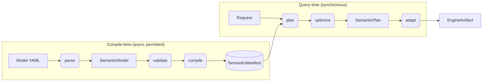

# semstrait Design — Overview

Status: **Ratified**

> This document is the contract for the semstrait design exercise. It establishes vocabulary, the master document map, design invariants, and diagram conventions. Every other document under `docs/design/` inherits from this one.

---

## 1. Purpose and Scope

semstrait is a **semantic model / semantic interface layer** over physical data: authors declare Semantics (dimensions, measures, metrics, filters, keys) in YAML, and semstrait produces an engine-ready query artifact from a request against those Semantics. Peer systems architecturally: dbt MetricFlow, Cube.js, AtScale, LookML. Query engines (DataFusion, DuckDB, Spark, …) are **consumers** of semstrait's output, not templates for its design.

Internally, semstrait compiles the Model into an engine-agnostic planner-ready `SemanticManifest`, then at query time turns a `Request` into a canonical `SemanticPlan` and adapts it into an `EngineArtifact` (SQL text or a structured IR). This design exercise specifies that system from first principles.

The design is **green-field**: current code is treated as the "before" state. Where existing code disagrees with a ratified design doc, the disagreement is a refactor task, not an argument against the design (see I9).

The scope of this exercise ends at the door of execution. semstrait produces artifacts; engines execute them. See §10 for what this design explicitly does not cover.

The scope boundary between **design** and **implementation**:

- **Design docs** (this tree) specify contracts, invariants, vocabulary, resolution order, and API surfaces. Design docs are engine-agnostic and code-structure-agnostic.
- **Implementation docs** (`implementation/40–42`) specify how to get from the current code to the target design: phased refactors, deprecations, migration notes.
- **Crate READMEs** describe what lives in each crate today. They point to the relevant `apis/3x_*.md` doc for the contract.

## 2. Audience

- **Contributors and reviewers** — read `00_overview.md` first, then the foundations doc most relevant to the change. Cross-crate changes additionally require reading the relevant `apis/` doc.
- **AI coding agents** — expected to load `00_overview.md` at session start when any semstrait work is indicated, then load topic-specific docs on demand. The ratified vocabulary in §4 binds the agent's own prose.
- **Not the audience** — end users of the engines semstrait targets; YAML authors (served by `SEMANTIC_RESOLUTION.md` and the model README, not this tree).

## 3. Approach: Canonical-First

semstrait's design center is the **semantic model / interface**: a declarative description of what is queryable (Semantics over DataKinds) and how queries compose. The peer systems — dbt MetricFlow, Cube.js, AtScale, LookML — all live at this level. semstrait differs from them primarily in its canonical, engine-agnostic plan IR (`SemanticPlan`) and in emitting to both SQL and native engine plans (Substrait and successors) through a single adapter contract.

The canonical pipeline has exactly two conversion boundaries:

1. **YAML → canonical** at compile time (the `compile` stage). After this boundary, no layer above `semstrait-manifest` sees YAML syntax, author-facing forms, or unresolved references.
2. **canonical → engine** at query time, done only by adapters (the `adapt` stage). Before this boundary, no layer sees engine identity, dialect, physical types, or engine-specific functions.

**Where engines fit.** Query engines (DataFusion, DuckDB, Spark, …) are *consumers* of semstrait's output, not templates for its design. We borrow **only** the structure of engine plan IRs for `PlanNode` composition, and reject engine vocabulary, typing, and layering everywhere else.

**Adopted from the semantic-layer peer group (MetricFlow, Cube.js, AtScale, LookML):**

- Dimensions / Measures / Metrics / Keys / Filters as first-class `Semantics`, not derived SQL constructs.
- Joins expressed as declared top-level `Relationship`s between DataKinds, not embedded in query syntax.
- A compiled, cached `SemanticManifest` separating author-time cost from query-time cost.
- Request surface at the Semantics level — callers name dimensions / measures, never columns.

**Rejected from that lineage:**

- Python-authored semantic models (ours is YAML-source, Rust-compiled).
- SQL-only rendering (semstrait emits both SQL and structured plan IR).
- Request-level metric algebra beyond what the `SemanticManifest` declares — ratio, conversion, and cumulative metrics as request-time constructs are DEFERRED (§10).
- Implicit time-spine concepts outside the `SemanticInterface` — ours live under `Grain`.
- Weak historization typing (peer systems expose at most `is_slowly_changing` / `event_time`); see the adjacent adoption from DWH modeling tradition below.

**Adopted from the data-warehouse modeling tradition (Kimball, Inmon):**

- Historization-aware DataKind classification via `TemporalShape` (`Timeseries`, `Events`, `Snapshot`, `SCD`), with SCD subtypes ratified under `foundations/17_temporal_shape.md`.
- Shape-informed defaults for `Grain`-rollup legality and relationship semantics.
- First-class as-of / point-in-time semantics as a planner capability (DEFERRED in initial implementation, ratified in design).

**Borrowed from query-engine IRs (DataFusion, Calcite, Substrait) for `PlanNode` structure only:**

- The catalogue of relational operators (Scan, Filter, Project, Agg, Join, Union, Sort, Fetch) and their tree composition.
- Substrait as a serialization target for `EnginePlan`.

**Rejected from engine IRs:**

- Engine-specific type systems (I2 keeps `DataType` logical).
- Dialect-aware operators (I3 confines `Dialect` to adapters).
- Cost-based optimizer state, statistics, equivalence classes.
- Physical-plan nodes (exchange, sort-merge join, hash partition).

**Where metadata sources fit.** Engine-specific behavior — dialects, SQL emission quirks, function rewriting, native plan construction — is confined behind the `EngineAdapter` trait and its `Dialect` machinery in `semstrait-adapter`. Metadata-source-specific behavior — Iceberg catalog quirks, Unity Catalog pagination, S3 path semantics — is confined behind `CatalogProvider` and `FileSystem` traits in `semstrait-catalog`. These two axes are independent: a single adapter may run against any metadata source; a single metadata source may back any adapter.

## 4. Canonical Vocabulary

Every term used in any design doc must be defined here or in the foundations doc listed in the rightmost column. Banned terms live in §4.3; the conflict-resolution precedence rule lives in §4.4.

> **Scan-optimized index.** `[INDEX.md](INDEX.md)` (sibling to this file) is a compact, alphabetical, topic-first lookup into the single source of truth for every named concept. Use it when you already know which concept you're hunting for; use §4 here when you want the full definition in context. The two stay in lockstep — when a concept's canonical home moves, both files update in the same commit.

### 4.1 Core Nouns

Naming convention note: **model-layer** types use their bare name (`DataKind`, `SemanticInterface`, `SemanticMapping`, …). **SemanticManifest-layer** types that diverge structurally from the model (flattening, denormalization, pre-computed indices per I8) use the `Resolved*` prefix (`ResolvedDataKind`, `ResolvedSource`, `ResolvedColumnMapping`, …). Types that are structurally identical across layers keep the same name; readers disambiguate by namespace. Historical note: the model-layer `SemanticMapping` was renamed from `ColumnMapping` in the 6th ratification pass (`foundations/18_entities.md §10`; originally ratified in `apis/32c_entities.md §10` before the 2026-04-17 promotion to the foundations layer); the SemanticManifest-layer `ResolvedColumnMapping` name is retained pending a follow-up rename decision.

| Term                        | Definition                                                                                                                                                                                                                                                                                                                                                                                                                                                                                                                                                                                                                                                                                                                                                                                                                                                                                                                                                                                                                                                                                                                                                                                                                                                                                                                                                                                                                                                                                                                                                                                                                                     | Authoritative doc                                                          |
| --------------------------- | ---------------------------------------------------------------------------------------------------------------------------------------------------------------------------------------------------------------------------------------------------------------------------------------------------------------------------------------------------------------------------------------------------------------------------------------------------------------------------------------------------------------------------------------------------------------------------------------------------------------------------------------------------------------------------------------------------------------------------------------------------------------------------------------------------------------------------------------------------------------------------------------------------------------------------------------------------------------------------------------------------------------------------------------------------------------------------------------------------------------------------------------------------------------------------------------------------------------------------------------------------------------------------------------------------------------------------------------------------------------------------------------------------------------------------------------------------------------------------------------------------------------------------------------------------------------------------------------------------------------------------------------------- | -------------------------------------------------------------------------- |
| `DataKind`                  | The abstraction over a queryable unit. Encodes construction behavior, nesting capability, and resolution strategy. Split into `SimpleDataKind` and `ComplexDataKind`.                                                                                                                                                                                                                                                                                                                                                                                                                                                                                                                                                                                                                                                                                                                                                                                                                                                                                                                                                                                                                                                                                                                                                                                                                                                                                                                                                                                                                                                                          | `data-kinds/20_taxonomy.md`                                                |
| `SimpleDataKind`            | The foundational, leaf DataKind. Defines data itself via a single Binding. Can be nested inside a ComplexDataKind; cannot contain other DataKinds.                                                                                                                                                                                                                                                                                                                                                                                                                                                                                                                                                                                                                                                                                                                                                                                                                                                                                                                                                                                                                                                                                                                                                                                                                                                                                                                                                                                                                                                                                             | `data-kinds/21_dataset.md`                                                 |
| `Dataset`                   | Consumer-level name for a SimpleDataKind. Used in YAML, request surface, and user-facing docs. Same concept as `SimpleDataKind`, expressed from the consumer angle.                                                                                                                                                                                                                                                                                                                                                                                                                                                                                                                                                                                                                                                                                                                                                                                                                                                                                                                                                                                                                                                                                                                                                                                                                                                                                                                                                                                                                                                                            | `data-kinds/21_dataset.md`                                                 |
| `ComplexDataKind`           | A DataKind that composes children via a strategy. Cannot be a leaf. Nests SimpleDataKinds and (per the nesting policy) other ComplexDataKinds. Variants: `Unionset`, `Grainset`, `Joinset`.                                                                                                                                                                                                                                                                                                                                                                                                                                                                                                                                                                                                                                                                                                                                                                                                                                                                                                                                                                                                                                                                                                                                                                                                                                                                                                                                                                                                                                                    | `data-kinds/20_taxonomy.md`                                                |
| `Unionset`                  | ComplexDataKind that composes children via union semantics (UNION ALL with NULL-fill for partial coverage).                                                                                                                                                                                                                                                                                                                                                                                                                                                                                                                                                                                                                                                                                                                                                                                                                                                                                                                                                                                                                                                                                                                                                                                                                                                                                                                                                                                                                                                                                                                                    | `data-kinds/23_unionset.md`                                                |
| `Grainset`                  | ComplexDataKind that routes queries to the cheapest child covering the requested grain.                                                                                                                                                                                                                                                                                                                                                                                                                                                                                                                                                                                                                                                                                                                                                                                                                                                                                                                                                                                                                                                                                                                                                                                                                                                                                                                                                                                                                                                                                                                                                        | `data-kinds/22_grainset.md`                                                |
| `Joinset`                   | ComplexDataKind that composes a named subset of DataKinds via a relationship-driven join path. The join path is specified over declared top-level `Relationship`s; the Joinset's resolved interface is a `ComposedSemanticInterface` with join composition, anchored at an explicit root child.                                                                                                                                                                                                                                                                                                                                                                                                                                                                                                                                                                                                                                                                                                                                                                                                                                                                                                                                                                                                                                                                                                                                                                                                                                                                                                                                                | `data-kinds/24_joinset.md`                                                 |
| `SemanticInterface`         | The structural type exposing a DataKind's Semantics. Holds dimensions, measures, metrics, filters, and keys. In prose, abbreviated as "interface" when context is clear. A `SimpleDataKind` exposes a `SemanticInterface` directly; a `ComplexDataKind` (or a Relationship-connected chain of DataKinds) exposes a `ComposedSemanticInterface` — a **distinct Rust type** sharing a common `SemanticsView` accessor trait but with independent shape (`16 §5.4`).                                                                                                                                                                                                                                                                                                                                                                                                                                                                                                                                                                                                                                                                                                                                                                                                                                                                                                                                                                                                                                                                                                                                                                              | `foundations/11_names_and_scopes.md`, `foundations/16_composition.md §5.4` |
| `ComposedSemanticInterface` | The queryable interface formed when multiple DataKinds are presented as a unified surface. Carries a unified Semantics view (namespace-aware where names would otherwise collide), references to constituent DataKinds, per-field provenance/coverage, and a composition-kind tag. Arises wherever DataKinds are connected: **(a)** via explicit `Relationship`s — any chain of top-level DataKinds connected by declared Relationships exposes a composed interface to the planner, independently of whether a Joinset is declared over them; **(b)** via `ComplexDataKind` declarations — Unionset (union composition), Grainset (grain composition), Joinset (relationship-driven join composition over a named subset). **Materialization policy** (`16 §10`): explicit compositions (`ComplexDataKind` declarations + named `Joinset`s) are materialized in the `SemanticManifest`; implicit Relationship-driven compositions are synthesized on-demand by the planner per the field-first resolution algorithm (`16 §11`).                                                                                                                                                                                                                                                                                                                                                                                                                                                                                                                                                                                                               | `foundations/16_composition.md`                                            |
| `Relationship`              | A pairwise connector between two top-level DataKinds: declares how rows in one relate to rows in another (join columns, `Cardinality`, `JoinType`). Lives as a global top-level block in the Model, independent of any specific DataKind. Relationships are what allow a `ComposedSemanticInterface` to form across DataKinds — both when consumed by a Joinset's explicit join path and when the planner forms a composition implicitly from a Request that spans related kinds (`16 §9` ratifies the explicit-vs-implicit boundary).                                                                                                                                                                                                                                                                                                                                                                                                                                                                                                                                                                                                                                                                                                                                                                                                                                                                                                                                                                                                                                                                                                         | `foundations/16_composition.md`                                            |
| `Cardinality`               | Multiplicity specification between two DataKinds. Used in `Relationship`s and (when serialized) on `PlanNode::Join` edges. Values: `OneToOne`, `OneToMany`, `ManyToOne`, `ManyToMany`. Non-exhaustive per I10.                                                                                                                                                                                                                                                                                                                                                                                                                                                                                                                                                                                                                                                                                                                                                                                                                                                                                                                                                                                                                                                                                                                                                                                                                                                                                                                                                                                                                                 | `foundations/16_composition.md`                                            |
| `JoinType`                  | The join-kind axis carried by `Relationship`s and `PlanNode::Join`. **v1 roster: `{Inner, Left, Right, Full}`**, `#[non_exhaustive]` per `foundations/18_entities.md §2`. Semi- and anti-joins are open extensions pending a concrete need. An `AsOf` variant (matching the most recent row where `valid_from <= T < valid_to`, required to join `SCD` / `Snapshot` with `Events`) is **descoped for v1** and documented as forward-reference / post-v1 design in `foundations/17_temporal_shape.md §5`. Non-exhaustive per I10.                                                                                                                                                                                                                                                                                                                                                                                                                                                                                                                                                                                                                                                                                                                                                                                                                                                                                                                                                                                                                                                                                                               | `foundations/18_entities.md`, `apis/35_semstrait_ir.md`                    |
| `Semantics`                 | Collective name for the elements of a `SemanticInterface` (dimensions, measures, metrics, filters, keys). Each element type is specified in `foundations/11_names_and_scopes.md`.                                                                                                                                                                                                                                                                                                                                                                                                                                                                                                                                                                                                                                                                                                                                                                                                                                                                                                                                                                                                                                                                                                                                                                                                                                                                                                                                                                                                                                                              | `foundations/11_names_and_scopes.md`                                       |
| `Additivity`                | Aggregation-compatibility classification on Measures and Metrics. Values: `Additive` (safe to sum across any dimension), `SemiAdditive` (safe across some dimensions, unsafe across others — typically time), `NonAdditive` (unsafe to aggregate mechanically; must be computed at the queried grain from underlying Measures). Authored inline on the Measure or Metric; shape-locked across all occurrences of that name. Defaults to `Additive` when every occurrence omits it (note: often wrong for ratio Metrics — authors should review). Independent of `TemporalShape` — the two are separate inputs the planner consults. Non-exhaustive per I10.                                                                                                                                                                                                                                                                                                                                                                                                                                                                                                                                                                                                                                                                                                                                                                                                                                                                                                                                                                                    | `foundations/11_names_and_scopes.md`                                       |
| `Constraint`                | A declarative rule attached to a Semantics element (Dimension, Measure, Metric, or Key) that restricts how the element may participate in a Request, and may encode derivation rules (e.g. a count-like Measure may be derived from a Key without an underlying Binding column). Evaluated by the planner's constraint step at the start of every plan; failures emit `Diagnostic`s. Distinct from `Precondition` — see below.                                                                                                                                                                                                                                                                                                                                                                                                                                                                                                                                                                                                                                                                                                                                                                                                                                                                                                                                                                                                                                                                                                                                                                                                                 | `foundations/11_names_and_scopes.md`                                       |
| `Precondition`              | A compile-time invariant check validating a Model's internal consistency against the capabilities semstrait exposes — supported aggregation functions, declarable dimension levels, permissible nesting, function-registry coverage. Evaluated during `validate` (structural Preconditions over `SemanticModel`, accumulating) and inline during `compile` (reference / function-registry Preconditions that require resolved context, fail-fast); failures emit `Diagnostic`s and abort compilation. Contrast with `Constraint`, which applies at plan time against a Request.                                                                                                                                                                                                                                                                                                                                                                                                                                                                                                                                                                                                                                                                                                                                                                                                                                                                                                                                                                                                                                                                | `foundations/10_resolution_pipeline.md`                                    |
| `Model`                     | The author-facing YAML definition. Text-level input to `parse`.                                                                                                                                                                                                                                                                                                                                                                                                                                                                                                                                                                                                                                                                                                                                                                                                                                                                                                                                                                                                                                                                                                                                                                                                                                                                                                                                                                                                                                                                                                                                                                                | `apis/32_semstrait_model.md`                                               |
| `SemanticModel`             | The in-memory, typed representation of a Model immediately after `parse`. Two canonical types bracket compile-time: `SemanticModel` (post-parse, consumed by `validate` and `compile`) and `SemanticManifest` (post-compile). No intermediate `ResolvedModel` type exists — resolution work happens inside `compile`, not in a separate pass.                                                                                                                                                                                                                                                                                                                                                                                                                                                                                                                                                                                                                                                                                                                                                                                                                                                                                                                                                                                                                                                                                                                                                                                                                                                                                                  | `apis/32_semstrait_model.md`                                               |
| `SemanticManifest`          | The compiled, resolved, engine-agnostic artifact consumed by the planner. Planner-complete (I8) and deterministic (I4). Contains `ResolvedDataKind`s (with their `Binding`s and `PhysicalSource`s) and the resolved top-level `Relationship` graph. The extent to which explicit or implicit `ComposedSemanticInterface`s are pre-materialized in the SemanticManifest versus synthesized by the planner is an open design item (`foundations/16_composition.md`).                                                                                                                                                                                                                                                                                                                                                                                                                                                                                                                                                                                                                                                                                                                                                                                                                                                                                                                                                                                                                                                                                                                                                                             | `apis/33_semstrait_manifest.md`                                            |
| `Request`                   | A query request. Fields: requested Semantics, filters, ordering, limit, a `SessionContext`, **optionally** a `temporal` block (as-of timestamp, time-range overrides — DEFERRED; gated by `TemporalShape` support, see `foundations/17_temporal_shape.md`), and **optionally** a `from` pointing to a DataKind (explicit target). When `from` is omitted, the planner performs **field-first resolution**: it maps each requested Semantics back to its owning DataKind(s) using the SemanticManifest indices and — if the fields span multiple DataKinds — traverses the top-level `Relationship` graph to form a `ComposedSemanticInterface` over the constituents. Rules in `apis/34_semstrait_planner.md` and `foundations/16_composition.md`.                                                                                                                                                                                                                                                                                                                                                                                                                                                                                                                                                                                                                                                                                                                                                                                                                                                                                             | `apis/34_semstrait_planner.md`                                             |
| `SessionContext`            | Request-scoped state carried alongside a `Request`: query clock (`now` timestamp), caller timezone, runtime feature toggles, correlation IDs. Does not mutate the SemanticManifest. Any non-determinism the planner introduces (e.g. substituting `CURRENT_TIMESTAMP`-like functions) is scoped to a single `plan` invocation and sourced from this object.                                                                                                                                                                                                                                                                                                                                                                                                                                                                                                                                                                                                                                                                                                                                                                                                                                                                                                                                                                                                                                                                                                                                                                                                                                                                                    | `apis/34_semstrait_planner.md`                                             |
| `Scope`                     | A name-resolution context. Scopes chain lexically according to the nesting policy.                                                                                                                                                                                                                                                                                                                                                                                                                                                                                                                                                                                                                                                                                                                                                                                                                                                                                                                                                                                                                                                                                                                                                                                                                                                                                                                                                                                                                                                                                                                                                             | `foundations/11_names_and_scopes.md`                                       |
| `Expr`                      | The canonical low-level expression AST used across the entire pipeline. No raw SQL (I1). Not a direct field type outside the expression module — fields use the wrapper types `SemanticExpr` or `PhysicalExpr` below.                                                                                                                                                                                                                                                                                                                                                                                                                                                                                                                                                                                                                                                                                                                                                                                                                                                                                                                                                                                                                                                                                                                                                                                                                                                                                                                                                                                                                          | `foundations/14_expressions.md`                                            |
| `SemanticExpr`              | A first-class newtype over `Expr` for semantic-layer composition. Invariants: `EntityRef` allowed (references another Semantics by name), `Column` forbidden; aggregations allowed. Authored at Measure / Metric / Dimension / Filter `expr:` sites. Substituted into `PhysicalExpr`s at compile per `14b`.                                                                                                                                                                                                                                                                                                                                                                                                                                                                                                                                                                                                                                                                                                                                                                                                                                                                                                                                                                                                                                                                                                                                                                                                                                                                                                                                    | `foundations/14_expressions.md`                                            |
| `PhysicalExpr`              | A first-class newtype over `Expr` for the binding layer. Invariants: `Column` allowed, `EntityRef` forbidden, no `Aggregate`. Authored at `semantic_mapping: { <name>: { expr: … } }` sites (the `SemanticMappingValue::Expr` variant per `foundations/18_entities.md §10`) and produced by compile as the resolved form stored in `ResolvedExprTable`. Carries compile-enriched fields `inferred_type: DataType` and `referenced_columns: Vec<String>`.                                                                                                                                                                                                                                                                                                                                                                                                                                                                                                                                                                                                                                                                                                                                                                                                                                                                                                                                                                                                                                                                                                                                                                                       | `foundations/14_expressions.md`                                            |
| `ExprSource`                | The YAML representation of an expression: inline string (DSL) or declarative YAML block. Dispatched at the parse site to either `SemanticExpr` or `PhysicalExpr`. Bare identifiers are context-resolved — an identifier in a Semantic parse site becomes an `EntityRef`, in a Physical parse site becomes a `Column` (no `@` sigil).                                                                                                                                                                                                                                                                                                                                                                                                                                                                                                                                                                                                                                                                                                                                                                                                                                                                                                                                                                                                                                                                                                                                                                                                                                                                                                           | `foundations/14_expressions.md`                                            |
| `CanonicalFn`               | Stable identifier for a canonical function, used by the optimizer and adapter rewrite tables. Implemented as a newtype `struct CanonicalFn(&'static str)` with `pub const` identities (e.g. `CanonicalFn::UPPER`) rather than a closed enum, enabling unbounded catalog growth while preserving Copy + Eq + Hash matching ergonomics. The `FunctionRegistry` is the single source of truth; `CanonicalFn` only provides named constants for matching. Construction is crate-private to the catalog module.                                                                                                                                                                                                                                                                                                                                                                                                                                                                                                                                                                                                                                                                                                                                                                                                                                                                                                                                                                                                                                                                                                                                     | `foundations/14a_function_catalog.md`                                      |
| `FunctionRegistry`          | Authoritative catalog of canonical functions. Each `FunctionSpec` carries canonical name, aliases, one or more `FnSignature`s (signature polymorphism with bounded type classes), a `FunctionCategory`, and a `FunctionPortability` flag. Drives arity validation, signature resolution, return-type inference, and adapter rewrite lookups. Extensible by adapter-provided registries for domain-specific functions.                                                                                                                                                                                                                                                                                                                                                                                                                                                                                                                                                                                                                                                                                                                                                                                                                                                                                                                                                                                                                                                                                                                                                                                                                          | `foundations/14a_function_catalog.md`                                      |
| `ResolvedExprTable`         | Compile-time pre-computed map from `(Semantics name, Binding id)` to a fully-resolved `PhysicalExpr`, stored in the `SemanticManifest`. Materializes the compile-once / plan-many property: every EntityRef traversal, signature resolution, type inference, and cross-DataKind path walk happens at compile; plan-time expression lookup is O(1).                                                                                                                                                                                                                                                                                                                                                                                                                                                                                                                                                                                                                                                                                                                                                                                                                                                                                                                                                                                                                                                                                                                                                                                                                                                                                             | `foundations/14b_expression_resolution.md`                                 |
| `Binding`                   | The compile-time process that links a `SimpleDataKind` (`Dataset`)'s `SemanticInterface` to its `PhysicalSource`(s), resolving author-declared `SemanticMapping` entries (or the `auto` default) against the resolved physical schema. `Binding` is a compile-time concept, not a model-layer authored type. Bindings attach to `SimpleDataKind`s exactly (one per `Dataset` leaf). A `ComplexDataKind` does not carry its own Binding; it composes the Bindings of its constituent leaves via its `ComposedSemanticInterface`.                                                                                                                                                                                                                                                                                                                                                                                                                                                                                                                                                                                                                                                                                                                                                                                                                                                                                                                                                                                                                                                                                                                | `foundations/15_mapping_and_binding.md`                                    |
| `SemanticMapping`           | The per-Binding authoring structure linking each Semantics name to a `SemanticMappingValue`. The enum is **4-variant** at the type level: `Column(String)` (bare physical column), `Literal(LiteralValue)` (row-independent broadcast), `Expr(PhysicalExpr)` (compiled expression tree), and `Metadata(MetadataDimensionRecipe)` (compile-synthesized; not authored under `semantic_mapping:`). The first three are author-facing under `extras.semantic_mapping:`; `Metadata` is synthesized by the compiler from the Dimension's `type: { metadata: ... }` block per `15 §5.5` / `15 §8`. For a `SimpleDataKind` (`Dataset`), the mapping covers the full `SemanticInterface` surface when provided explicitly; otherwise `auto` binds every Semantic 1:1 to a physical column of the same name. Pre-`18` name: `ColumnMapping` (still referenced in a small number of historical notes). SemanticManifest-layer counterpart: `ResolvedColumnMapping` — name retained at the `33 §5.3` surface pending a follow-up rename decision.                                                                                                                                                                                                                                                                                                                                                                                                                                                                                                                                                                                                          | `foundations/18_entities.md`, `foundations/15_mapping_and_binding.md`      |
| `PhysicalSource`            | A resolved physical target of a Binding — a path, table reference, or snapshot — carrying its resolved schema (columns + types) and catalog-supplied metadata. A single Binding resolves to **one or more** `PhysicalSource`s (e.g. a glob over multiple files expands to many sources).                                                                                                                                                                                                                                                                                                                                                                                                                                                                                                                                                                                                                                                                                                                                                                                                                                                                                                                                                                                                                                                                                                                                                                                                                                                                                                                                                       | `foundations/15_mapping_and_binding.md`                                    |
| `Coverage`                  | Per-source / per-constituent record of which Semantics are provided. Applied at two levels: at the `Binding` level (which Semantics a specific `PhysicalSource` serves — the X-axis of source selection), and at the `ComposedSemanticInterface` level (which constituent DataKind natively provides each field of the unified surface). Drives Unionset NULL-fill, Grainset child-eligibility, and field-first request resolution.                                                                                                                                                                                                                                                                                                                                                                                                                                                                                                                                                                                                                                                                                                                                                                                                                                                                                                                                                                                                                                                                                                                                                                                                            | `foundations/15_mapping_and_binding.md`                                    |
| `Grain`                     | The Y-axis of source selection: granularity / rollup level of a source. Temporal grain (Minute … Year) is the primary and only currently-specified instance; the concept is extensible to non-temporal rollups (geographic, entity) in future revisions. Works in concert with `TemporalShape`: the shape constrains which Grain rollups are legal (e.g. `Snapshot` has a fixed source grain; `SCD` has no intrinsic grain).                                                                                                                                                                                                                                                                                                                                                                                                                                                                                                                                                                                                                                                                                                                                                                                                                                                                                                                                                                                                                                                                                                                                                                                                                   | `foundations/13_types_and_grain.md`                                        |
| `TemporalShape`             | The historization classification of a DataKind's time axis — how the data preserves and indexes time. Authored on a `Dataset` leaf via `extras.temporal:` with a collapsed variant wrapper (`extras.temporal.<variant>: { … }` + sibling `grain:`) per `foundations/18_entities.md §3.2`. Struct shape: `{ kind: TemporalShapeKind, grain: Option<Grain> }`. `TemporalShapeKind` v1 roster: `Timeseries(TimeseriesBody)` (dense indexed series, rollable by `Grain`; identified by `occurred_at`), `Events(EventsBody)` (sparse discrete occurrences, bucket-then-aggregate; identified by `occurred_at`), `Snapshot(SnapshotBody)` (periodic full-state capture; semi-additive over snapshot-time by default; identified by `snapshotted_at`), `Scd(ScdBody)` (slowly-changing dimension with history; `ScdType` v1 roster trimmed to `{Type1, Type2}` with `valid_from` / `valid_to` fields per `18 §3.3`). `grain:` is required on leaf Datasets when `temporal:` is authored, forbidden on `ComplexDataKind`s (SR-E-6 / SR-E-7), and Grainset children must each author their own (SR-E-8). Independent of `Additivity` (Measure/Metric-level classification); the planner consults both separately and MAY emit advisory warnings when they appear inconsistent. Full Kimball `Type0`–`Type6` taxonomy is documented in `foundations/17_temporal_shape.md` as forward-reference / post-v1 deferred. All enums `#[non_exhaustive]` per I10. **Status**: vocabulary + model-level declaration ratified; planner support for shape-aware planning (snapshot selection, as-of joins, SCD window resolution) is DEFERRED to a later milestone. | `foundations/18_entities.md`, `foundations/17_temporal_shape.md`           |
| `DataType`                  | Logical data type. The canonical set covers the core scalar types provided by mainstream engines; the exact variant list, precision/width handling, and timezone treatment are ratified in `13_types_and_grain.md`. Complex types (arrays, structs, maps) are out of scope for the initial design. Physical-type mapping belongs to adapters (I2).                                                                                                                                                                                                                                                                                                                                                                                                                                                                                                                                                                                                                                                                                                                                                                                                                                                                                                                                                                                                                                                                                                                                                                                                                                                                                             | `foundations/13_types_and_grain.md`                                        |
| `Diagnostic`                | A structured message produced by any pipeline stage, carrying: a stable code (`COMP_E017`, `PLAN_W003`, …), a severity (`Info`, `Warning`, `Error`), a location, and a rendered human-readable message. The sole error-surface public APIs expose — never raw strings (I12). Severities are non-exhaustive per I10.                                                                                                                                                                                                                                                                                                                                                                                                                                                                                                                                                                                                                                                                                                                                                                                                                                                                                                                                                                                                                                                                                                                                                                                                                                                                                                                            | `apis/30_api_contracts.md`                                                 |
| `SemanticPlan`              | The canonical, engine-agnostic query plan tree. Output of the planner.                                                                                                                                                                                                                                                                                                                                                                                                                                                                                                                                                                                                                                                                                                                                                                                                                                                                                                                                                                                                                                                                                                                                                                                                                                                                                                                                                                                                                                                                                                                                                                         | `apis/35_semstrait_ir.md`                                                  |
| `PlanNode`                  | A single node within a `SemanticPlan`. Variants: Scan, Filter, Project, Agg, Join, Union, Sort, Fetch.                                                                                                                                                                                                                                                                                                                                                                                                                                                                                                                                                                                                                                                                                                                                                                                                                                                                                                                                                                                                                                                                                                                                                                                                                                                                                                                                                                                                                                                                                                                                         | `apis/35_semstrait_ir.md`                                                  |
| `EngineArtifact`            | The engine-ready output produced by an adapter. Sum type: `Sql(SqlArtifact)` or `Plan(EnginePlan)`. Non-exhaustive (I10).                                                                                                                                                                                                                                                                                                                                                                                                                                                                                                                                                                                                                                                                                                                                                                                                                                                                                                                                                                                                                                                                                                                                                                                                                                                                                                                                                                                                                                                                                                                      | `apis/36_semstrait_adapter.md`                                             |
| `SqlArtifact`               | Text-based engine output: `{ text: String, dialect: DialectId }`.                                                                                                                                                                                                                                                                                                                                                                                                                                                                                                                                                                                                                                                                                                                                                                                                                                                                                                                                                                                                                                                                                                                                                                                                                                                                                                                                                                                                                                                                                                                                                                              | `apis/36_semstrait_adapter.md`                                             |
| `Dialect`                   | Adapter-layer axis that selects SQL variation for SQL-emitting `EngineAdapter`s — keyword casing, function rewriting, identifier quoting, data-type spelling. Carried with every `SqlArtifact`. Implementations today: `Ansi`, `DataFusion`, `DuckDb`, `Spark`.                                                                                                                                                                                                                                                                                                                                                                                                                                                                                                                                                                                                                                                                                                                                                                                                                                                                                                                                                                                                                                                                                                                                                                                                                                                                                                                                                                                | `apis/36_semstrait_adapter.md`                                             |
| `DialectId`                 | Stable identifier of a `Dialect`. Serialized as part of every `SqlArtifact` so consumers can route emitted text to the correct engine. Non-exhaustive per I10.                                                                                                                                                                                                                                                                                                                                                                                                                                                                                                                                                                                                                                                                                                                                                                                                                                                                                                                                                                                                                                                                                                                                                                                                                                                                                                                                                                                                                                                                                 | `apis/36_semstrait_adapter.md`                                             |
| `EnginePlan`                | Structured-IR engine output. Variants today: `Substrait(substrait::Plan)`. Non-exhaustive.                                                                                                                                                                                                                                                                                                                                                                                                                                                                                                                                                                                                                                                                                                                                                                                                                                                                                                                                                                                                                                                                                                                                                                                                                                                                                                                                                                                                                                                                                                                                                     | `apis/36_semstrait_adapter.md`                                             |
| `CatalogProvider`           | Trait for structured metadata-source integrations (Iceberg REST, Unity, …). The authority for schema, snapshot, and partition metadata. Used at compile time for source resolution and schema retrieval; at query time only for schema-drift checks.                                                                                                                                                                                                                                                                                                                                                                                                                                                                                                                                                                                                                                                                                                                                                                                                                                                                                                                                                                                                                                                                                                                                                                                                                                                                                                                                                                                           | `apis/37_semstrait_catalog.md`                                             |
| `FileSystem`                | Trait for generic I/O over local or remote storage (local path, S3, …). Provides list/read/write/exists. Consumed by `Repository` (manifest persistence), Model loading, and source glob expansion. Contains no format-aware or schema-aware logic; if format-header-based metadata reading is ever needed, it is a separate future crate.                                                                                                                                                                                                                                                                                                                                                                                                                                                                                                                                                                                                                                                                                                                                                                                                                                                                                                                                                                                                                                                                                                                                                                                                                                                                                                     | `apis/37_semstrait_catalog.md`                                             |
| `Repository`                | SemanticManifest persistence trait. Implementations today: `InMemoryRepository`, `FileSystemRepository`. `FileSystemRepository` is built on top of `FileSystem`.                                                                                                                                                                                                                                                                                                                                                                                                                                                                                                                                                                                                                                                                                                                                                                                                                                                                                                                                                                                                                                                                                                                                                                                                                                                                                                                                                                                                                                                                               | `apis/33_semstrait_manifest.md`                                            |
| `EngineAdapter`             | Trait that turns a `SemanticPlan` into an `EngineArtifact`. Implementations may be SQL-emitting (with a dialect) or plan-producing (Substrait, …).                                                                                                                                                                                                                                                                                                                                                                                                                                                                                                                                                                                                                                                                                                                                                                                                                                                                                                                                                                                                                                                                                                                                                                                                                                                                                                                                                                                                                                                                                             | `apis/36_semstrait_adapter.md`                                             |

### 4.2 Core Verbs

| Verb       | Input → Output                                                                                                                                                                                                                                                                                                                                                                                                                                                                                                                                                                                         | Authoritative doc                       |
| ---------- | ------------------------------------------------------------------------------------------------------------------------------------------------------------------------------------------------------------------------------------------------------------------------------------------------------------------------------------------------------------------------------------------------------------------------------------------------------------------------------------------------------------------------------------------------------------------------------------------------------ | --------------------------------------- |
| `parse`    | Model YAML text → `SemanticModel`                                                                                                                                                                                                                                                                                                                                                                                                                                                                                                                                                                      | `apis/32_semstrait_model.md`            |
| `validate` | `&SemanticModel` → `Result<(), Vec<ValidateError>>`. Pure predicate. Runs Preconditions (structural checks: disallowed nestings, missing mandatory fields, arity violations, reference well-formedness). Accumulates all failures; does not touch catalogs or filesystem.                                                                                                                                                                                                                                                                                                                              | `foundations/10_resolution_pipeline.md` |
| `compile`  | Validated `SemanticModel` + Catalog snapshot → `SemanticManifest`. Resolves all references and names, fetches catalog metadata, expands source globs, compiles `ExprSource` → `SemanticExpr` / `PhysicalExpr` via the `FunctionRegistry`, and **eagerly resolves every Semantics × Binding pair into a `PhysicalExpr`** — stored in the SemanticManifest's `ResolvedExprTable` so plan-time expression lookup is O(1) (per `14b`). Builds SemanticManifest indices (name indices, Coverage indices, `Relationship` graph). Fails fast on first error (dependency chains make continuation unreliable). | `apis/33_semstrait_manifest.md`         |
| `plan`     | SemanticManifest + Request → SemanticPlan. Internally selects a per-DataKind-variant strategy; strategy selection is an implementation detail, not a vocabulary-level verb.                                                                                                                                                                                                                                                                                                                                                                                                                            | `apis/34_semstrait_planner.md`          |
| `optimize` | SemanticPlan → SemanticPlan. Rule-based rewrites: constant folding, metadata-dimension substitution, predicate simplification, pass registration.                                                                                                                                                                                                                                                                                                                                                                                                                                                      | `apis/34_semstrait_planner.md`          |
| `adapt`    | SemanticPlan → EngineArtifact                                                                                                                                                                                                                                                                                                                                                                                                                                                                                                                                                                          | `apis/36_semstrait_adapter.md`          |
| `emit`     | SemanticPlan → `SqlArtifact` — the specific form `adapt` takes for SQL-emitting adapters. Kept as a named verb so SQL-emission specifics have a hook in the adapter docs.                                                                                                                                                                                                                                                                                                                                                                                                                              | `apis/36_semstrait_adapter.md`          |

### 4.3 Banned / Deprecated Terms

| Term                                                                                        | Use instead                                                               | Reason                                                                                                                                                                                                                                                                                      |
| ------------------------------------------------------------------------------------------- | ------------------------------------------------------------------------- | ------------------------------------------------------------------------------------------------------------------------------------------------------------------------------------------------------------------------------------------------------------------------------------------- |
| `Kind` (bare)                                                                               | `DataKind`, `SimpleDataKind`, `ComplexDataKind`                           | "Kind" is overloaded across computer science. Always disambiguate.                                                                                                                                                                                                                          |
| `kind` in prose where we mean a DataKind                                                    | `data kind` / `DataKind`                                                  | Same as above; use the full term in documentation prose.                                                                                                                                                                                                                                    |
| `Entity`                                                                                    | "a named DataKind instance" or the instance name directly                 | DDD/ORM overtones; the concept adds nothing we don't get from the name + DataKind.                                                                                                                                                                                                          |
| `connector`                                                                                 | `EngineAdapter` or `CatalogProvider`                                      | Historically conflated two independent axes. Never use.                                                                                                                                                                                                                                     |
| `compiled dataset`, `CompiledDataKind`, `CompiledInterface`, etc.                           | `ResolvedDataKind`, `ResolvedInterface`, etc. (manifest-layer types)      | The `Compiled*` prefix implied a structural copy of the Model; manifest types diverge structurally (I8). `Resolved*` signals that all references, names, and sources have been resolved, matching the existing `ResolvedSource` / `ResolvedColumnMapping` / `ResolvedQueryRequest` pattern. |
| `StorageProvider`                                                                           | `FileSystem`                                                              | Former name conflated generic I/O with format-aware schema reading.                                                                                                                                                                                                                         |
| `simplify` (as pipeline verb)                                                               | `optimize`                                                                | Single verb for plan rewriting.                                                                                                                                                                                                                                                             |
| `dispatch` (as vocabulary-level verb)                                                       | (no replacement — not a public verb)                                      | Dispatch is an internal detail of `plan`; strategy selection does not need its own name at the overview level.                                                                                                                                                                              |
| Positioning semstrait as "like Calcite / DataFusion / Trino / DuckDB"                       | "a semantic model / interface layer; peer group: dbt MetricFlow, Cube.js" | Engines are consumers, not peers.                                                                                                                                                                                                                                                           |
| Engine terminology in design prose (e.g. "RelNode", "Rel", "Binder Analyzer", "Convention") | Our canonical term (see §4.1)                                             | Engine IR concepts may inspire `PlanNode` structure where explicitly noted; engine terminology itself does not enter our prose.                                                                                                                                                             |
| `physical type` in any non-adapter doc                                                      | `DataType` (logical)                                                      | I2: physical types live only in adapters.                                                                                                                                                                                                                                                   |
| `TemporalHistorization` (in design prose or public APIs)                                    | `TemporalShape`                                                           | Design vocabulary uses `TemporalShape`. `TemporalHistorization` is the current internal code symbol; the rename is tracked as a future refactor (`implementation/40_refactor_plan.md`).                                                                                                     |

### 4.4 Precedence rule for apparent conflicts

When two design docs appear to disagree on the **shape, roster, or spelling** of a named concept, the precedence is:

1. `**authoritative-for:` front matter wins.** The doc that lists the concept under its YAML `authoritative-for:` field is the single source of truth. Every other doc is a consumer and must reconcile to the authoritative doc's definition. This is the primary tie-breaker; it applies even when a consumer doc is older, longer, or more detailed than the authoritative one.
2. **Directionality rule (§8) is the fallback.** When no doc lists the concept explicitly under `authoritative-for:`, the **lower-numbered** doc wins per the layering contract: concepts ratified in earlier docs (`1x` foundations before `2x` data-kinds before `3x` APIs) take precedence over later appearances. A later doc may *refine* or *specialize* but never *override* an earlier one.
3. **Glossary fallback.** Concepts listed in §4.1 / §4.2 are authoritative when no other doc claims them; the rightmost column of the glossary table names the authoritative doc. If the glossary is silent, the concept is unratified and belongs in `STATUS.md` until a home is chosen.

Any apparent conflict that cannot be resolved by these three steps is a design bug, not an intentional override; resolve it by amending the earlier doc or re-scoping the later one, never by leaving both in place. `[INDEX.md](INDEX.md)` (sibling to this file) enumerates the current `authoritative-for:` assignments for the concepts most likely to accrete duplicates; keep it in sync with this doc's §4 when concepts move between docs. The 2026-04-17 consolidation pass (promotion of `apis/32c_entities.md` → `foundations/18_entities.md`) established the current assignments for `Relationship`, `JoinType`, `TemporalShape`, `SemanticMapping`, and every other cross-cutting entity concept; see `STATUS.md` for the historical record of that pass.

## 5. Pipeline at a Glance

The canonical pipeline has two distinct stages separated by the SemanticManifest. Compile-time is async-permitted (catalog I/O); query-time is strictly synchronous (I6).

Full per-stage contract is in `foundations/10_resolution_pipeline.md`.

## 6. Document Map

All design documents, their responsibility, and their read-order dependencies. Every doc lists its prerequisites in its own front-matter.

**Numbering convention.** Categorical, not sequential. The tens-digit identifies the category:

- `0x` — overview (this document).
- `1x` — foundations (cross-cutting rules, terminology, semantic-model invariants).
- `2x` — data-kind specifications (per-variant design and nesting implications).
- `3x` — per-crate API contracts.
- `4x` — implementation plan (refactor, deprecations, migration).
- `**registry/`** — unnumbered Living catalogs: per-engine mappings of canonical primitives (types, functions, temporal semantics, join variants). See §6.6.

Gaps within a decade (e.g. between `17` and `20`) are intentional: they reserve room for future foundations, data-kinds, or APIs without renumbering. File-on-disk layout mirrors categories (`design/foundations/`, `design/data-kinds/`, `design/apis/`, `design/implementation/`, `design/registry/`).

**Sibling-suffix convention.** A number may carry a lowercase-letter suffix (`14a`, `14b`, …) when the parent topic is naturally split into focused sub-documents that share the parent's layering position. Sibling documents refine the parent; they do not override it. Prereq columns may cite either the parent alone (shorthand for the whole family) or the specific sibling when precise. Current use: `14` (core expression model) + `14a` (function catalog) + `14b` (expression resolution).

**Read order as layering contract.** Prereqs below are strict: each doc ratifies its concepts on top of what earlier docs have ratified, and a doc may only be read after all of its listed prereqs. A later doc may **refine** or **specialize** an earlier concept for a distinct scope (e.g. `15` specifies `Coverage` at the `Binding` level on top of `11`'s scope-chain, then `16` extends `Coverage` to the `ComposedSemanticInterface` level), but a later doc must never **override** or **weaken** what an earlier doc ratified — see §8 for the directionality rule.

### 6.1 Overview (0x)

| #   | Path                    | Responsibility | Prerequisites |
| --- | ----------------------- | -------------- | ------------- |
| 00  | `design/00_overview.md` | This document  | —             |

### 6.2 Foundations (1x)

| #   | Path                                              | Responsibility                                                                                                                                                                                                                                                                                                                                                                                                                                                 | Prerequisites                       |
| --- | ------------------------------------------------- | -------------------------------------------------------------------------------------------------------------------------------------------------------------------------------------------------------------------------------------------------------------------------------------------------------------------------------------------------------------------------------------------------------------------------------------------------------------- | ----------------------------------- |
| 10  | `design/foundations/10_resolution_pipeline.md`    | End-to-end canonical pipeline, per-stage contract                                                                                                                                                                                                                                                                                                                                                                                                              | 00                                  |
| 11  | `design/foundations/11_names_and_scopes.md`       | Identifiers, namespaces, scope lookup rules                                                                                                                                                                                                                                                                                                                                                                                                                    | 00, 10                              |
| 12  | `design/foundations/12_nesting_policy.md`         | Container-in-container rules (matrix + invariants)                                                                                                                                                                                                                                                                                                                                                                                                             | 00, 11                              |
| 13  | `design/foundations/13_types_and_grain.md`        | Logical type system, nullability, grain semantics                                                                                                                                                                                                                                                                                                                                                                                                              | 00                                  |
| 14  | `design/foundations/14_expressions.md`            | Expression model core: shared `Expr` AST, first-class `SemanticExpr` / `PhysicalExpr` types with context-enforcing invariants, `ExprSource` YAML grammar (Inline DSL + Declarative block), typing outline, computed-Semantics `data_type:` inference                                                                                                                                                                                                           | 00, 11, 13                          |
| 14a | `design/foundations/14a_function_catalog.md`      | Function catalog: `CanonicalFn` newtype + `pub const` identities, `FunctionRegistry` as single source of truth, `FnSignature` polymorphism (signature overload resolution with bounded type classes), BinaryOp promotion lattice expressed as signatures, cast policy                                                                                                                                                                                          | 14                                  |
| 14b | `design/foundations/14b_expression_resolution.md` | Expression resolution: `ResolvedExprTable` (per-(Semantics, Binding) `PhysicalExpr` pre-computed at compile), substitution algorithm, cross-DataKind path pre-resolution via `Relationship`s, cycle detection, O(1) plan-time lookup contract                                                                                                                                                                                                                  | 14, 14a                             |
| 15  | `design/foundations/15_mapping_and_binding.md`    | Semantic→physical resolution, literals, metadata                                                                                                                                                                                                                                                                                                                                                                                                               | 00, 11, 13, 14, 14a, 14b            |
| 16  | `design/foundations/16_composition.md`            | `Relationship`s, `ComposedSemanticInterface`, explicit vs implicit composition, field-first resolution across related DataKinds                                                                                                                                                                                                                                                                                                                                | 00, 11, 12, 15                      |
| 17  | `design/foundations/17_temporal_shape.md`         | `TemporalShape` planner-level semantics: shape × grain rollup matrix, snapshot-selection rules, SCD / as-of anchor selection, shape-gated composition, advisory warnings when inconsistent with `Additivity`, `AsOf` forward-reference design, Kimball `Type0`–`Type6` historical taxonomy. Struct-shape authoritative home is `18 §3`; this doc owns what each shape *means* for request execution. Vocabulary ratified; planner support DEFERRED.            | 00, 11, 13, 16, 18                  |
| 18  | `design/foundations/18_entities.md`               | Canonical entity types: shared Semantics pools and reference/override grammar, `Relationship` + `RelationshipId`, `JoinType` / `Cardinality` / `Directionality` / `JoinKeyExprPair`, `TemporalShape` struct hierarchy, `Dimension` / `Measure` / `Metric`, filter taxonomy, `AiContext`, `Keys`, `SemanticMapping` / `SemanticMappingValue` value shape, `SR-E-`* codes. Promoted from the legacy `apis/32c_entities.md` in the 2026-04-17 consolidation pass. | 00, 10, 11, 13, 14, 14b, 15, 16, 17 |

### 6.3 Data-Kind Specifications (2x)

| #   | Path                                           | Responsibility                                                                                                             | Prerequisites              |
| --- | ---------------------------------------------- | -------------------------------------------------------------------------------------------------------------------------- | -------------------------- |
| 20  | `design/data-kinds/20_taxonomy.md`             | Simple vs Complex, shared invariants, lifecycle                                                                            | 10, 11, 12, 15, 16, 17     |
| 21  | `design/data-kinds/21_dataset.md`              | Simple kind (single-dataset fast path)                                                                                     | 20, 13, 14, 15, 17         |
| 22  | `design/data-kinds/22_grainset.md`             | Grain-aware routing                                                                                                        | 20, 13, 14, 15, 16, 17     |
| 23  | `design/data-kinds/23_unionset.md`             | Union + NULL-fill                                                                                                          | 20, 13, 14, 15, 16, 17     |
| 24  | `design/data-kinds/24_joinset.md`              | Join-composed kind over declared `Relationship`s                                                                           | 20, 11, 13, 14, 15, 16, 17 |
| 25  | `design/data-kinds/25_applicability_matrix.md` | Which foundation rules apply to which DataKind variant; per-variant planner strategy summarized at a cross-reference level | 20–24                      |

### 6.4 Per-Crate API Contracts (3x)

| #   | Path                                   | Responsibility                                   | Prerequisites                            |
| --- | -------------------------------------- | ------------------------------------------------ | ---------------------------------------- |
| 30  | `design/apis/30_api_contracts.md`      | Stability policy, public vs internal, versioning | 00                                       |
| 31  | `design/apis/31_semstrait_core.md`     | `semstrait-core` public surface                  | 13, 14                                   |
| 32  | `design/apis/32_semstrait_model.md`    | `semstrait-model` public surface                 | 11, 12, 13, 14, 15, 16, 17               |
| 33  | `design/apis/33_semstrait_manifest.md` | `semstrait-manifest` public surface              | 10, 11, 13, 14, 14a, 14b, 15, 16, 17, 20 |
| 34  | `design/apis/34_semstrait_planner.md`  | `semstrait-planner` public surface               | 10, 11, 13, 14, 14b, 15, 16, 17, 20–25   |
| 35  | `design/apis/35_semstrait_ir.md`       | `semstrait-ir` public surface                    | 13, 14, 14a, 16, 17                      |
| 36  | `design/apis/36_semstrait_adapter.md`  | `semstrait-adapter` public surface               | 35                                       |
| 37  | `design/apis/37_semstrait_catalog.md`  | `semstrait-catalog` public surface               | 15                                       |
| 38  | `design/apis/38_semstrait_api.md`      | `semstrait-api` public surface                   | 30–37                                    |
| 39  | `design/apis/39_semstrait_facade.md`   | `semstrait` facade public surface                | 30–38                                    |

### 6.5 Implementation Plan (4x)

| #   | Path                                          | Responsibility                              | Prerequisites |
| --- | --------------------------------------------- | ------------------------------------------- | ------------- |
| 40  | `design/implementation/40_refactor_plan.md`   | **Stub.** Delta: current code → target design, phased. Authored only after design completion. | all above     |
| 41  | `design/implementation/41_deprecations.md`    | **Stub.** Workarounds to remove, old names to retire. Authored only after design completion. | 40            |
| 42  | `design/implementation/42_migration_notes.md` | **Stub.** Behavioral and API changes. Authored only after design completion. | 40            |

### 6.6 Registry (Living catalogs)

Per-engine mapping catalogs for canonical primitives. Separate from numbered design documents because they are **Living** — they grow whenever an adapter is added, a function is extended, or a per-engine edge case is resolved. Canonical specifications (in `1x`) stabilize once ratified; registry catalogs are expected to churn with adapter work.

| Path                                        | Responsibility                                                                                                                                                                                                                                                                                                                                           | Prerequisites |
| ------------------------------------------- | -------------------------------------------------------------------------------------------------------------------------------------------------------------------------------------------------------------------------------------------------------------------------------------------------------------------------------------------------------- | ------------- |
| `design/registry/README.md`                 | Index and policy for all registry catalogs                                                                                                                                                                                                                                                                                                               | 00            |
| `design/registry/types_mapping.md`          | Canonical `DataType` ↔ DataFusion / Spark / DuckDB native types, cast semantics, per-engine gaps                                                                                                                                                                                                                                                         | 13            |
| `design/registry/functions_mapping.md`      | Canonical function catalog ↔ engine function names (DataFusion / Spark / DuckDB), rewrite tiers (name-only / name-remap / structural / unsupported), per-engine arity and signature differences, aliases, and rewrite rules. Promoted from the legacy `docs/FUNCTION_CATALOG.md`; the canonical set and `FnSignature` polymorphism are defined in `14a`. | 14, 14a       |
| `design/registry/temporal_shape_mapping.md` | How each engine expresses SCD / Events / Snapshot semantics; per-shape mapping matrix + AsOf rewrite tiers                                                                                                                                                                                                                                               | 17            |
| `design/registry/join_types_mapping.md`     | Canonical `JoinType` ↔ engine join variants (including `AsOf` support matrix); per-engine native syntax + rewrite tiers                                                                                                                                                                                                                                  | 16            |

Registry documents may reference `1x` / `2x` / `3x` docs freely, but `1x` docs may only reference the registry as **non-authoritative pointers** (the canonical spec must never depend on a specific engine's mapping).

## 7. Diagram Conventions

### 7.1 Diagram types by purpose

Mermaid is primary. Author picks type by purpose:

| Purpose                                               | Mermaid type      |
| ----------------------------------------------------- | ----------------- |
| Pipelines, control flow, data flow                    | `flowchart`       |
| Request lifecycle, timing, ordering across components | `sequenceDiagram` |
| Type hierarchies, struct/enum layouts (high-level)    | `classDiagram`    |
| Lifecycles, compile/plan states                       | `stateDiagram-v2` |
| Relationships between DataKinds (joinset)             | `erDiagram`       |
| Taxonomies, term maps                                 | `mindmap`         |

ASCII memory-maps are **required** (not optional) when describing:

- struct field layouts with byte/word offsets,
- bitmap / index structures (CoverageIndex, FieldIndex, …),
- scope-chain snapshots,
- bit-field encodings.

Mermaid is the wrong tool for these; use plain code-fenced ASCII.

### 7.2 Visual encoding (global legend)

Every diagram in this tree respects this legend. No color dependency — shapes and line styles alone carry meaning.

**Shapes (Mermaid flowchart syntax):**

| Shape             | Syntax      | Meaning                                                 |
| ----------------- | ----------- | ------------------------------------------------------- |
| Rectangle         | `[Label]`   | Data / type / artifact                                  |
| Rounded rectangle | `(Label)`   | Process / verb                                          |
| Cylinder          | `[(Label)]` | Store / persistent artifact (SemanticManifest, catalog) |
| Hexagon           | `{{Label}}` | Trait / interface / abstract contract                   |

**Line styles:**

| Style           | Meaning                                   |
| --------------- | ----------------------------------------- |
| `-->` solid     | Required data/control flow                |
| `-.->` dashed   | Optional / conditional flow               |
| `==>` thick     | Emphasis (rare; highlights critical path) |
| `~~~` invisible | Layout-only (no semantic meaning)         |

Dotted arrows (`-...-`) are reserved — not used at this level.

### 7.3 Diagram count per document

No minimum. Diagrams where they help, prose where they don't. Author discretion, reviewer pushback.

### 7.4 Legend handling

The legend in §7.2 is the **global legend**. Other documents assume it and do not republish it. A doc that introduces a non-standard shape or line style must republish a local legend inline.

## 8. Cross-Reference Rules

- Terms defined in §4 may be used without link in any design doc.
- Cross-doc references use relative path + anchor:
`../foundations/14a_function_catalog.md#function-registry`.
- Design docs do not reference code paths. Code cites design docs, not the reverse.
- `DECISION_LOG.md` entries may be cited in design docs as historical rationale.
- `TECH_DEBT.md` entries may be cited only in §10 (Out of Scope) or §11 (Relationship to Existing) within any doc.
- Every non-overview doc starts with a YAML front-matter block listing its prerequisites and its authoritative-for list (added as we fill each doc).
- **Directionality rule (layering contract).** A doc may freely *refine*, *specialize*, or *elaborate* concepts ratified in any earlier doc (lower `##`). A doc may **not** *override*, *weaken*, or *redefine* a concept ratified earlier. Specifically:
  - Vocabulary in §4 is authoritative; later docs add structural detail (field shapes, enum variants, algorithm semantics) but cannot repurpose a term or contradict its definition.
  - Invariants in §9 are authoritative; later docs add detail on how an invariant is upheld but cannot carve exceptions.
  - A concept ratified in doc `N` may be **extended** in doc `M > N` **only for a distinct scope** (e.g. `Coverage`-at-`Binding`-level in `15` vs `Coverage`-at-`ComposedSemanticInterface`-level in `16`). Such extensions must be explicitly scoped and must not subsume the earlier ratification.
  - A forward-reference from `N` to `M > N` is allowed when it names a concept authoritatively ratified in `M` (e.g. `11`'s `Additivity` row forward-referencing `17` and `20–25` for planner rollup semantics and advisory-warning rules when TemporalShape and Additivity appear inconsistent). Forward references do not establish a prereq.
  - Any apparent conflict between two docs is a design bug, not an intentional override; it must be resolved by amending the earlier doc or re-scoping the later one, never by leaving both in place.

## 9. Design Invariants

Violations are design bugs, not implementation bugs.

- **I1** — No raw SQL in the canonical layer. Authored expressions live in the Model as `ExprSource` (inline DSL or declarative YAML) and are compiled into typed `Expr` trees at the `compile` boundary. Beyond that boundary — SemanticManifest, SemanticPlan, and everything consumed by the planner and adapter — only `Expr` is carried; no string-form expressions, no SQL text. SQL is produced exclusively by adapters (`emit` / `adapt`).
- **I2** — Physical types belong to adapters. The canonical layer uses logical `DataType` only (variant list ratified in `foundations/13_types_and_grain.md`). Arrow / Spark / engine-specific types never leak above `semstrait-adapter`.
- **I3** — No canonical-layer crate branches on engine identity or metadata-source identity. Engine-specific behavior lives behind `EngineAdapter` and dialect traits in `semstrait-adapter`. Metadata-source-specific behavior lives behind `CatalogProvider` and `FileSystem` traits in `semstrait-catalog`. Engines and metadata sources are independent axes and are never conflated.
- **I4** — The SemanticManifest is deterministic. Identical `(Model YAML, Catalog snapshot)` produces byte-identical SemanticManifest output. Enables content-addressable caching and reproducible planning.
- **I5** — Name **resolution** happens only at compile time. Lexical scope traversal, reference expansion, alias expansion, and source binding are all performed during `compile` and captured in the SemanticManifest as direct references. At plan time, the planner performs only Semantics **lookup**: matching `Request`-side identifiers against pre-built SemanticManifest indices (O(1) hits). Lookup is not resolution — no scope chain is walked, no references are expanded, and any unknown Semantics identifier fails fast as a `Diagnostic`.
- **I6** — The `plan → optimize → adapt` hot path is synchronous. No `.await` inside the planner core, the optimizer, or any adapter. Async is permitted only at two well-defined boundaries: (a) all of compile time (catalog metadata fetches, glob expansion, source resolution), and (b) the two gated query-time-adjacent entry points ratified in I11. Once the SemanticManifest is in memory and a Request enters `plan`, execution is fully synchronous.
- **I7** — Crate DAG is strict and acyclic. No crate may depend upward. Layer violations are compile errors.
- **I8** — The SemanticManifest is planner-complete. The planner operates through the SemanticManifest alone: it does not parse YAML, does not perform name resolution at plan time (per I5, it only performs Semantics lookup), and does not query catalogs at plan time except for the explicit optional drift check enumerated in I11. The SemanticManifest is also planner-optimized — flattened, denormalized, pre-indexed — structural fidelity to the Model YAML is explicitly not a goal (manifest-layer types that diverge use the `Resolved`* prefix per §4.1).
- **I9** — Green-field design is the source of truth. Current code is the "before" state; the design docs are the "after" state. The mechanism for cataloging deviations from the design will be chosen in `implementation/40_refactor_plan.md` once the design stabilizes. Until then, "current code disagrees" is not a valid argument against a design choice.
- **I10** — Extensibility. Every public sum type — including `DataType`, `DataKind`, `Additivity`, `Cardinality`, `JoinType`, `DialectId`, `EngineArtifact`, `EnginePlan`, `CanonicalFn`, `ExprSource` variants, `Diagnostic` severity, `TemporalShape` (and its `SCD` subtype enum), and the composition-kind tag of `ComposedSemanticInterface` — is `#[non_exhaustive]`. Adding a variant is non-breaking.
- **I11** — No downward I/O surprises. Every layer declares its I/O in its API contract. `semstrait-core`, `semstrait-model`, `semstrait-ir`, and `semstrait-planner` are pure (no I/O). `semstrait-adapter` never performs I/O. `semstrait-manifest` performs I/O only at compile time and only through provider traits (`CatalogProvider`, `FileSystem`). Inside the `plan → optimize → adapt` hot path, no crate performs I/O. Outside that hot path, exactly two gated I/O entry points are permitted at or around query time: (a) `Repository::load` — fetching a SemanticManifest from persistent storage before the first Request, and (b) `CatalogProvider::check_schema_drift` — narrow drift validation against a previously-compiled SemanticManifest. Both are explicit, synchronous from the caller's perspective (awaited before planning begins), and outside the planner's own execution.
- **I12** — First-class diagnostics. Every stage emits structured warnings/errors with a stable documented code (e.g. `COMP_I001`, `PLAN_E042`). Raw string errors are banned in public APIs.

## 10. Out of Scope

This design does not cover:

- Runtime query execution — engines execute; semstrait emits.
- Storage-level catalog management (table creation, schema migrations, partition evolution).
- User authentication / authorization at the engine or storage layer.
- Multi-tenancy, workspace isolation, row/column-level security.
- Cost-based optimization. `optimize` is rule-based; statistics-driven rewriting is a future topic.
- Data lineage / governance / column-level access control.
- Live manifest hot-reload semantics beyond what `Repository::load` already provides.
- Window functions (`OVER …`), grouping sets, `ROLLUP`, `CUBE`.
- Subqueries and CTEs as request-surface primitives — the request surface is Semantics-level; nested shapes are expressed through DataKind composition and `Relationship`s.
- Set operations beyond `UNION` (`INTERSECT`, `EXCEPT`) unless a concrete need arises.
- Recursive queries, `PIVOT` / `UNPIVOT`.
- Advanced metric classifications from the MetricFlow / Cube lineage (conversion metrics, cumulative metrics, ratio metrics declared at request time). Their SemanticManifest-time equivalents remain expressible through existing `Metric` declarations.

Items that are in scope for the design but explicitly deferred to a later document revision are tagged `DEFERRED` in the doc that would otherwise cover them, with a one-line rationale.

## 11. Relationship to Existing Documents

The living session-handoff for this exercise is `[STATUS.md](STATUS.md)` (sibling to this file). It tracks the current spec phase, active reconciliation items, deferred topics, and the next-session starting point. Every spec session starts by reading this document, then `STATUS.md`.

Project-root entry-points:

| File                                             | Role                                                                                          |
| ------------------------------------------------ | --------------------------------------------------------------------------------------------- |
| `[../../AGENTS.md](../../AGENTS.md)`             | Tool-neutral project-mode signpost (Cursor / Claude Code / Codex); points here + `STATUS.md`  |
| `[../../CLAUDE.md](../../CLAUDE.md)`             | Workstyle + per-topic routing table (spec work routed here first; legacy code docs secondary) |
| `[../../CONTEXT.md](../../CONTEXT.md)`           | Thin pointer to `AGENTS.md`                                                                   |
| `[../../README.md](../../README.md)`             | Describes **current code**, not target spec; top banner directs spec readers here             |
| `[../../DECISION_LOG.md](../../DECISION_LOG.md)` | Records code-state constraints; spec supersedes as migration phases land                      |

Legacy doc migration (current code → target spec):

| Existing                                      | Role after this exercise                                                                                                                                                                                |
| --------------------------------------------- | ------------------------------------------------------------------------------------------------------------------------------------------------------------------------------------------------------- |
| `docs/ARCHITECTURE.md`                        | Becomes a short summary pointing into `design/foundations/` + `design/apis/`                                                                                                                            |
| `docs/{DATASET,GRAINSET,UNIONSET,JOINSET}.md` | Superseded by `design/data-kinds/21–24` (kept briefly as redirects)                                                                                                                                     |
| `docs/CATALOG_RESOLUTION.md`                  | Superseded by `design/foundations/15_mapping_and_binding.md`                                                                                                                                            |
| `docs/COMPUTED_EXPRESSIONS.md`                | Superseded by `design/foundations/14_expressions.md`                                                                                                                                                    |
| `docs/FUNCTION_CATALOG.md`                    | Migrated to `design/registry/functions_mapping.md` (per-engine mapping, rewrite tiers); canonical function identity and signature polymorphism ratified in `design/foundations/14a_function_catalog.md` |
| `docs/SEMANTIC_RESOLUTION.md`                 | Superseded by `design/foundations/11_names_and_scopes.md` + `12_nesting_policy.md`                                                                                                                      |
| `docs/TECH_DEBT.md`                           | Kept. Deviation tracking mechanism to be finalized in `implementation/40_refactor_plan.md` (I9).                                                                                                        |
| `DECISION_LOG.md`                             | Kept. Records ratifications as design docs land; entry numbering continues.                                                                                                                             |
| Crate `README.md`s                            | Kept, trimmed to "what's in this crate"; link into `design/apis/3x_*.md` for the contract.                                                                                                              |
| `CLAUDE.md`                                   | Updated — routes spec work to `docs/design/` first; legacy code routing preserved below as secondary table.                                                                                             |

## 12. Next Up

Fill order (all prerequisites point back to this doc):

1. `foundations/10_resolution_pipeline.md` — the per-stage contract for the pipeline diagrammed in §5
2. `foundations/11_names_and_scopes.md` — identifier rules, scope chain, lookup semantics
3. `foundations/12_nesting_policy.md` — DataKind nesting matrix and invariants
4. `foundations/13_types_and_grain.md` — canonical `DataType` set (core scalars) and Grain semantics (temporal first, extensibility notes)
5. `foundations/14_expressions.md` — Expr IR and the function registry
6. `foundations/15_mapping_and_binding.md` — Binding, `PhysicalSource` resolution, column mapping, metadata dimensions
7. `foundations/16_composition.md` — Relationships, ComposedSemanticInterface, explicit vs implicit composition, field-first resolution
8. `foundations/17_temporal_shape.md` — `TemporalShape` classification, SCD subtypes, as-of / snapshot-selection semantics, interaction with Grain / JoinType / Request, advisory warnings when inconsistent with Additivity. Vocabulary ratified; planner support deferred.

Then `data-kinds/` (20–25), then `apis/` (30–39), then `implementation/` (40–42).