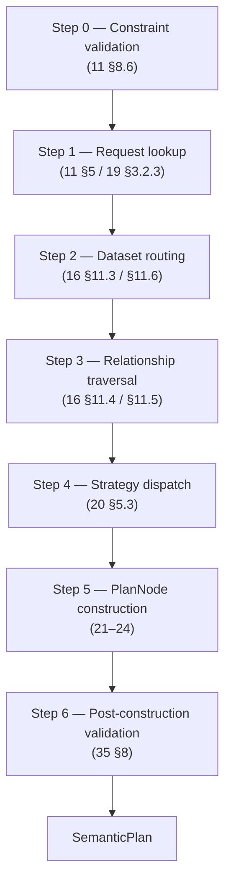

# 34. semstrait-planner

> **Status:** ratified (Round 1). `34` nails down the public surface of
> `semstrait-planner` — the crate that owns the `plan` stage (`10 §3.4`)
> and the `optimize` stage (`10 §3.5`) — against `20`'s Strategy-per-
> variant taxonomy, `21`–`24`'s per-variant strategy bodies, `33`'s
> SemanticManifest consumer contract, `35`'s `SemanticPlan` shape, and `30`'s
> stability / diagnostics policy. All types the surface touches are
> ratified upstream; `34` adds the crate-level wiring — the `plan` /
> `optimize` entry points, the `Request` / `SessionContext` /
> `ResolvedQueryRequest` value objects, the `Strategy` and
> `OptimizerPass` trait shapes, and the `PlanErrorKind` / `OptimizeErrorKind`
> typed-kind enums (per `30 §5`) that flow across the stage boundary.
> Round-1 open items parked in `questions/open/34_questions.md`.
>
> **Scope note (2026-05-27).** Planner runtime graph lifecycle is intentionally marked TODO/provisional in this document. Canonical graph types live in ir (`35`), manifest seeds live in `33`, and finalized planner runtime contracts will land in a dedicated planner pass. Runtime DAG backend target for that pass is `daggy`; legacy `petgraph` usage in manifest internals is transitional and non-authoritative for planner runtime contracts.

## 1. Purpose, scope, layering

### 1.1 What `semstrait-planner` OWNS

- The `plan` free function (§6) that turns a `&SemanticManifest` + a `Request` into a `SemanticPlan`.
- The `optimize` free function (§11) that takes a `SemanticPlan` and returns an equivalent, canonicalized `SemanticPlan`.
- The `Request` (§3), `SessionContext` (§4), and `ResolvedQueryRequest` (§5) value types.
- The `Strategy` trait (§8) — the dispatch surface ratified structurally in `20 §5.2` and concretized here.
- The four built-in strategies: `SimpleStrategy`, `GrainsetStrategy`, `UnionsetStrategy`, `JoinsetStrategy` (§9) — crate-public wrappers whose algorithms are ratified in `21`–`24`.
- Field-first resolution (§10) — the planner-side realization of the algorithm ratified in `16 §11`.
- TODO/provisional boundary contract for runtime graph lifecycle (builder/store/drift/lowering details deferred).
- The `OptimizerPass` trait (§12) — the pluggable v1 optimizer interface.
- The `PlanErrorKind` and `OptimizeErrorKind` typed-kind enums (§13), their `Diagnose` impls per `30 §5.4`, and the variant rosters wrapping per-DataKind `Simple` / `Grainset` / `Unionset` / `Joinset` errors.
- The `StrategyRegistry` and `StrategyContext` (§8.3 / §8.4) — internal wiring types exposed to adapter-level extensions and test doubles only.

### 1.2 What `semstrait-planner` does NOT own

- **Expression and graph type vocabulary.** `Expr`, `SemanticExpr`, `PhysicalExpr`, `SemanticGraph`, `SemanticNode`, `SemanticEdge`, `SegmentKey`, `DataType`, `Grain`, and diagnostics primitives live in `semstrait-ir`/`semstrait-common` (`35`, `31`). `34` consumes them.
- **Plan-tree shape.** `SemanticPlan`, `PlanNode`, `NodeMeta`, `SourceRef`, `Name` all live in `semstrait-ir` (`35`). `34` emits and consumes them.
- **SemanticManifest shape.** `SemanticManifest` seed/index contracts live in `semstrait-manifest` (`33`). `34` reads them, builds runtime segments, and never mutates persisted artifacts.
- **YAML parsing / structural validation.** Lives in `semstrait-model` (`32`). The `Request` the planner accepts is already a Rust value — the API layer (`semstrait-api`) is responsible for converting user-facing JSON / gRPC / protobuf into `Request`.
- **Catalog / filesystem ownership.** `CatalogProvider` / `FileSystem` trait ownership remains in `37`; planner may consume explicit drift probes/results but does not own provider contracts.
- **SQL / engine emission.** `semstrait-adapter` (`36`) consumes the `SemanticPlan` and produces engine-specific artifacts; no planner API touches a dialect.

### 1.3 Design posture — sync-only dispatch crate

The planner is the workspace's widest dispatch site — the `plan` entry point fans out across every `ResolvedDataKind` variant — but it is **not** the crate with the most runtime weight. The hot path is a single tree walk over pre-resolved SemanticManifest indices (§7). Three properties shape the design:

- **Synchronous end-to-end.** Per I6, there is no `async fn` anywhere on the public surface. `plan` and `optimize` are ordinary fallible functions; every strategy method is sync. The `async` wrapper on `compile` (`10 §3.3`) is the last async boundary in the pipeline; everything the planner reads has already been resolved.
- **Manifest-seeded planning.** Per I5 / I8, the planner does no semantic name resolution. It performs O(1)/O(log n) lookups on manifest indices and lowers to `PlanNode`s. Runtime graph lifecycle details are TODO/provisional in this revision.
- **Strategy dispatch is the one variant-match site.** Per `20 §5.3`, the only place the planner branches on a `ResolvedDataKind` variant tag is the dispatch function (§8.5). Every other planner site consumes `&dyn Strategy`. Adding a new `Complex` variant per I10 is a MINOR change that forces a new match arm in one place, not a scatter of edits.

### 1.4 Invariants upheld by the crate


| Invariant                                  | `semstrait-planner` guarantee                                                                                                                                                                                                                                                                                                                                   |
| ------------------------------------------ | --------------------------------------------------------------------------------------------------------------------------------------------------------------------------------------------------------------------------------------------------------------------------------------------------------------------------------------------------------------- |
| **I5** — name resolution is compile-time   | The planner performs **lookup only** (`19 §3.2.3`, `33 §4`). No `resolve`_* method walks names to Semantics or columns; every such walk was performed at `compile`. A CI lint forbids `EntityRef` leaves in any `PhysicalExpr` a plan node carries.                                                                                                            |
| **I6** — plan hot path is synchronous      | **No `pub async fn` exists on `semstrait-planner`.** The `Strategy` trait's `plan` method is sync; so is every `OptimizerPass::apply`. A CI audit (`cargo clippy -- -D clippy::async_fn_in_trait`) enforces.                                                                                                                                                    |
| **I8** — planner-complete SemanticManifest | Every lookup needed for candidate selection and segment build is present in manifest seeds/indices (`33 §3`). Missing ids/edges/seeds trigger `PlanErrorKind::SemanticManifestIndexInconsistent` before lowering.           |
| **I10** — non-exhaustive public sum types  | `Request`, `SessionContext`, `ResolvedQueryRequest`, `PlanErrorKind`, `OptimizeErrorKind`, `StrategyId` are all `#[non_exhaustive]`. An integration test over `cargo public-api` enforces.                                                                                                                                                                      |
| **I11** — no I/O in hot path               | No `std::fs`, no `std::net`, no `tokio`, no `reqwest` in the crate's dependency graph. The `Cargo.toml` audit (§16.2) is CI-enforced.                                                                                                                                                                                                                           |
| **I12** — first-class diagnostics          | `PlanErrorKind` and `OptimizeErrorKind` implement `Diagnose` per `30 §5.4`; identification is by variant identity per `30 §5.4` (no string-code surface). Warnings accumulate through both success and failure arms per `30 §7.2` / `§7.3`. The `tracing` channel (`30 §6`) carries library-internal observability events orthogonally to returned diagnostics. |


### 1.4A Runtime contract: `manifest -> graph -> planning -> plan`

Status: **TODO / provisional**.

This section is intentionally a boundary marker, not a finalized planner implementation contract.

Planned runtime path:

1. read candidates from manifest indices (`33`);
2. materialize/lookup runtime graph fragments using canonical IR graph shapes (`35`);
3. resolve runtime physical expressions for touched fragment scope;
4. apply source drift policy (`Strict` / `Warn` / `TrustManifest`);
5. lower fragment into canonical `SemanticPlan`.

Current contract at this stage:

- `33` is authoritative for persisted manifest seed/index shape.
- `35` is authoritative for canonical graph and expression types.
- Graph-fragment admission validates DAG-ness and typed expression-reference resolvability (`GraphExprRef`) before planning/lowering.
- planner runtime store/build/eviction/drift interfaces are pending dedicated planner design pass.
- planner runtime DAG backend target is `daggy`; backend-specific types do not leak through `33`/`35` public contracts.

### 1.5 Constraint validation precedes Strategy dispatch

Per `11 §8.6`, realized-carrier Constraint validation runs as the **planner's first action — step 0, pre-resolution — before any other sub-step of the `plan` pipeline**. The rationale is twofold:

1. Constraints express author-declared admissibility rules on Request shape (`11 §8.4`). A Request that violates a Measure's `dimensions: { one_of: [...] }` rule cannot be planned without lying about author intent; it is cheaper and clearer to reject before any SemanticManifest index work begins.
2. The v1 `ConstraintValidator::check()` (`11 §8.6`) reads only the Request and the SemanticManifest's name indices — work the planner must do anyway in step 1. Reordering would duplicate lookups.

§7.1 ratifies step 0 as the planner's entry action. The seven-step pipeline is fixed: violating the order is a crate-internal bug, not a surface the caller can influence.

## 2. Public crate surface

Every `pub` symbol below carries a doc comment, is listed in this document, and has documented invariants. Crate-internal helpers (`DataKindPlannerRegistry`, `PlanFragment`, `PrunedView`, etc. from the legacy code) are `pub(crate)` and are not part of `34`'s surface. The target module layout is:

```
semstrait-planner
├── request              // Request, SessionContext, ResolvedQueryRequest,
│                        //   Filter, TemporalRequest (forward-ref to 17)
├── plan                 // pub fn plan, PlanErrorKind, plan-pipeline internals
├── optimize             // pub fn optimize, OptimizerPass, OptimizeErrorKind,
│                        //   canonical v1 passes
├── graph_runtime        // TODO/provisional: runtime graph lifecycle interfaces
├── strategy             // Strategy trait, StrategyId, StrategyContext,
│                        //   StrategyRegistry, dispatch_strategy
├── strategies           // SimpleStrategy, GrainsetStrategy, UnionsetStrategy,
│                        //   JoinsetStrategy
└── resolution           // field-first resolution entry point; Request-lookup
                         //   helpers; relationship-traversal wrappers
```

Crate-root re-exports expose the stable convenience surface. Non-root re-exports are forbidden — consumers either import `semstrait_planner::plan` or `semstrait_planner::plan::plan`, never both.

**Surface roster (one line per item; full shapes in later sections):**


| Module       | Item                                                                                                                                              | Kind                               | Section |
| ------------ | ------------------------------------------------------------------------------------------------------------------------------------------------- | ---------------------------------- | ------- |
| (crate root) | `pub fn plan(...) -> Result<(SemanticPlan, Diagnostics<PlanErrorKind>), (Diagnostic<PlanErrorKind>, Diagnostics<PlanErrorKind>)>`                 | free fn                            | §6      |
| (crate root) | `pub fn optimize(...) -> Result<(SemanticPlan, Diagnostics<OptimizeErrorKind>), (Diagnostic<OptimizeErrorKind>, Diagnostics<OptimizeErrorKind>)>` | free fn                            | §11     |
| `graph_runtime` | TODO/provisional runtime graph lifecycle interfaces                                                                                              | deferred surface                   | §1.4A   |
| `request`    | `pub struct Request`                                                                                                                              | value type                         | §3      |
| `request`    | `pub struct SessionContext`                                                                                                                       | value type                         | §4      |
| `request`    | `pub struct ResolvedQueryRequest`                                                                                                                 | value type                         | §5      |
| `request`    | `pub struct Filter`                                                                                                                               | value type                         | §3.5    |
| `request`    | `pub enum FilterOperator`                                                                                                                         | sum type                           | §3.5    |
| `request`    | `pub enum FilterValue`                                                                                                                            | sum type                           | §3.5    |
| `request`    | `pub enum SortDir`                                                                                                                                | sum type                           | §3.6    |
| `request`    | `pub struct DataKindRef`                                                                                                                          | newtype                            | §3.8    |
| `request`    | `pub struct TemporalRequest`                                                                                                                      | value type (reserved)              | §3.9    |
| `plan`       | `pub enum PlanErrorKind`                                                                                                                          | typed-kind enum (impls `Diagnose`) | §13     |
| `optimize`   | `pub enum OptimizeErrorKind`                                                                                                                      | typed-kind enum (impls `Diagnose`) | §13.3   |
| `optimize`   | `pub trait OptimizerPass`                                                                                                                         | pluggable pass                     | §12     |
| `optimize`   | `pub struct Optimizer`                                                                                                                            | pass chain                         | §12.4   |
| `optimize`   | `pub struct OptimizerBuilder`                                                                                                                     | builder                            | §12.5   |
| `strategy`   | `pub trait Strategy`                                                                                                                              | dispatch surface                   | §8      |
| `strategy`   | `pub struct StrategyId`                                                                                                                           | newtype                            | §8.2    |
| `strategy`   | `pub struct StrategyContext<'a>`                                                                                                                  | per-invocation context             | §8.4    |
| `strategy`   | `pub struct StrategyRegistry`                                                                                                                     | dispatch table                     | §8.3    |
| `strategy`   | `pub fn dispatch_strategy(...) -> Result<&dyn Strategy, PlanErrorKind>`                                                                          | free fn                            | §8.5    |
| `strategies` | `pub struct SimpleStrategy`                                                                                                                       | v1 strategy                        | §9.1    |
| `strategies` | `pub struct GrainsetStrategy`                                                                                                                     | v1 strategy                        | §9.2    |
| `strategies` | `pub struct UnionsetStrategy`                                                                                                                     | v1 strategy                        | §9.3    |
| `strategies` | `pub struct JoinsetStrategy`                                                                                                                      | v1 strategy                        | §9.4    |


> **Legacy detail note.** Sections `§3+` retain extensive pre-split planner details. The split contract ratified in `§1.4A` (runtime graph lifecycle) and `§2` (public surface roster) is authoritative when names/flows differ (for example legacy `expr_table` references vs `ManifestExpressions` + runtime realization).

## 3. The `Request` type

### 3.1 Shape

```rust
/// A caller-authored query intent — the planner's input at the
/// stage-4 boundary (`10 §3.4`). Per `00 §4.1`'s Request row. Carries
/// no references to the SemanticManifest; the API layer constructs it from
/// the user-facing query form.
#[non_exhaustive]
pub struct Request {
    pub dimensions: Vec<SemanticsName>,
    pub measures:   Vec<SemanticsName>,
    pub metrics:    Vec<SemanticsName>,
    pub filters:    Vec<Filter>,
    pub order:      Vec<(Name, SortDir)>,
    pub limit:      Option<u64>,
    pub offset:     Option<u64>,
    pub from:       Option<DataKindRef>,
    pub temporal:   Option<TemporalRequest>,
    pub session:    SessionContext,
}
```

Each field is detailed in §3.2–§3.7. `#[non_exhaustive]` per I10: additions (e.g. a reserved `explain:` block for plan-tree introspection) are MINOR per `30 §2.2`.

### 3.2 `dimensions`, `measures`, `metrics`

Each field is a `Vec<SemanticsName>`. Order is user-visible: it pins the left-to-right column order in `SemanticPlan.output_names` (`35 §3.2`). Duplicates within any single list are rejected at step 1 with `PLAN_E_0510 DuplicateRequestedName`; empty lists on all three simultaneously are rejected with `PLAN_E_0511 EmptyRequest`.

The split into three vectors mirrors `00 §4.1`'s terminology. At the planner layer the distinction is structural, not semantic: every entry becomes a leaf lookup against the SemanticManifest's name index. The split matters downstream — a Measure wraps inside a `PlanNode::Agg`; a Dimension lands in `group_by`; a Metric routes through its `CompiledMetric` entry per `19 §3.2.4`.

**Type admissibility.** If a name's resolved Semantics type contradicts the field it was placed in (e.g. a Dimension name in `measures`), the planner raises `PLAN_E_0512 RequestFieldTypeMismatch` at step 1.

**Rollup-aware Dimension carrier (forward-extensible).** The bare `Vec<SemanticsName>` shape suffices when every Dimension is requested in its native form. When a Dimension needs a per-axis transform (e.g. temporal rollup to `month` via `DATE_TRUNC(month, axis)` at `GROUP BY`), the carrier `RequestDimensionRef { name, variation }` per §3.10 is the forward-extensible replacement. Tracked under `[TD-REQUEST-DIM-VARIATION]`; consumed by `[19 §6.2](../foundations/19_expression_flow.md)`.

### 3.3 `filters`

`Vec<Filter>` — a flat list of row-level predicates conjoined by logical AND. Each `Filter` names a Semantics by `SemanticsName`, an operator, and a value vector (§3.5). Filter decomposition and placement across scan / rename / expression / aggregation layers is the planner's job (§7.6, `21 §4.6`); the caller sees only the conjunctive list.

Filters on a Measure or two-stage Metric with `agg:` land above `PlanNode::Agg` (HAVING-equivalent). Filters on a Dimension sink below aggregation. Filters on a declared Filter Semantics (`11 §6`) resolve through the Semantics' body. `filters: Vec::new()` is legal; default filters carried on the `ResolvedDataKind` (e.g. Filter-injection under reserved carrier `11 §8.5.2`'s `requires:`) are applied separately.

### 3.4 `order`, `limit`, `offset`

- `order: Vec<(Name, SortDir)>` — ORDER BY list. Names MUST appear in `dimensions` ∪ `measures` ∪ `metrics`; violation raises `PLAN_E_0513 OrderByUnknownName`.
- `limit: Option<u64>` — row cap on the post-sort output. `Some(0)` emits an empty-result `PlanNode::Fetch`.
- `offset: Option<u64>` — row offset applied before `limit`.

Placement: `order` → `PlanNode::Sort`; `offset` / `limit` → `PlanNode::Fetch`. Empty `order` with non-empty `limit` is legal; result order is non-deterministic unless `order` is specified.

### 3.5 `Filter`

```rust
/// A single user-supplied predicate. Conjoined with siblings via AND.
#[non_exhaustive]
pub struct Filter {
    /// The Semantics name being filtered. MUST resolve on the target
    /// `ResolvedDataKind`'s interface (Simple `SemanticInterface` or
    /// Complex `ComposedSemanticInterface`).
    pub field: SemanticsName,

    /// The operator applied between `field` and `values`.
    pub operator: FilterOperator,

    /// The operand(s) the operator consumes. Each operator has a
    /// per-variant arity rule enforced at step 1 (§7.2).
    pub values: Vec<FilterValue>,
}

#[non_exhaustive]
pub enum FilterOperator {
    Eq,
    NotEq,
    Lt,
    LtEq,
    Gt,
    GtEq,
    In,
    NotIn,
    Between,
    IsNull,
    IsNotNull,
}

/// Typed filter operand. The planner lowers every variant to an
/// `Expr::Literal` leaf with the appropriate `LiteralValue` variant
/// during step 5 (§7.5).
#[non_exhaustive]
pub enum FilterValue {
    String(String),
    Number(f64),
    Integer(i64),
    Decimal(String),   // string form; parsed against the target's DataType
    Bool(bool),
    Timestamp(Timestamp),
    Date(Date),
    Null,
}
```

**Arity rules** (enforced at step 1):


| Operator                                       | Arity            | Error                             |
| ---------------------------------------------- | ---------------- | --------------------------------- |
| `Eq` / `NotEq` / `Lt` / `LtEq` / `Gt` / `GtEq` | 1                | `PLAN_E_0520 FilterArityMismatch` |
| `In` / `NotIn`                                 | ≥ 1              | same                              |
| `Between`                                      | 2 (lower, upper) | same                              |
| `IsNull` / `IsNotNull`                         | 0                | same                              |


**Type admissibility.** A `FilterValue` whose native Rust type cannot be cast to `field`'s resolved `DataType` raises `PLAN_E_0521 FilterValueTypeMismatch`. Conversions follow `13 §4`'s compatibility relation; no engine-specific coercion is performed (I2).

### 3.6 `SortDir`

```rust
#[non_exhaustive]
pub enum SortDir {
    Asc,
    Desc,
    AscNullsFirst,
    AscNullsLast,
    DescNullsFirst,
    DescNullsLast,
}
```

The null-aware variants are explicit vocabulary per `35 §5.7`. `Asc` and `Desc` are null-placement-agnostic; the planner forwards the agnostic variant to the `PlanNode::Sort` node and the adapter's null-placement default applies.

### 3.7 Delta with legacy code

The legacy `crates/semstrait-planner/src/request.rs::ResolvedQueryRequest` folds several concerns into one struct:

- `entity_name: String` — the legacy name for `Request.from` (scalar, not optional). `34` ratifies `from: Option<DataKindRef>`, with `None` triggering field-first resolution.
- `dimensions: Vec<String>` — split in this spec into `dimensions` / `measures` / `metrics` to match `00 §4.1`.
- `grain: Option<Grain>` — DEFERRED to `17 §6`'s `Request.temporal` block; current `ResolvedQueryRequest.grain` is a legacy convenience that the API layer derived from `dimensions`.
- `session_variables: HashMap<String, String>` — refined into `SessionContext` (§4).

The rename is tracked in `implementation/40_refactor_plan.md` as `[TD-REQUEST-SHAPE]`. The legacy name `ResolvedQueryRequest` survives in the crate-internal `resolution::` pipeline as a stage-internal alias for the post-lookup form (§5) until the refactor lands.

### 3.8 `DataKindRef`

```rust
/// Reference to a top-level `ResolvedDataKind` by its canonical name.
/// Newtype over `DataKindName` (from `semstrait-common` / `11 §4`).
pub struct DataKindRef(pub DataKindName);

impl DataKindRef {
    pub fn new(name: impl Into<DataKindName>) -> Self;
    pub fn as_name(&self) -> &DataKindName;
}
```

`DataKindRef` is intentionally non-`#[non_exhaustive]` — it is a newtype over a stable inner type per `30`'s "newtype-over-stable" exception (`31 §3.2`).

### 3.9 `TemporalRequest` — reserved shape

```rust
/// Reserved per `17 §6.1`. Planner consumption is DEFERRED.
#[non_exhaustive]
pub struct TemporalRequest {
    pub as_of: Option<Timestamp>,
    pub range: Option<TimeRange>,
}

#[non_exhaustive]
pub struct TimeRange {
    pub start: Timestamp,
    pub end: Timestamp,
}
```

Exposed now, consumed later. Ratifying the shape in `34` lets the API layer (`semstrait-api`) populate the field in a forward-compatible way; per `17 §10`, the Round-1 planner emits `PLAN_W_1702` when a populated `TemporalRequest` targets a `TemporalShape::None` DataKind, and `PLAN_W_1700 ShapeAwareRequestDeferred` on any non-trivial consumption attempt.

### 3.10 `RequestDimensionRef` — rollup-aware Dimension carrier (reserved shape)

Forward-extensible replacement for the bare `Request.dimensions: Vec<SemanticsName>` shape. Used when a Dimension needs an axis-rollup transform at `GROUP BY` (e.g. temporal rollup to `month`). Tracked under `[TD-REQUEST-DIM-VARIATION]`; consumed by `[19 §6.2](../foundations/19_expression_flow.md)`.

```rust
#[non_exhaustive]
pub struct RequestDimensionRef {
    pub name:      SemanticsName,
    pub variation: DimensionVariation,
}

#[non_exhaustive]
pub enum DimensionVariation {
    /// Native model projection — no transform wrap.
    None,
    /// Temporal rollup — wraps the axis in `DATE_TRUNC(grain, axis)` at GROUP BY.
    /// Legal only when the Dimension's `data_type` is temporal.
    Temporal { grain: Grain },
}
```

**Type admissibility.** `Temporal { grain }` against a non-temporal Dimension → `PlanErrorKind::DimensionVariationTypeMismatch`. Non-temporal Dimensions admit only `None` in v1 (string-cased / numeric-bucketed variations are forward-extensible). Multi-axis rollup composes naturally — one `RequestDimensionRef` per requested Dimension, each with its own `variation`.

**Distinct from `[18 §1.2](../foundations/18_entities.md)`'s `DimensionRef`** (a model-side Semantics-reference-with-overrides carrier — different concern). Naming kept distinct: `RequestDimensionRef` is the request-layer rollup carrier; `DimensionRef` is the model-layer reference shape.

**Computed Dimensions** participate in `GROUP BY` as their materialised column; variation does not apply to computed Dimensions in v1.

**Embedder-level surface.** A CLI or other front-end may accept tokens such as `name.grain` and desugar them to `RequestDimensionRef { name, variation: Temporal { grain } }` before constructing the planner input — embedder convention, not a crate contract.

## 4. `SessionContext`

### 4.1 Shape

```rust
/// Per-invocation runtime parameters the planner consumes. Never
/// `Option` on `Request`; every Request carries a `SessionContext`.
#[non_exhaustive]
pub struct SessionContext {
    pub now:             Timestamp,
    pub timezone:        Timezone,
    pub feature_toggles: FeatureToggles,
    pub correlation_id:  Option<CorrelationId>,
}
```

The planner reads `SessionContext` at exactly two sites: `Expr::Literal` folding for Request filters referencing session-resolved literals (e.g. `as_of = session.now`), and expressions whose resolved `PhysicalExpr` carries a `FunctionCall` whose `FunctionSpec` is session-dependent (`14a §3.5` Q3, currently empty). `#[non_exhaustive]` per I10: additional parameters (e.g. a `tenant_id` for per-tenant rewrites) are MINOR per `30 §2.2`.

### 4.2 Field-by-field

- `**now: Timestamp**` — the single fact every session-aware expression resolves against. The planner never calls `SystemTime::now()` itself (I11); a caller replaying a historical query sets `now` to that instant and every strategy observes it uniformly.
- `**timezone: Timezone**` — `#[non_exhaustive]` newtype over an IANA identifier; `Timezone::utc()` is `Default`. Feeds into `PhysicalExpr::DateTrunc` nodes declaring `zone: ZoneScope::Session` per `13 §3`; v1's `Grain` variants are session-zone-oblivious so the field is carried but not consumed.
- `**feature_toggles: FeatureToggles**` — a `BTreeMap<String, FeatureToggleValue>` shim, `#[non_exhaustive]`. Per I4, the planner's output is a pure function of `(manifest, request, feature_toggles)`. The planner reads toggles only at ratified sites (§11.4, `OptimizerPass::apply`).
- `**correlation_id: Option<CorrelationId>**` — opaque caller-supplied identifier embedded into every emitted `Diagnostic.location.source` so downstream log-aggregation can correlate a request across stage boundaries.

### 4.3 Constructors

```rust
impl SessionContext {
    /// Build a `SessionContext` with `now = SystemTime::now()`,
    /// `timezone = Timezone::utc()`, empty toggles, no correlation ID.
    /// Intended for tests and single-shot CLI tools.
    pub fn new() -> Self;

    /// Build a `SessionContext` pinned to a specific instant in UTC.
    pub fn at(now: Timestamp) -> Self;

    pub fn with_timezone(self, tz: Timezone) -> Self;
    pub fn with_feature_toggle(self, key: &str, value: FeatureToggleValue) -> Self;
    pub fn with_correlation_id(self, id: CorrelationId) -> Self;
}
```

The only constructor that reads the host clock is `new()`. Every other code path must call `at(...)` with an explicit timestamp, preserving I11's "no implicit I/O / host-env dependency on the hot path" rule.

### 4.4 Delta with legacy code

Legacy `crates/semstrait-planner/src/request.rs::SessionVariables` is a `HashMap<String, String>`. `34` ratifies a structured shape with four named fields; free-form session bag moves to `feature_toggles`. Migration tracked as `[TD-SESSION-CONTEXT]` in the refactor plan; the legacy `SessionVariables` alias survives for one MINOR cycle.

## 5. `ResolvedQueryRequest`

### 5.1 Shape

The SemanticManifest-contextualized Request: every `SemanticsName` looked up, every target DataKind resolved (either via explicit `from` or via field-first resolution per §10), every `Filter.field` bound to its `ResolvedSemanticRef`. Produced by step 1 (§7.2) and consumed by step 4 (§7.5). NEVER exposed on the `plan` entry signature — a caller who needs the resolved form destructures the returned `SemanticPlan` instead. The type is `pub` so `Strategy` impls can consume it directly; construction is `pub(crate)` (only the step-1 builder produces well-formed instances).

```rust
#[non_exhaustive]
pub struct ResolvedQueryRequest {
    pub target:     ResolvedTarget,
    pub dimensions: Vec<(SemanticsName, ResolvedSemanticRef)>,
    pub measures:   Vec<(SemanticsName, ResolvedSemanticRef)>,
    pub metrics:    Vec<(SemanticsName, ResolvedSemanticRef)>,
    pub filters:    Vec<ResolvedFilter>,
    pub order:      Vec<(Name, SortDir)>,
    pub limit:      Option<u64>,
    pub offset:     Option<u64>,
    pub session:    SessionContext,
    pub temporal:   Option<TemporalRequest>,
}

#[non_exhaustive]
pub enum ResolvedTarget {
    Explicit(DataKindRef),                            // Request.from = Some(d)
    Implicit(DataKindRef),                            // `16 §11.3` single-kind fast path
    Composition(DataKindRef),                         // `16 §11.4` — graph-index lookup
                                                      //   hit by constituent-set; origin is on
                                                      //   the resolved kind itself
}

#[non_exhaustive]
pub struct ResolvedSemanticRef {
    pub owner:      DataKindRef,
    pub element:    SemanticElement,
    pub binding_id: EntityId,                         // key into manifest `bindings`
}

#[non_exhaustive]
pub enum SemanticElement { Dimension, Measure, Metric, Filter, Key }
```

For `ResolvedTarget::Composition(name)`, the planner consumes the resolved kind through the runtime graph composition index (`graph.composition_index(name)`); traversed paths and constituent sets are graph-build products derived from manifest primitives (`16 §10` / `§11`). Strategies treat `Origin::Explicit` and `Origin::Implicit { id }` uniformly. For Complex-owned fields, `binding_id` points at the constituent Binding the field resolves through per `16 §7`'s `FieldOwnership`.

### 5.2 Invariants

A well-formed `ResolvedQueryRequest` satisfies: every `owner` resolves through graph/manifest lookup (`graph.name_index` + `manifest.data_kinds`); every `binding_id` is present in `manifest.bindings` (I8 / `19 §3.2.3`); `target` is consistent with all `owner` fields; `dimensions` / `measures` / `metrics` entries have `element` matching the field they appear in; `filters` preserve caller order. Violation is a planner-internal bug; step 1 constructs only well-formed instances and consumers MAY `debug_assert!` in test builds.

## 6. The `plan` function signature

### 6.1 Signature

```rust
use semstrait_common::diagnostic::{Diagnostic, Diagnostics};

/// Planner entry point. Per `10 §3.4`.
///
/// Consumes a read-only `SemanticManifest` reference and an owned `Request`;
/// returns a well-formed `SemanticPlan` plus warnings on success, or a
/// fail-fast `(Diagnostic<PlanErrorKind>, Diagnostics<PlanErrorKind>)`
/// pair on failure (per `30 §7.2`).
///
/// Sync (I6). Never mutates the SemanticManifest (I8 / I5). Performs no I/O
/// (I11). Accumulates warnings across both arms per `30 §7.3` — they
/// flow on the success-tuple's second element or the failure-tuple's
/// second element respectively. The success-arm `SemanticPlan.diagnostics`
/// (`35 §3.1`) is a content-equivalent copy retained on the artifact.
pub fn plan(
    manifest: &SemanticManifest,
    request: Request,
) -> Result<
    (SemanticPlan, Diagnostics<PlanErrorKind>),
    (Diagnostic<PlanErrorKind>, Diagnostics<PlanErrorKind>),
>;
```

**Input ownership.** `SemanticManifest` is borrowed (never consumed) — a SemanticManifest is typically cached across many `plan` calls; the planner takes a read-only view. `Request` is owned (consumed) — its fields are destructured into the internal `ResolvedQueryRequest` representation, and retaining the caller's copy has no utility.

**Return shape.** Matches `30 §7.2`'s fail-fast pattern verbatim: success arm `(SemanticPlan, Diagnostics<PlanErrorKind>)`, failure arm `(Diagnostic<PlanErrorKind>, Diagnostics<PlanErrorKind>)`. The fatal `Diagnostic<PlanErrorKind>` carries primary `Location` on its envelope per `30 §5.1`; the wrapped `PlanErrorKind` carries semantic payload only. No bespoke carrier struct.

### 6.2 Preconditions on `manifest`

The SemanticManifest must satisfy every invariant in `33 §4` / `§10` / `§12` — in particular, `bindings`, `data_kinds`, `relationships`, and typed expression pools must be internally consistent so graph build can derive indices before planning. Feeding a partially-built SemanticManifest is a caller error; planner graph/index checks raise `PlanErrorKind::SemanticManifestIndexInconsistent` where possible but are not exhaustive. Multi-thread access is safe per `33 §12` — a single `SemanticManifest` may back concurrent `plan` calls.

### 6.3 Postconditions

**On success** (`Ok((plan, warnings))`): every `SemanticPlan` invariant from `35 §3.2` holds — `output_names.len()` equals `root.meta().output_schema.len()`, every `Name` is valid per `35 §6.4`, the tree satisfies `35 §8` well-formedness, and `warnings` (and the artifact-side `plan.diagnostics`) carry no `Severity::Error` entries. Step 6 (§7.7) is the enforcement point.

**On failure** (`Err((fatal, warnings))`): `fatal.severity == Severity::Error`; `fatal.kind` is a `PlanErrorKind` variant identifying the failure category; `warnings` carries every `Severity::Warning` `Diagnostic<PlanErrorKind>` emitted before the fail-fast abort.

### 6.4 Thread-safety

`plan` is `Send` on the invoking thread and reentrant under concurrent invocations against the same SemanticManifest (reads only; no interior mutability across calls).

## 7. Legacy direct-plan pipeline notes (transitional)

This section preserves pre-split direct-plan wording for migration context. The authoritative planner pipeline is `§1.4A` plus `10 §3.4`. Any conflict between this section and `§1.4A` is resolved in favor of `§1.4A`.

### 7.1 Step 0 — Constraint validation (`11 §8.6`)

**Work.** Invoke `ConstraintValidator::check(request, manifest)` per `11 §8.6`. The v1 checker iterates every Measure and Metric named in `request.measures` / `request.metrics`, resolves each via the SemanticManifest's name index, and evaluates every `MeasureConstraints` entry against the Request's query scope (`dimensions` ∪ filter-field Dimensions) and against the Measure's effective aggregation.

**Output.** Either a successful advance to step 1, or a fail-fast abort with `PLAN_E_0500 ConstraintViolation { entity, message }` per `11 §8.7`. The v1 checker short-circuits on first violation; future fan-out (`[TD-CONSTRAINT-ERROR-FANOUT]`) refines the carrier without changing step-0 placement.

**Why step 0.** Constraint violations express author-declared admissibility rules. Running them before any SemanticManifest-index work avoids redundant field-first resolution / relationship / dispatch work on Requests that cannot be planned by author intent.

### 7.2 Step 1 — Request lookup (`11 §5`)

**Work.** Per `11 §5`'s lookup algorithm and `19 §3.2.3`'s O(1) guarantee:

1. For each name in `request.dimensions` ∪ `request.measures` ∪ `request.metrics`, look up the `SemanticsName` in the SemanticManifest's name index. Unknown names raise `PLAN_E_0508 UnknownSemantics { name }` per `16 §14.3`.
2. Record each name's `SemanticElement` and owning `DataKindRef`. Mismatch with the field the name was placed in raises `PLAN_E_0512 RequestFieldTypeMismatch`.
3. For each `Filter.field`, look up similarly; arity mismatch raises `PLAN_E_0520`; value-type mismatch raises `PLAN_E_0521`.
4. Duplicate names within any field list raise `PLAN_E_0510`.

No name resolution beyond the pre-built index (I5). Complexity is O(names × log n) over `BTreeMap`-backed indices per `19 §3.2.1`.

**Output.** Partially-built `ResolvedQueryRequest` — resolved refs populated; `target` not yet set. Step-1 errors sit in the `PLAN_E_05xx` band per `30 §6.2`.

### 7.3 Step 2 — Dataset routing

Two-branch decision:

- **Explicit (`request.from == Some(d)`).** Per `16 §11.6`: look up `d` in the graph/manifest DataKind index (`graph.datakind_index`). Absent → `PLAN_E_2040`. For every resolved Semantics, assert the owner equals `d` (Simple) or appears in `d`'s constituents (Complex); violation → `PLAN_E_0507 SemanticsNotOnSurface`. Set `target = Explicit(d)`.
- **Implicit (`request.from == None`).** Invoke field-first resolution (§10 / `16 §11`). Output is `ResolvedTarget::Implicit(d)` (single-kind fast path) or `ResolvedTarget::Composition(d)` (constituent-set lookup hit per §10.2 step 4). Errors: `PLAN_E_0500` / `PLAN_E_0501` / `PLAN_E_0502` / `PLAN_E_0503` / `PLAN_E_0508`.

### 7.4 Step 3 — Composition consistency check

For composition targets (`ResolvedTarget::Explicit(d)` where `d` is Complex, or `ResolvedTarget::Composition(d)`), the planner consumes the graph-built composition entry from `graph.composition_index(d)`:

- **Composition target (explicit or implicit):** `traversed_paths` is materialized during graph build per `16 §10`. Step 3 walks the path edges to confirm every relationship `EntityId` resolves in the manifest relationship scope (`manifest.relationships` plus Joinset-local shadows) and packages the per-edge `JoinKeyExprPair` shape strategies consume.
- **Simple target:** step 3 is a no-op.

`PLAN_E_2052 SemanticManifestIndexInconsistent` surfaces here when a recorded relationship `EntityId` is missing from the expected relationship scope — a manifest/graph integrity bug, not a plan-time failure mode under valid inputs.

### 7.5 Step 4 — Strategy dispatch (`20 §5.3`)

Invoke `dispatch_strategy(kind, &registry)` per `20 §5.3`: a single `match` on the `ResolvedDataKind` variant returning `&dyn Strategy`. Per `20 §5.3`, this is the **only** variant-match site in the hot path; every other planner site consumes `&dyn Strategy`. Defensive errors: `PLAN_E_2050`, `PLAN_E_2051`.

### 7.6 Step 5 — `PlanNode` construction

The dispatched strategy's `plan` method (§8) builds the subtree rooted at the target DataKind. Algorithm pointers by variant:

- `SimpleStrategy` (§9.1, `21 §4`) — 5-layer shape (Scan / Rename / Expression / Aggregate / Project) with interleaved `Filter`.
- `GrainsetStrategy` (§9.2, `22 §4`–§5) — child selection, recursive dispatch, optional rollup wrap.
- `UnionsetStrategy` (§9.3, `23 §4`) — per-branch recursive dispatch, NULL-fill seam, `Union`, optional re-aggregation.
- `JoinsetStrategy` (§9.4, `24 §5`) — anchor-outward path walk, per-member recursive dispatch, `Join` sequences, reconciling `Project`.

After the strategy returns, the planner wraps with Request-level nodes: (1) user-filter `Filter` nodes at the appropriate layer, (2) `Sort` if `order` non-empty, (3) `Fetch` if `limit` / `offset` set, (4) outermost `Project` pinning output column order.

Errors: per-variant `PLAN_E_21xx` / `PLAN_E_22xx` / `PLAN_E_23xx` / `PLAN_E_24xx` surfaced through the `PlanError::{Simple|Grainset|Unionset|Joinset}` wrapper variants; shared `PLAN_E_0600 PlanNodeConstructionFailed`, `PLAN_E_0601 UnsupportedRequestShape`.

### 7.7 Step 6 — Post-construction validation (`35 §8`)

Invoke `SemanticPlan::validate()` per `35 §9.3`. The validator walks the tree and checks every `35 §8` invariant (schema alignment, type resolution, predicate well-typedness, join-key agreement, union arm parity). Failure wraps an `IR_E_35xx` error into `PLAN_E_0610 PostConstructionInvariantViolated`.

**Production posture.** In optimized builds, step 6 is a no-op by default — strategies are trusted to produce well-formed plans. Test builds (`cfg(test)` + `debug_assertions`) always run it. An operator concerned about planner regressions opts in via the `semstrait.plan.validate` feature toggle (§4.2).

### 7.8 Pipeline summary diagram




Every arrow is fail-fast — a failure short-circuits to `Err(PlanErrors)` with accumulated warnings (§14).

## 8. The `Strategy` trait

### 8.1 Trait surface

Per `20 §5.2`, the `Strategy` trait is the planner-side contract every per-variant strategy implements. `20 §5.2` sketches the shape; `34` ratifies the concrete signature:

```rust
pub trait Strategy: Send + Sync {
    fn id(&self) -> StrategyId;
    fn supports(&self, kind: &ResolvedDataKind) -> bool;
    fn plan(
        &self,
        ctx: &StrategyContext,
        request: &ResolvedQueryRequest,
        datakind: &ResolvedDataKind,
    ) -> Result<PlanNode, PlanError>;
}
```

`**id`.** Stable identifier for diagnostic / debug / registry use — one of `StrategyId::{Simple, Grainset, Unionset, Joinset}`. Third-party strategies (if Q-PLAN-002 opens the trait) add variants via `#[non_exhaustive]`.

`**supports`.** Called by `dispatch_strategy` as a defense-in-depth check AFTER the variant-tag match has chosen the candidate strategy. Mismatch raises `PLAN_E_2051 StrategyMissingForVariant`. Built-in strategies return `true` for exactly one variant tag.

`**plan`.** Plans the Request against the given DataKind, returning the root `PlanNode` of the subtree (not a full `SemanticPlan` — Request-level wrapping is applied by step 5, §7.6, after the strategy returns). `ctx` carries session, registry for recursive dispatch, and the diagnostic sink; `request` is the resolved form from step 1; `datakind` is the variant this call is planning against (consistent with `request.target`).

**Borrow shapes.** `&StrategyContext` (not `&mut`) — mutation flows through interior-mutable fields so `&dyn Strategy` is shareable across threads. `&ResolvedQueryRequest` — constructed once per `plan` call and consumed read-only. Passing `&ResolvedDataKind` separately from `request.target` lets strategies access variant-specific fields (`ResolvedJoinset.path`, `ResolvedGrainset.levels`) without re-matching.

Per I6, no `async` anywhere in the surface; per I12, every failure returns a typed `PlanError` with a stable `PLAN_E_`* code.

### 8.2 `StrategyId`

```rust
#[non_exhaustive]
pub enum StrategyId { Simple, Grainset, Unionset, Joinset }

impl StrategyId {
    pub fn as_str(&self) -> &'static str; // "SimpleStrategy" …
}
```

Used in `Diagnostic` messages and structured logs only; never in user-facing error codes (those use the stable `PLAN_E_*` constants per §13).

### 8.3 `StrategyRegistry`

```rust
pub struct StrategyRegistry {
    simple:   Box<dyn Strategy>,
    grainset: Box<dyn Strategy>,
    unionset: Box<dyn Strategy>,
    joinset:  Box<dyn Strategy>,
}

impl StrategyRegistry {
    pub fn default_v1() -> Self;
    pub fn simple(&self)   -> &dyn Strategy;
    pub fn grainset(&self) -> &dyn Strategy;
    pub fn unionset(&self) -> &dyn Strategy;
    pub fn joinset(&self)  -> &dyn Strategy;
    pub fn with(
        simple:   impl Strategy + 'static,
        grainset: impl Strategy + 'static,
        unionset: impl Strategy + 'static,
        joinset:  impl Strategy + 'static,
    ) -> Self;
}
```

Holds exactly one strategy per variant; replacement is allowed at construction time only (no mutate-in-place API). Registry is `Send + Sync` — a single instance backs every `plan` invocation in a multi-threaded server. `with` is the test-doubles constructor.

### 8.4 `StrategyContext`

```rust
pub struct StrategyContext<'a> {
    pub manifest: &'a SemanticManifest,
    pub session:  &'a SessionContext,
    pub registry: &'a StrategyRegistry,
    pub diagnostics: &'a DiagnosticSink,
    pub plan_builder: &'a dyn PlanBuilder,
}

impl<'a> StrategyContext<'a> {
    pub fn plan_datakind(
        &self,
        request: &ResolvedQueryRequest,
        datakind: &ResolvedDataKind,
    ) -> Result<PlanNode, PlanError>;
    pub fn emit(&self, diagnostic: Diagnostic);
}
```

`plan_datakind` is the recursive-dispatch entry point for Complex strategies (Unionset / Grainset / Joinset) planning child subplans. `emit` adds a non-error `Diagnostic` to the accumulator; at step 6 the accumulator is drained into `SemanticPlan.diagnostics` (success) or `PlanErrors.warnings` (failure).

`DiagnosticSink` is an interior-mutable container (`RefCell` / `Cell`); every field of `StrategyContext` is either `&T: Sync` or an interior-mutable wrapper over a `Send + Sync` type. `PlanBuilder` is the `10 §6` injection-mode hook for adapter-provided deterministic rewrites; `DefaultPlanBuilder` (v1) applies none.

### 8.5 `dispatch_strategy`

```rust
pub fn dispatch_strategy<'r>(
    kind: &ResolvedDataKind,
    registry: &'r StrategyRegistry,
) -> Result<&'r dyn Strategy, PlanErrorKind> {
    match kind {
        ResolvedDataKind::Simple(_) => Ok(registry.simple()),
        ResolvedDataKind::Complex(ResolvedComplexDataKind::Unionset(_)) => Ok(registry.unionset()),
        ResolvedDataKind::Complex(ResolvedComplexDataKind::Grainset(_)) => Ok(registry.grainset()),
        ResolvedDataKind::Complex(ResolvedComplexDataKind::Joinset(_))  => Ok(registry.joinset()),
        _ => Err(PlanErrorKind::StrategyMissingForVariant),
    }
}
```

The single variant-tag match site in the planner's hot path (per `20 §5.3`). `#[non_exhaustive]` on `ResolvedDataKind` / `ResolvedComplexDataKind` requires a defensive fallback arm for forward-compatible builds. O(1) for known variants; every other planner site consumes the returned `&dyn Strategy` from here or from `ctx.plan_datakind` recursion.

## 9. Built-in strategies (v1 roster)

Each v1 strategy is a zero-sized, stateless struct constructed via `::new()` and held as `Box<dyn Strategy>` in the registry (§8.3). All four share the same `impl Strategy` shape — `id` returns the fixed `StrategyId`, `supports` pattern-matches on the variant tag, `plan` delegates to the algorithm in the cited data-kind spec. The signatures below omit the repetitive `impl Strategy` block; the authoritative algorithm lives in the cited sections.

### 9.1 `SimpleStrategy`

**Variant.** `ResolvedDataKind::Simple(ResolvedSimpleDataKind)`.

```rust
pub struct SimpleStrategy;
impl SimpleStrategy { pub fn new() -> Self; }
// impl Strategy per §8.1 — dispatches to the `21 §4` algorithm.
```

**Algorithm pointer.** `21 §4.1`–§4.7: L1 `Scan` per-source per `15 §3.6`; L2 `Rename` Semantics → physical columns; L3 `Expression` materializes Measure / Metric / Dimension expressions from the manifest physical pool (`ManifestExpression { expr, layer }`, `33 §7.2`); L4 `Agg` aggregates per-Measure; L5 `Project` final-column projection. The Strategy reads each expression's `ExprLayer` to choose the L-layer placement (`Scalar` → L2/L3 pre-agg, `Aggregate` → L4, `PostAggregate` → above L4) per `19 §6.0`; pre-/re-aggregation safety from function-derived `Additivity` (`14a §3.6.2`). Single-source vs multi-source fan-out per `21 §4.2`; filter interleaving per `21 §4.6`.

**Errors.** `PLAN_E_21xx` per `21 §7`; shared `PLAN_E_0600`, `PLAN_E_0601`.

### 9.2 `GrainsetStrategy`

**Variant.** `ResolvedDataKind::Complex(ResolvedComplexDataKind::Grainset(ResolvedGrainset))`.

```rust
pub struct GrainsetStrategy;
impl GrainsetStrategy { pub fn new() -> Self; }
// impl Strategy per §8.1 — dispatches to the `22 §4` algorithm.
```

**Algorithm pointer.** `22 §4.1`–§4.5: derive `request_grain` from the Request's Dimensions; filter children via the eligibility predicate; apply the rollup-legality gate (cross-ref `17 §8`); pick the winner via the cost function + deterministic tie-break; recursively dispatch into the winner's strategy via `ctx.plan_datakind`; optionally wrap with rollup nodes per `22 §10.1`. The Grainset is a **planner strategy**, not a `PlanNode` variant — the emitted tree rooted at the Grainset's subtree is identical to what would be produced if the Request had targeted the winning child directly, plus the optional rollup wrapper.

**Errors.** `PLAN_E_22xx` per `22 §8`; notably `PLAN_E_2201 NoEligibleChild`, `PLAN_E_2205 SnapshotRollupWithoutPin`.

### 9.3 `UnionsetStrategy`

**Variant.** `ResolvedDataKind::Complex(ResolvedComplexDataKind::Unionset(ResolvedUnionset))`.

```rust
pub struct UnionsetStrategy;
impl UnionsetStrategy { pub fn new() -> Self; }
// impl Strategy per §8.1 — dispatches to the `23 §4` algorithm.
```

**Algorithm pointer.** `23 §4.1`–§4.6: per-branch Coverage narrowing (`23 §4.4`); recursive dispatch into each branch's strategy via `ctx.plan_datakind`; NULL-fill / type-reconciliation seam (`23 §4.3`); NullFill-only branch pruning (`23 §4.6`; advisory `PLAN_W_2301`; fully-NullFilled requests raise `PLAN_E_2303`); emit `PlanNode::Union` over surviving branches; optional terminal re-aggregation (`23 §4.5`).

**Errors.** `PLAN_E_23xx` per `23 §10`.

### 9.4 `JoinsetStrategy`

**Variant.** `ResolvedDataKind::Complex(ResolvedComplexDataKind::Joinset(ResolvedJoinset))`.

```rust
pub struct JoinsetStrategy;
impl JoinsetStrategy { pub fn new() -> Self; }
// impl Strategy per §8.1 — dispatches to the `24 §5` algorithm.
```

**Algorithm pointer.** `24 §5.1`–§5.5: scan-plan the anchor via `ctx.plan_datakind`; for each hop in `ResolvedJoinset.path`, scan-plan the hop target and emit a `PlanNode::Join` with per-hop `JoinType` / `Cardinality` (`24 §5.2`, `16 §4`); after every hop, emit a `Project` reconciling the `UnifiedSemantics` (`16 §6`). `AsOf` join emission is DEFERRED per `17 §5` / `24 §5.4` — the v1 planner emits `PLAN_W_2401 AsOfNotYetActive` and falls back to an inner join on the non-temporal key.

**Errors.** `PLAN_E_24xx` per `24 §10`.

## 10. Field-first resolution

### 10.1 When it runs

Step 2 of the pipeline (§7.3) invokes field-first resolution when `request.from == None`. When `request.from` is `Some(d)`, step 2 takes the explicit-routing branch per `16 §11.6` and field-first resolution is skipped entirely.

### 10.2 Algorithm — lookup-only over `SemanticGraph` build-time indices (`16 §11`)

The algorithm's canonical ratification is `16 §11`; §10 here records the planner-side realization. Per `33 §4.1` / `§6.8` and `16 §10`, the manifest persists primitives only, while explicit and implicit compositions are synthesized into `SemanticGraph` at graph-build time. Plan-time resolution is therefore lookup-only over graph-held indices — no plan-time BFS / Steiner walk and no on-demand synthesis.

1. **Name-to-kind map (`16 §11.2`).** For each `SemanticsName` in `request.dimensions ∪ request.measures ∪ request.metrics ∪ request.filters.field`, consult `graph.name_index(name)`:
  - `None` → `PLAN_E_0508 UnknownSemantics { name }`.
  - `Some(owning)` → record the `Vec<DataKindRef>`.
2. **Candidate kind set `T`.** Deduplicate `⋃ owning` across selected names.
3. **Single-kind fast path (`16 §11.3`).** If `|T| == 1`, return `ResolvedTarget::Implicit(T[0])`.
4. **Multi-target lookup (`16 §11.4`).** If `|T| >= 2`, query `graph.composition_by_constituent_set(&T)`:
  - **Single match** → `ResolvedTarget::Composition(name)`.
  - **Multi match** → `PLAN_E_0500 AmbiguousImplicitComposition`.
  - **No match** → `PLAN_E_0501 NoCompositionPath` or `PLAN_E_0502 CompositionDepthExceeded` (when the graph build recorded a cap hit).
5. **Return.** `ResolvedTarget::{Implicit | Composition(name)}`; strategy dispatch remains variant-driven and origin-agnostic.

### 10.3 Integration with graph-build indices

The planner reads graph-build indices reconstructed from manifest primitives:

- `graph.name_index: BTreeMap<SemanticsName, Vec<DataKindRef>>`
- `graph.composition_index: BTreeMap<DataKindName, ResolvedComplexDataKind>`
- `graph.composition_by_constituent_set: BTreeMap<BTreeSet<DataKindRef>, Vec<DataKindName>>`

These indices are built during `SemanticGraph` construction from `SemanticBitmap`, `DataKind` coverage, and `relationships` (`33 §4.1`, `§6.8`; `16 §10`/`§11`). Planner hot path performs lookup only (I5/I6/I11).

### 10.4 Depth bound (graph-build reference)

```rust
pub const MAX_IMPLICIT_COMPOSITION_DEPTH: usize = 4;
```

Per `16 §10.4` (Q-COMP-001 closed 2026-04-28). The constant is a code-level invariant used by implicit-composition enumeration during graph build. Plan-time does not enforce the bound; it only consumes graph-build outcomes (for example `PLAN_E_0502` when no composition candidate was materialized due to cap limits).

The companion cap `MAX_IMPLICIT_ENUMERATION_COUNT = 2000` (Q-COMP-005 closed 2026-04-29; `16 §10.4`) is also graph-build-side; if exceeded, graph construction fails before any request planning starts.

### 10.5 Interaction with Joinsets and `19 §3.4` path resolution

A `Request` with explicit `from: Some(joinset)` skips §10 entirely. A `Request` with `from: None` whose constituent set hits a pre-built `Origin::Explicit` Joinset returns it directly — there is no "implicit composition shadows Joinset" advisory because the canonical form is uniquely the explicit Joinset's by construction (per `16 §10.6` clash rejection — an implicit composition with the same canonical form would have failed compile with `COMP_E_0414` `ExplicitImplicitCompositionClash`).

Per `16 §11.7`, plan-time field-first resolution and compile-time cross-kind path resolution (`19 §3.4`) operate on different timing layers and share manifest primitives, but not the same runtime indices. `19 §3.4` runs at compile and materializes `PathSignature` entries inside `ResolvedExprTable`; `34 §10` runs at plan and looks up graph-build composition indices by constituent set. Depth-bound and tie-break policy are graph-build discipline (`16 §10.4` / `§10.6`) — no shared plan-time BFS helper exists.

## 11. The `optimize` function

### 11.1 Signature

```rust
use semstrait_common::diagnostic::{Diagnostic, Diagnostics};

pub fn optimize(
    plan: SemanticPlan,
) -> Result<
    (SemanticPlan, Diagnostics<OptimizeErrorKind>),
    (Diagnostic<OptimizeErrorKind>, Diagnostics<OptimizeErrorKind>),
>;
```

Optimizer entry point per `10 §3.5`. Consumes a `SemanticPlan` and returns an equivalent plan (same observable results) with canonical-form rewrites applied, plus warnings on the success arm. Sync (I6), no I/O (I11), fail-fast per `30 §7.1`. Return-shape mirrors `30 §7.2`'s fail-fast pattern: success `(SemanticPlan, Diagnostics<OptimizeErrorKind>)`, failure `(Diagnostic<OptimizeErrorKind>, Diagnostics<OptimizeErrorKind>)`. Passes are in-place rewrites over the tree (`PlanNode::transform` per `35 §9`); ownership is consumed because retaining the caller's copy has no utility.

The free function applies `Optimizer::with_v1_passes()`, bundling the four canonical passes (§11.2). A caller wishing to skip optimization simply does not call `optimize` — there is no bypass argument. Callers composing custom pass chains use `OptimizerBuilder` (§12.5) and `Optimizer::apply` directly.

### 11.2 Canonical v1 passes


| Pass | Name                            | Purpose                                                                                                                                   | Failure variant                                                                | Section |
| ---- | ------------------------------- | ----------------------------------------------------------------------------------------------------------------------------------------- | ------------------------------------------------------------------------------ | ------- |
| 1    | `ConstantFolding`               | Fold constant `PhysicalExpr` subtrees into `Expr::Literal` leaves. Operates on predicates, Project expressions, and Agg expressions.      | `OptimizeErrorKind::PassFailed { pass: "constant_folding", … }`                | §11.3   |
| 2    | `MetadataDimensionSubstitution` | Substitute metadata-source Dimensions (per `13 §4.7` / SR-10) with their declared metadata expression.                                    | `OptimizeErrorKind::PassFailed { pass: "metadata_dimension_substitution", … }` | §11.4   |
| 3    | `PredicateSimplification`       | Simplify predicates: `true AND x` → `x`, `false OR x` → `x`, `NOT NOT x` → `x`, range fusion (`x >= a AND x <= b` → `x BETWEEN a AND b`). | `OptimizeErrorKind::PassFailed { pass: "predicate_simplification", … }`        | §11.5   |
| 4    | `IdentityProjectElimination`    | Remove `PlanNode::Project` nodes whose projection list is a 1:1 identity on the input schema.                                             | `OptimizeErrorKind::PassFailed { pass: "identity_project_elimination", … }`    | §11.6   |


Every pass is deterministic, shape-preserving, and pure over the plan tree. No pass introduces or removes a `PlanNode` variant — the tree's variant distribution is stable under the v1 pass chain. (Pass 4 removes a `Project` node, which is variant-count change but not variant-introduction.)

### 11.3 `ConstantFolding`

**Algorithm.** Post-order walk over every `PhysicalExpr` the plan carries. Fold `BinaryOp`, `Negate` / `Not`, `Cast`, `Coalesce`, `NullIf`, and `Case` nodes whose operands are all `Literal` into a single `Literal` per the semantics in `31 §3.1` / `13 §4`. Non-constant subtrees pass through unchanged. Overflow, precision loss, or divide-by-zero is non-fatal — the pass returns the original expression and emits a `Severity::Warning` `Diagnostic<OptimizeErrorKind>` with kind `ConstantFoldSkipped { reason }`.

**Interaction with `SessionContext`.** The pass does NOT fold session-dependent functions (`NOW()`, `CURRENT_DATE()`) even though `session.now` is available — folding them would prevent planner-level caching of the `SemanticPlan` across invocations with different `SessionContext.now`. Session-dependent folds happen at adapter time per `36`.

### 11.4 `MetadataDimensionSubstitution`

**Algorithm.** Per `13 §4.7` (SR-10), a Dimension may be declared `metadata_source: true`, meaning its runtime value is pinned at plan time rather than projected from a Binding. The pass walks every `PhysicalExpr` in the plan and substitutes every `Column { name }` referring to a metadata Dimension with the Dimension's declared metadata expression (typically a `Literal`). The substitution source is `manifest.metadata_index: BTreeMap<SemanticsName, PhysicalExpr>`, populated by `compile` per `19 §3.2.3`. The pass short-circuits if `metadata_index.is_empty()`.

Lifting the substitution to a uniform pass keeps per-strategy code free of metadata-aware bookkeeping.

### 11.5 `PredicateSimplification`

**Algorithm.** Post-order walk over every `PlanNode::Filter.predicate` and every `PhysicalExpr` child of Agg / Project nodes, applying a fixed rewrite-rule set: `Literal(Bool(true)) AND x` → `x`; `Literal(Bool(false)) AND x` → `false` (and symmetric `OR` rules); `NOT NOT x` → `x`; `NOT Literal(Bool(b))` → `Literal(Bool(!b))`; `x IS NULL AND x IS NULL` → `x IS NULL`; range fusion (`x >= a AND x <= b` → `x BETWEEN a AND b`) for same-type literal bounds; De Morgan only when it strictly shortens the expression. Every rewrite strictly shrinks the expression, so a single pass converges.

### 11.6 `IdentityProjectElimination`

**Algorithm.** Walk the tree. For every `PlanNode::Project { input, expressions, .. }`, replace the node with `input` if and only if (a) every expression is `PhysicalExpr::Column { name }`, (b) the name sequence equals the input's column-name sequence exactly, and (c) the output `Name` for each expression equals the column name (no rename). O(n) in node count.

The outermost Request-level `Project` emitted at step 5 (§7.6 item 4) pins `SemanticPlan.output_names` — the identity check includes the output-order constraint and the Project survives unless its input already presents the required order.

### 11.7 Pass ordering

Passes run in order 1 → 2 → 3 → 4. Pass 2 must run before pass 3 so that metadata-pinned predicates become literals pass 3 can eliminate; pass 1 must run before pass 3 for the same reason; pass 4 must run last because earlier passes MAY create identity-shaped `Project` nodes. Third-party passes MAY be inserted at any position via `OptimizerBuilder::with(...)` (§12.5); the v1 built-in order is fixed.

## 12. `OptimizerPass` trait

### 12.1 Trait surface

```rust
use semstrait_common::diagnostic::{Diagnostic, Diagnostics};

pub trait OptimizerPass: Send + Sync {
    fn name(&self) -> &str;
    fn apply(
        &self,
        plan: SemanticPlan,
        ctx: &OptimizePassContext,
    ) -> Result<
        (SemanticPlan, Diagnostics<OptimizeErrorKind>),
        (Diagnostic<OptimizeErrorKind>, Diagnostics<OptimizeErrorKind>),
    >;
    fn is_applicable(&self, _plan: &SemanticPlan) -> bool { true }
}
```

Passes are pure, sync, deterministic (`10 §3.5`). `name` is stable per pass for diagnostics (`"constant_folding"`, `"identity_project"`, …); `apply` returns the rewritten plan plus warnings on success or a fail-fast `(Diagnostic<OptimizeErrorKind>, Diagnostics<OptimizeErrorKind>)` pair on failure (per `30 §7.2`); `is_applicable` allows skipping a pass silently (default: always applicable). A pass that cannot produce an equivalent plan (e.g. an adapter-specific rewrite requiring dialect information) MUST NOT implement `OptimizerPass` — it belongs in the adapter's `adapt` stage per `36`.

### 12.2 `OptimizePassContext`

```rust
pub struct OptimizePassContext<'a> {
    pub manifest:    Option<&'a SemanticManifest>,
    pub session:     Option<&'a SessionContext>,
    pub diagnostics: &'a DiagnosticSink,
}
```

`manifest` and `session` are `Option` because a `SemanticPlan` passed through `optimize` does not necessarily carry its producing SemanticManifest / SessionContext — a plan deserialized from a wire form (`35 §3.3`) may arrive without either. Passes that require them MUST emit a fatal `Diagnostic<OptimizeErrorKind>` whose kind is `PassRequiresContext { pass, required }` when invoked without the needed reference.

### 12.3 Externally-implementable

`OptimizerPass` is **non-sealed** per `30 §4.6`: new passes are a primary extensibility vector. Adapter crates in particular MAY expose plan-level passes for engine-independent rewrites they've identified. Soundness (semantic equivalence) cannot be statically enforced by the trait; it relies on the author's discipline. A test harness in `semstrait-planner::tests::optimize` cross-checks every built-in pass against a golden-plan corpus.

### 12.4 `Optimizer`

```rust
pub struct Optimizer { passes: Vec<Box<dyn OptimizerPass>> }

impl Optimizer {
    pub fn empty() -> Self;
    pub fn with_v1_passes() -> Self;
    pub fn apply(
        &self,
        plan: SemanticPlan,
        ctx: &OptimizePassContext,
    ) -> Result<
        (SemanticPlan, Diagnostics<OptimizeErrorKind>),
        (Diagnostic<OptimizeErrorKind>, Diagnostics<OptimizeErrorKind>),
    >;
    pub fn pass_count(&self) -> usize;
}
```

`apply` runs the passes in registered order, fail-fast on first error; warnings accumulate across passes via the context's diagnostic sink and ride out on the success-tuple's second element or the failure-tuple's second element. `with_v1_passes` bundles the four canonical passes in order.

### 12.5 `OptimizerBuilder`

```rust
pub struct OptimizerBuilder { passes: Vec<Box<dyn OptimizerPass>> }

impl OptimizerBuilder {
    pub fn new() -> Self;
    pub fn with(self, pass: impl OptimizerPass + 'static) -> Self;
    pub fn with_v1_passes(self) -> Self;
    pub fn build(self) -> Optimizer;
}
```

The free function `optimize(plan)` is equivalent to `OptimizerBuilder::new().with_v1_passes().build().apply(plan, &default_ctx)`. Callers wishing to insert custom passes before or after the v1 chain compose explicitly via the builder.

## 13. `PlanErrorKind` / `OptimizeErrorKind`

> **Migration note.** Body sections `§6`–`§10` and the cross-doc-fix table in `§17` retain references to legacy `PLAN_E_`* / `OPT_E_`* codes (e.g. `PLAN_E_0500 ConstraintViolation`). Those codes are **retired** per `30 §5`; the public-API surface identifies errors by `PlanErrorKind` / `OptimizeErrorKind` variant identity. The legacy code prefixes remain in body prose during the migration as cross-reference anchors and will be stripped in a follow-up doc pass. Read `PLAN_E_NNNN VariantName` in the body as shorthand for `PlanErrorKind::VariantName`.

### 13.1 `PlanErrorKind`

```rust
use semstrait_common::diagnostic::{Diagnose, Severity};
use semstrait_common::{DataType, Location};

/// Typed-kind enum for the `plan` stage. Per `30 §5`. Identification is
/// by variant identity (`matches!`); there is no string-code accessor.
///
/// `#[non_exhaustive]` per I10: adding a variant is MINOR per
/// `30 §2.2`; renaming or removing a variant is MAJOR per `30 §2.1`.
#[non_exhaustive]
pub enum PlanErrorKind {
    // -- step 0: constraint validation (§7.1 / 11 §8.7) --
    ConstraintViolation { entity: String, message: String },

    // -- step 1: request lookup (§7.2) --
    UnknownSemantics         { name: SemanticsName },
    DuplicateRequestedName   { name: SemanticsName },
    EmptyRequest,
    RequestFieldTypeMismatch { name: SemanticsName, placed_in: SemanticElement, resolved: SemanticElement },
    OrderByUnknownName       { name: Name },
    FilterArityMismatch      { field: SemanticsName, operator: FilterOperator, expected: usize, got: usize },
    FilterValueTypeMismatch  { field: SemanticsName, resolved_type: DataType, value: String },

    // -- step 2/3: dataset routing and relationship traversal (§7.3 / §7.4) --
    // Payload shapes match `16 §14.3`'s canonical `PlannerError` table.
    AmbiguousImplicitComposition  { constituent_set: Vec<DataKindRef>, candidates: Vec<DataKindRef> },
    NoCompositionPath             { from: DataKindRef, to: DataKindRef },
    CompositionDepthExceeded      { from_kinds: Vec<DataKindRef>, max_depth: usize },
    CrossCompositionForbidden     { relationship_id: EntityId, attempted_direction: String },
    AmbiguousCompositionReference { name: SemanticsName, candidates: Vec<DataKindRef> },
    CompositionAggregationConflict { name: SemanticsName, aggregations: Vec<String> },
    SemanticsNotOnSurface         { name: SemanticsName, surface: DataKindRef },

    // -- step 4/5: dispatch + construction (§7.5 / §7.6) --
    PlanNodeConstructionFailed       { strategy: StrategyId, reason: String },
    UnsupportedRequestShape          { reason: String },
    PostConstructionInvariantViolated { underlying: String },

    // -- DataKind-specific (§7.5 delegate) --
    DataKindNotInSemanticManifest    { name: DataKindRef },
    StrategyDispatchFailed           { kind_variant: String },
    StrategyMissingForVariant        { kind_variant: String },
    SemanticManifestIndexInconsistent { detail: String },

    // -- per-variant error passthrough (21–24) — kind-nesting per `30 §5.6` --
    Simple   (SimpleErrorKind),
    Grainset (GrainsetErrorKind),
    Unionset (UnionsetErrorKind),
    Joinset  (JoinsetErrorKind),

    // -- temporal (17, DEFERRED) --
    TemporalDeferred { code: TemporalDeferredCode },
}

impl Diagnose for PlanErrorKind {
    fn message(&self) -> String { /* per-variant human text */ }
    fn severity_default(&self) -> Severity { Severity::Error }
    fn cause(&self) -> Option<&(dyn std::error::Error + 'static)> { None }
}

impl From<SimpleErrorKind>   for PlanErrorKind { /* … */ }
impl From<GrainsetErrorKind> for PlanErrorKind { /* … */ }
impl From<UnionsetErrorKind> for PlanErrorKind { /* … */ }
impl From<JoinsetErrorKind>  for PlanErrorKind { /* … */ }
```

**Per-variant location.** The primary source span of an error lives on the wrapping `Diagnostic<PlanErrorKind>` envelope (per `30 §5.1`'s `location: Option<Location>` field), not on the variant. Variants carry semantic payload only.

**Variant rename and identity.** Renaming a variant of `PlanErrorKind` is MAJOR per `30 §2.1` because variant identity is the public-API surface for caller pattern-matching. Adding a variant inside `#[non_exhaustive]` is MINOR per `30 §2.2`.

**Per-DataKind passthrough.** The four `Simple` / `Grainset` / `Unionset` / `Joinset` variants embed the per-DataKind kind enums (`SimpleErrorKind` per `21 §7`, `GrainsetErrorKind` per `22 §8`, `UnionsetErrorKind` per `23 §10`, `JoinsetErrorKind` per `24 §10`) using the cross-crate kind-nesting pattern from `30 §5.6`. Each `From<XxxErrorKind>` impl lifts a per-DataKind kind into the parent `PlanErrorKind` enum.

### 13.2 Non-error diagnostic emission

Strategies emit non-error diagnostics via `ctx.emit(diag)` (§8.4). The per-plan-call `DiagnosticSink` accumulates them in emission order. At step 6 the sink drains into `SemanticPlan.diagnostics` (success) and into the Ok-tuple's `Diagnostics<PlanErrorKind>` second element on success, or the Err-tuple's `Diagnostics<PlanErrorKind>` second element on failure. Warnings flow through both arms — no silent drops (per `30 §7.3`).

### 13.3 `OptimizeErrorKind`

```rust
#[non_exhaustive]
pub enum OptimizeErrorKind {
    PassFailed          { pass: String, reason: String },
    InvalidRewrite      { pass: String, detail: String },
    PassRequiresContext { pass: String, required: &'static str },
    /// Non-fatal ConstantFold result; emitted at `Severity::Warning`.
    /// Carries the reason the pass declined to fold (overflow, precision loss, …).
    ConstantFoldSkipped { reason: String },
}

impl Diagnose for OptimizeErrorKind {
    fn message(&self) -> String { /* per-variant human text */ }
    fn severity_default(&self) -> Severity {
        match self {
            OptimizeErrorKind::ConstantFoldSkipped { .. } => Severity::Warning,
            _ => Severity::Error,
        }
    }
    fn cause(&self) -> Option<&(dyn std::error::Error + 'static)> { None }
}
```

Canonical v1 passes are specified to NOT error under well-formed inputs; the `Error`-severity variants fire in practice only for third-party passes with soundness bugs. `ConstantFoldSkipped` is the one v1-emitted `Warning`-severity variant — riding the warnings vector of either Ok or Err arm.

### 13.4 `Diagnose`-conversion

Both `PlanErrorKind` and `OptimizeErrorKind` implement `Diagnose` per `30 §5.4`. The blanket `Display` and `std::error::Error` impls on `Diagnostic<K>` that ride from `Diagnose` (per `31 §10`) make `Diagnostic<PlanErrorKind>` / `Diagnostic<OptimizeErrorKind>` directly usable as `std::error::Error` values without any `IntoDiagnostic`-style conversion. `Diagnostic`s never carry a `code: &'static str` field — identification is the variant tag.

## 14. Diagnostics accumulation policy

### 14.1 `plan` is fail-fast

Per `10 §5` and `30 §7.1`, the `plan` stage is fail-fast. The first `Diagnostic<PlanErrorKind>` of `Severity::Error` produced by any sub-step aborts the pipeline; later sub-steps do not run (step 0 fails → steps 1–6 skipped; step 1 fails → steps 2–6 skipped; and so on). The fatal diagnostic becomes the failure-tuple's first element; warnings emitted before the abort are preserved in the failure-tuple's `Diagnostics<PlanErrorKind>` second element.

### 14.2 Constraint violations (step 0) are fail-fast per `11 §8.7`

The v1 `ConstraintValidator` short-circuits on first violation — subsequent Measures / Metrics / constraints are not checked for the same Request. Future refinement (`[TD-CONSTRAINT-ERROR-FANOUT]`) may move constraint evaluation to accumulate mode while leaving the outer `plan` stage fail-fast; the boundary is re-drawable.

### 14.3 Non-error diagnostics accumulate

`Severity::Warning` diagnostics do NOT fail-fast. They accumulate in the per-invocation `DiagnosticSink` (§8.4) and flow out through the success-tuple's `Diagnostics<PlanErrorKind>` second element (and a content-equivalent copy on `SemanticPlan.diagnostics`), or the failure-tuple's second element, mirroring `30 §7.3`'s "warnings are never silently dropped" rule.

### 14.4 `optimize` is fail-fast per `30 §7.1`

The `optimize` stage matches `plan`'s discipline. A pass producing a fatal `Diagnostic<OptimizeErrorKind>` aborts the remaining chain; warning-severity pass diagnostics accumulate and flow through the Ok / Err second element identically.

### 14.5 Idempotence of re-`optimize`

Re-applying `optimize` to an already-optimized plan is a no-op at the v1 canonical-pass level — every pass reaches a fixed point in a single run. Callers MAY optimize-then-re-optimize without observable change. Third-party passes are not guaranteed idempotent; the convention is encouraged, not enforced.

## 15. Stability

### 15.1 `Strategy` trait — open for adapter extension

The `Strategy` trait is **non-sealed** (`30 §4.6`). Third-party crates MAY implement it. This is a deliberate extensibility point: adapter authors who need a custom plan-tree shape for a novel `Complex` DataKind variant (added under I10 per `20 §5.3`) contribute a new `Strategy` impl and register it into a custom `StrategyRegistry`.

**Caveat.** The built-in variant dispatch (`dispatch_strategy`, §8.5) matches on the ratified `ResolvedDataKind` variant set — a third-party strategy is useful only when paired with a third-party `ResolvedDataKind` variant (also under I10 per `20 §5.1`). The v1 built-in registry holds exactly the four built-in strategies; a custom strategy requires building a custom registry.

Whether the trait should be **sealed** (restricting impls to the workspace) is tracked as `Q-PLAN-002` in open questions. The Round-1 default is non-sealed per `Q-KIND-001` (in `[questions/open/20_questions.md](../questions/open/20_questions.md)`) pending resolution.

### 15.2 Built-in strategies — stable

`SimpleStrategy`, `GrainsetStrategy`, `UnionsetStrategy`, `JoinsetStrategy` are **stable types** in the crate's public API. Renaming any of them is MAJOR per `30 §2.1`. Behavioral changes to their `plan` methods are MINOR if they preserve the ratified algorithm (`21 §4`, `22 §4`–§5, `23 §4`, `24 §5`) and MAJOR if they alter the observable shape of the emitted plan tree.

### 15.3 `OptimizerPass` trait — open

The `OptimizerPass` trait is **non-sealed** per §12.3. Third-party passes compose via `OptimizerBuilder::with(...)`. The v1 canonical passes are stable types; the pass-chain order within `Optimizer::with_v1_passes()` is stable per §11.7.

### 15.4 `#[non_exhaustive]` discipline

Every public `pub enum` and every public `pub struct` exposed by `34` carries `#[non_exhaustive]` with the following exceptions (newtype-over-stable per `30 §3.5`):

- `DataKindRef` — newtype over `DataKindName`.
- `StrategyRegistry` — stable shape by construction.
- `Optimizer` / `OptimizerBuilder` — stable internal vector.

Adding a new variant to any `#[non_exhaustive]` enum (e.g. a new `PlanErrorKind` variant for a new error condition, a new `StrategyId` variant for an externally-contributed strategy) is MINOR per `30 §2.2`.

### 15.5 Variant identity stability

Per `30 §2.1` / `30 §5.4`:

- A published `PlanErrorKind` / `OptimizeErrorKind` variant's identity (its name + payload shape) is frozen at its first release.
- Adding a new variant inside `#[non_exhaustive]` is MINOR.
- Renaming or removing a variant is MAJOR. Deprecation rides via `#[deprecated(since, note)]` and is MINOR per `30 §12.3`.

The `PLAN_E_0500` aliasing referenced in `§13.1`'s legacy code allocation table is no longer applicable: variant identity is the surface, and `ConstraintViolation` and `AmbiguousImplicitComposition` are distinct variants. `§17`'s Q-PLAN-003 closes accordingly.

## 16. Crate boundaries

### 16.1 NO I/O

No `std::fs`, no `std::net`, no `tokio`, no `reqwest`, no `aws-sdk-`*, no `object_store` in the crate's dependency graph. A `plan` or `optimize` invocation performs zero syscalls on the hot path; every datum consulted is already in the `SemanticManifest` (I8 / I11). `tracing::debug!` is permissible as instrumentation — `tracing` is a no-op when no subscriber is installed.

### 16.2 NO SQL emission

The planner emits `PlanNode`s carrying `PhysicalExpr` trees (`35 §5`). No SQL string is produced and no dialect-aware operator is chosen; SQL emission is strictly `semstrait-adapter`'s concern (`36`) per I1 / I3. Filter placement names `PlanNode::Filter` (not `WHERE` / `HAVING`); aggregation emission names `PlanNode::Agg` with `Aggregation` variants (not `SUM(...)` strings).

### 16.3 NO YAML parsing

YAML parsing lives in `semstrait-model` (`32`). The `Request` the planner accepts is already a Rust value — constructed by `semstrait-api` or any direct Rust caller. No `serde_yaml` / `yaml-rust` in the dependency graph.

### 16.4 NO catalog access

`CatalogProvider` / `FileSystem` (`37`) are strictly a `compile`-stage concern. The planner takes a `&SemanticManifest` that already encodes every piece of catalog data it needs; no `&dyn CatalogProvider` appears on any planner surface. The legacy `SemanticPlanner.catalog: Option<Arc<dyn CatalogProvider>>` field is a migration item (`[TD-PLANNER-NO-CATALOG]`) retained only for the handful of ad-hoc-join paths pending the field-first-resolution refactor (§9.5); the ratified surface drops it entirely.

### 16.5 Dependency posture

A canonical `Cargo.toml` target (matching `31 §12.1`'s discipline):

```toml
[dependencies]
semstrait-common     = { workspace = true }
semstrait-ir       = { workspace = true }
semstrait-manifest = { workspace = true }

thiserror  = "^"    # error enum derivations
tracing    = "^"    # instrumentation-only; no I/O

[dependencies.serde]
version = "^"
optional = true
features = ["derive"]

[features]
default = []
serde = ["dep:serde", "semstrait-common/serde", "semstrait-ir/serde", "semstrait-manifest/serde"]
```

**No runtime async dependencies.** No `tokio`, `async-trait`, `futures`, `reqwest`.

**No engine-identity dependencies.** No `datafusion`, `arrow`, `spark-`*, `duckdb`, `substrait` — these live in `semstrait-adapter`.

**Zero `semstrait-adapter` / `semstrait-catalog` / `semstrait-model` dependencies.** The planner sits strictly above the first four workspace crates and strictly below the adapter / API crates per I7's DAG.

### 16.6 CI enforcement

Per `31 §13`, concrete CI checks guard each boundary:

- `cargo deny` enforces §16.1 and §16.5's dependency bans.
- `cargo clippy -- -D clippy::async_fn_in_trait` enforces I6.
- `cargo public-api` snapshot test enforces the surface in §2.
- An integration test asserts that every exported `pub enum` / `pub struct` (minus the stable-newtype exception set) carries `#[non_exhaustive]`.
- A grep-based CI lint rejects `String`-typed SQL literals inside planner source (the `EXPRESSION_INCLUDES_SQL` regex).

