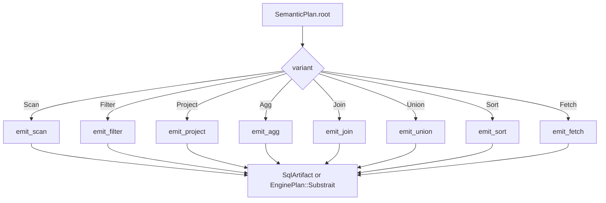

# 36. semstrait-adapter

> **Status:** ratified. `36` nails down the public surface of `semstrait-adapter` — the crate that turns a `SemanticPlan` (`35`) into an `EngineArtifact` (`35 §6`). No new IR vocabulary is introduced; `36` refines `35`'s adapter-artifact shapes with the *emission* contract, the *dialect* operational trait, the *adapter roster*, the *function / type rewrite* pipelines, and the `AdaptErrorKind` surface (typed-kind discipline per `30 §5` / `31 §3`). All engine-identity branching in the workspace is confined behind `EngineAdapter` per I3.

## 1. Purpose, Scope, and Layering

`semstrait-adapter` is the **engine-boundary crate**. Every piece of engine-specific knowledge in the workspace — dialect quirks, SQL idioms, Substrait wire format, per-engine function rewrites, per-engine type spellings, capability declarations — lives behind the `EngineAdapter` trait here or in a per-engine crate that implements it. No canonical-layer crate (`semstrait-core`, `semstrait-ir`, `semstrait-model`, `semstrait-manifest`, `semstrait-planner`) branches on engine identity (I3); every such branch resolves to an `EngineAdapter` dispatch.

### 1.1 What `semstrait-adapter` OWNS

- The `EngineAdapter` trait (§3) — the single abstraction every downstream consumer dispatches through.
- The `DialectEmit` operational trait (§4) — per-dialect SQL rendering: identifier quoting, function rewriting, `DataType` spelling, cast semantics, null-ordering syntax, AsOf-join emission.
- The v1 built-in adapter roster (§5): `AnsiSqlAdapter`, `DataFusionSqlAdapter`, `DuckDbSqlAdapter`, `SparkSqlAdapter`, `SubstraitAdapter`. Per-engine adapters live in dedicated crates (`semstrait-adapter-datafusion`, …) per `30 §10.2`; `semstrait-adapter` carries the trait + shared emission scaffolding + the two baseline impls that depend on no engine crate (`AnsiSqlAdapter`, `SubstraitAdapter`).
- `AdapterCapabilities` (§6) — the declarative capability-flag surface.
- The function-rewrite pipeline (§7) — per-adapter rewrite tier tables (Name-only / Name-remap / Structural / Unsupported) consuming `registry/functions_mapping.md` at the adapter layer.
- The type-rewrite pipeline (§8) — canonical `DataType` → engine-native textual / Substrait form consuming `registry/types_mapping.md`.
- The `adapt` / `emit` pipeline (§9) — the per-variant `PlanNode` walk that produces an `EngineArtifact`.
- The `AdaptErrorKind` typed-error enum (§10) — identified by variant identity per `30 §5`; legacy `ADAPT_E_*` / `ADAPT_W_*` codes are retired. Warning-severity variants flow as `Diagnostic<AdaptErrorKind>` with `Severity::Warning` per `31 §3`.
- The `AdapterRegistry` (§11) — `OnceLock`-backed process-global dispatch table keyed by `AdapterId` / `DialectId`.
- SQL-emission safety scaffolding (§14) — quoting helpers, literal-escape helpers, the injection-safety audit.

### 1.2 What `semstrait-adapter` does NOT own

- **Planning strategy, optimization, plan-tree construction.** `semstrait-planner` (`34`) owns plan production and optimization. `semstrait-adapter` is pure consumer.
- **The `SemanticPlan` tree shape, `PlanNode` variants, `EngineArtifact` / `EnginePlan` / `SqlArtifact` / `DialectId` structural types.** Ratified in `semstrait-ir` (`35`). `36` consumes and emits those types but does not define them.
- **The canonical function catalog.** Ratified in `14a`. Adapters consult the sealed `FunctionRegistry` at `function_registry()` (`31 §9.1`) and the per-engine mapping at `registry/functions_mapping.md`; they do not own the canonical set.
- **SemanticManifest construction, name resolution, or catalog I/O.** `semstrait-manifest` (`33`) owns the SemanticManifest; `semstrait-catalog` (`37`) owns I/O. The adapter receives the `SemanticManifest` as a read-only borrow alongside the `SemanticPlan` (§3.1).
- **Per-engine runtime integration.** Actually executing a `SqlArtifact` or `EnginePlan` against a live engine is **out of scope** — that work lives in executor shims one layer above `semstrait-adapter`. `36` produces the artifact; someone else executes it.
- **Authoring-layer YAML, expression parsing.** `ExprSource` / parse dispatch live in `semstrait-model` (`32`).

### 1.3 The three axes `36` confines

Three independent axes of engine-variation meet in this crate. `36` is where each is declared and confined:

1. **Emission mode** — SQL text (`EngineArtifact::Sql(SqlArtifact)`) vs structured IR (`EngineArtifact::Plan(EnginePlan)`). Selected per-adapter; `EngineAdapter::dialect()` returns `None` for non-SQL adapters (§3.1).
2. **Dialect** — for SQL-emitting adapters, the per-engine SQL variation axis (identifier quoting, keyword casing, function spelling, type name, cast semantics). Carried with every `SqlArtifact` via `DialectId` (`35 §6.4`). Ratified here as `DialectEmit` (§4).
3. **Engine identity** — the concrete target engine (DataFusion, DuckDB, Spark, Substrait consumer, …). Identified by `AdapterId` (§3.3). Each per-engine adapter picks its own `Dialect` (or `None` for Substrait) + its own `AdapterCapabilities` + its own `RegistryExtension` impl (`14a §7`).

These axes are *independent* in principle — two adapters MAY share a `DialectId` (`AnsiSqlAdapter` and a hypothetical `TrinoSqlAdapter` could both claim `DialectId::ANSI` as a baseline) — but in v1 every `DialectId` has exactly one built-in adapter that emits it.

### 1.4 Design posture — sync, no I/O, deterministic

`semstrait-adapter` is deliberately **pure**:

- **Zero I/O surface.** Concrete I11 guarantee. No `std::fs`, no `std::net`, no `reqwest`. Every method on `EngineAdapter` is an in-memory transformation.
- **Zero async.** Every `EngineAdapter` method is `fn`, not `async fn`. I6 guarantee. `adapt` runs on the caller's thread and returns on the caller's thread; no awaits, no futures, no scheduler integration.
- **Deterministic given `(SemanticPlan, SemanticManifest, adapter config)`.** Two `adapt` calls with the same inputs produce byte-identical `EngineArtifact`s. Enables content-addressable caching of emitted SQL / Substrait per `00 §9` I4.
- **No hidden global state inside `adapt`.** The `AdapterRegistry` (§11) is used for *dispatch* (picking which adapter runs), not as a mutable workspace during `adapt`. The `FunctionRegistry` (`31 §5.2`) is consulted as read-only. No `thread_local!` side-state.

## 2. Module Layout

Top-level `pub mod` structure for `semstrait-adapter` itself. Per-engine crates (`semstrait-adapter-datafusion`, `-duckdb`, `-spark`, `-substrait`) mirror this layout inside their own crate root; `36` is authoritative for the shared `semstrait-adapter` core.

```
semstrait-adapter
├── adapter              // EngineAdapter trait, AdapterId, debug_sql free fn
├── dialect              // DialectEmit trait, shared default-impl helpers
│   ├── ansi             //   AnsiDialect + AnsiSqlAdapter (baseline)
│   └── quoting          //   identifier-quoting + literal-escape primitives
├── capabilities         // AdapterCapabilities, Capability-helper methods
├── rewrite              // per-node rewrite pipeline; PlanBuilder-layer rewrites
│   ├── function         //   canonical function → engine form (Name-only /
│   │                    //   Name-remap / Structural / Unsupported)
│   └── type             //   canonical DataType → engine type name / Substrait
├── emit                 // SQL emitter: PlanNode → SqlArtifact; orchestrator
├── substrait            // SubstraitAdapter + proto-emission scaffolding
├── registry             // AdapterRegistry + adapter_registry() accessor
└── error                // AdaptErrorKind, UnsupportedFeatureKind
```

**Split rationale:**

- `adapter` vs `dialect` — the trait surface (what adapters DO) is decoupled from dialect rendering (how SQL-emitting adapters spell things). A Substrait-only adapter (§5.5) implements `EngineAdapter` but never touches `dialect`.
- `dialect::ansi` carries `AnsiSqlAdapter` alongside its dialect — one of the two baseline adapters every workspace build includes.
- `dialect::quoting` — identifier + literal escape primitives are the top of the SQL-injection-safety audit (§14). Isolating them lets the audit suite target one module.
- `capabilities` — standalone because every adapter declares its `AdapterCapabilities`; the shared struct lives here and is consumed by planner (`34`), API (`38`), and each adapter's `capabilities()`.
- `rewrite::function` vs `rewrite::type` — two independent pipelines; both consume registry data (`functions_mapping`, `types_mapping`) but operate on different node positions (`FunctionCall` nodes vs `Cast` targets and `PhysicalExpr.inferred_type`). Isolating limits the blast radius when a new rewrite tier lands.
- `emit` — the SQL orchestrator; traverses `SemanticPlan` and delegates per-variant rendering to `DialectEmit` methods.
- `substrait` — isolated because it's the only module that pulls in `prost` / `substrait::proto` dependencies; gated by `substrait-emit` feature on per-engine downstreams.
- `registry` — dispatch table; no emission code lives here.
- `error` — mirrors `31 §2`'s / `35 §2`'s `error` split; one stable home for `AdaptErrorKind`.

**Re-exports.** The crate root re-exports the curated surface listed in §15. Third-party adapter crates re-export their own `<Engine>Adapter` and `<Engine>Dialect` from their own crate root; `semstrait-adapter` re-exports only the shared core and the baseline `AnsiSqlAdapter` + `SubstraitAdapter`.

## 3. `EngineAdapter` Trait

### 3.1 Signature

```rust
/// The abstraction every engine-specific adapter implements. Consumed by
/// `semstrait-api` (`38`) for pipeline dispatch and by `semstrait-planner`
/// (`34`) for capability-gated plan rules. Per `00 §4.1`.
///
/// Not sealed — third-party adapter crates outside the workspace MUST be
/// able to `impl EngineAdapter` without a private escape hatch
/// (`30 §8.2`).
pub trait EngineAdapter: Send + Sync {
    /// The adapter's stable identity. Used for registry-keyed dispatch
    /// (§11) and for diagnostic reporting. See §3.3 for the roster.
    fn id(&self) -> AdapterId;

    /// The adapter's target dialect.
    ///
    /// - `Some(&dyn DialectEmit)` — SQL-emitting adapter; returned
    ///   reference is used by the generic SQL orchestrator (`§9.2`).
    /// - `None` — non-SQL adapter (e.g. `SubstraitAdapter`). The
    ///   default `emit` impl (§3.2) rejects with
    ///   `AdaptErrorKind::EmissionNotSupported`.
    fn dialect(&self) -> Option<&dyn DialectEmit>;

    /// Declarative capability advertisement. Consumed by
    /// `semstrait-planner` (`34`) for capability-gated plan rules, by
    /// `semstrait-api` (`38`) for pre-`adapt` feasibility checks, and by
    /// cross-engine test harnesses. Not consumed inside `adapt` itself;
    /// the authoritative feasibility check is the emission path
    /// (`AdaptErrorKind::Unsupported*`). Per `Q-ADAPT-002`.
    fn capabilities(&self) -> &AdapterCapabilities;

    /// Produce an engine-ready artifact from a canonical plan.
    ///
    /// Stage-entry-point shape per `30 §7`: fail-fast tuple
    /// (`(fatal, warnings)` on `Err`; `(artifact, warnings)` on `Ok`).
    /// Adapters that produce no warnings return an empty
    /// `Diagnostics<AdaptErrorKind>` on the success arm — the typed-
    /// kind discipline obviates the prior `adapt_with_diagnostics`
    /// extension.
    ///
    /// Invariants:
    /// - Synchronous (I6).
    /// - No I/O (I11). The `SemanticManifest` is consumed read-only; no
    ///   catalog-provider traffic, no filesystem reads.
    /// - Deterministic given `(plan, manifest, self)`: two invocations
    ///   with identical inputs produce byte-identical outputs and
    ///   byte-identical warning sequences.
    /// - Takes `plan` and `manifest` by borrow so the caller retains
    ///   ownership; neither is mutated.
    /// - `plan.diagnostics` is NOT consulted by default — the adapter
    ///   emits against `plan.root` on the assumption that the planner
    ///   raised every needed warning already.
    fn adapt(
        &self,
        plan: &SemanticPlan,
        manifest: &SemanticManifest,
    ) -> Result<
        (EngineArtifact, Diagnostics<AdaptErrorKind>),
        (Diagnostic<AdaptErrorKind>, Diagnostics<AdaptErrorKind>),
    >;

    /// The SQL-specialized form of `adapt`. Produces `SqlArtifact`
    /// directly; the default impl rejects for non-SQL adapters.
    ///
    /// Motivation: every SQL-emitting adapter implements `adapt` by
    /// calling `emit` and wrapping in `EngineArtifact::Sql`; exposing
    /// `emit` separately avoids the `EngineArtifact::Sql(..)` unwrap at
    /// every caller site that already knows it wants SQL.
    fn emit(
        &self,
        plan: &SemanticPlan,
        manifest: &SemanticManifest,
    ) -> Result<
        (SqlArtifact, Diagnostics<AdaptErrorKind>),
        (Diagnostic<AdaptErrorKind>, Diagnostics<AdaptErrorKind>),
    > {
        let _ = (plan, manifest);
        Err((
            Diagnostic::error(AdaptErrorKind::EmissionNotSupported {
                adapter: self.id(),
            }),
            Diagnostics::empty(),
        ))
    }
}
```

### 3.2 Trait-level invariants

Every `impl EngineAdapter` MUST uphold:

- **I-ADAPT-1 — sync.** No `.await`, no `block_on`. `adapt` / `emit` run on the caller's thread. I6 guarantee per `30 §9`.
- **I-ADAPT-2 — no I/O.** No filesystem access, no network access, no catalog-provider calls. I11 guarantee. The `SemanticManifest` the adapter consumes already contains every piece of metadata needed; drift checks live outside `adapt` per `00 §9` I11.
- **I-ADAPT-3 — deterministic.** Two calls with identical `(plan, manifest)` must produce byte-identical `EngineArtifact`s. UUID generation, timestamp capture, randomized ordering — all forbidden inside `adapt`.
- **I-ADAPT-4 — quoting mandatory.** Every identifier embedded in `SqlArtifact.text` passes through the adapter's `DialectEmit::quote_identifier` (§4.3). Every literal value passes through `DialectEmit::quote_literal` or equivalent. String concatenation of unquoted identifiers is a soundness bug (§14).
- **I-ADAPT-5 — error-first fallback.** If a `PlanNode` variant, a `FunctionCall` name, or a `DataType` is not representable in the adapter's target, `AdaptError::Unsupported*` fires at `adapt` time. Silent truncation, stub emission, runtime-deferred panics — all banned. Matches `14a §6.3`'s hard-error policy for `UnsupportedFunction`.
- **I-ADAPT-6 — structural-mapping conformance.** SQL-emitting adapters render each `PlanNode` variant per the structural conventions of §9; the generic orchestrator assumes conformance and composes clauses accordingly. Substrait adapters conform to the mapping table at `35 §9.2`.

### 3.3 `AdapterId`

```rust
/// Stable identity newtype, paralleling `DialectId`'s posture at
/// `35 §6.4`. Construction is crate-private; consumers compare against
/// `pub const` identities.
///
/// Newtype-over-stable exception per `30 §4.3`: no `#[non_exhaustive]`.
#[derive(Copy, Clone, Eq, PartialEq, Hash, Debug)]
pub struct AdapterId(&'static str);

impl AdapterId {
    pub const fn as_str(self) -> &'static str { self.0 }

    pub const ANSI_SQL:        AdapterId = AdapterId("ansi-sql");
    pub const DATAFUSION_SQL:  AdapterId = AdapterId("datafusion-sql");
    pub const DUCKDB_SQL:      AdapterId = AdapterId("duckdb-sql");
    pub const SPARK_SQL:       AdapterId = AdapterId("spark-sql");
    pub const SUBSTRAIT:       AdapterId = AdapterId("substrait");
}
```

Adding a new `pub const AdapterId` — e.g. `AdapterId::TRINO_SQL`, `AdapterId::CLICKHOUSE_SQL` — is MINOR per `30 §11.1`. Third-party adapter crates declare their own constants on their own type; they MAY NOT add `pub const`s to `AdapterId` directly (construction is crate-private). The crate-private construction mirrors `CanonicalFn` / `DialectId` (`31 §5.1` / `35 §6.4`).

### 3.4 Diagnostics flow (no separate extension)

`adapt` and `emit` carry warnings inline through their fail-fast tuple
return shape (§3.1). The historical `adapt_with_diagnostics(&mut Vec<Diagnostic>)`
extension is **retired** by the workspace-wide diagnostic-shape decision in
`30 §7`: every adapter receives a slot for warnings on the success arm of
`Result` and a `(fatal, warnings_so_far)` tuple on the `Err` arm. Adapters
that produce no warnings return an empty `Diagnostics<AdaptErrorKind>`;
adapters that do (e.g. DuckDB precision clamping, Spark structural
rewrites) accumulate them in the same vector and propagate.

### 3.5 `debug_sql` free function

```rust
/// Render a `SemanticPlan` as ANSI-baseline SQL for debugging. Not an
/// `EngineAdapter` method — adapter-independent rendering per
/// `Q-ADAPT-004`. Consumed by test harnesses, logging tools, and the
/// `semstrait-api` plan-inspection surface.
///
/// Bare-kind shape per `31 §3.1` construction-site convention; callers
/// (debug paths, inspection UIs) wrap into `Diagnostic<AdaptErrorKind>` if
/// they need a stage-boundary location.
pub fn debug_sql(plan: &SemanticPlan, manifest: &SemanticManifest) -> Result<String, AdaptErrorKind>;
```

Routes through `AnsiSqlAdapter::emit` internally. Non-SQL adapters (`SubstraitAdapter`) have no native "debug_sql" — callers use this free function for any plan, regardless of target adapter. Keeping it outside the trait avoids forcing every adapter to provide a SQL renderer (Substrait adapters genuinely lack one). Current code exposes `debug_sql` as a trait method with a default impl; the migration to a free function is tracked as `[TD-ADAPTER-DEBUG-SQL-FREE-FN]`.

## 4. `DialectEmit` — Operational Dialect Trait

### 4.1 Relationship to `Dialect` in `35`

`35 §6.5` ratifies the **structural** `Dialect` trait: associated `const ID: DialectId` and `fn capabilities(&self) -> &'static [Capability]`. That trait is consumed by planner-side capability gates — it answers "is this dialect in the set?" and "what can it do?".

`36` adds the **operational** half: `DialectEmit`, a supertrait extension that carries the per-dialect SQL rendering methods. The split per `Q-ADAPT-003`:

```rust
/// Operational dialect surface. Extends the structural `Dialect` trait
/// (`35 §6.5`) with rendering methods every SQL-emitting adapter relies
/// on. `DialectEmit: Dialect` (supertrait chain).
///
/// Not sealed — third-party dialects (e.g. a hypothetical
/// `ClickHouseDialect`) MUST be able to impl `DialectEmit` without a
/// private escape hatch.
pub trait DialectEmit: Dialect {
    // ... §4.2–§4.7 methods
}
```

Substrait-only adapters (§5.5) impl `Dialect` (to advertise capabilities) but do NOT impl `DialectEmit` (they never render SQL). `EngineAdapter::dialect()` returns `None` for them.

### 4.2 Identifier quoting

```rust
/// Quote `ident` per dialect rules. Every identifier emitted into
/// `SqlArtifact.text` passes through this method — column names, table
/// names, CTE labels, aliases. Never concatenated raw. I14 guarantee.
fn quote_identifier(&self, ident: &str) -> String;
```

Every impl MUST:

- Enclose `ident` in the dialect's identifier-quote delimiters (ANSI / DataFusion / DuckDB: `"…"`; Spark: backtick-fallback per legacy SQL idiom; MySQL-family: backtick).
- Escape the delimiter character occurring inside `ident` per dialect rules (ANSI: double the quote — `abc"def` → `"abc""def"`).
- NOT truncate, case-fold, or reject `ident` based on length / reserved-word collisions — any identifier that survived `Name::new` (`35 §5.4`) is quoting-safe at this layer. Length limits and reserved-word handling are engine-side concerns.

### 4.3 Literal escaping

```rust
/// Render a `LiteralValue` as dialect-appropriate SQL text.
/// Per-variant rendering per `registry/types_mapping.md` conventions.
fn quote_literal(&self, lit: &LiteralValue) -> String;

/// Escape an embedded string-literal value (for `Expr::Literal {
/// value: String(_) }`). Default impl doubles internal single-quotes
/// per ANSI SQL; adapters MAY override for engines with non-standard
/// rules (none at v1).
fn escape_string_literal(&self, s: &str) -> String {
    format!("'{}'", s.replace('\'', "''"))
}
```

### 4.4 `DataType` spelling

```rust
/// Render a canonical `DataType` as the dialect's native SQL type
/// name. Consumed by `Expr::Cast` rendering and by projection-alias
/// type annotations. Per `registry/types_mapping.md §1`.
///
/// Error if the canonical `DataType` variant (e.g. a future
/// `DataType::Json`) has no dialect-native form:
/// `AdaptErrorKind::UnsupportedType { ty, adapter, .. }`.
/// Bare-kind shape per `31 §3.1` construction-site convention.
fn type_name(&self, dt: &DataType) -> Result<String, AdaptErrorKind>;
```

### 4.5 Function rewriting

```rust
/// Rewrite a canonical `FunctionCall` per the adapter's per-function
/// tier table (`registry/functions_mapping.md`, §7 of this doc).
///
/// Returns:
/// - `Ok(RewrittenCall::NameOnly)` — emit the canonical name verbatim.
/// - `Ok(RewrittenCall::Remapped { name })` — emit `name` with the same
///   args.
/// - `Ok(RewrittenCall::Structural(expr))` — caller re-renders the
///   returned `Expr` in place of the original `FunctionCall`.
/// - `Err(AdaptErrorKind::UnsupportedFeature { .. })` — hard fail per
///   `14a §6.3`.
///
/// Called during §9's emit walk at every `FunctionCall` encounter.
/// Bare-kind shape per `31 §3.1` construction-site convention.
fn rewrite_function(
    &self,
    call: &FunctionCall,
) -> Result<RewrittenCall, AdaptErrorKind>;

#[non_exhaustive]
pub enum RewrittenCall {
    NameOnly,
    Remapped   { name: &'static str },
    Structural(Box<PhysicalExpr>),
}
```

`rewrite_function` is where the PlanBuilder-layer rewrites of `registry/functions_mapping.md §13` land. Structural rewrites (e.g. DataFusion's `date_diff` → `CAST(d2 - d1 AS BIGINT)`) produce a `PhysicalExpr` the generic emitter renders as if authored — maintains the single-pass emission posture.

### 4.6 Cast semantics

```rust
/// Render an `Expr::Cast { expr, target }` node. Default impl emits
/// `CAST(<expr> AS <type_name(target)>)`; adapters with a native
/// short-form (DuckDB's `expr::TYPE`) MAY override for terser output,
/// but the default is always the canonical SQL form.
///
/// Per `registry/types_mapping.md §2` — widening is silent, narrowing
/// is author-explicit. The adapter NEVER inserts a cast the planner
/// did not author; boundary reconciliation Casts originate at compile
/// per `14 §6.4`.
fn emit_cast(&self, expr: &str, target: &DataType) -> Result<String, AdaptErrorKind> {
    Ok(format!("CAST({} AS {})", expr, self.type_name(target)?))
}
```

### 4.7 Null-ordering, AsOf join, DateTrunc, regex — ratified methods

```rust
/// SQL rendering of `NullOrdering` as an ORDER BY suffix. `First` →
/// `" NULLS FIRST"`, `Last` → `" NULLS LAST"`, `Unspecified` → `""`
/// (engine default applies). Per `35 §5.6`.
fn null_ordering_clause(&self, nulls: NullOrdering) -> &'static str;

/// `Expr::DateTrunc { expr, grain }` emission. All three first-class
/// engines render as `date_trunc('grain', expr)` — keep the method for
/// dialect override anyway (casing, quoting of the grain token).
fn emit_date_trunc(&self, expr: &str, grain: Grain) -> String;

/// `Expr::Like / ILike / RegexpMatch / RegexpExtract` emission, one
/// method per dedicated variant. Default impls fall back to the
/// ANSI forms; per-engine overrides live on
/// `DataFusionDialect` / `DuckDbDialect` / `SparkDialect` per
/// `registry/functions_mapping.md §13`.
fn emit_like(&self, expr: &str, pattern: &str, negated: bool) -> String;
fn emit_ilike(&self, expr: &str, pattern: &str, negated: bool) -> String;
fn emit_regexp_match(&self, expr: &str, pattern: &str, full_match: bool) -> String;
fn emit_regexp_extract(&self, expr: &str, pattern: &str, group: usize) -> String;

/// Emission of an `AsOf` join variant when the adapter advertises
/// `Capability::AsOfJoin`. Called only when `capabilities()` includes
/// `AsOfJoin`; the generic emitter raises
/// `AdaptErrorKind::UnsupportedFeature { UnsupportedFeatureKind::JoinType, .. }`
/// when the adapter does NOT advertise it but a plan carries an
/// `AsOf` join. Per `16 §5.2` / `17 §5`. Bare-kind shape per
/// `31 §3.1` construction-site convention.
fn emit_asof_join(
    &self,
    left: &str,
    right: &str,
    anchor: &AsOfAnchor,
    on: &[KeyPair],
) -> Result<String, AdaptErrorKind> {
    let _ = (left, right, anchor, on);
    Err(AdaptErrorKind::UnsupportedFeature {
        feature: UnsupportedFeatureKind::JoinType,
        name: "as-of".into(),
        adapter: self.id_hint(),
    })
}

/// Helper: the adapter's `AdapterId` as available to the dialect.
fn id_hint(&self) -> AdapterId;
```

### 4.8 Dialect-surface stability

`DialectEmit` is `#[non_exhaustive]` in effect — adding a new method with a default body is MINOR per `30 §2.1`. Removing or changing a method signature is MAJOR. Every method carries a default impl where a canonical fallback makes sense (`emit_asof_join`, `escape_string_literal`, `emit_cast`, `emit_regexp_*`); methods with engine-specific emission (`quote_identifier`, `type_name`, `date_trunc`, `null_ordering_clause`) are required.

## 5. Adapter Implementations (v1 roster)

Each subsection ratifies the per-adapter `AdapterId`, dialect choice, artifact output, and PlanBuilder-layer rewrite scope. Per `30 §10.2`, per-engine adapter crates (DataFusion / DuckDB / Spark / Substrait) live in their own crates with their own stability tiers; `semstrait-adapter` carries only the baseline `AnsiSqlAdapter` and the dependency-free `SubstraitAdapter` scaffold. The roster is `#[non_exhaustive]` in practice — new adapter crates land independently per `14a §7.1` / `30 §10.2`.

### 5.1 `AnsiSqlAdapter`

```rust
/// Baseline SQL adapter. Emits ANSI-standard SQL with double-quoted
/// identifiers, `FETCH FIRST n ROWS ONLY` for limits, `IS NOT DISTINCT
/// FROM` for null-safe equality. No PlanBuilder-layer rewrites —
/// emits the canonical `Expr` tree verbatim where ANSI SQL supports it.
pub struct AnsiSqlAdapter;

impl EngineAdapter for AnsiSqlAdapter {
    fn id(&self) -> AdapterId { AdapterId::ANSI_SQL }
    fn dialect(&self) -> Option<&dyn DialectEmit> { Some(&AnsiDialect) }
    fn capabilities(&self) -> &AdapterCapabilities { &ANSI_CAPABILITIES }
    fn adapt(&self, plan: &SemanticPlan, manifest: &SemanticManifest)
        -> Result<
            (EngineArtifact, Diagnostics<AdaptErrorKind>),
            (Diagnostic<AdaptErrorKind>, Diagnostics<AdaptErrorKind>),
        >
    {
        let (sql, warnings) = self.emit(plan, manifest)?;
        Ok((EngineArtifact::Sql(sql), warnings))
    }
    fn emit(&self, plan: &SemanticPlan, manifest: &SemanticManifest)
        -> Result<
            (SqlArtifact, Diagnostics<AdaptErrorKind>),
            (Diagnostic<AdaptErrorKind>, Diagnostics<AdaptErrorKind>),
        >
    {
        crate::emit::emit_sql(plan, manifest, &AnsiDialect, AdapterId::ANSI_SQL)
    }
}
```

- Purpose — the reference / fallback adapter. Used by `debug_sql` (§3.5), by diagnostics that surface rendered SQL for troubleshooting, and as a starting point for authors bringing up a new dialect. Matches current code's `AnsiDialect` + ANSI emitter path.
- Capabilities — conservative. Advertises none of the irreducible features (`AsOfJoin = false`, `RegexpMatch = false`, `RegexpExtract = false`, `IntervalLiteral = false`, `StructAccess = false`). Authors targeting the ANSI fallback who require those features get a `34`/`38`-side pre-flight diagnostic. See §6.
- Rewrite posture — zero PlanBuilder-layer rewrites; every canonical `FunctionCall` emits its canonical name verbatim. `DialectEmit::rewrite_function` always returns `Ok(RewrittenCall::NameOnly)`. Adapters that need rewrites use the per-engine impls below.

### 5.2 `DataFusionSqlAdapter`

Lives in `semstrait-adapter-datafusion`. Produces SQL targetable at `datafusion-sql` or — under feature `substrait-emit` — routes through `SubstraitAdapter` (the DataFusion engine natively consumes Substrait; the SQL path is for human-facing inspection or session-API consumers that prefer SQL).

- `id() = AdapterId::DATAFUSION_SQL`.
- `dialect() = Some(&DataFusionDialect)` (dialect lives in `semstrait-adapter-datafusion`).
- PlanBuilder-layer rewrites per `registry/functions_mapping.md §13.1`: `position` → `strpos` with arg-reorder; `sign` → `Cast(signum(x), Integer)`; `variance` → `var_samp`; `approx_count_distinct` → `approx_distinct`; `date_add` / `date_sub` → `BinaryOp` forms; `date_diff` (3-arg) → `date_part`-extracted form; `year`/`month`/`day`/`hour`/`minute`/`second` → `date_part('part', x)`; `RegexpExtract` → `array_element(regexp_match(...), group + 1)`.
- Capabilities — `AsOfJoin = false`, `RegexpMatch = true`, `RegexpExtract = true`, `IntervalLiteral = true`, `StructAccess = false` (pending canonical `DataType::Struct` which is out of v1).

### 5.3 `DuckDbSqlAdapter`

Lives in `semstrait-adapter-duckdb`.

- `id() = AdapterId::DUCKDB_SQL`.
- `dialect() = Some(&DuckDbDialect)`.
- PlanBuilder-layer rewrites per `registry/functions_mapping.md §13.2`: `position` → `strpos` with arg-reorder; `concat` → `||`-chain (NULL-propagation alignment); `lpad` / `rpad` 2-arg → 3-arg space-injection; `to_date` / `to_timestamp` (1-arg) → `Cast`. `log(base, x)` — if DuckDB version floor does not carry the 2-arg form, raises `AdaptError::UnsupportedFeature { feature: UnsupportedFeatureKind::Function, .. }`. Dialect-layer rendering of `percentile_cont` uses native `WITHIN GROUP (ORDER BY col)` syntax per `§13.2`.
- Capabilities — `AsOfJoin = true` (DuckDB 0.9+ native `ASOF JOIN` syntax), `RegexpMatch = true`, `RegexpExtract = true`, `IntervalLiteral = true`, `StructAccess = false` (pending canonical `DataType::Struct`).
- Dialect notes — `DuckDbDialect.type_name` maps `Timestamp(p)` to precision-specific keywords (`TIMESTAMP_S` / `TIMESTAMP_MS` / `TIMESTAMP` / `TIMESTAMP_NS`) per `registry/types_mapping.md §3.3`.

### 5.4 `SparkSqlAdapter`

Lives in `semstrait-adapter-spark`.

- `id() = AdapterId::SPARK_SQL`.
- `dialect() = Some(&SparkDialect)`.
- PlanBuilder-layer rewrites per `registry/functions_mapping.md §13.3`: `length(arr)` → `size(arr)`; `lpad` / `rpad` 2-arg → 3-arg space-injection; `ceil(Float)` / `floor(Float)` → `Cast(... as Double)`; `date_add` / `date_sub` → `BinaryOp` forms; `date_diff` (3-arg, day part) → `datediff(end, start)` with arg-reorder; `date_diff` (3-arg, non-day part) → per-part extraction via `date_part(part, end) - date_part(part, start)`; `SafeDivide` (Spark 3.3+) → `try_divide` (optional optimization). Dialect-layer rendering of `percentile_cont` uses native `WITHIN GROUP (ORDER BY col)` syntax (Spark 3.1+).
- Capabilities — `AsOfJoin = false` (Spark lacks native as-of), `RegexpMatch = true`, `RegexpExtract = true`, `IntervalLiteral = true` (Spark 3.4+ for `TimestampNTZType` per `registry/types_mapping.md §3.2`), `StructAccess = false` (pending canonical `DataType::Struct`).
- `SparkDialect::emit_ilike` uses the `LOWER(...) LIKE LOWER(...)` form per §4.7 default; Spark has no native `ILIKE`.

### 5.5 `SubstraitAdapter`

```rust
/// Non-SQL adapter producing `EngineArtifact::Plan(EnginePlan::Substrait)`.
/// Consumed by Substrait-native engines (DataFusion via
/// `datafusion-substrait`; future Substrait-direct consumers).
pub struct SubstraitAdapter;

impl EngineAdapter for SubstraitAdapter {
    fn id(&self) -> AdapterId { AdapterId::SUBSTRAIT }
    fn dialect(&self) -> Option<&dyn DialectEmit> { None }   // non-SQL
    fn capabilities(&self) -> &AdapterCapabilities { &SUBSTRAIT_CAPABILITIES }
    fn adapt(&self, plan: &SemanticPlan, manifest: &SemanticManifest)
        -> Result<
            (EngineArtifact, Diagnostics<AdaptErrorKind>),
            (Diagnostic<AdaptErrorKind>, Diagnostics<AdaptErrorKind>),
        >
    {
        let (substrait_plan, warnings) =
            crate::substrait::emit_substrait(plan, manifest)?;
        Ok((
            EngineArtifact::Plan(EnginePlan::Substrait(Box::new(substrait_plan))),
            warnings,
        ))
    }
    // `emit` inherits the default impl — returns
    // AdaptErrorKind::EmissionNotSupported { adapter: SUBSTRAIT }.
}
```

- Emission follows the mapping table at `35 §9.2` — each `PlanNode` maps to exactly one `substrait::proto::Rel` kind.
- Function anchors — every `FunctionCall.name` / every `Aggregation` variant maps directly to a Substrait-standard function URN. V1 uses `CanonicalFn::as_str()` as the anchor; per-function URN overrides are tracked as `[TD-ADAPTER-SUBSTRAIT-ANCHOR]` (see `Q-ADAPT-008`).
- `SemAnnotation` round-trip — per `35 §9.2`, annotations travel through `AdvancedExtension.optimization` with URN `urn:semstrait:annotations:v1`. Deserializers unknown to the consuming engine skip unknown annotations gracefully per `35 §11.2`.
- Capabilities — `AsOfJoin = false` in v1 (Substrait has no standard as-of; extension path tracked as `[TD-ADAPTER-SUBSTRAIT-ASOF]`), `RegexpMatch = true`, `RegexpExtract = true`, `IntervalLiteral = true`, `StructAccess = true` (Substrait supports struct-field access natively; advertisement gated by canonical `DataType::Struct` which is out of v1, but the consumer-side support is real). **Substrait is the load-bearing capability-contract path** per §6.2 — capabilities advertised here are what the Substrait plan REQUIRES the consuming engine to support.

## 6. `AdapterCapabilities`

### 6.1 Shape

```rust
/// Declarative capability advertisement. Returned by
/// `EngineAdapter::capabilities()`. Every adapter holds its
/// capabilities in a `static` instance (no per-invocation mutation).
#[non_exhaustive]
pub struct AdapterCapabilities {
    pub capabilities: &'static [Capability],
    // Ratified flags — exposed as methods, not public fields, so the
    // struct can grow on its `#[non_exhaustive]` surface without
    // breaking pattern-match consumers (`30 §4.2`).
}

impl AdapterCapabilities {
    /// True when `capabilities` contains `cap`. Linear in
    /// `capabilities.len()`, but the slices are bounded (≤ 32 entries).
    pub fn supports(&self, cap: Capability) -> bool;

    // --- Ratified predicate shortcuts: one per variant in the
    // non-exhaustive `Capability` roster defined in `35 §11.6`. ---
    pub fn supports_as_of(&self)            -> bool;
    pub fn supports_regexp_match(&self)     -> bool;
    pub fn supports_regexp_extract(&self)   -> bool;
    pub fn supports_interval_literal(&self) -> bool;
    pub fn supports_struct_access(&self)    -> bool;
    // Additional predicates MAY be added in MINOR per `30 §2.1`.
}
```

The struct surface is `#[non_exhaustive]` per `30 §4.2`. Adding a new `Capability` variant is MINOR per I10 / `30 §11.1`.

### 6.2 Consumers — SQL adapters vs Substrait handoff

Per `Q-ADAPT-002` (closed 2026-05-21), `AdapterCapabilities` plays two architecturally distinct roles depending on the emission target. The asymmetry is load-bearing.

**SQL-emitting adapters** (`AnsiSqlAdapter`, `DataFusionSqlAdapter`, `DuckDbSqlAdapter`, `SparkSqlAdapter`) — capabilities are **ergonomic hints**, not contracts. semstrait owns the full PlanBuilder-layer rewrite pipeline and emits engine-native SQL itself; adapter-internal rewrite strategies (CTE expansion, GROUPING SETS expansion, DISTINCT-aggregate emulation, function-name remaps) are private to each adapter and NOT advertised through `Capability`. Consumers:

- **`semstrait-planner` (`34`)** — pre-flight UX. A plan rule that emits `Capability::AsOfJoin` SHOULD be disabled when the target adapter advertises `supports_as_of() == false`, so authors get a clear `34`-side diagnostic instead of an opaque `adapt`-time failure.
- **`semstrait-api` (`38`)** — pre-`adapt` feasibility check. The caller consults the adapter's capabilities before dispatching. Not mandatory — `adapt` is the authoritative feasibility check, raising `AdaptError::Unsupported*` when an irreducible gap surfaces downstream.

**`SubstraitAdapter`** — capabilities are the **handoff contract**. semstrait emits a Substrait plan to be consumed by a foreign engine across a process / engine boundary; semstrait CANNOT rewrite on the consumer's behalf. The capability set declares what the consuming engine MUST support. The same `AdapterCapabilities` advertisement is consulted by `34` / `38` exactly as for SQL adapters, but the role flips from ergonomic to contractual at the handoff line.

**Inside `adapt` itself** — capabilities are NOT consulted. Each adapter's `adapt()` either renders successfully or raises `AdaptError::Unsupported*`. Q-ADAPT-002 closes with the rule: capability checks live at planner / api pre-flight; `adapt`-time failures are the fallback.

### 6.3 Roster growth policy

Adding a new `Capability` variant is MINOR. The type definition lives in `35 §11.6` (closed catalog rule R4); `36` drives variant additions through concrete adapter-feature need and owns the per-adapter `AdapterCapabilities` roster (Q-IR-010, 2026-05-21).

**Scope test for a new variant.** Before adding a variant, answer: *"Is this feature irreducible across the Substrait-handoff boundary?"* — i.e. is its absence in the consuming engine impossible to paper over with a semstrait-side PlanBuilder rewrite without changing semantics? If yes, add it. If the feature is universally synthesizable via SQL-adapter rewrite (CTE → subquery, GROUPING SETS → UNION ALL, DISTINCT-aggregate → universal), it is adapter-internal strategy and does NOT belong in `Capability`.

Each new variant:

1. Earns a paragraph in §4 / §5 describing its emission pathway and (if Substrait-bound) the consumer-engine requirement.
2. Earns a predicate shortcut on `AdapterCapabilities` if it's a commonly-consulted flag.
3. Documents the adapters that advertise it in the per-adapter subsections of §5.

## 7. Function Rewrite

### 7.1 Inputs

The function-rewrite pipeline consumes two sources of truth:

1. **`FunctionRegistry`** (`35 §7` / `14a §2`) — the canonical catalog. Every `FunctionCall.name` reaching the adapter has already been resolved against this registry at compile time per `19 §3.3`; the adapter consults the registry for return-type / signature metadata only, never to decide whether the call is valid.
2. **`registry/functions_mapping.md`** — the per-engine mapping, authoritative for rewrite-tier classification. Each `(canonical_name, adapter_id)` pair maps to exactly one tier: Name-only / Name-remap / Structural / Unsupported.

### 7.2 Rewrite tiers

Per `registry/functions_mapping.md §1`:

| Tier | Adapter action | `DialectEmit::rewrite_function` return |
|---|---|---|
| **Name-only** | Emit canonical name verbatim | `Ok(RewrittenCall::NameOnly)` |
| **Name-remap** | Emit `new_name(args…)` with unchanged arg list | `Ok(RewrittenCall::Remapped { name })` |
| **Structural** | Emit a reshaped `PhysicalExpr` in place of the `FunctionCall` | `Ok(RewrittenCall::Structural(Box<PhysicalExpr>))` |
| **Unsupported** | Hard fail per `14a §6.3` | `Err(AdaptError::UnsupportedFeature { UnsupportedFeatureKind::Function, name, adapter, location })` with stable code `ADAPT_E_0302` (§10.1) |

### 7.3 Pipeline

At every `FunctionCall` encounter inside `§9`'s walk, the generic emitter calls `dialect.rewrite_function(call)` and dispatches on the returned variant. `Structural` rewrites produce a `PhysicalExpr` that re-enters the emission walk recursively — the re-entry point is `ProjectNode.projections[*].1` or `FilterNode.predicate` or wherever the original `FunctionCall` sat; the generic emitter substitutes the rewritten expression and continues. Recursion depth is bounded by the `Expr` tree depth of the original plan; structural rewrites MUST NOT introduce unbounded expansion (the registry policy prohibits rewrites that duplicate an arg more than O(1) times; a rewrite that would blow up is forbidden at registration).

### 7.4 Aggregates

The closed five (`Sum` / `Avg` / `Count` / `Min` / `Max`) are carried on `AggregateExpr` (`35 §5.7`), not on `FunctionCall`. They bypass `rewrite_function` — the generic emitter renders them directly through a dialect-specific aggregate-emission path on `DialectEmit::emit_aggregate` (signature detailed in §9.4). Non-closed aggregates (`stddev` / `variance` / `median` / `percentile_cont` / …) ARE `FunctionCall`s with `FunctionCategory::Aggregate` and flow through `rewrite_function` like scalars — the aggregate-vs-scalar distinction is at the tier table, not at the pipeline level.

### 7.5 Registry extension interplay

Adapter-extended functions (`14a §7`) live in each adapter's `RegistryExtension::FUNCTIONS` slice. At `adapt` time, if `FunctionCall.name` resolves in the registry but the target adapter's rewrite table returns no entry for it, the fallback is `Err(AdaptError::UnsupportedFeature { feature: UnsupportedFeatureKind::Function, .. })` — an adapter-extended function registered by DataFusion but called from a Spark adapter is unsupported, exactly matching `14a §6.3`.

## 8. Type Rewrite

### 8.1 Inputs

Two sources of truth, paralleling §7:

1. **Canonical `DataType`** (`13 §2` / `31 §4.1`) — the typed logical variants.
2. **`registry/types_mapping.md`** — per-engine native type spelling, per-engine cast semantics, per-engine gaps.

### 8.2 Spelling (`DialectEmit::type_name`)

Called at every `Expr::Cast { expr, target }` rendering and at projection-alias type annotations (when the adapter emits explicit column-type annotations — rare; only relevant for Spark's `DataFrameWriter`-targeted rendering, not v1 SQL).

The method per §4.4:

```rust
fn type_name(&self, dt: &DataType) -> Result<String, AdaptErrorKind>;
```

Returns:

- `Ok(String)` — the engine-native type name per `registry/types_mapping.md §1`.
- `Err(AdaptErrorKind::UnsupportedType { ty, adapter, context })` — the variant has no engine-native form (e.g. a future `DataType::Json` on ANSI adapter). Matches `14a §6.3`'s hard-error policy.

### 8.3 Cast semantics

Per `registry/types_mapping.md §2`:

- **Widening** (physical narrower → declared wider): silent cast. Emitted as `CAST(expr AS declared_type)` at the Binding-reconciliation Cast site (`14 §6.4` rule 2). The Cast originates at compile; the adapter only *renders* it.
- **Narrowing** (physical wider → declared narrower): `CompileError::PhysicalTypeNarrower` at compile time. Never reaches `36`. If a narrowing Cast somehow reaches `adapt` (bug), the adapter emits it verbatim and trusts the engine's runtime behavior; no `36`-layer safety net.
- **Precision-clamping** (timestamp precision; decimal width): per-engine policies documented in `registry/types_mapping.md §2.5` / `§3.3`. Adapters emit the engine's native spelling and emit a non-fatal `Diagnostic<AdaptErrorKind>` with kind `PrecisionClamped` (`Severity::Warning`; §10.3) if configured.

### 8.4 Type-rewrite exceptions

Per `registry/types_mapping.md §3`:

- Spark-adapter `Time(p)` → String emulation per `§3.2`'s `TD-ADAPTER-SPARK-TIME`. A `DataType::Time` in a `Cast` target on Spark triggers the emulation wrapping.
- DuckDB-adapter `Timestamp(p)` precision clamp per `§3.3`'s `TD-ADAPTER-DUCKDB-TIMESTAMP-NS`. `p > 6` emits a `Diagnostic<AdaptErrorKind>` with kind `PrecisionClamped` (`Severity::Warning`) and clamps.

These exception paths live in per-adapter crates; `36` ratifies only the shape (Result + `UnsupportedType` code) and the policy (hard error on genuine gap, warn + coerce on bounded truncation).

## 9. `adapt` / `emit` Pipeline

### 9.1 Structural overview

Both `adapt` and `emit` walk the same `SemanticPlan` tree and apply per-variant rendering. The flow per variant:



### 9.2 SQL-emission orchestrator (`crate::emit::emit_sql`)

```rust
/// Shared SQL orchestrator. Invoked by every SQL-emitting adapter's
/// `emit` method. Walks the plan tree, dispatches per-variant
/// rendering to `dialect`'s methods, and assembles the final
/// `SqlArtifact`. Returns the adapter's standard fail-fast tuple
/// shape: warnings (`PrecisionClamped` / `StructuralRewriteApplied` /
/// `SumOverflowRisk`) accumulate alongside a successful artifact;
/// the first fatal `AdaptErrorKind` short-circuits with the warnings
/// observed up to that point.
pub(crate) fn emit_sql<D: DialectEmit>(
    plan:     &SemanticPlan,
    manifest: &SemanticManifest,
    dialect:  &D,
    id:       AdapterId,
) -> Result<
    (SqlArtifact, Diagnostics<AdaptErrorKind>),
    (Diagnostic<AdaptErrorKind>, Diagnostics<AdaptErrorKind>),
>;
```

The orchestrator:

1. Walks `plan.root` bottom-up, producing a per-node SQL fragment (CTE-structured for non-trivial trees; flat `SELECT` for trivial single-source plans).
2. Consults `manifest` via each `ScanNode.source: SourceRef` to resolve the physical table / path / format per `15 §7.1`. Resolution produces the on-engine identifier the adapter quotes into the `FROM` clause. Non-table sources (files, globs) are rendered per each engine's syntactic conventions (DuckDB `read_parquet(...)`, DataFusion `CREATE EXTERNAL TABLE`, Spark `spark.read.parquet(...)` — the adapter owns the spelling).
3. At every `FunctionCall`, calls `dialect.rewrite_function(call)` and dispatches on `RewrittenCall`.
4. At every `Expr::Cast`, calls `dialect.emit_cast(inner, target)`.
5. At every identifier emission, calls `dialect.quote_identifier(name.as_str())`. No raw concatenation (§14).
6. Wraps the assembled text into `SqlArtifact { text, dialect: D::ID }` per `35 §6.3`.

### 9.3 Substrait-emission orchestrator (`crate::substrait::emit_substrait`)

```rust
/// Per `35 §9.2`'s mapping table. Each `PlanNode` variant maps to
/// exactly one `substrait::proto::Rel` kind. The free function emits
/// a complete `substrait::proto::Plan` together with any advisory
/// warnings; the caller wraps the proto in
/// `EngineArtifact::Plan(EnginePlan::Substrait(Box::new(plan)))` and
/// forwards the warnings to its tuple return.
pub(crate) fn emit_substrait(
    plan:     &SemanticPlan,
    manifest: &SemanticManifest,
) -> Result<
    (substrait::proto::Plan, Diagnostics<AdaptErrorKind>),
    (Diagnostic<AdaptErrorKind>, Diagnostics<AdaptErrorKind>),
>;
```

The orchestrator:

1. Walks `plan.root` bottom-up, emitting one `Rel` per `PlanNode` per the `35 §9.2` mapping.
2. Threads Substrait function-anchor registration per `§5.5`.
3. Round-trips `SemAnnotation` through `AdvancedExtension.optimization` per `35 §9.2`.
4. Serializes `output_names` into the plan's `RelRoot.names`.

### 9.4 Per-variant SQL rendering contracts

Every SQL-emitting `DialectEmit` provides (via default impls + targeted overrides) the following methods; the orchestrator calls them in the flow above. The full method surface is enumerated inline; default impls cover the ANSI-baseline form.

- `fn emit_scan(&self, src: &ResolvedPhysicalSource, cols: &[ResolvedColumn]) -> String` — default: `SELECT <cols…> FROM <table_name>`.
- `fn emit_filter(&self, child: &str, pred: &PhysicalExpr) -> Result<String, AdaptErrorKind>` — default: wraps `child` with `WHERE <pred>`.
- `fn emit_project(&self, child: &str, projs: &[(Name, PhysicalExpr)]) -> Result<String, AdaptErrorKind>`.
- `fn emit_agg(&self, child: &str, group_by: &[Name], aggs: &[(Name, AggregateExpr)]) -> Result<String, AdaptErrorKind>`.
- `fn emit_aggregate(&self, agg: &AggregateExpr) -> Result<String, AdaptErrorKind>` — the inner per-aggregate render; handles `distinct: true`, `FILTER (WHERE …)` (reserved per `35 §5.7`), and per-engine aggregate quirks.
- `fn emit_join(&self, left: &str, right: &str, ty: JoinType, card: Cardinality, on: &[KeyPair]) -> Result<String, AdaptErrorKind>` — per-engine `INNER`/`LEFT`/`RIGHT`/`FULL` rendering. `AsOf` routes through `emit_asof_join` (§4.7) when `supports_as_of()`.
- `fn emit_union(&self, inputs: &[String], distinct: bool) -> String` — `UNION ALL` / `UNION DISTINCT`.
- `fn emit_sort(&self, child: &str, order: &[(Name, SortDir)]) -> String` — uses `null_ordering_clause` per `§4.7`.
- `fn emit_fetch(&self, child: &str, limit: Option<u64>, offset: Option<u64>) -> Result<String, AdaptErrorKind>` — dialect-specific `LIMIT` / `FETCH FIRST` syntax per `registry/types_mapping.md §1`-adjacent conventions. Rejects values exceeding `i64::MAX` per `35 §4.9` as `AdaptErrorKind::FetchValueOutOfRange`.

Each method is a construction site per `31 §3.1` — returns the bare error kind; the orchestrator (§9.2 / §9.3) wraps into the stage-boundary `Diagnostic<AdaptErrorKind>` envelope alongside warning accumulation.

Each method carries a default ANSI-form impl; per-engine dialects override where the canonical rendering diverges (e.g. `emit_fetch` is overridden on DataFusion / DuckDB / Spark — they prefer `LIMIT n OFFSET m` over ANSI's `OFFSET m ROWS FETCH FIRST n ROWS ONLY`).

### 9.5 Error propagation

Any per-variant error fires the orchestrator immediately — fail-fast per `30 §7`. Partial SQL / partial Substrait is never returned. The failing node's `NodeMeta.node_id` (`35 §5.1`) is carried into the `Diagnostic<AdaptErrorKind>`'s `location` field at the orchestrator's wrapping point for post-hoc correlation. Any warnings accumulated up to the failure point ride alongside the fatal in the `Err((fatal, warnings))` tuple per the `30 §7` shape.

## 10. `AdaptErrorKind`

> **Migration note.** Body sections `§3`–`§9` retain references to legacy `ADAPT_E_*` / `ADAPT_W_*` codes (e.g. `ADAPT_E_0302 UnsupportedFeature`, `ADAPT_W_0301 PrecisionClamped`). Those codes are **retired** per `30 §5`; the public-API surface identifies errors by `AdaptErrorKind` variant identity. The legacy code prefixes remain in body prose during the migration as cross-reference anchors and will be stripped in a follow-up doc pass. Read `ADAPT_E_NNNN VariantName` / `ADAPT_W_NNNN VariantName` in the body as shorthand for `AdaptErrorKind::VariantName`.

### 10.1 `AdaptErrorKind`

```rust
/// Typed error-kind enum for `adapt` / `emit`. Identification by
/// variant identity per `30 §5`; numeric `ADAPT_E_*` codes have been
/// retired. `UnsupportedFeature` uses a `UnsupportedFeatureKind` sub-
/// classifier; per-flavor top-level variants are parked as
/// `Q-ADAPT-009`.
///
/// Severity is conveyed by `Diagnose::severity()` per `31 §3` —
/// most variants are `Error`; the per-engine advisory variants in the
/// `*Clamped` / `*RewriteApplied` / `*OverflowRisk` family are
/// `Warning` and surface through the `Diagnostics<AdaptErrorKind>`
/// channel in `adapt`'s tuple return (§3.1).
///
/// Source location lives in the `Diagnostic<AdaptErrorKind>` envelope,
/// not on this enum's variants.
#[non_exhaustive]
pub enum AdaptErrorKind {
    // -- Feasibility / capability --
    /// Plan references a dialect the adapter does not target.
    DialectMismatch         { expected: DialectId, got: Option<DialectId> },

    /// Adapter cannot produce a SQL artifact (non-SQL adapter, e.g.
    /// `SubstraitAdapter`, called via `emit`).
    EmissionNotSupported    { adapter: AdapterId },

    /// The plan uses a feature the adapter does not support. Primary
    /// kind for function / join-type / plan-node / annotation / type
    /// gaps. See `UnsupportedFeatureKind`.
    UnsupportedFeature      { feature: UnsupportedFeatureKind,
                              name:     String,
                              adapter:  AdapterId },

    /// `DialectEmit::type_name` / `emit_cast` raised an explicit
    /// unsupported-type error. Distinct from `UnsupportedFeature`
    /// because type gaps surface at a different layer (Binding
    /// reconciliation vs PlanNode emission).
    UnsupportedType         { ty:      DataType,
                              adapter: AdapterId,
                              context: &'static str },

    // -- Emission mechanics --
    /// Identifier quoting failed (e.g. embedded NULL byte,
    /// unrepresentable character). Rare; most pathological inputs are
    /// caught at `Name::new` (`35 §5.4`).
    IdentifierQuotingFailed { identifier: String, reason: &'static str },

    /// A `FetchNode.limit` / `.offset` value exceeds the adapter's
    /// representable range (typically `i64::MAX` for Substrait, or the
    /// engine's native `LIMIT` parse limit).
    FetchValueOutOfRange    { field: &'static str, value: u64, adapter: AdapterId },

    /// An `AggregateExpr.filter` (`35 §5.7`) is populated but the
    /// adapter has no emission path for `FILTER (WHERE ...)`. All
    /// three first-class engines do; reserved variant covers future
    /// adapters that do not.
    AggregateFilterUnsupported { adapter: AdapterId },

    /// Structural plan mismatch detected during emission (e.g.
    /// `JoinNode.on` has a `KeyPair` referencing a column not in the
    /// child's schema). Not re-raised by default (planner is the
    /// authoritative validator, `35 §7`); fires only when the
    /// adapter's optional sanity check catches it.
    PlanStructureInvalid    { node_kind: &'static str, reason: String },

    // -- PlanBuilder-layer rewrite --
    /// Structural rewrite produced an expression that fails the
    /// generic emitter's invariants (bug in the adapter's rewrite;
    /// surfaces on debug builds with `debug_assertions`).
    RewriteInvariantViolated { source: String, target: String, reason: String },

    /// A `RegistryExtension`-contributed function resolved at compile
    /// but the adapter's own rewrite table has no entry for it.
    /// Surfaces only when an adapter-extended function registered by
    /// adapter X is called from adapter Y. Matches `14a §7.2`'s cross-
    /// adapter policy.
    AdapterExtendedFunctionCrossEngine {
        name:            String,
        owning_adapter:  AdapterId,
        calling_adapter: AdapterId,
    },

    // -- Substrait-specific --
    /// Substrait proto encoding failed. Wraps the `prost::EncodeError`
    /// as a string (`prost` is not on the public surface).
    SubstraitEncodeFailed   { reason: String },

    /// An `Expr` variant has no canonical Substrait anchor (e.g. a
    /// future `Expr` variant added before its URN lands).
    SubstraitAnchorMissing  { variant: &'static str },

    // -- Internal / adapter-bug --
    /// Generic SQL emission failure wrapping a lower-level string-
    /// build failure with no dedicated kind.
    EmitFailed              { reason: String, adapter: AdapterId },

    /// `adapt` was called with a plan whose
    /// `output_names.len() != root.meta().output_schema.len()`
    /// (`35 §3.2`). Planner bug reaching the adapter; re-raises as an
    /// adapter-layer error for trace-ability.
    OutputNamesMismatch     { expected: usize, got: usize },

    // -- Warning-severity advisories (per-engine adapter crates) --
    /// Per-engine type-precision was clamped (e.g. DuckDB timestamp
    /// precision truncation per `registry/types_mapping.md §3.3`).
    /// Severity::Warning. Surfaces through `adapt`'s warning slot.
    PrecisionClamped        { ty: DataType, adapter: AdapterId, reason: String },

    /// A structural rewrite was applied as a fallback (e.g. Spark's
    /// `string_agg` → `collect_list + array_join`). Severity::Warning.
    StructuralRewriteApplied { source_fn: String, target_form: String, adapter: AdapterId },

    /// `SUM(...)` over a tier the adapter promotes to a wider native
    /// type (e.g. DuckDB `HUGEINT` per
    /// `registry/functions_mapping.md §16.5`). Severity::Warning.
    SumOverflowRisk         { adapter: AdapterId, promoted_to: String },
}

/// Sub-classifier for `AdaptErrorKind::UnsupportedFeature`.
///
/// Per `Q-ADAPT-009`, promotion to top-level variants (one variant per
/// flavor) is deferred pending consumer feedback.
#[non_exhaustive]
pub enum UnsupportedFeatureKind {
    Function,       // FunctionCall name absent / blocked per §7.2 Unsupported tier
    JoinType,       // JoinType variant not supported (e.g. AsOf w/o capability)
    PlanNode,       // PlanNode variant not supported (e.g. future Distinct on
                    //   an adapter that lacks SQL rendering for it)
    Annotation,     // SemAnnotation variant not expressible on the emission target
    Dialect,        // caller requested a DialectId no registered adapter targets
    Cardinality,    // Cardinality variant carried on a JoinNode the adapter
                    //   cannot consume as a hint
}

impl semstrait_core::diagnostic::Diagnose for AdaptErrorKind {
    fn message(&self) -> std::borrow::Cow<'_, str>;
    fn severity(&self) -> semstrait_core::Severity {
        use AdaptErrorKind::*;
        match self {
            PrecisionClamped { .. }
            | StructuralRewriteApplied { .. }
            | SumOverflowRisk { .. } => semstrait_core::Severity::Warning,
            _ => semstrait_core::Severity::Error,
        }
    }
}
```

### 10.2 Variant identity, not codes

`AdaptErrorKind` is identified by **variant identity** per `30 §5`; the legacy
`ADAPT_E_0300`–`ADAPT_E_0499` / `ADAPT_W_0300`–`ADAPT_W_0499` reserved range
is retired alongside the workspace-wide stable-code retirement. SemVer
posture for variant identity:

- Renaming a variant is **MAJOR** (consumer pattern matches break).
- Adding a variant is **MINOR** (`#[non_exhaustive]` per §10.1; consumer
  exhaustive matches were already required to handle a wildcard arm).
- Adding a field to an existing variant's struct payload is **MINOR**
  (`#[non_exhaustive]` on each variant payload struct).
- Refining `Diagnose::message()` text is **PATCH** — consumers route on
  variant identity, not on `Display`/`message` strings.

The 16 v1 variants cover every Round-1 `ADAPT_E_*` code plus the three v1
warning advisories that were previously reserved-only (`PrecisionClamped`,
`StructuralRewriteApplied`, `SumOverflowRisk`). Per-engine adapter crates
contribute their advisory variants as PATCH/MINOR additions.

### 10.3 Warning posture

Warning-severity variants (`PrecisionClamped`, `StructuralRewriteApplied`,
`SumOverflowRisk`) flow through the same `Diagnose::severity()` channel as
errors but report `Severity::Warning`. The `adapt` / `emit` tuple return
shape (§3.1) carries them in the `Diagnostics<AdaptErrorKind>` slot — both
on the success arm (warnings accumulated alongside a successful artifact)
and on the failure arm (warnings accumulated up to the fatal point). Per-
engine adapter crates may add further warning variants without affecting
SemVer beyond the standard `#[non_exhaustive]` MINOR rule.

Adapters that produce no warnings return an empty `Diagnostics<_>` on the
success arm; consumers do not treat empty-warning success as a separate
shape.

## 11. Adapter Registration

### 11.1 `AdapterRegistry`

```rust
/// Process-global dispatch table. Maps `AdapterId` → `&'static dyn
/// EngineAdapter`. Sealed and immutable post-init. Per `Q-ADAPT-005`.
pub struct AdapterRegistry {
    /* crate-private: HashMap<AdapterId, &'static dyn EngineAdapter> */
}

impl AdapterRegistry {
    /// O(1) lookup by adapter id.
    pub fn get(&self, id: AdapterId) -> Option<&'static dyn EngineAdapter>;

    /// O(1) lookup by dialect id — returns the first-registered
    /// SQL-emitting adapter whose `dialect().map(|d| d.id()) == Some(id)`.
    /// For dialects with exactly one built-in adapter (v1 default),
    /// this is deterministic.
    pub fn get_by_dialect(&self, id: DialectId) -> Option<&'static dyn EngineAdapter>;

    /// Iterate every registered adapter.
    pub fn entries(&self) -> impl Iterator<Item = (AdapterId, &'static dyn EngineAdapter)>;
}
```

No mutation API — once the registry seals at first-access, no registration / deregistration happens. Matches `FunctionRegistry`'s posture (`31 §5.2`).

### 11.2 Process-global accessor

```rust
/// Returns the process-global, sealed adapter registry. Initialized
/// lazily via `OnceLock` on first call; subsequent calls return the
/// same `&'static`. Per `Q-ADAPT-005`.
///
/// Bundled adapters (`AnsiSqlAdapter`, `SubstraitAdapter`) are always
/// registered. Per-engine crates contribute their adapters via the
/// `AdapterContribution` trait (§11.3); wiring mechanism mirrors
/// `[TD-REGISTRY-EXTENSION-WIRING]` of `14a §7.1` — the registry
/// initializer's seed list is either a build.rs-generated aggregation
/// or a feature-gated static array.
pub fn adapter_registry() -> &'static AdapterRegistry;
```

### 11.3 `AdapterContribution`

```rust
/// Analog of `RegistryExtension` (`14a §7.1`) for adapter registration.
/// Each per-engine crate impls on a zero-size marker and contributes
/// a `&'static dyn EngineAdapter`.
pub trait AdapterContribution {
    const ADAPTER: &'static dyn EngineAdapter;
}
```

Third-party adapter crates outside the workspace (`semstrait-adapter-trino`, `semstrait-adapter-clickhouse`, …) impl this trait on their own marker; the process's `adapter_registry()` folds every linked `AdapterContribution` at startup.

### 11.4 Dispatch at the API boundary

`semstrait-api` (`38`) consumes the registry to resolve a `Session::adapt(adapter_id, plan, manifest)` call:

```rust
// Sketch — 38 owns the final signature.
impl Session {
    pub fn adapt(
        &self,
        adapter_id: AdapterId,
        plan:       &SemanticPlan,
        manifest:   &SemanticManifest,
    ) -> Result<
        (EngineArtifact, Diagnostics<AdaptErrorKind>),
        (Diagnostic<AdaptErrorKind>, Diagnostics<AdaptErrorKind>),
    > {
        let adapter = adapter_registry().get(adapter_id).ok_or_else(|| {
            (
                Diagnostic::error(AdaptErrorKind::UnsupportedFeature {
                    feature: UnsupportedFeatureKind::Dialect,
                    name:    adapter_id.as_str().into(),
                    adapter: adapter_id,
                }),
                Diagnostics::empty(),
            )
        })?;
        adapter.adapt(plan, manifest)
    }
}
```

Per-session allow-lists (e.g. "this read-only session can only use `duckdb-sql`") layer on top of the global registry per `Q-ADAPT-005`; the underlying registry remains global.

## 12. Stability

### 12.1 Stable parts

- **`EngineAdapter` trait is OPEN.** Third-party adapter crates outside the workspace MUST be able to impl `EngineAdapter` without a sealed-trait escape hatch (`30 §8.2`). Adding a new method with a default body is MINOR; adding a required method is MAJOR; removing a method is MAJOR.
- **`DialectEmit` trait is OPEN.** Same posture as `EngineAdapter`. Adding a new method with a default body (e.g. `emit_grouping_sets`) is MINOR.
- **Built-in `Dialect` implementations stable across v1** — `AnsiDialect`, `DataFusionDialect`, `DuckDbDialect`, `SparkDialect`. Their emission output is tested byte-for-byte against a snapshot fixture per `§14.6`; a MINOR release MAY NOT change the rendering of a plan that did not change canonical representation between versions. Matches `30 §11.4`'s "behavior-preserving refactors" rule.
- **`AdapterId` / `DialectId` const additions are non-breaking** (MINOR per `30 §11.1`).
- **`AdapterCapabilities` predicate additions are non-breaking** (method addition is MINOR per `30 §2.1`).
- **`Capability` variant additions are non-breaking** (`#[non_exhaustive]` per `35 §11.6`; type definition in `35`, per-adapter roster authority in `36` per Q-IR-010 / `Q-ADAPT-007`).
- **`AdaptErrorKind` variant additions** are non-breaking (`#[non_exhaustive]` per `10.1`; identification by variant identity per `30 §5`).
- **The Substrait mapping** (per `35 §9.2`) is stable across v1; changes require a MINOR release of `semstrait-ir` AND a MINOR release of `semstrait-adapter` in lock-step per `30 §2.1`.

### 12.2 Internal parts

- **The internal orchestrator (`crate::emit::emit_sql`, `crate::substrait::emit_substrait`)** is `pub(crate)`; non-workspace consumers don't see it. Adapter crates reach it through the `EngineAdapter` trait surface, not through direct function calls.
- **Exact per-adapter rewrite tables** — adapter crates MAY refine their tier tables within a MINOR release; the observable contract is the rendered output, not the tier classification. A rewrite that moves from Name-only to Name-remap without changing observable output is PATCH per `30 §11.4`.
- **Diagnostic wording** — every `Diagnose::message()` rendering for `AdaptErrorKind` may be refined in PATCH; consumers route on variant identity, not on `Display` / `message` text.

### 12.3 Per-engine crate versioning

Per `30 §13`, per-engine adapter crates (`semstrait-adapter-datafusion`, `-duckdb`, `-spark`, `-substrait`) are **Provisional** and versioned **independently**. Their stability tiers follow each crate's own maturity; a `semstrait-adapter` MINOR does not automatically force a per-adapter-crate MINOR. Whether per-adapter crates pin `semstrait-adapter` exactly or float within a MINOR band is parked as `Q-ADAPT-006`.

## 13. Crate Boundaries

### 13.1 What `semstrait-adapter` does NOT do

- **No I/O.** No filesystem, no network, no catalog-provider calls. Concrete I11 guarantee. Adapters are pure in-memory transformations. Running the emitted artifact against a live engine is an executor shim one layer above `semstrait-adapter`.
- **No catalog.** `SemanticPlan`'s `SourceRef`s resolve against the `SemanticManifest` the adapter receives by borrow; the adapter does not consult `semstrait-catalog`. Any drift between the SemanticManifest's `ResolvedPhysicalSource` and a live engine's schema is the caller's concern (narrow drift-check per `00 §9` I11, outside `adapt`).
- **No planning.** `semstrait-adapter` does not strategize over `Request` / `SemanticManifest`. It consumes a finalized `SemanticPlan` and emits. Per `34`, the planner is the sole producer.
- **No optimization.** Rule-based rewrites over `SemanticPlan` live in `semstrait-planner` per `34`. The PlanBuilder-layer rewrites of §4.5 are engine-specific structural rewrites of individual `FunctionCall` nodes, NOT cost-based or rule-scheduled optimization passes over the plan tree.
- **No SemanticManifest construction.** Consumes `SemanticManifest` by borrow; never builds one.
- **No authoring-layer YAML.** Never parses Model YAML, never sees `ExprSource`; only `PhysicalExpr` flows through.

### 13.2 Dependency posture

Per `Cargo.toml`, `semstrait-adapter` depends on:

```toml
[dependencies]
semstrait-core     = { path = "../semstrait-core" }
semstrait-ir       = { path = "../semstrait-ir" }
semstrait-manifest = { path = "../semstrait-manifest" }  # borrow-only use
thiserror          = "^"
prost              = "^"                                 # for substrait::proto encoding
substrait          = "^"                                 # proto types consumed from 35

[dependencies.serde]
version  = "^"
optional = true
features = ["derive"]

[features]
default = []
serde   = ["dep:serde", "semstrait-ir/serde", "semstrait-core/serde"]
```

**No runtime-only dependencies.** No `tokio`, `async-trait`, `futures`, `reqwest`, `hyper`, `sqlx`.

**No engine dependencies.** No `datafusion`, no `arrow`, no `duckdb`, no `spark-*` in the shared crate. Those live in per-engine crates (`semstrait-adapter-datafusion` depends on `datafusion` + this crate; `semstrait-adapter-duckdb` on `duckdb` + this crate; etc.) per `30 §10.2`.

**Workspace dependencies** are limited to `semstrait-core`, `semstrait-ir`, `semstrait-manifest`. Adding a dependency on `semstrait-model`, `semstrait-planner`, `semstrait-catalog`, or `semstrait-api` is a CI-enforced failure per I7.

## 14. Sandboxing / Safety

### 14.1 SQL injection — threat model

The emitter receives `SemanticPlan` values that are NOT necessarily trusted:

- `Name` values were validated at `Name::new` (`35 §5.4`) and are empty-rejected + reserved-prefix-rejected.
- `LiteralValue::String(_)` values come from author-written YAML or from planner-substituted request parameters (`SessionContext` values). Both can contain arbitrary bytes including SQL-delimiter characters.
- `ResolvedColumn.name` values come from SemanticManifest resolution (`15 §4.2`) and are catalog-derived — typically well-formed but may contain engine-specific special characters depending on source.
- `SourceRef` resolves to a `ResolvedPhysicalSource` whose `table_name` / `path` fields are catalog-derived. Same trust model.

### 14.2 Mandatory quoting

**Every identifier emitted into `SqlArtifact.text` MUST pass through `DialectEmit::quote_identifier`.** String-concatenating an identifier raw into SQL text is a soundness bug, not a style violation. The internal orchestrator (§9.2) enforces this discipline: every column reference, table reference, CTE label, and alias emits via `quote_identifier`. Per-adapter overrides that want a "fast path" for known-safe names are rejected — the quoting cost is negligible and the safety benefit is absolute.

**Every string literal emitted MUST pass through `DialectEmit::escape_string_literal`.** The default impl doubles internal single-quotes per ANSI. Engines with non-standard escape rules (none at v1) override.

### 14.3 Trusted-path literals

Numeric / boolean / date / timestamp literals go through `DialectEmit::quote_literal` without escape handling — their canonical rendering contains no delimiter characters by construction. `LiteralValue::Decimal` values arrive as pre-validated `String` per `31 §3.5`'s decimal shape; the adapter emits the underlying digits directly (no escaping needed, no delimiter characters possible).

### 14.4 Binary literals

`LiteralValue::Binary(Vec<u8>)` renders per-engine:

- ANSI / DataFusion / DuckDB: `X'<hex>'` (hex-encoded byte string).
- Spark: `unhex('<hex>')` (function-call form).

Binary literals can never introduce SQL injection because the hex encoding rejects any byte that's not in `[0-9a-fA-F]`; the adapter refuses to emit a binary literal from an input that has already-invalid bytes (impossible — `Vec<u8>` is any byte sequence; hex encoding is unconditional).

### 14.5 Regex / LIKE pattern literals

`Expr::RegexpMatch`, `Expr::RegexpExtract`, `Expr::Like`, `Expr::ILike` carry their pattern as a `PhysicalExpr` — which, when it's a `Literal(String(...))`, routes through `escape_string_literal`. There is no "regex-specific quoting" at the SQL layer; the SQL-level escaping is the only defense. Per-engine regex flavor divergence (RE2 vs ICU vs Java Pattern) is out of scope per `registry/functions_mapping.md §11` — the adapter emits the pattern verbatim (after SQL-layer escape); interpretation is engine-side.

### 14.7 Injection invariants

Upheld across every `impl EngineAdapter`:

- **SI-1 — no raw-identifier concatenation.** Every identifier passes through `quote_identifier`. Enforced by the internal orchestrator + a release audit scanning adapter source for raw-String `format!("{}", col_name)` patterns outside quoting helpers.
- **SI-2 — no raw-literal concatenation.** Every string literal passes through `escape_string_literal` or `quote_literal`. Same audit scope.
- **SI-3 — delimiter invariants hold per dialect.** Each `DialectEmit` impl documents its quote / escape character set; the audit suite validates round-trip for every fixture across every built-in adapter.
- **SI-4 — `SourceRef` resolution does not bypass quoting.** SemanticManifest-derived identifiers (table_name, path segments) pass through the same `quote_identifier` path. No "trust the catalog" exemption.

## 15. Public API Surface Sketch

### 15.1 `adapter`

```
pub trait  EngineAdapter                                 // id, dialect, capabilities, adapt, emit
pub struct AdapterId                                     // newtype; pub const ANSI_SQL | ... | SUBSTRAIT
pub fn     debug_sql(&SemanticPlan, &SemanticManifest) -> Result<String, AdaptErrorKind>
```

### 15.2 `dialect`

```
pub trait  DialectEmit : Dialect                         // operational SQL rendering
pub struct AnsiDialect                                   // baseline
pub struct AnsiSqlAdapter                                // baseline adapter
pub enum   RewrittenCall                                 // NameOnly | Remapped | Structural
```

### 15.3 `dialect::quoting`

```
// pub(crate) — exposed only through DialectEmit methods.
pub(crate) fn quote_ansi_identifier(&str) -> String
pub(crate) fn escape_ansi_string_literal(&str) -> String
```

### 15.4 `capabilities`

```
pub struct AdapterCapabilities                           // capability slice + predicate shortcuts
pub use    semstrait_ir::Capability                      // re-export per 35 §11.6
```

### 15.5 `substrait`

```
pub struct SubstraitAdapter                              // non-SQL adapter; emits EnginePlan::Substrait
// pub(crate) emit_substrait(&SemanticPlan, &SemanticManifest) -> Result<substrait::proto::Plan, AdaptErrorKind>
```

### 15.6 `registry`

```
pub struct AdapterRegistry                               // sealed, &'static
pub trait  AdapterContribution                           // ADAPTER const
pub fn     adapter_registry() -> &'static AdapterRegistry
```

### 15.7 `error`

```
pub enum   AdaptErrorKind                                // 16 variants v1 (13 error + 3 warning advisory); identification by variant identity per `30 §5`
pub enum   UnsupportedFeatureKind                        // Function | JoinType | PlanNode | Annotation | Dialect | Cardinality
impl       semstrait_core::diagnostic::Diagnose for AdaptErrorKind
```

### 15.8 Crate-root re-exports

```rust
// lib.rs
pub use crate::adapter::{EngineAdapter, AdapterId, debug_sql};
pub use crate::dialect::{DialectEmit, AnsiDialect, AnsiSqlAdapter, RewrittenCall};
pub use crate::capabilities::AdapterCapabilities;
pub use crate::substrait::SubstraitAdapter;
pub use crate::registry::{AdapterRegistry, AdapterContribution, adapter_registry};
pub use crate::error::{AdaptErrorKind, UnsupportedFeatureKind};

// Re-exports from semstrait-ir that `36`-authoritative surfaces rely on:
pub use semstrait_ir::{
    Capability, Dialect, DialectId,
    EngineArtifact, EnginePlan, SqlArtifact,
};
```

