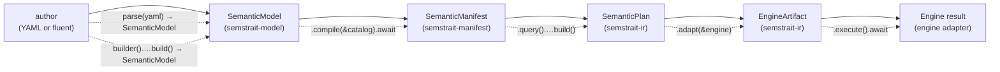

# 39b. Facade Fluent API — v1 Base Abstractions and Control Flow

> **Status:** v1 reservation. **Pins base abstractions, their crate locations, and the pipeline-stage contract.** Concrete builder method signatures, ergonomic shorthand methods, and per-stage internal mechanics are deferred to the per-crate API docs (`32` / `33` / `34` / `36`). The formal facade contract lives in [`39_semstrait_facade.md`](39_semstrait_facade.md); this doc reserves the API ergonomics 39 must serve.

---

## 1. Purpose

For v1, reserve:

- The **base abstractions** that participate in the user-facing fluent pipeline.
- Their **crate locations** (where each type lives).
- The **per-crate responsibility split** — what each crate owns and what it does not own.
- The **control-flow stage vocabulary** (`build`, `compile`, `query`, `adapt`, `execute`) and the owning crate of each transition.
- The **stage-transition mechanism** — extension traits in the owning crate, reachable through `semstrait::prelude::*`.
- The **prelude composition by category**.
- The **resolution of the model↔expr coupling** at the import level (one prelude line covers both).

Out of scope for this v1 reservation:

- Concrete builder method signatures, parameter naming, default values.
- Whether sub-builder methods return `Self` or `Result<Self, _>`.
- Internal substep ordering inside `compile` / `plan` / `adapt`.
- Engine-specific execute() shapes — those belong to per-engine adapter crates.

---

## 2. Base abstraction inventory

The minimum set of types a fluent v1 author touches end-to-end, with their authoritative home.

| Abstraction | Kind | Owning crate | Doc owner |
|---|---|---|---|
| `SemanticModel` | struct | `semstrait-model` | `[32](32_semstrait_model.md)` |
| `Dataset` / `Grainset` / `Unionset` / `Joinset` (+ Nested variants) | struct | `semstrait-model` | `[32](32_semstrait_model.md)` |
| `Dimension` / `Measure` / `Metric` / `Filter` / `Relationship` / `Keys` | struct | `semstrait-model` | `[18](../foundations/18_entities.md)` (shape) + `[32](32_semstrait_model.md)` (placement) |
| `SemanticInterface` (per-DataKind exposure of entities) | struct | `semstrait-model` | `[32](32_semstrait_model.md)` |
| `SemanticMapping` (semantics-to-physical) | struct | `semstrait-model` | `[15](../foundations/15_mapping_and_binding.md)` (shape) + `[18 §10](../foundations/18_entities.md)` |
| `ExprSource` (YAML authoring surface — `Inline(String)` / `Block(Expr<L>)`; no separate `ExprBlock` AST per `[14 §6.1](../foundations/14_expressions.md)`) | enum | `semstrait-model` | `[14 §6](../foundations/14_expressions.md)` (contract) + `[32](32_semstrait_model.md)` (impl) |
| `SemanticExpr` / `PhysicalExpr` (canonical expression types) | type alias over `Expr<L>` | `semstrait-ir` | `[14](../foundations/14_expressions.md)` |
| `Expr<L>` / `PhysicalLeaf` / `SemanticLeaf` (structural + leaf sets) | enum / enum / enum | `semstrait-ir` | `[14](../foundations/14_expressions.md)` |
| `Tree` / `Visitor` / `Rewriter` / `ExprLeaf` (traversal trait family) | trait / trait / trait / trait | `semstrait-ir` | `[14 §3.1 / §3.2](../foundations/14_expressions.md)` + `[35 §3.2](35_semstrait_ir.md)` |
| `BinaryOpKind` / `UnaryOpKind` / `AggregationOp` / `LikeKind` / `CastFailure` / `WindowFn` / `WindowFrame` / `Literal` (structural-variant support enums + typed-literal carrier) | enum | `semstrait-ir` | `[14 §3.3](../foundations/14_expressions.md)` + `[35 §3.4](35_semstrait_ir.md)` |
| `ColumnRef` / `SemanticsName` (identifier carriers) | newtype / newtype | `semstrait-ir` | `[14 §3.4 / §3.5](../foundations/14_expressions.md)` + `[35 §3.4](35_semstrait_ir.md)` |
| `Accessor` family / `Parameter` / `Window` | enum / struct / struct | `semstrait-ir` | `[14 §4 / §5](../foundations/14_expressions.md)` |
| `CanonicalFn` / `FunctionRegistry` / `FunctionSpec` | newtype / struct / struct | `semstrait-ir` | `[14a](../foundations/14a_function_catalog.md)` |
| `ValidateError` / `CompileError` (narrow IR-emitted error kinds — trait-machinery / `ReturnTypeRule::Custom`) | enum / enum | `semstrait-ir` | `[35 §16.1 / §15.2](35_semstrait_ir.md)` |
| `SemanticManifest` (compile output) | struct | `semstrait-manifest` | `[33](33_semstrait_manifest.md)` |
| `ResolvedExprTable` (per-(Semantics, Binding) PhysicalExpr) | struct | `semstrait-manifest` | `[19 §3.2](../foundations/19_expression_flow.md)` |
| `Request` / `RequestDimensionRef` (query-time input) | struct / struct | `semstrait-planner` | `[34](34_semstrait_planner.md)` |
| `SemanticPlan` / `PlanNode` (canonical plan tree) | struct / enum | `semstrait-ir` | `[35](35_semstrait_ir.md)` |
| `EngineArtifact` (adapter output) | enum | `semstrait-ir` | `[35](35_semstrait_ir.md)` |
| `EngineAdapter` (trait) | trait | `semstrait-adapter` | `[36](36_semstrait_adapter.md)` |
| `CatalogProvider` / `FileSystem` (traits) | trait / trait | `semstrait-catalog` | `[37](37_semstrait_catalog.md)` |
| `DataType` / `Grain` / `Schema` | enum / enum / struct | `semstrait-common` | `[13](../foundations/13_types_and_grain.md)` (shape) + `[31](31_semstrait_common.md)` (placement) |
| `Diagnostic<K>` / `Diagnostics<K>` / `Severity` / `Diagnose` | struct / alias / enum / trait | `semstrait-common` | `[30 §5](30_api_contracts.md)` + `[31](31_semstrait_common.md)` |

This is the v1 reservation roster. Any new top-level abstraction is a clause-level MINOR addition per `[30 §2.2](30_api_contracts.md)`.

---

## 3. Per-crate responsibilities

A type lives in the crate that owns its **definition and v1 evolution**. A crate may **consume** types from upstream crates without owning them. The table is intentionally explicit about both halves.

| Crate | Owns | Does NOT own |
|---|---|---|
| `semstrait-common` | Non-expression shared vocabulary only: logical-type primitives (`DataType`, `Grain`, `TypeClass`, `Schema`, `SchemaColumn`); constraint-DSL shapes (`MeasureConstraints`, `DimensionConstraints`, `AggregationConstraints`); diagnostic primitives (`Diagnostic<K>`, `Diagnostics<K>`, `Severity`, `Location`, `Span`, `SourceId`, `Diagnose`); byte-blob `io` transport | Any expression-tree vocabulary — no `Expr<L>`, no `PhysicalExpr` / `SemanticExpr`, no `Tree` / `Visitor` / `Rewriter` / `ExprLeaf`, no support enums (`BinaryOpKind`, …), no `Literal`, no identifier carriers (`ColumnRef`, `SemanticsName`), no `CanonicalFn` / `FunctionRegistry`, no `ValidateError` / `CompileError`; any model / manifest / plan type |
| `semstrait-ir` | The **complete expression-vocabulary home** after the second-cascade landing (`STATUS.md` item Q): the canonical IR layer (`Expr<L>` + leaf sets + type aliases `PhysicalExpr` / `SemanticExpr`); the traversal trait family (`Tree`, `Visitor`, `Rewriter`, `ExprLeaf`); the structural-variant support enums (`BinaryOpKind`, `UnaryOpKind`, `AggregationOp`, `LikeKind`, `CastFailure`, `WindowFn`, `WindowFrame`) and `Literal` typed-literal carrier; the identifier carriers (`ColumnRef`, `SemanticsName`); the `Accessor` family + `Parameter`; `CanonicalFn` + `FunctionRegistry`; the narrow `ValidateError` (trait-machinery) and `CompileError` (`ReturnTypeRule::Custom`); `PlanNode` + `SemanticPlan` + `EngineArtifact` containers; expression DSL (free constructors in `expr_fn`; `std::ops` impls; aggregate/window builder traits) | Parsing (no YAML, no inline DSL parser); compile resolution; planning algorithms; engine emission |
| `semstrait-model` | **The YAML surface** (`ExprSource` with `Inline(String)` / `Block(Expr<L>)` variants — no separate `ExprBlock` parallel AST per `[14 §6.1](../foundations/14_expressions.md)`; parse-site dispatch via `parse_semantic` / `parse_physical`); **parse-time structural rules** (per-site shape gates, identifier syntax, reserved-tag catalog dispatched via `Expr<L>`'s serde shape); **entity types** (`SemanticModel`, `Dataset`, `Grainset`, `Unionset`, `Joinset`, `Dimension`, `Measure`, `Metric`, `Relationship`, `Filter`, `Keys`, `SemanticInterface`, `SemanticMapping`); validate-stage checks (cross-entity SR-* rules); the model-level `ValidateError` (embeds `Ir(ir::ValidateError)` via D.ii) | The canonical expression *semantics* (consumes `SemanticExpr` / `PhysicalExpr` from `semstrait-ir` as value types — does not own their shape evolution); compile-time resolution (no name lookup, no cross-DataKind path BFS); function-registry evolution |
| `semstrait-manifest` | Compile-time resolution (`SemanticExpr` → `PhysicalExpr`); `ResolvedExprTable`; `SemanticManifest` (sealed artifact); the manifest-level `CompileError` (wider resolution-stage roster; embeds `Ir(ir::CompileError)` via D.ii); `Repository` trait + bundled impls; the `Compile` extension trait (build → compile transition) | Authoring (no YAML parsing); planning (no `Request` handling); definition of `Expr<L>` / `FunctionRegistry` / `PlanNode` (those are `semstrait-ir`'s) |
| `semstrait-planner` | Planning (`Request` × `Manifest` → `SemanticPlan`); per-DataKind Strategy; `Aggregate` lift; `Parameter` binding from `Request`; the `Query` extension trait + `RequestBuilder` (compile → query transition) | Adaptation (no engine-specific rewrites); compile-time resolution |
| `semstrait-adapter` | Adapter trait (`EngineAdapter`); per-engine rendering of `PhysicalExpr` and `PlanNode` to engine artifacts; the `Adapt` extension trait (query → adapt transition) | Plan construction; expression resolution |
| `semstrait-catalog` | `CatalogProvider` + `FileSystem` trait surfaces; bundled providers (local, in-memory); optional providers behind features (Iceberg, Unity, etc.) | Compile-stage logic; planning |
| `semstrait-api` | Orchestration helpers (`SemStrait`, `SemStraitBuilder`); transport entry points (REST / gRPC / CLI behind feature flags) | Any sub-stage logic — composes only |
| `semstrait` (facade) | The crate root re-exports (`semstrait::core`, `::model`, `::ir`, `::manifest`, `::planner`, `::adapter`, `::catalog`, `::api`); `semstrait::prelude::*` (the curated bundle); `semstrait::builder()` re-export (= `SemanticModel::builder()`); optional `semstrait::run` YAML one-shot per `[39 §4](39_semstrait_facade.md)` | Any new types; any logic beyond `run` |

**The model↔ir split deserves an explicit clause.** `semstrait-model` parses YAML into `SemanticExpr` values, but does not own how `SemanticExpr` is *evaluated*, *resolved*, *operator-overloaded*, or *eliminated*. Those concerns live in `semstrait-ir` (operators, registry, DSL constructors) and `semstrait-manifest` (resolution). The model crate's contract with the expression layer is:

- It can **construct** `SemanticExpr` values (parser output).
- It can apply **structural validation** to those values (per-site shape gates, reserved-identifier checks).
- It does **not** evolve the shape of `SemanticExpr`. If a new variant lands, it lands in `semstrait-ir` and is consumed by the model crate without re-definition.

---

## 4. Control-flow stages

The pipeline at the API level. Each stage has a verb, an input, an output, an owning crate, and a transition mechanism.



Per-stage contract:

| Stage | Input | Output | Owning crate | Transition mechanism |
|---|---|---|---|---|
| **build** | author input (programmatic or YAML) | `SemanticModel` | `semstrait-model` | `SemanticModel::builder().…build()` (programmatic) or `parse(&yaml)` (YAML) |
| **compile** | `SemanticModel`, `&dyn CatalogProvider` | `SemanticManifest` | `semstrait-manifest` | `Compile` extension trait on `SemanticModel` |
| **query** | `SemanticManifest`, `Request` (or `RequestBuilder`) | `SemanticPlan` | `semstrait-planner` | `Query` extension trait on `SemanticManifest` |
| **adapt** | `SemanticPlan`, `&dyn EngineAdapter` | `EngineArtifact` | `semstrait-adapter` | `Adapt` extension trait on `SemanticPlan` |
| **execute** | `EngineArtifact`, engine-specific runtime context | engine-specific result | per-engine adapter crate | inherent method on `EngineArtifact` or on the engine handle (engine-specific) |

**Verb vocabulary is reserved for v1**: `build` / `compile` / `query` / `adapt` / `execute`. These are the canonical names exposed through the prelude. Internal helper methods may shadow these names with different specificity (e.g., `parse(&yaml)` is a build-stage helper), but no stage transition takes a different name.

---

## 5. Stage-transition mechanism

Each cross-crate stage transition is implemented as a **single named extension trait** in the owning crate, implemented on the input-stage type. The pattern is uniform:

```rust
// Pattern (one of three concrete instances below):
pub trait <Verb> {
    type Output;
    type Error;
    fn <verb>(self, …context…) -> Result<(Self::Output, Diagnostics<Self::Error>), …>;
}
impl <Verb> for <UpstreamStageType> {
    type Output  = <DownstreamStageType>;
    type Error   = <PerStageErrorKind>;
    fn <verb>(…) -> … { … }
}
```

Concrete v1 traits:

| Trait | Owning crate | Implemented on | Output type |
|---|---|---|---|
| `Compile` | `semstrait-manifest` | `SemanticModel` | `SemanticManifest` |
| `Query` | `semstrait-planner` | `SemanticManifest` | `SemanticPlan` (via `RequestBuilder` terminal) |
| `Adapt` | `semstrait-adapter` | `SemanticPlan` | `EngineArtifact` |

**Why extension traits**: each owning crate is downstream of the type it adds methods to. The orphan rule says we can either define the trait in the owning crate (and impl it on the upstream type — legal because we own the trait) or define inherent methods on the upstream type (illegal across crates). Extension traits are the only working pattern.

**Discoverability**: each trait is re-exported through `semstrait::prelude::*`. A user with the prelude in scope sees all three transition methods as if they were inherent on the chain. The user never types `use semstrait::manifest::Compile;`.

**Single trait per transition, not many**: we reserve exactly one trait per cross-crate stage boundary. Trait proliferation (`CompileExt` + `CompileWithRepo` + `CompileWithMetadata` + …) is rejected. If a transition gains options, they go on the input type via a setter (`model.with_options(…).compile(&catalog)`) or on a builder, not on a new trait.

---

## 6. Prelude composition (by category)

The facade prelude (`semstrait::prelude::*`) brings the following **categories** into scope. The exact item list per category is owned by `[39 §3.2](39_semstrait_facade.md)`; this doc reserves the categories themselves.

| Category | Sourced from | Reserved for the prelude? |
|---|---|---|
| **Entity types** (`SemanticModel`, `Dataset`, `Grainset`, `Unionset`, `Joinset`, `Dimension`, `Measure`, `Metric`, `Relationship`, `Filter`, `Keys`, `SemanticInterface`) | `semstrait-model` | **Yes** — required for any author to construct a model |
| **Entity builders** (the `::builder()` constructors as inherent methods on the entity types) | `semstrait-model` | **Yes** — implicitly reachable when the types are in scope |
| **Canonical expression types** (`SemanticExpr`, `PhysicalExpr`, `EntityRef`, `Accessor`, `Parameter`) | `semstrait-ir` | **Yes** — required as the value type of `Measure::expr(…)`, etc. |
| **Expression DSL** (`col`, `lit`, `entity_ref`, `when`, `case`, aggregate helpers like `sum` / `count` / `avg` / `min` / `max`) | `semstrait-ir::expr_fn` | **Yes** — required for inline expression authoring |
| **Expression operator overloads** (`impl Add for SemanticExpr`, etc.) | `semstrait-ir` (in scope automatically when the type is in scope) | **Implicit** — no explicit prelude entry needed |
| **Stage-transition traits** (`Compile`, `Query`, `Adapt`) | per owning crate | **Yes** — without them the fluent chain breaks |
| **Query-input types** (`Request`, `RequestBuilder`, `RequestDimensionRef`) | `semstrait-planner` | **Yes** — required to author queries |
| **Engine-adapter trait** (`EngineAdapter`) | `semstrait-adapter` | **Yes** — required to bind a plan to an engine |
| **Catalog-provider trait** (`CatalogProvider`) | `semstrait-catalog` | **Yes** — required as `.compile(&catalog)`'s argument type |
| **Plan-tree types** (`SemanticPlan`, `PlanNode`, `EngineArtifact`) | `semstrait-ir` | **Yes** — required to inspect/manipulate plans between stages |
| **Diagnostic primitives** (`Diagnostic`, `Diagnostics`, `Severity`, `Diagnose`) | `semstrait-common` | **Yes** — required to consume the canonical `(Output, Diagnostics<K>)` tuple |
| **Logical type primitives** (`DataType`, `Grain`) | `semstrait-common` | **Yes** — required as field types on entities |
| **Top-level convenience** (`semstrait::builder()` free function) | facade | **Yes** (function not re-exported but reachable at crate root) |

**Categories explicitly NOT in the prelude** (reachable through `semstrait::<module>::*`):

- Internal-only types (`ResolvedExprTable`, `Binding`, plan-strategy types).
- Per-stage `*ErrorKind` enums except the unified `SemStraitErrorKind` (consumed via `Diagnostic::kind`).
- Function-spec types (`FunctionSpec`, `FnSignature`, `ParamType`) — the registry is process-global; these are rarely referenced by name at the call site.
- Per-engine adapter handles beyond the default (default engine ships in the facade default features; other engines reachable through their adapter crates).

---

## 7. Resolution of the model↔expr coupling

**The observation.** A `Measure` carries a `SemanticExpr`. Constructing a `Measure` value programmatically requires a `SemanticExpr` value. Therefore model authoring and expression authoring are conceptually coupled.

**Conceptual coupling**: unavoidable. The domain has this shape.

**Crate-DAG coupling**: handled. `semstrait-model` depends on `semstrait-ir` per `[14 §9.3](../foundations/14_expressions.md)`.

**Import coupling at the call site**: **eliminated**. One `use semstrait::prelude::*;` brings both entity types and expression DSL into scope. The author types neither `semstrait_model::…` nor `semstrait_ir::…` ever.

**The split that makes this work cleanly**:

| Concern | Lives in |
|---|---|
| The shape and semantics of `SemanticExpr` | `semstrait-ir` |
| The shape of entity types (`Measure`, `Dimension`, `Metric`) | `semstrait-model` |
| Construction of `SemanticExpr` values via parsing | `semstrait-model` (consumes the type from `semstrait-ir`) |
| Operator overloads, free constructors, registry-driven dispatch | `semstrait-ir` |
| Resolution (`SemanticExpr` → `PhysicalExpr`) | `semstrait-manifest` |

`semstrait-model` is a **consumer** of `SemanticExpr`, not a **co-owner**. It can construct expression values via parsing, but it does not own the shape of `SemanticExpr` and does not implement operator overloads or function dispatch on it. The model crate's contract is "produce well-formed `SemanticExpr` values that pass structural rules"; the canonical evaluation contract belongs to `semstrait-ir` and `semstrait-manifest`.

This is what `[14 §9.3](../foundations/14_expressions.md)` already ratifies; 39b reservation makes the *consumer-not-co-owner* posture explicit on the model-crate side.

---

## 8. Composition point vs implementation point

The user-facing fluent surface lives at the facade for one reason: **the facade is the only crate that depends on every sub-crate**. It is the workspace's terminal node in the DAG. Composition happens at the top; implementation happens in sub-crates.

- **Composition point** (`semstrait` facade): the prelude, the `semstrait::builder()` re-export, the optional `run` convenience. Adds zero new types per `[39 §1.5](39_semstrait_facade.md)`.
- **Implementation point** (sub-crates): every type definition, every method body, every algorithm. Each sub-crate has exactly one job per §3.

Equivalent statement: the facade is **discoverability infrastructure**. It reorganizes upstream names into ergonomic groupings (the prelude) and provides one-shot conveniences for the common cases. It does not invent vocabulary.

---

## 9. Open shape decisions reserved for clause-level ratification

These are the decisions that affect *base abstractions* and *control-flow shape*, not concrete ergonomics. Ergonomic decisions (builder method signatures, optional method shortcuts, namespace newtypes for type-family methods like `.str()` / `.dt()`) live in the per-crate API docs and can be added MINOR-additively.

| ID | Decision | Status |
|---|---|---|
| **D1** | `Compile` / `Query` / `Adapt` extension-trait pattern (§5) — accepted as the v1 standard for cross-crate stage transitions | Open |
| **D2** | `query()` as the verb for compile → plan transition (vs `plan()` / `select()`) | Open — recommended `query()` |
| **D3** | `Query` extension trait returns `RequestBuilder` (Polars-flavored) vs takes a `Request` argument (DataFusion-flavored) — affects the v1 fluent UX shape | Open — recommended `RequestBuilder` |
| **D4** | Prelude includes the three transition traits, the expression DSL (`expr_fn::*`), and the operator-overloaded types | Open — recommended yes (all three categories) |
| **D5** | `semstrait::builder()` re-exports `SemanticModel::builder()` at the facade crate root | Open — recommended yes |
| **D6** | `execute()` ownership — method on `EngineArtifact` (engine-bound) vs method on `SemanticPlan` (plan-bound, dispatches via adapter) | Open — recommended on `EngineArtifact` |

Decisions explicitly deferred to post-v1 (not in this reservation):

- Inline DSL parser shape (still possible to ship `Declarative` form alone in v1; reserved behind a feature flag if added later).
- Namespace newtypes for type-family methods (`col("x").str()…` Polars-style).
- SQL-frontend boundary parser (separate `semstrait-sql` crate, post-v1).
- Streaming / incremental compile.

---

## 10. Required follow-ups in [39](39_semstrait_facade.md)

This reservation implies the following updates to `39` once D1–D6 ratify (each is its own clause):

1. **`39 §3.2`** — prelude inventory adds:
   - `Compile`, `Query`, `Adapt` (the three transition traits, from §5).
   - `RequestBuilder` (returned by `Query::query`).
   - `expr_fn::*` (free constructors).
   - `SemanticExpr`, `PhysicalExpr`, `EntityRef`, `Accessor`, `Parameter` (canonical expression types).
   - `EngineAdapter`, `CatalogProvider` (the two trait inputs to stage transitions).
2. **`39 §4`** — adds `semstrait::builder()` free-function re-export of `SemanticModel::builder()`. Preserves the existing `run(yaml, …)` convenience (different mental model, YAML-first).
3. **`39 §1.5`** — the zero-new-logic principle holds throughout. The fluent surface emerges entirely from re-exports + upstream extension traits + the orphan-rule-co-located DSL.

---

## 11. Cross-references

- [`14_expressions.md`](../foundations/14_expressions.md) — `Expr<L>`, `SemanticExpr` / `PhysicalExpr`, expression DSL, per-crate placement.
- [`14a_function_catalog.md`](../foundations/14a_function_catalog.md) — `CanonicalFn`, `FunctionRegistry`, `FunctionSpec`.
- [`32_semstrait_model.md`](32_semstrait_model.md) — entity types and parse-time structural rules (the model crate's contract).
- [`33_semstrait_manifest.md`](33_semstrait_manifest.md) — `compile`, `SemanticManifest`; will host the `Compile` trait.
- [`34_semstrait_planner.md`](34_semstrait_planner.md) — `plan`, `Request`; will host the `Query` trait and `RequestBuilder`.
- [`35_semstrait_ir.md`](35_semstrait_ir.md) — canonical-IR layer; owns `SemanticPlan`, `PlanNode`, `EngineArtifact` plus (per `[14](../foundations/14_expressions.md)`) the expression layer.
- [`36_semstrait_adapter.md`](36_semstrait_adapter.md) — `EngineAdapter`; will host the `Adapt` trait.
- [`38_semstrait_api.md`](38_semstrait_api.md) — `SemStrait` orchestrator at the API layer.
- [`39_semstrait_facade.md`](39_semstrait_facade.md) — formal facade contract.
