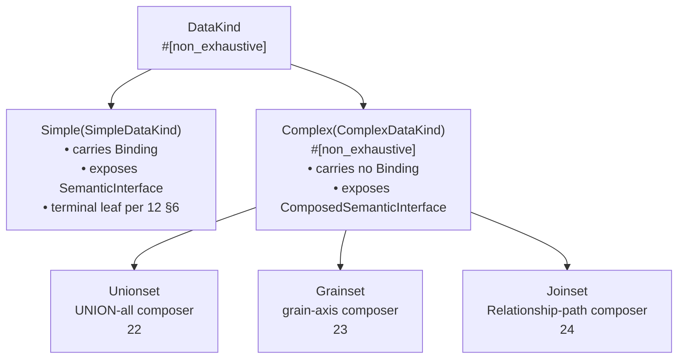

# 20. DataKind Taxonomy

> **Reconciliation (Phase-3, 2026-04-17).** The concrete per-variant Rust-struct / YAML-surface shape is ratified across:
>
> - [`../apis/32_semstrait_model.md §3`](../apis/32_semstrait_model.md) — top-level plural YAML tags (`datasets:`, `grainsets:`, `unionsets:`, `joinsets:`) and the `DatasetBody` / `GrainsetBody` / `UnionsetBody` / `JoinsetBody` struct shapes.
> - [`../foundations/18_entities.md`](../foundations/18_entities.md) — canonical entity types consumed by every data-kind variant: `SemanticInterface`, `Extras`, `TemporalShape`, `SemanticMapping`, `Keys`, `AiContext`, inline-vs-`ref` grammar for Dimensions / Measures / Metrics / filters, `Relationship` (unified struct).
> - [`26_nesting_matrix.md`](./26_nesting_matrix.md) — nesting rules (R1 / R2 / R3).
> - [`../apis/32b_catalogs_yaml.md`](../apis/32b_catalogs_yaml.md) — `CatalogRef` grammar consumed via `extras.catalog:`.
>
> This document retains authority for:
>
> - The `DataKind` sum-type shape (§2) and `Simple | Complex` split.
> - The `DataKindBase` common-fields struct and the per-variant `*Body` pattern.
> - Shared trait surface — sealed hierarchy of `SemanticsCarrier` / `SimpleDataKind` / `ComplexDataKind` / variant-specific traits.
> - Shared invariants (§4) that hold for every variant: naming, lifecycle, coverage-surface presence, grain posture, nesting-rules citation.
> - The `Strategy` trait surface and dispatch contract (§5).
> - Per-stage responsibility skeleton (§6) shared across all variants.
> - Shared error-code roster `*_E_20NN`; reservation of `21NN`–`25NN` sub-ranges.
>
> Body sections below that describe pre-`18` YAML shape (formerly `32c` before the 2026-04-17 promotion — e.g., `data_kinds:` singular tag, non-flattened body structs, `ColumnMapping`) are historical. `ColumnMapping` → `SemanticMapping` rename per `18 §10`.

## Table of Contents

1. [Purpose and Scope](#1-purpose-and-scope)
2. [The `DataKind` Abstraction](#2-the-datakind-abstraction)
3. [The Four Variants at a Glance](#3-the-four-variants-at-a-glance)
4. [Shared Invariants](#4-shared-invariants)
5. [Construction / Resolution Strategy — the Strategy Taxonomy](#5-construction--resolution-strategy--the-strategy-taxonomy)
6. [Lifecycle — Per-Stage Responsibilities (Shared Skeleton)](#6-lifecycle--per-stage-responsibilities-shared-skeleton)
7. [Applicability Cross-Cuts](#7-applicability-cross-cuts)
8. [Error-Code Roster](#8-error-code-roster)
9. [Round-1 Audit / Open Items](#9-round-1-audit--open-items)

---

## 1. Purpose and Scope

### 1.1 What `20` ratifies

`20` is the foundations-adjacent document that ratifies the **shared variant-level abstraction** sitting on top of `15`'s binding layer and `16`'s composition layer. It is the first document in the `data-kinds/` sub-tree; everything in `21`–`25` inherits from `20`'s invariants and refines them for one concrete variant (`21` Simple / `22` Grainset / `23` Unionset / `24` Joinset) or for a cross-variant matrix (`25`).

Concretely, `20` ratifies:

- **§2** — the `DataKind` sum-type shape (`Simple | Complex`), the inner `ComplexDataKind` variant split, and the Rust surface both levels expose (`#[non_exhaustive]` per I10).
- **§2.2** — the minimal **trait** every concrete DataKind variant implements: interface accessor (`SemanticInterface` for `Simple`, `ComposedSemanticInterface` for each `Complex` variant), binding-slot rule, nesting-capability flags, lifecycle hooks wired into each of `parse` / `validate` / `compile` / `plan`.
- **§2.3** — the **Simple vs Complex** boundary: `Simple` is the only variant that carries a `Binding` (refining `15 §2.1`); `Complex` variants never carry their own `Binding` and compose the Bindings of their Simple leaves through `16 §5`'s `ComposedSemanticInterface` machinery.
- **§3** — the single at-a-glance variant matrix (composes? / Binding carried? / interface type / grain-aware? / uses Relationships? / fan-out rule). This is the entry point readers use before descending into `21`–`24`.
- **§4** — the shared invariants that hold for every variant: naming rules, the shared lifecycle skeleton, the coverage-surface rule, interface exposure, grain-posture axis, nesting-rules citation, additivity-coupling citation.
- **§5** — the **strategy taxonomy**: each concrete variant owns its planner-layer resolution strategy (`SimpleStrategy`, `GrainsetStrategy`, `UnionsetStrategy`, `JoinsetStrategy`). The `Strategy` trait surface is sketched here and ratified on `34`'s public-API side.
- **§6** — the per-stage responsibilities shared across all variants during `parse` / `validate` / `compile` / `plan`. Per-variant specialization of each stage lives in `21`–`24`.
- **§7** — a pointer forward to `25`'s applicability matrix: which foundation rule (`10`–`17`) applies to which variant.
- **§8** — the DataKind-shared error-code roster (`*_E_2000`–`*_E_2099`) and the reservation of `*_E_2100`–`*_E_2599` for `21`–`25`.

### 1.2 What `20` does NOT ratify (forward-refs)

- **Per-variant block shape beyond `12`'s nesting matrix.** `12 §3` / `12 §4` / `12 §5` already ratify block layout for `Unionset` / `Grainset` / `Joinset`; `20` does not re-state these. Variant-specific authoring details live in `21`–`24`.
- **Per-variant resolution algorithms.** How a `Grainset` picks a level; how a `Unionset` assembles branches; how a `Joinset` walks its declared path — all specific to `22` / `23` / `24`.
- **Per-variant YAML surface.** The authoring-side form is ratified in `32` and cross-referenced by each `21`–`24`.
- **The `ComposedSemanticInterface` internals.** `20` treats `ComposedSemanticInterface` as a ratified `16 §5` type. Its `UnifiedSemantics` merge (`16 §6`), `FieldProvenance` axis (`16 §7`), and `CompositionCoverage` keying (`16 §8`) are `16`'s concerns.
- **The `Relationship` block shape, Cardinality, JoinType carriage, and implicit-vs-explicit composition boundary.** All `16`'s. `20` cites `16` whenever a `Complex` variant depends on composition machinery.
- **`TemporalShape` × `Additivity` interactions.** Forward-referenced per `17`'s ratification: `17 §*` is still landing in parallel. Where `20` mentions `TemporalShape` it names only section numbers already in `00 §4.1`'s row and `11 §7` / `17` general scope.
- **Manifest-layer struct rosters** (`ResolvedDataKind`, `ResolvedSimpleDataKind`, `ResolvedComplexDataKind`) — ratified in `33`. `20` describes the abstract trait contract; the concrete `Resolved*` field lists are `33`'s.

### 1.3 Design posture

`20`'s posture matches the `15` / `16` stance: **ratify the shared shape once, specialize once per variant, and let the planner dispatch**.

- **One abstraction, four concretions.** The `DataKind` sum type is closed at the top level (`Simple | Complex`), open one level down (`Complex::Unionset | Grainset | Joinset`, `#[non_exhaustive]`). Authors extend the set by adding a new `ComplexDataKind` variant in `21`–`24` scope; the shared-invariant surface in `20 §4` already tells them what they must uphold.
- **Trait surface, not ad-hoc dispatch.** Every concrete variant implements the same minimal trait (`§2.2`). The planner's strategy dispatch (`§5.3`) reads the trait, not the variant tag. Pattern-matching on the variant tag at plan time is permitted only at the dispatch site itself; downstream planner code operates through the trait.
- **Invariants live here; specifics live below.** A reader who wants to know *what every DataKind has in common* reads `20 §4`. A reader who wants to know *how a `Grainset` picks a level* reads `22`. `20` never duplicates per-variant text and never weakens a shared invariant for one variant.

### 1.4 Read-order note

`20`'s prereqs are `10` / `11` / `12` / `15` / `16` / `17`. A reader who has the vocabulary from `00 §4` and the per-stage contract from `10` can skim `20 §2`–`§3`; to follow `§4` onward, the scope-chain ratifications from `11`, the nesting matrix from `12`, the binding contract from `15`, and the composition mechanism from `16` are all required. `17` is a light prereq — `20` only cites its section numbers from `00 §4.1`'s `TemporalShape` row and defers planner-side temporal-shape rules to `22` / `24` and to `17` itself.

After `20`, read `21`–`24` in any order (they are sibling documents); `25`'s applicability matrix makes most sense after at least one of `21`–`24` has been read.

### 1.5 Guardrails — how `20` upholds `00 §9` invariants

| Invariant | Where `20` keeps it |
|---|---|
| **I5** — resolution is compile-time | Every DataKind variant's structural / reference / binding / composition work happens in `parse` / `validate` / `compile` per `§6`. Plan time sees only a ratified trait surface. |
| **I6** — `plan` is synchronous | The `Strategy` trait (`§5.2`) returns a `Result<PlanNode, PlanError>` with no `async`. Strategy dispatch (`§5.3`) is a single `match` on the ratified `DataKind::Complex` variant tag. |
| **I8** — Manifest is planner-complete | Every per-variant field the planner needs is materialized by `compile` (`§6.3`). Simple's resolved `Binding`, Complex's constituent refs, composed interfaces — all Manifest-present before `plan` is invoked. |
| **I10** — public sum types are `#[non_exhaustive]` | `DataKind`, `ComplexDataKind`, every variant-owned enum (e.g. `NestingCapability` in `§2.2`), and every `*_E_2xxx` error variant carry `#[non_exhaustive]`. |
| **I12** — diagnostics carry stable codes | Every `§8` entry has a `{SUBSYSTEM}_{SEVERITY}_{NUMBER}` code matching `30 §6.1`'s format. Ranges are reserved per `30 §6.2`'s structural-not-sequential discipline, with a cross-doc-fix note in `§8.5` on extending `30 §6.2`'s subsystem caps to accept `2xxx`. |

I1 / I2 / I3 / I4 / I7 / I9 / I11 apply transitively — `20`'s surface exposes no raw SQL, no physical types, no engine identity, no I/O-at-plan, and sits at layer `2x` which only crates above the `1x` layer consume.

---

## 2. The `DataKind` Abstraction

### 2.1 `DataKind` as a closed-at-top sum type

The `DataKind` abstraction is a **two-level** sum type: the outer layer is closed to two shapes (`Simple` / `Complex`), and the inner layer of `Complex` enumerates the composer variants. Both layers are `#[non_exhaustive]` per I10 — adding a new `Complex` variant (e.g. a future `Snapshotset` or `Windowset`) is a MINOR change (`30 §2`).

```rust
/// The top-level DataKind abstraction.
///
/// Every queryable unit in a SemanticModel is exactly one of these two shapes:
/// - `Simple` — a leaf DataKind carrying a single `Binding` (per `15 §2.1`).
/// - `Complex` — a composer over children, carrying no Binding of its own
///   (per `15 §1.2` / `16 §1.1`).
#[non_exhaustive]
pub enum DataKind {
    Simple(SimpleDataKind),
    Complex(ComplexDataKind),
}

/// The inner variant discriminator for `DataKind::Complex`.
///
/// Each variant carries its own variant-specific shape ratified in `21`–`24`.
/// Same-variant self-nesting is banned by `12 §2`.
#[non_exhaustive]
pub enum ComplexDataKind {
    Unionset(UnionsetSpec),
    Grainset(GrainsetSpec),
    Joinset(JoinsetSpec),
}
```

The two-level structure (as opposed to a flat `DataKind { Simple, Unionset, Grainset, Joinset }`) is deliberate:

- It encodes the **`Binding` rule structurally**: a single `Simple(_)` arm carries the Binding; a single `Complex(_)` arm does not. Downstream code branches once on Simple-vs-Complex and then on the specific Complex variant.
- It mirrors `16 §5`'s `ComposedSemanticInterface::kind: CompositionKind` discriminator. Every `Complex(ComplexDataKind)` pairs 1:1 with a `CompositionKind` tag on its composed interface; there is no composed interface for `Simple`.
- It isolates the `SimpleDataKind` surface — which is stable — from the `ComplexDataKind` surface, which is expected to grow per I10.

At the Manifest layer (`33`), the same two-level shape appears as `ResolvedDataKind::Simple(ResolvedSimpleDataKind)` / `ResolvedDataKind::Complex(ResolvedComplexDataKind)`, with the inner variant discriminator preserved. No `CompiledDataKind`-prefixed type exists in the design vocabulary (`00 §4.3` bans the `Compiled*` prefix). Any code symbol still named `CompiledDataKind` is an implementation-side rename deferred to `implementation/40_refactor_plan.md` per I9.

#### 2.1.1 Diagram — the `DataKind` taxonomy tree

The taxonomy tree below is the canonical shape every downstream diagram in `21`–`25` refines. It is the **only** diagram in `20` — the remaining sections use prose and tables where those are clearer.



Shape legend per `00 §7.2`: rectangles are data/types. No arrows diverge — the tree is strict (a DataKind is exactly one variant).

### 2.2 Mandatory trait surface — what every DataKind variant exposes

Every concrete DataKind variant (`SimpleDataKind`, `Unionset`, `Grainset`, `Joinset`) implements the same minimal trait. The trait is the **contract surface** that the planner, the Manifest indices, and the validator read; pattern-matching on the variant tag is restricted to the dispatch site in `§5.3` and to a small number of clearly-marked match arms in `22`–`24`.

```rust
/// The minimal trait every concrete DataKind variant implements.
///
/// Lives in `semstrait-model` (at the Model-layer) with a parallel `ResolvedDataKindOps`
/// trait in `semstrait-manifest` (at the Manifest layer, per `33`). `20` ratifies the
/// Model-layer surface; the `ResolvedDataKindOps` roster is `33`'s to pin down.
pub trait DataKindOps {
    /// The Semantics-facing interface this DataKind exposes.
    ///
    /// - `SimpleDataKind` returns `InterfaceView::Bare(&SemanticInterface)`.
    /// - Every `ComplexDataKind` variant returns `InterfaceView::Composed(&ComposedSemanticInterface)`.
    fn interface(&self) -> InterfaceView<'_>;

    /// The binding slot.
    ///
    /// - `SimpleDataKind` returns `Some(&Binding)` after the `15 §10` compile-time
    ///   resolution has produced a `ResolvedBinding`; pre-compile, returns `None` and the
    ///   Model-layer `Binding` is reached through the variant-specific field.
    /// - Every `ComplexDataKind` variant returns `None` unconditionally.
    fn binding(&self) -> Option<&Binding>;

    /// Static capability flags describing what this variant may contain.
    ///
    /// Read by `validate` against `12 §2`'s nesting matrix. Not consumed at plan time.
    fn nesting_capability(&self) -> NestingCapability;

    /// Lifecycle hook — called by the `validate` driver (`10 §3`).
    ///
    /// Runs variant-specific structural Preconditions that sit on top of `12`'s matrix
    /// checks: Unionset's "≥2 children" rule (`12 §3.2`), Grainset's "coarsest-first
    /// ordering" rule (`12 §4.2`), Joinset's "binary v1" rule (`12 §5.2`). Accumulates
    /// diagnostics per `10 §5`.
    fn validate_structure(&self, ctx: &mut ValidateCtx) -> Result<(), ValidateError>;

    /// Lifecycle hook — called by the `compile` driver (`10 §4`).
    ///
    /// - `Simple` resolves its `Binding` per `15 §10` and produces a `ResolvedSimpleDataKind`.
    /// - `Complex` variants resolve their constituents (depth-first per `10 §4.3`), synthesize
    ///   their `ComposedSemanticInterface` per `16 §5`, and produce a `ResolvedComplexDataKind`.
    fn compile_into(&self, ctx: &mut CompileCtx) -> Result<ResolvedDataKind, CompileError>;

    /// Lifecycle hook — called by the planner's strategy-dispatch site (`§5.3`).
    ///
    /// Returns the variant's `Strategy` by reference; the planner invokes it on a
    /// `(Manifest, Request slice)` to produce a `PlanNode` subtree (`§5.2`).
    fn strategy(&self) -> &dyn Strategy;
}

/// The interface access discriminator — ratified here so `SimpleDataKind` and
/// `ComplexDataKind` can share the `DataKindOps::interface` signature.
#[non_exhaustive]
pub enum InterfaceView<'a> {
    Bare(&'a SemanticInterface),
    Composed(&'a ComposedSemanticInterface),
}

/// Static nesting-capability flags — read by `validate` against `12 §2`'s matrix.
///
/// `allows_simple` / `allows_unionset` / `allows_grainset` / `allows_joinset` each tell
    /// the validator whether a child DataKind is legal in this parent's child-list
/// blocks. `min_children` / `max_children` pin the cardinality rule from `12 §3.2` /
/// `12 §4.3` / `12 §5.3`. `SimpleDataKind`'s struct has every flag false and cardinality
/// `(0, 0)` — it is always a leaf.
#[non_exhaustive]
pub struct NestingCapability {
    pub allows_simple: bool,
    pub allows_unionset: bool,
    pub allows_grainset: bool,
    pub allows_joinset: bool,
    pub min_children: u16,
    pub max_children: Option<u16>,
}
```

**What the trait does NOT carry.**

- No `PlanNode`-shaped fields: the trait returns a `Strategy` reference; the `PlanNode` is produced by the strategy, not by the trait. This keeps the planner's single-responsibility split (§5.3).
- No `Binding`-shape flexibility on `ComplexDataKind`: the `binding()` method returns `Option<&Binding>` and every `Complex` variant's implementation is `None`. A future variant that invented its own binding-carrying semantics would violate `15 §2.1`'s "exactly-one-Simple-per-Binding" rule and is explicitly banned.
- No `CompositionKind`-shape accessor on `SimpleDataKind`: `CompositionKind` is defined only when a `ComposedSemanticInterface` exists (`16 §5`). `Simple`'s `interface()` returns `Bare(_)`; no composed kind applies.

**Implementer's checklist.** A developer adding a new `ComplexDataKind` variant in `21`–`24` scope must:

1. Return `InterfaceView::Composed(_)` from `interface()` — a new variant with `InterfaceView::Bare(_)` is a Simple, not a Complex, and belongs in `21`'s scope extension, not in `Complex`.
2. Return `None` from `binding()` unconditionally. `15 §2.1`.
3. Populate `NestingCapability` to match the `12 §2` matrix row reserved for the new variant (requires `12 §2` to be extended first).
4. Implement `validate_structure`, `compile_into`, `strategy()` — all four hooks are mandatory, no default impl.
5. Allocate an error-code sub-range from the reserved `2600`+ block (see `§8.3`) and register it in `30 §6.2` via a MINOR bump.

### 2.3 Simple vs Complex — the leaf-vs-composer split

The `Simple` / `Complex` boundary is the single most load-bearing distinction `20` ratifies. Every downstream rule in `21`–`25` cites it. It carries three independent but co-timed guarantees:

#### 2.3.1 `Binding` lives on `SimpleDataKind` exactly

Per `15 §2.1`:

> Every `SimpleDataKind` owns exactly one `Binding`; … `ComplexDataKind`s carry no `Binding` of their own — they aggregate the `Binding`s of their constituent Simple children, through the `ComposedSemanticInterface` machinery in `16`.

`20` restates this as a **hard invariant**:

> **Invariant D1 — single-binding-on-Simple.** A `Binding` may appear in the `SemanticModel` at exactly one position: the `binding:` field of a `SimpleDataKind`. A `ComplexDataKind` YAML block containing a `binding:` key is a structural error (`VALID_E_2001 BindingOnComplex`).

This invariant is what makes the `DataKindOps::binding()` method on `ComplexDataKind` return `None` unconditionally. It also justifies the absence of a `Binding` resolver path in `§5.2`'s `Strategy::resolve` contract for non-Simple variants.

#### 2.3.2 Interface exposure — bare vs composed

Per `00 §4.1`:

- `Simple` exposes a **bare** `SemanticInterface` — the set of `Semantics` declared directly on the `SimpleDataKind` (dimensions, measures, metrics, filters, keys per `11 §6`).
- `Complex` exposes a **`ComposedSemanticInterface`** — the unified, `UnifiedSemantics`-merged view of the `ComplexDataKind`'s constituents (per `16 §5`).

The type `ComposedSemanticInterface` is structurally **distinct** from `SemanticInterface` (ratified in `16 §5.1`). Both implement a `SemanticsView` trait for the accessors they share; consumers who need either view consume the trait, not the concrete type. `20`'s `DataKindOps::interface` method is a variant-tagged union (`InterfaceView`) over the two concrete types; see `§2.2`.

#### 2.3.3 Composer-without-own-Semantics rule

Per `11 §2` / `11 §10`, nested DataKinds do NOT declare their own Semantics; only the top-level DataKind's interface is authoritative. This means a `Complex` variant at the top level exposes **its own** interface declarations plus constituent contributions, merged via `16 §6`'s `UnifiedSemantics`. Nested-kind children (under a top-level `Complex`) contribute Bindings and structural resolution but never Semantics declarations.

This rule is carried into `20`'s trait surface via the `InterfaceView::Composed` arm: the `ComposedSemanticInterface` returned always carries the top-level Complex's declared Semantics, merged with constituent surfaces per `16 §5` / `§6`. A nested `ComplexDataKind` (e.g. a `Grainset` level's `unionsets:` child) does NOT expose its own `InterfaceView`; the access path is through its parent's composed interface.

---

## 3. The Four Variants at a Glance

The matrix below is the **single at-a-glance reference** for how the four concrete DataKind variants differ. Detailed rules live in `21`–`24`. Readers descending to the per-variant docs should return to this matrix whenever they need a quick cross-variant sanity check.

| Aspect | `Simple` / Dataset (`21`) | `Unionset` (`22`) | `Grainset` (`23`) | `Joinset` (`24`) |
|---|---|---|---|---|
| **Composes children?** | No — terminal leaf per `12 §6`. | Yes — ≥ 2 branches per `12 §3.2`. | Yes — ≥ 2 levels per `12 §4.3`. | Yes — exactly 2 members in v1 per `12 §5.3` (N-ary deferred as `TD-NESTING-NARY-JOIN`). |
| **Carries own `Binding`?** | Yes — exactly one, per `15 §2.1` / `§2.3.1`. | No — aggregates branch Bindings. | No — aggregates per-level child Bindings. | No — aggregates member Bindings. |
| **Interface exposed** | `SemanticInterface` (bare), per `00 §4.1` / `11 §2`. | `ComposedSemanticInterface` with `CompositionKind::Unionset`, per `16 §5`. | `ComposedSemanticInterface` with `CompositionKind::Grainset`. | `ComposedSemanticInterface` with `CompositionKind::Joinset`. |
| **Grain-aware at resolution?** | No — fixed grain per source (`15 §6`). | No — union over branches at the branch's own grain; no cross-branch rollup. | **Yes** — level selection is grain-driven per `22 §*` / `13 §*`. | No — join semantics are grain-agnostic at the Joinset level; per-member grain is its own concern. |
| **Uses declared `Relationship`s?** | No — Simple is unrelated to `16 §2`'s `Relationship` block. | No — branches are unioned, not joined. | No — levels are grain-stacked, not joined. | **Yes** — `path:` optionally names a declared `Relationship` per `12 §5.1`; mandatory from `16 §9` if the path spans two constituents connected only by declared Relationships. |
| **Request fan-out rule** | 1:1 — one Request resolves to one `Scan` over the Simple's `ResolvedBinding` (or one `Scan` per PhysicalSource — see `15 §3`). | 1:N union branches — one Request fans out to N `Scan`/filter legs `UNION ALL`-ed per `23 §*`. | 1:1 level selection — one Request resolves to one level's child subtree. | 1:1 join — one Request resolves to one join tree over exactly the members on the `path:`. |
| **Coverage model** | Binding-level `Coverage` per `15 §6` (`Native` / `NullFill` / `Derived`). | Composition-level `CompositionCoverage` per `16 §8`, with NULL-fill for gaps per `23 §*`. | Composition-level `CompositionCoverage` per `16 §8`, with per-level coverage folding per `22 §*`. | Composition-level `CompositionCoverage` per `16 §8`, with join-path provenance per `24 §*`. |
| **TemporalShape interaction** | Shape declared inline per `00 §4.1` row / `17`; constrains `Grain` rollup legality on its own axis. | Branches may have heterogeneous shapes; planner advisories per `17 §*`. | Shape-gated level eligibility per `17 §*` (e.g. `Snapshot` has a fixed source grain). | `AsOf` join variant is gated on `TemporalShape` support per `17 §*` (currently DEFERRED). |
| **Same-variant self-nesting** | N/A — Simple is a leaf. | Banned by `12 §2.1` (`ParseError::IllegalNesting`). | Banned by `12 §2.1`. | Banned by `12 §2.1`. |
| **Materialization in Manifest** | `ResolvedSimpleDataKind` with `ResolvedBinding` — always materialized by `compile` per `15 §10`. | `ResolvedComplexDataKind` with composed interface — always materialized by `compile` per `16 §10.1`. | Same as Unionset — always materialized. | Same — Joinset is an **explicit** composition per `16 §9`, so the Manifest carries its composed interface and path materially. |
| **Strategy (§5)** | `SimpleStrategy` (`21`). | `UnionsetStrategy` (`23`). | `GrainsetStrategy` (`22`). | `JoinsetStrategy` (`24`). |

**Reading the matrix.** Each row is a semantic dimension of the variant axis; each column is a variant. A blank cell is forbidden — every variant has a defined answer for every row. When a cell cites a forward-ref (`§*` within `21`–`24`), the ref marks a per-variant specialization that the matrix summarizes in one line.

**Rows NOT in the matrix.**

- **Scope exposure.** All four variants sit at the **Kind scope** level per `11 §2` when top-level, or at the **Nested-kind scope** level when nested. Scope exposure does not vary across variants; it's a single-axis fact of `11`.
- **Naming.** All four variants follow the `11 §3` global identity rule with the unified-namespace constraint. No variant-specific naming exception exists.
- **Diagnostic-code range.** Each variant gets its own reserved sub-range in `§8`; that is already tabulated there.

---

## 4. Shared Invariants

The invariants below hold **for every DataKind variant**. Each is stated as a numbered invariant (D2–D8); D1 was ratified in `§2.3.1` (single-Binding-on-Simple). Violation at `parse` / `validate` / `compile` fails the stage; at `plan` or later, violation is a design bug per I9.

### 4.1 Naming

> **Invariant D2 — global identity of DataKind names.** A top-level DataKind's name is globally unique within the Model's Root scope (`11 §2` / `11 §3`). No two top-level DataKinds may share a name. Nested DataKinds bear structural labels per `11 §10.3`; structural labels are NOT DataKind names and do NOT participate in the Root-scope global namespace.

Consequences:

- The Request-side `from:` field, when present, references a top-level DataKind by this global name. Field-first resolution (`16 §11`) ignores structural labels entirely.
- A variant's structural label (e.g. a Grainset level's `name:`) may repeat across levels of distinct Grainsets without collision — the label's scope is the parent Complex alone (`11 §10`).
- Names follow the ASCII-only identifier grammar ratified in `11 §4`. No variant relaxes this.

### 4.2 Lifecycle — shared stage skeleton

Every DataKind variant participates in the six-stage pipeline ratified in `10 §2`. The shared skeleton is:

| Stage | Shared responsibility | Per-variant specialization |
|---|---|---|
| `parse` | Parser recognizes the variant's YAML discriminator (`datasets:` / `unionsets:` / `grainsets:` / `joinsets:`), emits a `SemanticModel` node tagged with the variant. No references are resolved. | Per-variant YAML shape (`12 §3`–`§5`); per-variant ParseErrors in `PARSE_E_02xx` range (structural) per `30 §6.2`. |
| `validate` | Validator runs every variant's `validate_structure` hook (`§2.2`). Variant-independent structural Preconditions (valid references, legal nesting per `12 §2`) run in parallel with variant-specific ones; all diagnostics accumulate per `10 §5`. | Per-variant structural rules: `12 §3.2`, `§4.2`, `§4.3`, `§5.3`, and every variant-specific rule in `21`–`24`. |
| `compile` | Compiler runs every variant's `compile_into` hook (`§2.2`). Per `15 §10` for `Simple`; per `16 §5` / `§6` / `§10.1` for `Complex`. Produces `ResolvedDataKind` nodes placed in the Manifest tree. Fails fast per `10 §4.4`. | Per-variant compile work: Simple resolves a single Binding; Unionset constructs branch coverage; Grainset folds per-level coverage; Joinset walks its declared path and synthesizes a materialized composed surface. |
| `plan` | Planner's strategy-dispatch site (§5.3) matches on the DataKind variant, retrieves its `Strategy`, and invokes `Strategy::resolve`. Request-side field-first resolution (`16 §11`) locates the variant owning each requested field before dispatch. | Per-variant strategy: §5.1 names them; `21`–`24` ratify each algorithm. |
| `optimize` | Rule-based rewrites over the `PlanNode` tree (`10 §5.4`). Variant-agnostic — every `PlanNode` is already engine-agnostic by the time optimize sees it (I3). | None — optimizer rules are declared at the `PlanNode` level, not the DataKind level. |
| `adapt` | Adapter lowers the `PlanNode` tree to an `EngineArtifact` (`10 §5.5`). Variant-agnostic. | None. |

> **Invariant D3 — every DataKind variant owns a compile-time materialization.** By the end of `compile`, every top-level DataKind in the input `SemanticModel` has produced a corresponding `ResolvedDataKind` in the Manifest. No DataKind crosses into `plan` without being fully resolved.

The shared skeleton above is `20`'s scope. Per-variant specifics (how a `Joinset` anchor is picked, how a `Grainset` level is selected, etc.) are `21`–`24`'s scope. `§6` expands on the per-stage skeleton with per-stage error-emission rules and the responsibility split between `20` and `21`–`24`.

### 4.3 Coverage surface — every DataKind exposes one

Every DataKind exposes a **coverage surface**: a mapping from the DataKind's Semantics to the degree of physical availability of each field. The coverage surface comes in two layers depending on variant:

| Variant | Coverage layer | Source |
|---|---|---|
| `Simple` | **Binding-level** `Coverage` (`Native` / `NullFill` / `Derived`). | `15 §6` — one entry per Semantics, one entry per `PhysicalSource`. |
| `Unionset` / `Grainset` / `Joinset` | **Composition-level** `CompositionCoverage` keyed by `(ConstituentRef, SemanticsName)`. | `16 §8` — extends `15 §6` to the composed surface. |

> **Invariant D4 — coverage is always present.** Every `ResolvedDataKind` in the Manifest carries a coverage surface (either `ResolvedBinding.coverage` for `Simple` or `ComposedSemanticInterface.composition_coverage` for Complex). A Manifest that carries a `ResolvedDataKind` with no coverage surface is malformed — `CompileError::MissingCoverage` (`COMP_E_2005`).

Per-variant behavior:

- **Simple.** Coverage is derived at `15 §10`'s steps 4–5 (schema reconciliation + per-source coverage computation).
- **Unionset.** Per-branch Binding-level coverage folds into `16 §8`'s `CompositionCoverage`; gaps are `NullFill` at the composed level. See `23 §*`.
- **Grainset.** Per-level Binding-level coverage folds; the planner consumes per-level coverage at strategy time to pick eligible levels. See `22 §*`.
- **Joinset.** Per-member Binding-level coverage folds into `CompositionCoverage`; join-path provenance is tracked per `16 §7`'s `FieldProvenance`. See `24 §*`.

The planner does NOT walk `Coverage` at plan time beyond a pre-indexed lookup — `15 §1.3`'s plan-fast posture applies at the DataKind level too.

### 4.4 Interface exposure

> **Invariant D5 — `Simple` exposes `SemanticInterface`; every `Complex` variant exposes `ComposedSemanticInterface`.** The mapping is variant-determined and irrevocable: no Simple is ever wrapped into a degenerate `ComposedSemanticInterface` at the DataKind level, and no Complex variant exposes a bare `SemanticInterface`.

Rationale:

- `ComposedSemanticInterface` carries per-field `FieldProvenance` and per-`(ConstituentRef, SemanticsName)` `CompositionCoverage` (`16 §7` / `§8`). A Simple has no constituents, so these fields would be trivially empty — the type-level distinction keeps the API honest.
- Request-side field-first resolution (`16 §11`) may form an implicit `ComposedSemanticInterface` **at plan time** when a Request's Semantics span multiple top-level DataKinds connected by declared `Relationship`s. This is a **plan-time synthesis**, not a DataKind-level interface exposure — the individual DataKinds still expose their variant-determined interface at the Manifest layer. (Open question Q3 in `open_questions/20_open_questions.md`: should a single-DataKind Request's planner entry always receive `InterfaceView::Composed(_)` for uniform dispatch?)
- `20 §5.3`'s dispatch logic reads the variant tag; it does NOT read the `InterfaceView` variant. Strategy selection is structural, not interface-shape-based.

### 4.5 Grain posture

`Grain` (`13 §*`) is the granularity / rollup axis that interacts with certain variants' resolution semantics. `20`'s shared rule:

> **Invariant D6 — `Grain`-awareness is a per-variant property declared on the DataKind.** `Simple` / `Unionset` / `Joinset` are **not grain-aware at the DataKind level** — they carry their constituents' intrinsic grain without rollup. `Grainset` **is grain-aware** — it stacks the same logical DataKind across multiple `Grain` levels, and its `Strategy` selects a level at plan time.

This is already summarized in the `§3` matrix's "Grain-aware at resolution?" row. The invariant lives here so `§7`'s applicability cross-cuts and `25`'s matrix have a single statement to cite.

Per-variant rules carried over from foundations:

- Every DataKind declares a `TemporalShape` per `00 §4.1` / `17`. The shape constrains which grain rollups are legal (e.g. `Snapshot` has a fixed source grain; `SCD` has no intrinsic grain). `17` is the ratifying doc; `20` does not re-state shape / grain interactions.
- Per-source grain availability lives in `15 §6`'s `Coverage` at the Binding level; cross-source grain folding for `Grainset`'s level selection is ratified in `22`.

### 4.6 Nesting rules

> **Invariant D7 — nesting legality is exclusively ratified by `12 §2`'s matrix.** `20` does NOT carve exceptions; each variant's `NestingCapability` (`§2.2`) is the machine-readable projection of that matrix's row.

`12 §2`'s matrix is reproduced here as a courtesy (legality summary only; rationale and diagnostic codes live in `12`):

| Parent ↓ / Child → | Simple | Unionset | Grainset | Joinset |
|---|---|---|---|---|
| Unionset | ✓ | ✗ | ✓ | ✓ |
| Grainset (per level) | ✓ | ✓ | ✗ | ✓ |
| Joinset (as member) | ✓ | ✓ | ✓ | ✗ |

Same-variant self-nesting is banned (the three `✗` cells on the diagonal). The ban is structural — same-variant chains always flatten, so two distinct nesting shapes would collapse to identical semantics. See `12 §2.1`.

`Simple` never nests children; its `NestingCapability` struct reads `{ allows_*: false, min_children: 0, max_children: Some(0) }`.

### 4.7 Additivity coupling

> **Invariant D8 — `Additivity` shape-locks across all occurrences of a `Semantics` name per `11 §7`.** A Measure named `revenue` declared on two different top-level DataKinds must carry the same `Additivity` value on both occurrences. The `ComposedSemanticInterface` of a Complex variant inherits its constituents' `Additivity` values per `16 §8.3`'s composed-measure rules.

Per-variant consequences:

- **Simple.** No composition; `Additivity` is just the declared value on the Measure/Metric.
- **Unionset.** Union-composed measures may require explicit `constraints:` per `11 §8`'s constraint framework (e.g. SemiAdditive measures unioned across branches may be illegal on the shared time axis — `16 §8.3` ratifies the rule; `23` cites it).
- **Grainset.** Grain-stacked measures carry `Additivity` at every level; the planner checks consistency at compile per `22 §*`.
- **Joinset.** Join-composed measures inherit `Additivity` from the "natively-providing" member per `16 §7`'s `FieldProvenance`; `24` ratifies tie-breaks.

`17`'s `TemporalShape × Additivity` advisory warnings are orthogonal — see `11 §7`'s independence note and `17 §*`.

---

## 5. Construction / Resolution Strategy — the Strategy Taxonomy

### 5.1 Strategy-per-variant principle

Each concrete DataKind variant owns a single **strategy** — the algorithm that maps a `(Manifest, Request-slice)` to a `PlanNode` subtree at plan time. The strategies are:

| Variant | Strategy | Authoritative doc |
|---|---|---|
| `Simple` | `SimpleStrategy` | `21 §*` |
| `Grainset` | `GrainsetStrategy` | `22 §*` |
| `Unionset` | `UnionsetStrategy` | `23 §*` |
| `Joinset` | `JoinsetStrategy` | `24 §*` |

**Why one strategy per variant.** The planner's per-stage hot path (`10 §5.3` / I6) requires that strategy dispatch be O(1) and free of per-variant branching beyond the single match at the dispatch site. Collapsing strategies into a single `GenericStrategy` that takes a variant tag and branches internally would:

- Re-introduce variant-tag branching inside the hot path beyond the dispatch site (I6 violation).
- Centralize every per-variant detail in one file, contradicting the "specifics live below" posture (`§1.3`).
- Complicate `#[non_exhaustive]` extensibility: adding a new `Complex` variant would require editing `GenericStrategy`, not adding a new `NewStrategy` file.

The one-strategy-per-variant pattern matches the current codebase's `DataKindPlanner` trait + dispatch registry (see `crates/semstrait-planner/src/data_kind/mod.rs`); that code symbol is pending a rename to `Strategy` per I9 / `implementation/40_refactor_plan.md`.

> **Invariant D9 — variant-to-strategy binding is total and exclusive.** Every ratified `DataKind` variant maps to exactly one `Strategy` type. Adding a new variant without adding a strategy is a design bug. Strategies do NOT span variants — there is no `UnionsetOrGrainsetStrategy` or `CompositeStrategy`.

### 5.2 Trait surface — `planner::Strategy`

The `Strategy` trait is the planner-side contract every strategy implements. It lives in `semstrait-planner` (per `34`'s public surface); `20` ratifies its **shape**, not its concrete field names (which are `34`'s scope).

```rust
/// The planner-layer strategy trait for a single DataKind variant.
///
/// Implemented exactly once per concrete variant. Returned by
/// `DataKindOps::strategy()` (`§2.2`); invoked by the planner's dispatch
/// site (`§5.3`).
///
/// I6: no `async` anywhere in the surface. I12: every failure returns a
/// typed `PlanError` with a stable `PLAN_E_*` code.
pub trait Strategy: Send + Sync {
    /// Resolve the given Request slice against this DataKind using the
    /// Manifest. Returns the `PlanNode` subtree rooted at this DataKind.
    ///
    /// - `manifest` — the full Manifest. Reads from index-keyed lookups
    ///   (I8); no catalog calls, no filesystem calls, no expression
    ///   re-compilation (I5, I11).
    /// - `request` — the slice of the incoming Request that this DataKind
    ///   is responsible for. Field-first resolution (`16 §11`) has
    ///   already scoped the slice down to Semantics owned by this DataKind
    ///   or its constituents.
    /// - `ctx` — the per-invocation planner context (SessionContext,
    ///   strategy registry for recursive dispatch into Complex children,
    ///   diagnostic accumulator).
    fn resolve(
        &self,
        manifest: &Manifest,
        request: &RequestSlice,
        ctx: &mut PlannerCtx,
    ) -> Result<PlanNode, PlanError>;

    /// The strategy's human-readable name, for diagnostics.
    ///
    /// Stable per strategy (`"SimpleStrategy"` / `"GrainsetStrategy"` / …).
    /// Used in `PlanError::context` and in debug logs only; not a public
    /// enum-style identifier.
    fn name(&self) -> &'static str;
}
```

**What the trait does NOT take.**

- **No `&self: &mut`.** Strategies are stateless once constructed; per-invocation state lives in `PlannerCtx`. This keeps the strategy registry shareable (`&dyn Strategy` is `Sync`).
- **No `SessionContext` as a direct param.** It's carried inside `PlannerCtx` per `34`'s contract.
- **No asynchronous resolution.** I6 forbids it; if a strategy needs a value that is not in the Manifest, that is a `CompileError` bug (I8 violation), not a plan-time situation.
- **No adapter-specific branching.** I3 — the strategy emits `PlanNode`s; adapter-specific lowering happens in `adapt`.

**Variant-to-strategy delegation for Complex variants.** A `UnionsetStrategy` (and analogously `GrainsetStrategy`, `JoinsetStrategy`) resolves its own DataKind's composed surface, then **recursively dispatches** into its constituents via `ctx.strategy_registry.dispatch(child)`. This is how `Unionset ⊃ Grainset ⊃ Simple` (the deepest legal chain per `12 §2.3`) walks bottom-up: the outer strategy composes `PlanNode::Union` / `PlanNode::Grain` / `PlanNode::Join` nodes over the inner strategies' outputs.

### 5.3 Dispatch mechanism at plan time

The planner's strategy-dispatch site is a single function: given a resolved `DataKind` and a `Request` slice, return the appropriate `Strategy` reference.

```rust
/// Dispatch a ResolvedDataKind to the appropriate Strategy via the
/// strategy registry.
///
/// Variant-tag match is concentrated here — every other planner site
/// consumes the returned &dyn Strategy.
pub fn dispatch_strategy<'r>(
    kind: &ResolvedDataKind,
    registry: &'r StrategyRegistry,
) -> &'r dyn Strategy {
    match kind {
        ResolvedDataKind::Simple(_) => registry.simple(),
        ResolvedDataKind::Complex(ResolvedComplexDataKind::Unionset(_)) => {
            registry.unionset()
        }
        ResolvedDataKind::Complex(ResolvedComplexDataKind::Grainset(_)) => {
            registry.grainset()
        }
        ResolvedDataKind::Complex(ResolvedComplexDataKind::Joinset(_)) => {
            registry.joinset()
        }
        // Future `Complex` variants (I10) require a new arm here and a new
        // method on `StrategyRegistry`. The `#[non_exhaustive]` on
        // `ResolvedDataKind` / `ResolvedComplexDataKind` forces a match
        // arm to be added in a MINOR bump (`30 §2`).
    }
}
```

**Dispatch guarantees.**

- **O(1) per dispatch.** Each arm is a direct reference-returning branch; no allocation, no registry walk. I6 hot-path safe.
- **One match site.** Every other planner site that needs a strategy consumes `&dyn Strategy` from this function or from `DataKindOps::strategy()`. No second match on the variant tag exists in the hot path.
- **`#[non_exhaustive]` discipline.** Because `ResolvedDataKind` and `ResolvedComplexDataKind` are `#[non_exhaustive]` (I10), adding a future `Complex` variant is a MINOR change that forces this match arm to be extended; no silent compile-time hole.
- **Strategy registry ownership.** The `StrategyRegistry` holds exactly one strategy per variant. It is constructed at planner init and shared across requests (all strategies are `Send + Sync`). Replacing a strategy (e.g. test doubles) is allowed at registry-construction time only.

**Error-code surface.** `PlanError::StrategyDispatchFailed` (`PLAN_E_2050`, allocated in `§8`) covers the "no strategy for this variant" case, which — given the `#[non_exhaustive]` compile-time check — should never fire for ratified variants. The code is reserved defensively: it fires only when a third-party crate constructs a `DataKind` variant the workspace's registry does not know about, in which case the planner fails fast.

---

## 6. Lifecycle — Per-Stage Responsibilities (Shared Skeleton)

`§4.2`'s matrix stated *what* each stage does shared-wise; `§6` specifies *the responsibility split between `20` and `21`–`24`* at each stage, and enumerates the shared diagnostics each stage may emit.

### 6.1 `parse` (stage 1)

**Shared responsibility (`20`):** None beyond what `10 §3` / `11 §4` / `12 §3`–`§5` / `32` already ratify. `parse` recognizes the variant discriminator and produces a `SemanticModel` node tagged with the variant; `20` inherits the tag.

**Per-variant responsibility (`21`–`24`):** Per-variant YAML surface (`32` + per-variant doc). Per-variant `ParseError`s in the `PARSE_E_02xx` range per `30 §6.2`.

**`20`-scope error codes:** None. The DataKind variant tag is a pure structural reading of the YAML key (`datasets:` / `unionsets:` / `grainsets:` / `joinsets:`); failure to recognize it surfaces as a `PARSE_E_0101 UnknownDiscriminator`, which is `32`'s / the parser's concern.

### 6.2 `validate` (stage 2)

**Shared responsibility (`20`):** Structural checks that apply to every variant:

- `12 §2`'s nesting matrix (enforcement is `12`'s; `20`'s `DataKindOps::nesting_capability` is the machine-readable projection).
- `§2.3`'s Invariant D1 — no `binding:` key on any `ComplexDataKind`.
- `§4.1`'s Invariant D2 — top-level DataKind name global uniqueness.
- `§4.4`'s Invariant D5 — interface-type match to variant.

These checks accumulate per `10 §5`'s fail-accumulate policy. Every variant's `validate_structure` hook (`§2.2`) is invoked; a single invocation may produce multiple diagnostics.

**Per-variant responsibility (`21`–`24`):** Per-variant structural Preconditions — Unionset's "≥2 children" (`12 §3.2`), Grainset's coarsest-first ordering (`12 §4.2`), Joinset's binary-v1 arity (`12 §5.3`), and each variant's block-shape rules.

**`20`-scope error codes:** `VALID_E_2000`–`VALID_E_2029` — see `§8.2`.

### 6.3 `compile` (stage 3)

**Shared responsibility (`20`):**

- Invoke every variant's `compile_into` hook (`§2.2`), in dependency order: children before parents within a Complex subtree (per `10 §4.3`'s depth-first traversal).
- For `Simple`: delegate to `15 §10`'s Binding resolution flow.
- For `Complex`: produce a `ResolvedComplexDataKind` carrying (a) the resolved constituent references, (b) the synthesized `ComposedSemanticInterface` per `16 §5` / `§6` / `§7` / `§8`, (c) the composition-level `FieldProvenance` / `CompositionCoverage` records.
- Fail fast on first error per `10 §4.4`.
- Register the resolved DataKind in the Manifest's `DataKindIndex` (`33 §*`).

**Per-variant responsibility (`21`–`24`):**

- `Simple` (`21`) — single-Binding resolution; all the details in `15 §10` apply directly.
- `Unionset` (`23`) — branch-by-branch Binding resolution, then `CompositionCoverage` fold.
- `Grainset` (`22`) — per-level Binding resolution, then per-level coverage and temporal-shape interaction.
- `Joinset` (`24`) — member Binding resolution, path validation against `Relationship` graph (`16 §2`), materialized-surface synthesis.

**`20`-scope error codes:** `COMP_E_2000`–`COMP_E_2029` — see `§8.2`. Notably `COMP_E_2005 MissingCoverage` (Invariant D4), `COMP_E_2010 StrategyBindingUnresolved` (contract failure between `compile_into` and `strategy`).

**Ordering note.** `compile`'s depth-first traversal is deterministic per I4 — siblings are processed in YAML-declaration order. The Manifest's `DataKindIndex` is populated in the same order, preserving reproducibility.

### 6.4 `plan` (stage 4)

**Shared responsibility (`20`):**

- Field-first resolution (`16 §11`) locates the top-level DataKind owning each requested field. For single-kind Requests, this is a direct index lookup (`33 §*` / I5).
- Strategy dispatch (`§5.3`) — the `dispatch_strategy` function returns a `&dyn Strategy`.
- Strategy invocation — `Strategy::resolve(manifest, request_slice, ctx)` returns the `PlanNode` subtree.
- Result splicing — the returned subtree is attached at the appropriate position in the overall `SemanticPlan` tree.

All four steps are synchronous (I6). No I/O (I11).

**Per-variant responsibility (`21`–`24`):** The per-variant algorithm inside `Strategy::resolve`. Everything a strategy does — what `PlanNode` shapes it emits, how it consumes the Manifest indices, how it recursively dispatches — lives in the variant's strategy doc.

**`20`-scope error codes:** `PLAN_E_2040`–`PLAN_E_2069` — see `§8.2`. These cover cross-variant planner failures: strategy-dispatch failure (`PLAN_E_2050`), missing strategy for a variant (`PLAN_E_2051`), Manifest-index-inconsistency during dispatch (`PLAN_E_2052`).

### 6.5 `optimize` / `adapt` (stages 5–6)

No `20`-scope responsibility. Both stages operate at the `PlanNode` level (`10 §5.4` / `§5.5`) and are variant-agnostic by design. `20` explicitly claims no error codes in these stages; any failure here is `34` / `36`'s.

---

## 7. Applicability Cross-Cuts

A pointer forward to `25 (data-kinds/25_applicability_matrix.md)` — the full cross-cut of "which foundation rule applies to which DataKind variant." `20` enumerates the applicability axes; the exhaustive matrix lives in `25`.

**Axes of applicability.** Each row of `25`'s matrix is a foundation rule (`10`–`17` or a specific section). Each column is a DataKind variant. Cells are `always` / `conditional` / `n/a`.

A non-exhaustive preview (abbreviated; full matrix in `25`):

| Foundation | `Simple` | `Unionset` | `Grainset` | `Joinset` |
|---|---|---|---|---|
| `10 §2` canonical pipeline | always | always | always | always |
| `11 §3` global identity | always | always | always | always |
| `11 §7` Additivity | always | conditional (see `23`) | conditional (see `22`) | conditional (see `24`) |
| `11 §8` Constraint framework | always | always | always | always |
| `12 §2` nesting matrix | n/a (always leaf) | always | always | always |
| `12 §3` Unionset block shape | n/a | always | n/a | n/a |
| `12 §4` Grainset block shape | n/a | n/a | always | n/a |
| `12 §5` Joinset block shape | n/a | n/a | n/a | always |
| `13 §*` Grain axis | conditional (single grain per source) | conditional | **always** | conditional (per-member) |
| `14 §*` expression model | always | always | always | always |
| `14b §*` cross-DataKind path pre-resolution | conditional (intra-Simple only) | conditional (cross-branch) | conditional (cross-level) | **always** (cross-member) |
| `15 §*` Binding / ColumnMapping / Coverage | **always** | via Simple children | via Simple children | via Simple children |
| `16 §2` Relationship block | n/a | n/a | n/a | **always** |
| `16 §5` ComposedSemanticInterface | n/a | always | always | always |
| `16 §8` CompositionCoverage | n/a | always | always | always |
| `17 §*` TemporalShape | **always** (declared inline) | conditional (per-branch) | **always** (gates level eligibility) | conditional (gates `AsOf`; currently DEFERRED) |

`25` expands every row with a one-line reason and cross-references the ratifying doc and section. `20` does NOT attempt to be exhaustive here — the full matrix grows as new foundation rules land, and living next to the per-variant docs is more maintenance-friendly than maintaining the full matrix in `20`.

---

## 8. Error-Code Roster

### 8.1 Allocation summary

| Range | Scope | Doc |
|---|---|---|
| `*_E_2000`–`*_E_2099` | **shared across all DataKind variants** | `20` (this doc) |
| `*_E_2100`–`*_E_2199` | `SimpleDataKind` / Dataset | `21` |
| `*_E_2200`–`*_E_2299` | `Grainset` | `22` |
| `*_E_2300`–`*_E_2399` | `Unionset` | `23` |
| `*_E_2400`–`*_E_2499` | `Joinset` | `24` |
| `*_E_2500`–`*_E_2599` | applicability matrix / cross-variant planner | `25` |
| `*_E_2600`–`*_E_2699` | reserved for future `Complex` variants per I10 | — |

The subsystem prefix (`*`) depends on the stage the diagnostic surfaces at; see `§8.2`.

### 8.2 `20`-scope error codes (the `*_E_2000`–`*_E_2099` block)

Every code below follows the `{SUBSYSTEM}_{SEVERITY}_{NUMBER}` format ratified in `30 §6.1`. Variants are `#[non_exhaustive]` per I10.

#### `VALID_E_20xx` — shared structural validation (validate stage)

| Code | Variant | Meaning |
|---|---|---|
| `VALID_E_2000` | `DataKindNameCollision` | Two top-level DataKinds share the same name. Violates Invariant D2 (`§4.1`). |
| `VALID_E_2001` | `BindingOnComplex` | A `ComplexDataKind` YAML block carries a `binding:` key. Violates Invariant D1 (`§2.3.1`). |
| `VALID_E_2002` | `InterfaceTypeMismatch` | An internal consistency failure: a `ComplexDataKind` variant returned `InterfaceView::Bare`, or a `SimpleDataKind` returned `InterfaceView::Composed`. Violates Invariant D5 (`§4.4`). Should not fire for Model-authored content — diagnostic fires only if a trait impl is buggy. |
| `VALID_E_2003` | `NestingCapabilityInconsistent` | A variant's declared `NestingCapability` flags disagree with `12 §2`'s matrix row. Invariant D7 (`§4.6`) violation — an implementer bug, not an authoring bug. |
| `VALID_E_2004` | `StructuralLabelCollision` | Two sibling nested DataKinds share a structural label under the same parent (from `11 §10.3`). Carried at DataKind level because every Complex variant's `validate_structure` checks its own child-label uniqueness. |
| `VALID_E_2005` | `DataKindNameReserved` | A DataKind's name shadows a reserved identifier (e.g. a banned term from `00 §4.3` used despite identifier parsing). Reserved against `11 §4`'s future expansion. |

#### `COMP_E_20xx` — shared compile-time errors

| Code | Variant | Meaning |
|---|---|---|
| `COMP_E_2000` | `DataKindCompileFailed` | Generic wrapper fired when a variant's `compile_into` hook returns an error without a more-specific subsystem code. Carries the underlying `Diagnostic` as a `ContextLine`. Reserved against `§6.3`'s "fail fast on first error" policy. |
| `COMP_E_2001` | `DataKindTraversalOrderInvalid` | Compile's depth-first traversal hit a DataKind whose children were not yet resolved — ordering bug. Should never fire for ratified content. |
| `COMP_E_2005` | `MissingCoverage` | A `ResolvedDataKind` attempted to enter the Manifest without a coverage surface (either `ResolvedBinding.coverage` for Simple or `ComposedSemanticInterface.composition_coverage` for Complex). Violates Invariant D4 (`§4.3`). |
| `COMP_E_2010` | `StrategyBindingUnresolved` | A variant's `DataKindOps::strategy()` was invoked against a `ResolvedDataKind` whose required resolution data is missing (e.g. a Simple with `ResolvedBinding::None` or a Complex with empty constituent list). Contract failure between `compile_into` and `strategy`. |
| `COMP_E_2015` | `InterfaceSynthesisFailed` | For a `ComplexDataKind`, the synthesized `ComposedSemanticInterface` could not be produced — usually because a constituent's own compile failed, or `UnifiedSemantics` merge (`16 §6`) failed. `16 §14` owns the specific COMP_E_04xx codes for Relationship / composition; `2015` is the `20`-layer wrapper that labels the failure at the variant boundary. |
| `COMP_E_2020` | `DataKindIndexConflict` | Populating the Manifest's `DataKindIndex` found a conflict — two `ResolvedDataKind`s resolved to the same index key. Violates Invariant D2 (`§4.1`) in Manifest form; should be caught earlier by `VALID_E_2000`. |

#### `PLAN_E_20xx` — shared plan-time errors

| Code | Variant | Meaning |
|---|---|---|
| `PLAN_E_2040` | `DataKindNotInManifest` | Field-first resolution or explicit `Request.from` named a DataKind that is not in the Manifest's `DataKindIndex`. Likely an invalid Request against a stale Manifest. |
| `PLAN_E_2050` | `StrategyDispatchFailed` | The strategy registry produced no `Strategy` for a variant. Reserved defensively — the `#[non_exhaustive]` match in `§5.3` makes this fire only when a third-party crate extends `DataKind::Complex` without registering a strategy. |
| `PLAN_E_2051` | `StrategyMissingForVariant` | A ratified variant has no registered `Strategy`. Indicates a planner init bug, not an authoring bug. |
| `PLAN_E_2052` | `ManifestIndexInconsistent` | During dispatch, the Manifest's `DataKindIndex` returned a `ResolvedDataKind` whose variant tag disagrees with its inner content (e.g. `Simple` with `ResolvedComplexDataKind` inside). Should not fire for ratified content. |

#### Reserved `20`-scope codes

- `VALID_E_2010`–`VALID_E_2029` — reserved for future shared structural checks (e.g. `NestingDepthExceeded` in future `Complex` variants).
- `COMP_E_2030`–`COMP_E_2049` — reserved for future shared compile-time checks.
- `PLAN_E_2060`–`PLAN_E_2099` — reserved for future shared plan-time checks.

### 8.3 Per-variant sub-range allocations (`21`–`25`)

Each of `21`–`25` owns a 100-code sub-range. Within each sub-range, authors follow `30 §6.4`'s discipline: pick the next free number in the reserved band; document the variant in an error-variant table; cross-reference back to `20 §8.1`.

| Sub-range | Recommended sub-structure per variant |
|---|---|
| `2100`–`2129` (`21` Simple) | `VALID_E_21xx` block-shape (Simple doesn't have much); `COMP_E_21xx` per-Simple Binding checks beyond `15 §*`; `PLAN_E_21xx` per-Simple Strategy failures. |
| `2200`–`2229` (`22` Grainset) | `VALID_E_22xx` level ordering, grain axis match; `COMP_E_22xx` per-level coverage folding; `PLAN_E_22xx` level-selection failure, grain-mismatch at request time. |
| `2300`–`2329` (`23` Unionset) | `VALID_E_23xx` branch well-formedness; `COMP_E_23xx` branch coverage folding, NULL-fill typing; `PLAN_E_23xx` branch-selection failure. |
| `2400`–`2429` (`24` Joinset) | `VALID_E_24xx` binary-v1, path well-formedness, relationship cross-check; `COMP_E_24xx` anchor resolution, materialized surface synthesis; `PLAN_E_24xx` join assembly failure, `AsOf` gating (deferred). |
| `2500`–`2529` (`25` applicability matrix) | `PLAN_E_25xx` cross-variant planner failures surfaced only at the matrix level (e.g. ambiguous field-first resolution over a heterogeneous variant set; already partially covered by `16 §14`'s `PLAN_E_0507 AmbiguousFieldFirstResolution`). |

Each variant's reserved 100-code sub-range has a further-reserved tail (`_E_2130`–`_E_2199` etc., 70 codes) against future growth.

### 8.4 Severity distribution

- **`E` (Error)** is the primary severity for `*_E_2xxx`.
- **`W` (Warning)** is reserved against advisory cases (e.g. "unused DataKind — no Request ever targets it"); none are ratified at `20`'s level.
- **`I` (Info)** is reserved against planner info messages (e.g. "default strategy applied"); none at `20`'s level.

Severities are `#[non_exhaustive]` per I10 / `30 §6.2`.

### 8.5 Cross-doc fix — `30 §6.2` subsystem range extension

`30 §6.2`'s current ranges cap at `VALID_E` 0999, `COMP_E` 0499, `PLAN_E` 0699. The `20`-ratified `2000`–`2599` block sits outside those caps. The cleanest fix is to **extend `30 §6.2`**'s ranges to include a reserved `2000`–`2999` band per subsystem, labeled "data-kinds taxonomy block (`20`–`25`)". Specifically:

- `VALID_E` → extend to `0100`–`0999` ∪ `2000`–`2999`, with `2000`–`2599` allocated to `20`–`25`.
- `COMP_E` → extend to `0100`–`0499` ∪ `2000`–`2999`, with `2000`–`2599` allocated to `20`–`25`.
- `PLAN_E` → extend to `0500`–`0699` ∪ `2000`–`2999`, with `2000`–`2599` allocated to `20`–`25`.

The extension is a MINOR change per `30 §2` (new sub-range allocation). See `§9`'s cross-doc-fix note for the full list of flagged items.

---

## 9. Round-1 Audit / Open Items

### 9.1 Open items parked to `open_questions/20_open_questions.md`

Items surfaced during Round-1 drafting of `20` that cannot be closed from `10` / `11` / `12` / `15` / `16` / `17` alone. See `open_questions/20_open_questions.md` for full write-ups.

| ID | Title | Section | Blocking? |
|---|---|---|---|
| Q-KIND-001 | `Strategy` trait openness — sealed vs open for third-party implementers | `§5.2` | no |
| Q-KIND-002 | Subsystem-prefix allocation within the `2000`–`2099` range — single prefix vs per-stage split | `§8.2` | no |
| Q-KIND-003 | Interface exposure for a single-DataKind Request — bare vs degenerate-composed at planner entry | `§4.4` / `§5.3` | no |
| Q-KIND-004 | Shared-vs-per-variant partition of structural Preconditions — which live in `20` vs in `21`–`24` | `§4` / `§6.2` | no |

### 9.2 Cross-doc fixes flagged while drafting `20`

| ID | Location | Fix |
|---|---|---|
| CDF-16-01 | `foundations/16_composition.md` lines 18–22 (`refined-by:` list) | The numbering is inconsistent with `00 §6.3`. Currently reads `20 (data-kinds/20_dataset.md …)`, `21 (data-kinds/21_unionset.md …)`, `22 (data-kinds/22_grainset.md …)`, `23 (data-kinds/23_joinset.md …)`, `24 (data-kinds/24_simple.md …)`. Per `00 §6.3` it must read `20 (data-kinds/20_taxonomy.md)`, `21 (data-kinds/21_dataset.md)`, `22 (data-kinds/22_grainset.md)`, `23 (data-kinds/23_unionset.md)`, `24 (data-kinds/24_joinset.md)`, `25 (data-kinds/25_applicability_matrix.md)`. |
| CDF-30-01 | `apis/30_api_contracts.md §6.2` reserved-number-ranges table | `VALID_E` / `COMP_E` / `PLAN_E` subsystem caps currently stop below `2000`. Extend each to include a reserved `2000`–`2999` band labeled "data-kinds taxonomy block (`20`–`25`)", with `2000`–`2599` allocated to `20`–`25` per `§8.1`. MINOR per `30 §2`. |

### 9.3 Deferred / known-gap items

- **Code-vocabulary rename — `DataKindPlanner` → `Strategy`.** The current codebase (see `crates/semstrait-planner/src/data_kind/mod.rs`) names the trait `DataKindPlanner` and the registry `DataKindPlannerRegistry`. `20 §5.2` ratifies `Strategy` / `StrategyRegistry` per the design vocabulary; the rename is tracked as a task in `implementation/40_refactor_plan.md` per I9.
- **`17` section numbering.** `17 (foundations/17_temporal_shape.md)` is being drafted in parallel; `20` cites `17 §*` as a forward-ref where needed. Once `17`'s section numbers land, `§3`, `§4.5`, `§4.7`, and `§7` should be re-targeted to specific `17` sections instead of the wildcard `§*`.
- **`33` struct rosters for `ResolvedDataKind` / `ResolvedSimpleDataKind` / `ResolvedComplexDataKind`.** `20 §2.1` hints at the Manifest-layer shape but leaves field lists to `33`. Once `33` lands, `20 §2.1` may gain a one-line pointer (no structural changes).
- **`34`'s public `Strategy` trait.** `20 §5.2` sketches the trait; the concrete signatures — including `PlannerCtx` field rosters, `RequestSlice` shape, and `StrategyRegistry` API — are `34`'s to ratify.
- **`21`–`25` full rosters.** `20 §8.3` reserves sub-ranges; each variant doc will populate its own error-variant tables.

### 9.4 Not opened as questions (explicit non-issues)

These points came up during drafting but did NOT produce open questions — each has a ratified answer in an earlier doc, cited inline here for reviewer convenience:

- "Why is `DataKind` two-level (`Simple | Complex(…)`), not flat (`Simple | Unionset | Grainset | Joinset`)?" — `§2.1` enumerates the three reasons (Binding-rule structural encoding, `CompositionKind` 1:1 pairing, isolation of the stable Simple surface from the growing Complex surface).
- "Can a `Simple` ever carry more than one `Binding`?" — No; `15 §2.1` / `§2.3.1` Invariant D1.
- "Can a `Complex` carry its own `Binding`?" — No; same invariant.
- "Does nested-kind scope expose an interface?" — No; `11 §2` / `§2.3.3`.
- "Can two `Complex` variants be self-nested (e.g. `Unionset` of `Unionset`)?" — No; `12 §2.1`'s same-variant ban.
- "Is `Joinset` the only way DataKinds compose via `Relationship`s?" — No; `16 §9`'s explicit-vs-implicit boundary covers implicit-composition (planner-synthesized over declared Relationships) independently of Joinset. Joinset is the *explicit* form; implicit is synthesized at plan time per `16 §10`.

---

**End of `20_taxonomy.md`.**
