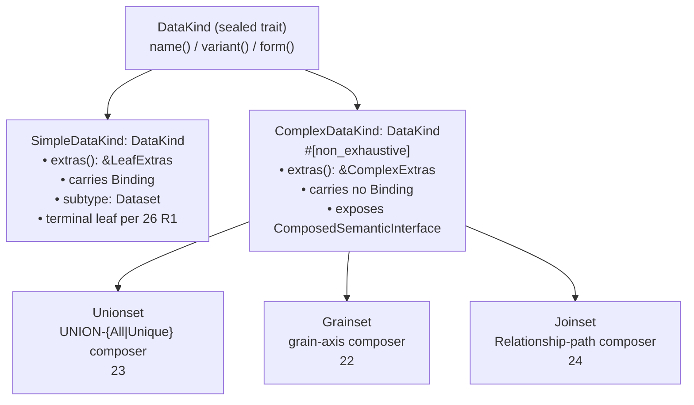

# 20. DataKind Taxonomy

> **Reconciliation.** The concrete per-variant Rust-struct / YAML-surface shape is ratified across:
>
> - [`../apis/32_semstrait_model.md §3`](../apis/32_semstrait_model.md) — top-level plural YAML tags; `DataKindBase<E>`; `DatasetBody` / `GrainsetBody` / `UnionsetBody` / `JoinsetBody`; `Public*` / `Nested*` concrete types; the **sealed `DataKind` trait hierarchy**; per-form view enums.
> - [`../apis/32_semstrait_model.md §4`](../apis/32_semstrait_model.md) — the `LeafExtras` / `ComplexExtras` shapes (the type-level expression of "leaf-only" for `catalog` / `storage` / `semantic_mapping`).
> - [`../foundations/18_entities.md`](../foundations/18_entities.md) — canonical entity types: `SemanticInterface`, `TemporalShape`, `SemanticMapping`, `Keys`, `AiContext`, `Relationship`.
> - [`26_nesting_matrix.md`](./26_nesting_matrix.md) — nesting rules R1 / R2 / R3.
> - [`../apis/32b_catalogs_yaml.md`](../apis/32b_catalogs_yaml.md) — `CatalogRef` grammar consumed via `extras.catalog:` (leaf-only).
>
> `20` retains authority for: the taxonomy (§2), the variant-level contract surface (§2.2), shared invariants (§4), the `Strategy` trait surface and dispatch contract (§5), the per-stage responsibility skeleton (§6), and the shared error-code roster (§8).

## 1. Purpose and Scope

`20` is the foundations-adjacent document that ratifies the **shared variant-level abstraction** sitting on top of `15`'s binding layer and `16`'s composition layer. It is the first document in the `data-kinds/` sub-tree; everything in `21`–`25` inherits from `20`'s invariants and refines them for one concrete variant or for a cross-variant matrix.

`20` does **not** ratify per-variant block shape (`12 §3`–`§5`), per-variant resolution algorithms (`21`–`24`), per-variant YAML surface (`32`), the `ComposedSemanticInterface` internals (`16 §5`), the `Relationship` block (`16 §2`), or SemanticManifest-layer struct rosters (`33`).

### 1.1 Guardrails — how `20` upholds `00 §9` invariants

| Invariant | Where `20` keeps it |
|---|---|
| **I5** — resolution is compile-time | Every variant's structural / reference / binding / composition work happens in `parse` / `validate` / `compile` per §6. Plan time sees only a ratified trait surface. |
| **I6** — `plan` is synchronous | The `Strategy` trait (§5.2) returns `Result<PlanNode, PlanError>` with no `async`. Strategy dispatch (§5.3) is a single `match` on `DataKindVariant`. |
| **I8** — SemanticManifest is planner-complete | Every per-variant field the planner needs is materialized by `compile` (§6.3). |
| **I10** — public sum types are `#[non_exhaustive]` | `DataKindVariant` and `DataKindForm` (per `32 §3.4`), the per-form view enums (per `32 §3.6`), and every `*_E_2xxx` error variant carry `#[non_exhaustive]`. The `ComplexDataKind` extension axis is itself non-exhaustive at the trait level. |
| **I12** — diagnostics carry stable codes | Every §8 entry has a `{SUBSYSTEM}_{SEVERITY}_{NUMBER}` code matching `30 §6.1`'s format; ranges are reserved per `30 §6.2`. |

I1 / I2 / I3 / I4 / I7 / I9 / I11 apply transitively — `20`'s surface exposes no raw SQL, no physical types, no engine identity, no I/O-at-plan, and sits at layer `2x` which only crates above the `1x` layer consume.

---

## 2. The `DataKind` Abstraction

### 2.1 `DataKind` as a sealed trait hierarchy

The `DataKind` abstraction is exposed as a **sealed trait hierarchy**, not a public sum type. Concrete types — `Dataset` plus the three composer variants `Grainset` / `Unionset` / `Joinset`, each in `Public*` and `Nested*` form — implement a base `DataKind` trait plus exactly one trait on each of two orthogonal axes:

- **Structural axis** — `SimpleDataKind` (leaf, carries `Binding`, owns `LeafExtras`) vs `ComplexDataKind` (composer, carries no `Binding` of its own, owns `ComplexExtras`). V1 subtypes: `SimpleDataKind` covers `Dataset` / `NestedDataset`; `ComplexDataKind` covers the three composer variants in both forms. The `ComplexDataKind` axis is `#[non_exhaustive]` per I10.
- **Behavioral axis** — `PublicDataKind` (top-level, queryable; exposes `description` / `ai_context` / `semantic_interface`) vs `NestedDataKind` (structural shell; body-only, no Public-form fields).

The sealed-trait declarations (`mod sealed`, base `DataKind`, the four sub-traits, the `DataKindVariant` / `DataKindForm` tag enums, and the per-form view enums for heterogeneous iteration) are ratified at [`32 §3.4`](../apis/32_semstrait_model.md). At the SemanticManifest layer (`33`), the same two-axis hierarchy appears as `ResolvedSimpleDataKind` / `ResolvedComplexDataKind`.

> **Phase 3 amendment (2026-05-28; cascade from CCK + C9.5).** [`../apis/33_semstrait_manifest.md §6`](../apis/33_semstrait_manifest.md) persists a **flat closed `DataKindVariant { Dataset, Unionset, Grainset, Joinset }`** that mirrors D9 (variant-to-strategy total mapping). `33` owns the manifest-resident `DataKind` primitive shape (id + name + role + origin + coverage + variant); `20` owns the canonical taxonomy and the sealed-trait authoring surface. The two are intentional duals: the model layer uses sealed traits for type-level discipline; the manifest layer uses a closed enum mirror for serialisation and id-keyed collection storage. Per C9.5, the manifest's `DataKind` carries an `origin: DataKindOrigin { Explicit, Implicit }` discriminator distinguishing author-declared kinds from compile-synthesised kinds (notably the multi-source-Dataset auto-Unionset of `21 §3.2` / `23 §2.1` row A). `Origin` is diagnostic-only; runtime semantics are identical across the two values.

#### 2.1.1 Diagram — the `DataKind` taxonomy tree

The behavioral axis (`PublicDataKind` / `NestedDataKind`) is orthogonal — every concrete leaf appears in two forms (Public top-level, Nested structural shell); the trait implementation matrix at `32 §3.5` is the canonical 8-row × 3-axis cross-product.



A concrete value implements exactly one of `SimpleDataKind` / `ComplexDataKind`, and exactly one of `PublicDataKind` / `NestedDataKind`.

### 2.2 Mandatory trait surface — what every DataKind variant exposes

The minimal trait every concrete variant exposes is the sealed `DataKind` trait plus exactly one trait on each of the two orthogonal axes (structural × behavioral). The full signatures are ratified at [`32 §3.4`](../apis/32_semstrait_model.md).

The contract surface is **read-only**:

- `name()` / `variant()` / `form()` on the base.
- `extras()` on each structural-axis trait — returns `&LeafExtras` on `SimpleDataKind`, `&ComplexExtras` on `ComplexDataKind` (per `32 §4`).
- `description()` / `ai_context()` / `semantic_interface()` on `PublicDataKind` only.
- `allowed_child_variants()` / `child_count()` / `children_ref()` on `ComplexDataKind`.

Pattern-matching on the variant tag is restricted to the planner's strategy-dispatch site (§5.3) and per-variant match arms inside `21`–`24`. Most generic planner / validator code consumes the trait, not the tag.

**Lifecycle hooks (validate / compile / strategy) live outside the trait hierarchy.** They are stage-owned operations on borrowed concrete types or `*Ref` view enums (`32 §3.6`):

- **Validate-stage hooks** at `10 §3` plus the `SR-E-*` rules in `18 §11` and per-variant rules in `22`–`24`.
- **Compile-stage hooks** at `15 §10` (Simple) and `16 §5` / `§10.1` (Complex).
- **Strategy dispatch** at `34` and the four per-variant strategies in `21`–`24`.

What the contract surface does **not** carry: no `Binding` accessor on `ComplexDataKind`; no `CompositionKind` accessor on `SimpleDataKind`; no Public-form fields on `NestedDataKind`-implementing types; no runtime `NestingCapability` flag struct (the legality matrix is `26 §1`'s table, type-level enforced via per-`*Body` child-vector field sets at `32 §3.2`).

### 2.3 Simple vs Complex — the leaf-vs-composer split

#### 2.3.1 `Binding` lives on `SimpleDataKind` exactly

> **Invariant D1 — single-binding-on-Simple.** A `Binding` may appear in the `SemanticModel` at exactly one position: the `binding:` field of a `SimpleDataKind`. A `ComplexDataKind` YAML block containing a `binding:` key is a structural error (`VALID_E_2001 BindingOnComplex`).

This is the type-level reason `Binding` is reachable only from `SimpleDataKind`-implementing concrete types per `32 §3.4` — `ComplexDataKind` has no `binding()` method by design.

#### 2.3.2 Interface exposure — bare vs composed

Per `00 §4.1`:

- `Simple` exposes a **bare** `SemanticInterface` — the set of `Semantics` declared directly on the leaf (per `11 §6`).
- `Complex` exposes a **`ComposedSemanticInterface`** — the unified view of constituents (`16 §5`).

`ComposedSemanticInterface` is structurally distinct from `SemanticInterface` (`16 §5.1`); both implement a `SemanticsView` trait. The model-layer `PublicDataKind::semantic_interface()` accessor returns `&SemanticInterface` for every Public variant; the variant-specific composed-interface materialization is a SemanticManifest-layer concept produced at compile per `16 §5` / `§10.1`.

> **Phase 3 amendment (2026-05-28; cascade from C7.4 + C8.2).** The persistence contract in [`../apis/33_semstrait_manifest.md`](../apis/33_semstrait_manifest.md) carries **coverage primitives only** for Complex variants — per-Joinset-hop `hop_coverage`, per-Grainset-level `level_coverage`, per-Unionset-branch `branch_coverage`, plus the universal top-level `coverage: SemanticBitmask` (CCK.1). The composed `ComposedSemanticInterface` (`UnifiedSemantics` + `FieldProvenance` + `CompositionCoverage`) is **not** persisted; `SemanticGraph` synthesises it at build time from the manifest's primitives. Spec `20`'s D5 invariant remains canonical at the taxonomy level — Complex variants conceptually expose a `ComposedSemanticInterface` — but the materialisation site is graph build, not manifest load. See `33 §6.6` (Grainset variant) and `33 §6.7` (Joinset variant) for the cascaded notes.

#### 2.3.3 Composer-without-own-Semantics rule

Per `11 §2` / `11 §10`, nested DataKinds do **not** declare their own Semantics; only the top-level DataKind's interface is authoritative. A nested `ComplexDataKind` (e.g. a `NestedUnionset` inside a `Grainset` body) implements `NestedDataKind`, not `PublicDataKind` — it has no `semantic_interface()` accessor; the access path is through its parent's composed interface.

---

## 3. The Four Variants at a Glance

| Aspect | `Simple` / Dataset (`21`) | `Unionset` (`23`) | `Grainset` (`22`) | `Joinset` (`24`) |
|---|---|---|---|---|
| **Composes children?** | No — terminal leaf per `26 §1` (R1). | Yes — ≥ 2 branches per `26 §1` (R3). | Yes — ≥ 2 levels per `26 §1` (R3). | Yes — exactly 2 members in v1 per `12 §5.3` (N-ary deferred as `TD-NESTING-NARY-JOIN`). |
| **Carries own `Binding`?** | Yes — exactly one, per `15 §2.1` / `§2.3.1`. | No — aggregates branch Bindings. | No — aggregates per-level child Bindings. | No — aggregates member Bindings. |
| **Interface exposed** | `SemanticInterface` (bare). | `ComposedSemanticInterface` with `CompositionKind::Unionset` (`16 §5`). | `ComposedSemanticInterface` with `CompositionKind::Grainset`. | `ComposedSemanticInterface` with `CompositionKind::Joinset`. |
| **Grain-aware at resolution?** | No — fixed grain per source. | No — union over branches at the branch's own grain. | **Yes** — level selection is grain-driven (`22 §*` / `13 §*`). | No — join semantics are grain-agnostic at the Joinset level. |
| **Uses declared `Relationship`s?** | No. | No — branches are unioned. | No — levels are grain-stacked. | **Yes** — `path:` references a declared `Relationship`; mandatory from `16 §9` for cross-Relationship spans. |
| **Request fan-out rule** | 1:1 — one `Scan` per PhysicalSource (`15 §3`). | 1:N union branches `UNION ALL`-ed per `23 §*`. | 1:1 level selection — one Request resolves to one level's child subtree. | 1:1 join — one Request resolves to one join tree over the members on the `path:`. |
| **Coverage model** | Binding-level `Coverage` (`15 §6`). | Composition-level `CompositionCoverage` (`16 §8`) with NULL-fill for gaps. | Composition-level `CompositionCoverage` with per-level coverage folding. | Composition-level `CompositionCoverage` with join-path provenance. |
| **TemporalShape interaction** | Shape declared inline (`00 §4.1` / `17`). | Branches may have heterogeneous shapes; planner advisories per `17 §*`. | Shape-gated level eligibility per `17 §*`. | `AsOf` join variant gated on `TemporalShape` (currently DEFERRED). |
| **Same-variant self-nesting** | N/A. | Banned (`26 §1` R2). | Banned. | Banned. |
| **Materialization in SemanticManifest** | `ResolvedSimpleDataKind` with `ResolvedBinding` (`15 §10`). | `ResolvedComplexDataKind` with composed interface (`16 §10.1`). | Same. | Same — Joinset is **explicit** composition (`16 §9`). |
| **Strategy (§5)** | `SimpleStrategy` (`21`). | `UnionsetStrategy` (`23`). | `GrainsetStrategy` (`22`). | `JoinsetStrategy` (`24`). |

---

## 4. Shared Invariants

The invariants below hold for every DataKind variant. D1 was ratified in §2.3.1.

### 4.1 Naming

> **Invariant D2 — global identity of DataKind names.** A top-level DataKind's name is globally unique within the Model's Root scope (`11 §2` / `11 §3`). No two top-level DataKinds may share a name. Nested DataKinds bear structural labels per `11 §10.3`; structural labels are NOT DataKind names.

Names follow the ASCII-only identifier grammar in `11 §4`. The Request-side `from:` field references a top-level DataKind by this global name; field-first resolution (`16 §11`) ignores structural labels.

### 4.2 Lifecycle — shared stage skeleton

Every variant participates in the six-stage pipeline ratified in `10 §2`:

| Stage | Shared responsibility | Per-variant specialization |
|---|---|---|
| `parse` | Parser recognizes the variant's YAML discriminator (`datasets:` / `unionsets:` / `grainsets:` / `joinsets:`) and emits a `SemanticModel` node tagged with the variant. | Per-variant YAML shape (`12 §3`–`§5`); per-variant `ParseError`s in `PARSE_E_02xx` (`30 §6.2`). |
| `validate` | Validator dispatches per-variant structural rules (per `10 §3`). Variant-independent Preconditions run in parallel with variant-specific ones; diagnostics accumulate per `10 §5`. | `26 §1`, `26 §2.3`, and every variant-specific rule in `21`–`24`. |
| `compile` | Compiler runs per-variant resolution: Simple per `15 §10`; Complex constituent-resolution + composed-interface synthesis per `16 §5` / `§6` / `§10.1`. Produces `ResolvedSimpleDataKind` / `ResolvedComplexDataKind` and registers in `DataKindIndex` (`33`). | Simple resolves a single Binding; Unionset folds branch coverage; Grainset folds per-level coverage; Joinset walks declared path and synthesizes a materialized composed surface. |
| `plan` | Strategy dispatch (§5.3) → `Strategy::resolve` → result splicing into `SemanticPlan`. Synchronous (I6); no I/O (I11). | Per-variant `Strategy::resolve` algorithm in `21`–`24`. |
| `optimize` | Variant-agnostic — rules declared at `PlanNode` level (`10 §5.4`). | None. |
| `adapt` | Variant-agnostic — adapter lowers `PlanNode` to `EngineArtifact` (`10 §5.5`). | None. |

> **Invariant D3 — every DataKind variant owns a compile-time materialization.** By the end of `compile`, every top-level DataKind in the input `SemanticModel` has produced a corresponding `ResolvedDataKind` in the SemanticManifest.

### 4.3 Coverage surface

| Variant | Coverage layer | Source |
|---|---|---|
| `Simple` | Binding-level `Coverage` (`Native` / `NullFill` / `Derived` / `Metadata`). | `15 §6`. |
| `Unionset` / `Grainset` / `Joinset` | Composition-level `CompositionCoverage` keyed by `(ConstituentRef, SemanticsName)`. | `16 §8`. |

> **Invariant D4 — coverage is always present.** Every `ResolvedDataKind` carries a coverage surface. A `ResolvedDataKind` with no coverage surface is malformed — `COMP_E_2005 MissingCoverage`.

> **Phase 3 amendment (2026-05-28; cascade from CCK.1).** The manifest-resident realization of D4 is the universal top-level `coverage: SemanticBitmask` field on every `DataKind` per [`../apis/33_semstrait_manifest.md §6.1`](../apis/33_semstrait_manifest.md). `33` owns the persisted shape (id-keyed `data_kinds: BTreeMap<DataKindId, DataKind>` plus per-variant local coverage masks on `DataKindVariant`); `20` owns the canonical taxonomy and the coverage-always-present invariant. The persisted `coverage` is the union view; per-constituent `*Bitmask` (e.g., `branch_coverage`, `level_coverage`, `hop_coverage`) live on the variant struct per CCK.3.

### 4.4 Interface exposure

> **Invariant D5 — `Simple` exposes `SemanticInterface`; every `Complex` variant exposes `ComposedSemanticInterface`** at the SemanticManifest layer. The mapping is variant-determined and irrevocable.

Request-side field-first resolution (`16 §11`) may form an implicit `ComposedSemanticInterface` **at plan time** when a Request's Semantics span multiple top-level DataKinds connected by declared `Relationship`s. This is plan-time synthesis, not a DataKind-level interface exposure.

### 4.5 Grain posture

> **Invariant D6 — `Grain`-awareness is a per-variant property.** `Simple` / `Unionset` / `Joinset` are **not grain-aware** at the DataKind level — they carry their constituents' intrinsic grain without rollup. `Grainset` **is grain-aware** — it stacks the same logical DataKind across multiple `Grain` levels, and its `Strategy` selects a level at plan time.

`TemporalShape` (`17`) constrains grain-rollup legality on each variant; `17` is the ratifying doc.

### 4.6 Nesting rules

> **Invariant D7 — nesting legality is exclusively ratified by `26 §1`'s matrix.** Each `*Body`'s child-vector field set (`32 §3.2`) is the type-level projection of that matrix's row.

Same-variant self-nesting is banned (`26 §1` R2). `Simple` never nests children (`26 §1` R1); `DatasetBody` (`32 §3.2`) has no child-vector fields.

### 4.7 Additivity coupling

> **Invariant D8 — `Additivity` shape-locks across all occurrences of a `Semantics` name** per `11 §7`. A Measure named `revenue` declared on two different top-level DataKinds must carry the same `Additivity` value. `ComposedSemanticInterface` of a Complex variant inherits constituents' `Additivity` per `16 §8.3`.

`17`'s `TemporalShape × Additivity` advisory warnings are orthogonal — see `11 §7` and `17 §*`.

---

## 5. Construction / Resolution Strategy — the Strategy Taxonomy

### 5.1 Strategy-per-variant principle

| Variant | Strategy | Authoritative doc |
|---|---|---|
| `Simple` | `SimpleStrategy` | `21 §*` |
| `Grainset` | `GrainsetStrategy` | `22 §*` |
| `Unionset` | `UnionsetStrategy` | `23 §*` |
| `Joinset` | `JoinsetStrategy` | `24 §*` |

> **Invariant D9 — variant-to-strategy binding is total and exclusive.** Every ratified `DataKind` variant maps to exactly one `Strategy` type. No `UnionsetOrGrainsetStrategy`, no `CompositeStrategy`.

The current codebase names the trait `DataKindPlanner` and the registry `DataKindPlannerRegistry`; the rename to `Strategy` / `StrategyRegistry` is tracked in `implementation/40_refactor_plan.md` per I9.

### 5.2 Trait surface — `planner::Strategy`

`Strategy` lives in `semstrait-planner` (per `34`'s public surface); `20` ratifies its **shape**, not its concrete field names (which are `34`'s scope).

```rust
pub trait Strategy: Send + Sync {
    /// Resolve the given Request slice against this DataKind using the
    /// SemanticManifest. Returns the `PlanNode` subtree rooted at this DataKind.
    fn resolve(
        &self,
        manifest: &SemanticManifest,
        request: &RequestSlice,
        ctx: &mut PlannerCtx,
    ) -> Result<PlanNode, PlanError>;

    /// The strategy's human-readable name, for diagnostics.
    fn name(&self) -> &'static str;
}
```

Strategies are stateless once constructed; per-invocation state lives in `PlannerCtx`. No `async` (I6); no catalog calls, no filesystem calls, no expression re-compilation (I5, I11). A `UnionsetStrategy` (analogously `GrainsetStrategy`, `JoinsetStrategy`) resolves its own composed surface, then **recursively dispatches** into constituents via `ctx.strategy_registry.dispatch(child)`.

### 5.3 Dispatch mechanism at plan time

```rust
pub fn dispatch_strategy<'r>(
    kind: &ResolvedDataKind,
    registry: &'r StrategyRegistry,
) -> &'r dyn Strategy {
    match kind {
        ResolvedDataKind::Simple(_) => registry.simple(),
        ResolvedDataKind::Complex(ResolvedComplexDataKind::Unionset(_)) => {
            registry.unionset()
        }
        ResolvedDataKind::Complex(ResolvedComplexDataKind::Grainset(_)) => {
            registry.grainset()
        }
        ResolvedDataKind::Complex(ResolvedComplexDataKind::Joinset(_)) => {
            registry.joinset()
        }
        // Future `Complex` variants (I10) require a new arm here and a new
        // method on `StrategyRegistry`. The `#[non_exhaustive]` on
        // `ResolvedDataKind` / `ResolvedComplexDataKind` forces a match
        // arm to be added in a MINOR bump (`30 §2`).
    }
}
```

**Dispatch guarantees.**

- **O(1) per dispatch.** Each arm is a direct reference-returning branch. I6 hot-path safe.
- **One match site.** Every other planner site that needs a strategy consumes `&dyn Strategy` from this function.
- **`#[non_exhaustive]` discipline.** Adding a future `Complex` variant forces this match arm to be extended; no silent compile-time hole.
- **Strategy registry ownership.** The `StrategyRegistry` holds exactly one strategy per variant. Constructed at planner init, shared across requests (all strategies are `Send + Sync`).

`PLAN_E_2050 StrategyDispatchFailed` covers the "no strategy for this variant" case, which — given the `#[non_exhaustive]` compile-time check — should never fire for ratified variants. Reserved defensively for third-party extensions.

---

## 6. Lifecycle — Per-Stage Responsibilities (Shared Skeleton)

### 6.1 `parse` (stage 1)

Variant discriminator recognition only. Per-variant YAML surface in `32` + per-variant docs. Per-variant `ParseError`s in `PARSE_E_02xx` per `30 §6.2`. No `20`-scope codes.

### 6.2 `validate` (stage 2)

**Shared responsibility (`20`):** Structural checks that apply to every variant:

- `26 §1`'s nesting matrix (enforcement is `26`'s; type-level projection at `32 §3.2`).
- §2.3's Invariant D1 — no `binding:` key on any `ComplexDataKind`.
- §4.1's Invariant D2 — top-level DataKind name global uniqueness.
- §4.4's Invariant D5 — interface-type match to variant (manifest layer).

Diagnostics accumulate per `10 §5`'s fail-accumulate policy.

**Per-variant responsibility (`21`–`24`):** Per-variant structural Preconditions — Unionset's "≥2 children" (`12 §3.2`), Grainset's coarsest-first ordering (`12 §4.2`), Joinset's binary-v1 arity (`12 §5.3`), and each variant's block-shape rules.

**`20`-scope error codes:** `VALID_E_2000`–`VALID_E_2029` — see §8.2.

### 6.3 `compile` (stage 3)

**Shared responsibility (`20`):**

- Dispatch per-variant resolution in dependency order (children before parents per `10 §4.3`).
- For `Simple`: delegate to `15 §10`'s Binding resolution flow.
- For `Complex`: produce a `ResolvedComplexDataKind` carrying (a) resolved constituent references, (b) synthesized `ComposedSemanticInterface` per `16 §5` / `§6` / `§7` / `§8`, (c) composition-level `FieldProvenance` / `CompositionCoverage` records.
- Fail fast on first error per `10 §4.4`.
- Register the resolved DataKind in the SemanticManifest's `DataKindIndex` (`33 §*`).

**Per-variant responsibility (`21`–`24`):** `Simple` (`21`) — single-Binding resolution; `Unionset` (`23`) — branch-by-branch resolution + `CompositionCoverage` fold; `Grainset` (`22`) — per-level resolution + temporal-shape interaction; `Joinset` (`24`) — member Binding resolution + path validation against `Relationship` graph (`16 §2`) + materialized-surface synthesis.

**`20`-scope error codes:** `COMP_E_2000`–`COMP_E_2029` — see §8.2. Notably `COMP_E_2005 MissingCoverage` (D4) and `COMP_E_2010 StrategyBindingUnresolved`.

`compile`'s depth-first traversal is deterministic per I4 — siblings processed in YAML-declaration order; the `DataKindIndex` is populated in the same order.

### 6.4 `plan` (stage 4)

**Shared responsibility (`20`):**

1. Field-first resolution (`16 §11`) locates the top-level DataKind owning each requested field.
2. Strategy dispatch (§5.3) returns `&dyn Strategy`.
3. `Strategy::resolve(manifest, request_slice, ctx)` returns the `PlanNode` subtree.
4. Result splicing into the overall `SemanticPlan`.

All four steps synchronous (I6); no I/O (I11).

**Per-variant responsibility (`21`–`24`):** The per-variant algorithm inside `Strategy::resolve`.

**`20`-scope error codes:** `PLAN_E_2040`–`PLAN_E_2069` — see §8.2.

### 6.5 `optimize` / `adapt` (stages 5–6)

No `20`-scope responsibility. Both stages operate at the `PlanNode` level (`10 §5.4` / `§5.5`) and are variant-agnostic.

---

## 7. Applicability Cross-Cuts

Forward-pointer to [`25_applicability_matrix.md`](./25_applicability_matrix.md) — the full cross-cut of "which foundation rule applies to which DataKind variant." Each row in `25` is a foundation rule (`10`–`17`); each column is a DataKind variant; cells are `always` / `conditional` / `n/a`.

---

## 8. Error-Code Roster

### 8.1 Allocation summary

| Range | Scope | Doc |
|---|---|---|
| `*_E_2000`–`*_E_2099` | shared across all DataKind variants | `20` (this doc) |
| `*_E_2100`–`*_E_2199` | `SimpleDataKind` / Dataset | `21` |
| `*_E_2200`–`*_E_2299` | `Grainset` | `22` |
| `*_E_2300`–`*_E_2399` | `Unionset` | `23` |
| `*_E_2400`–`*_E_2499` | `Joinset` | `24` |
| `*_E_2500`–`*_E_2599` | applicability matrix / cross-variant planner | `25` |
| `*_E_2600`–`*_E_2699` | reserved for future `Complex` variants per I10 | — |

> **Cross-doc fix CDF-30-01.** `30 §6.2`'s current `VALID_E` / `COMP_E` / `PLAN_E` subsystem caps stop below `2000`. Each must be extended to include a reserved `2000`–`2999` band labeled "data-kinds taxonomy block (`20`–`25`)", with `2000`–`2599` allocated per the table above. MINOR per `30 §2`. Tracked here pending the `30 §6.2` table update.

The subsystem prefix (`*`) depends on the stage the diagnostic surfaces at; see §8.2.

### 8.2 `20`-scope error codes (the `*_E_2000`–`*_E_2099` block)

Every code follows `{SUBSYSTEM}_{SEVERITY}_{NUMBER}` per `30 §6.1`. Variants are `#[non_exhaustive]` per I10.

#### `VALID_E_20xx` — shared structural validation (validate stage)

| Code | Variant | Meaning |
|---|---|---|
| `VALID_E_2000` | `DataKindNameCollision` | Two top-level DataKinds share the same name. Violates D2 (§4.1). |
| `VALID_E_2001` | `BindingOnComplex` | A `ComplexDataKind` YAML block carries a `binding:` key. Violates D1 (§2.3.1). |
| `VALID_E_2002` | `InterfaceTypeMismatch` | At the SemanticManifest layer, a `ResolvedComplexDataKind` produced a bare `SemanticInterface` or vice versa. Violates D5 (§4.4). |
| `VALID_E_2003` | _(reserved — formerly `NestingCapabilityInconsistent`; retired with the runtime capability struct)_ | Reserved against future use. |
| `VALID_E_2004` | `StructuralLabelCollision` | Two sibling nested DataKinds share a structural label under the same parent (`11 §10.3`). |
| `VALID_E_2005` | `DataKindNameReserved` | A DataKind's name shadows a reserved identifier. Reserved against `11 §4`'s future expansion. |

#### `COMP_E_20xx` — shared compile-time errors

| Code | Variant | Meaning |
|---|---|---|
| `COMP_E_2000` | `DataKindCompileFailed` | Generic wrapper when a variant's compile path returns an error without a more-specific subsystem code. |
| `COMP_E_2001` | `DataKindTraversalOrderInvalid` | Compile's depth-first traversal hit a DataKind whose children were not yet resolved. Should never fire for ratified content. |
| `COMP_E_2005` | `MissingCoverage` | A `ResolvedDataKind` attempted to enter the SemanticManifest without a coverage surface. Violates D4 (§4.3). |
| `COMP_E_2010` | `StrategyBindingUnresolved` | A variant's strategy was invoked against a `ResolvedDataKind` whose required resolution data is missing (e.g. a Simple with `ResolvedBinding::None` or a Complex with empty constituent list). |
| `COMP_E_2015` | `InterfaceSynthesisFailed` | For a `ComplexDataKind`, the synthesized `ComposedSemanticInterface` could not be produced. `16 §14` owns specific COMP_E_04xx codes; `2015` is the variant-boundary wrapper. |
| `COMP_E_2020` | `DataKindIndexConflict` | Populating `DataKindIndex` found a conflict — two `ResolvedDataKind`s resolved to the same index key. Should be caught earlier by `VALID_E_2000`. |

#### `PLAN_E_20xx` — shared plan-time errors

| Code | Variant | Meaning |
|---|---|---|
| `PLAN_E_2040` | `DataKindNotInSemanticManifest` | Field-first resolution or explicit `Request.from` named a DataKind not in `DataKindIndex`. |
| `PLAN_E_2050` | `StrategyDispatchFailed` | The strategy registry produced no `Strategy` for a variant. Reserved defensively (the `#[non_exhaustive]` match in §5.3 makes this fire only for third-party `Complex` variants without registered strategies). |
| `PLAN_E_2051` | `StrategyMissingForVariant` | A ratified variant has no registered `Strategy`. Planner init bug. |
| `PLAN_E_2052` | `SemanticManifestIndexInconsistent` | During dispatch, `DataKindIndex` returned a `ResolvedDataKind` whose variant tag disagrees with its inner content. Should not fire for ratified content. |

**Reserved `20`-scope codes:** `VALID_E_2010`–`2029`, `COMP_E_2030`–`2049`, `PLAN_E_2060`–`2099`.

### 8.3 Per-variant sub-range allocations (`21`–`25`)

Each of `21`–`25` owns a 100-code sub-range. Within each, authors follow `30 §6.4`'s discipline.

| Sub-range | Recommended sub-structure per variant |
|---|---|
| `2100`–`2129` (`21` Simple) | `VALID_E_21xx` block-shape; `COMP_E_21xx` per-Simple Binding checks; `PLAN_E_21xx` per-Simple Strategy failures. |
| `2200`–`2229` (`22` Grainset) | `VALID_E_22xx` level ordering, grain axis match; `COMP_E_22xx` per-level coverage folding; `PLAN_E_22xx` level-selection failure. |
| `2300`–`2329` (`23` Unionset) | `VALID_E_23xx` branch well-formedness; `COMP_E_23xx` branch coverage folding, NULL-fill typing; `PLAN_E_23xx` branch-selection failure. |
| `2400`–`2429` (`24` Joinset) | `VALID_E_24xx` binary-v1, path well-formedness, relationship cross-check; `COMP_E_24xx` anchor resolution, materialized surface synthesis; `PLAN_E_24xx` join assembly failure. |
| `2500`–`2529` (`25` applicability matrix) | `PLAN_E_25xx` cross-variant planner failures surfaced only at the matrix level. |

Each variant's reserved 100-code sub-range has a further-reserved tail (70 codes) against future growth.

---

Open questions (`Q-KIND-001`..`004`) are tracked in [`questions/open/20_questions.md`](../questions/open/20_questions.md).

**End of `20_taxonomy.md`.**
