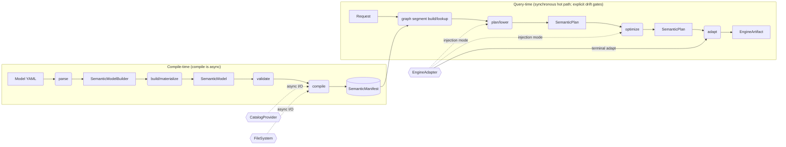
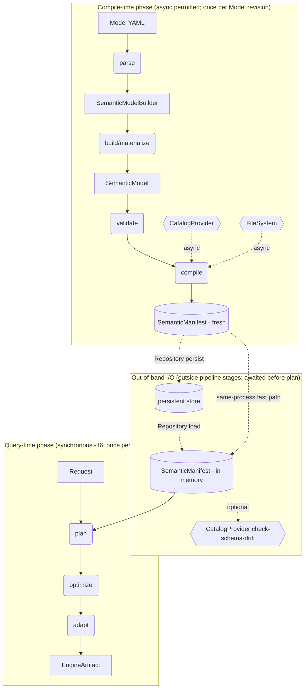

# 10. Resolution Pipeline — Per-Stage Contract

> **Note.** Root-shape authoritative spec: [`../apis/32_semstrait_model.md`](../apis/32_semstrait_model.md) + [`../data-kinds/26_nesting_matrix.md`](../data-kinds/26_nesting_matrix.md) + [`../apis/32b_catalogs_yaml.md`](../apis/32b_catalogs_yaml.md). This document predates that spec and is pending refactor.

## 1. Purpose and Scope

This document ratifies the per-stage contract of the canonical pipeline shown in `00_overview.md §5`. For each verb (`parse`, `validate`, `compile`, `plan`, `optimize`, `adapt`) it specifies:

- input type and output type (by vocabulary name — structural shapes live in 11–17 / 20–25 / 31–37),
- which `00` invariants it upholds,
- which typed-error enum carries its failures,
- which I/O surfaces (if any) it is permitted to touch,
- its sync/async posture,
- the forward-reference doc that ratifies its structural detail.

`10` does **not** re-specify concept shapes (those live in the foundations and data-kind docs) and does **not** specify per-crate public surface (that lives in the `3x` API docs). It is the contract matrix that ties the pipeline to the vocabulary.

**Two canonical data types bracket compile-time** (00 §4.1 `SemanticModel`, `SemanticManifest`):

- `SemanticModel` — post-parse, in-memory, typed.
- `SemanticManifest` — post-compile, planner-complete, denormalized.

No intermediate `ResolvedModel` type exists; all resolution-type work (name lookup, catalog metadata fetch, glob expansion, Relationship resolution, `ExprSource` → `Expr` compilation, index construction) happens inside `compile`. The word *resolve* is retained as descriptive English ("compile resolves references") and as the `Resolved*` type-name prefix for manifest-layer types that diverge structurally from model-layer counterparts (00 §4.1 naming note); it is no longer a top-level pipeline verb.

**`emit` is not a pipeline stage.** Per `00 §4.2`, `emit` is the name for the SQL-specific form `adapt` takes when the adapter is SQL-emitting (producing `SqlArtifact`). It is a vocabulary-level handle for SQL-emission specifics in `36`, not a distinct stage downstream of `adapt`. The pipeline terminates at `adapt`.

**Out of scope for this doc:**

- structural layouts of inputs/outputs (`SemanticModel`, `SemanticManifest`, `SemanticPlan`, `EngineArtifact`) — see 11–17, 33, 35,
- planner strategy dispatch per DataKind variant — see 20–25,
- adapter implementation specifics per engine — see 36,
- public crate API shape — see 31–39.

## 2. Stage Index

Six stages. Compile-time = `parse`, `validate`, `compile`. Query-time = `plan`, `optimize`, `adapt`.

| # | Stage | Input | Output | Owner (forward-ref) |
|---|---|---|---|---|
| 1 | `parse` | YAML bytes | `SemanticModelBuilder` | 32 |
| 2 | `validate` | `&SemanticModel` | `Result<(), Vec<ValidateError>>` (pure predicate) | 32 |
| 3 | `compile` | `SemanticModel` + `CatalogProvider` + `FileSystem` | `SemanticManifest` | 33 (orchestrator), 37 (metadata), 32 (AST source) |
| 4 | `plan` | `&SemanticManifest` + `Request` + planner graph-runtime context (segment store/builder/drift policy) + optional injected `EngineAdapter` hooks | `SemanticPlan` | 34 |
| 5 | `optimize` | `SemanticPlan` + optional injected `EngineAdapter` hooks | `SemanticPlan` | 34 |
| 6 | `adapt` | `SemanticPlan` | `EngineArtifact` (`Sql(SqlArtifact)` via `emit` sub-form, or `Plan(EnginePlan)`) | 36 |



**Notes on the diagram.**

- `parse` returns `SemanticModelBuilder`; builder materialization (`.build()`) yields `SemanticModel`. `validate` borrows that model and returns `Result<(), Vec<ValidateError>>` (pure predicate, no new type). The `V → C` edge represents pipeline ordering (validation-passed precedes compile), not a data transformation.
- `CatalogProvider` and `FileSystem` are hexagons (traits per 00 §7.2 legend) and appear as dashed async-I/O dependencies on `compile` only — no other stage touches them.
- Query-time graph handling is explicit: planner may build/reuse graph segments from manifest seeds before lowering to a `SemanticPlan`.
- `EngineAdapter` has two arrow styles: dashed (injection mode — optional, replaces canonical choices in `plan`/`optimize` for near-canonical engines) and solid (terminal — every adapter owns `adapt`).
- Two I/O entry points from §6 are **not** on this diagram because they are outside the pipeline stages; see the phase-boundary diagram in §7.

## 3. Per-Stage Contract

### 3.0 Stage template

Every subsection in §3 uses this fixed template. Fields are authoritative for the stage; any deviation must be flagged and resolved in that stage's subsection, not elsewhere.

- **Purpose** — one sentence, imperative.
- **Input** — vocabulary-name type (forward-ref doc).
- **Output** — vocabulary-name type (forward-ref doc).
- **Owning crate** — the crate implementing the stage's entry point (see §4 for the layering rule).
- **Invariants upheld** — list of `00 §9` invariants this stage is directly responsible for maintaining. (Invariants merely not-violated but not upheld are omitted.)
- **Error type** — the typed Rust enum that carries this stage's failures. Convertible to `Diagnostic` at the nearest public API boundary (see §5).
- **Error policy** — `fail-fast` or `accumulate` (see §5).
- **I/O permitted** — explicit list of trait methods this stage is allowed to invoke. Everything not listed is forbidden. (Refines I11.)
- **Sync/async** — one of `sync`, `async`. Justification required for `async`. (Refines I6.)
- **EngineAdapter interaction** — whether this stage accepts injected adapter hooks, and which hooks.
- **Forward-refs** — docs that ratify structural detail produced or consumed here.

### 3.1 `parse`

- **Purpose** — Deserialize Model YAML text into an appendable `SemanticModelBuilder`.
- **Input** — YAML text (bytes or `&str`). A single-file Model (multi-file / include-directive support is deferred — §9).
- **Output** — `SemanticModelBuilder` (materialized to `SemanticModel` by `.build()` per `32`).
- **Owning crate** — `semstrait-model`.
- **Invariants upheld** —
  - Preserves `ExprSource` verbatim (inline DSL strings and declarative YAML blocks). `parse` does **not** compile expressions; the `ExprSource` → `Expr` transition is `compile`'s boundary (I1).
  - Does not perform any name resolution. Cross-references (between DataKinds, between Semantics, between Bindings and sources) remain as unresolved identifiers in the `SemanticModel` (prefigures I5).
- **Error type** — `ParseError`. Typical variant families (exact list ratified in `32`):
  - YAML syntax errors (malformed document, unexpected token, bad indentation).
  - Schema tag errors (unknown top-level key, unknown discriminator variant, invalid type tag).
  - Structural errors (duplicate declaration of a name within its scope, missing required field, wrong field shape).
- **Error policy** — `accumulate` (per §5).
- **I/O permitted** — none.
- **Sync/async** — `sync`.
- **EngineAdapter interaction** — none.
- **Forward-refs** — `32` (`SemanticModel` structural shape, `ParseError` variants), `14` (`ExprSource` surface forms).

### 3.2 `validate`

- **Purpose** — Run structural Preconditions over a `SemanticModel` and accumulate all violations.
- **Input** — `&SemanticModel` (borrowed; `validate` does not consume or mutate).
- **Output** — `Result<(), Vec<ValidateError>>`. Pure predicate; returns the same `SemanticModel` surface to the caller (the caller passes it to `compile`).
- **Owning crate** — `semstrait-model`. Preconditions are model-level rules, co-located with the Model spec that defines what a valid model is.
- **Invariants upheld** —
  - The `Precondition` framework (00 §4.1): every structural Precondition defined in the vocabulary is evaluated here. Catalog-dependent Preconditions (function-registry coverage checks that depend on resolved `CanonicalFn` identities, reference checks that require resolved Bindings) are **not** run here — they run inline during `compile`.
- **Error type** — `ValidateError`. Typical variant families (exact list ratified in `32`):
  - Disallowed nesting (violates `12`'s container-in-container matrix).
  - Missing mandatory field (structural Precondition).
  - Arity violation (e.g. a `Joinset` with fewer than the required number of constituents, a `Grainset` with an empty grain set).
  - Malformed reference (a syntactically invalid identifier, independent of whether the target exists).
  - Shape-incompatible declarations (e.g. `SCD` subtype mismatched with supplied temporal columns — structural aspects only, gated by `17`).
  - Relationship well-formedness (Relationship block's structural shape, independent of target existence — gated by `16`).
- **Error policy** — `accumulate`. Batch-reporting every Precondition failure is the whole point of the pass.
- **I/O permitted** — none.
- **Sync/async** — `sync`.
- **EngineAdapter interaction** — none.
- **Forward-refs** — `32` (`ValidateError` variants, Precondition catalog), `11` (reference well-formedness rules), `12` (nesting matrix), `16` (Relationship structural rules), `17` (shape-gated structural rules).

### 3.3 `compile`

- **Purpose** — Produce a planner-complete lightweight `SemanticManifest` from a validated `SemanticModel`, performing semantic resolution, catalog fetching, expression-seed compilation, and index construction in a single pass.
- **Input** — owned `SemanticModel` + `impl CatalogProvider` + `impl FileSystem`. (The caller has already invoked `validate`; `compile` does not re-run structural Preconditions.)
- **Output** — `SemanticManifest` (structural shape ratified in `33`).
- **Owning crate** — `semstrait-manifest` (orchestrator) + `semstrait-catalog` (metadata I/O) + `semstrait-model` (AST source).
- **Work subsumed** — this is the work that would have been split across a separate `resolve` stage and a downstream `compile` stage in an engine-style pipeline; here it is a single coherent pass:
  1. Name resolution — lexical scope traversal, reference expansion, alias expansion across DataKinds, Semantics, Bindings, and Relationships (I5).
  2. Catalog metadata fetch — via `CatalogProvider` for each Binding's declared source: schema (columns + types), catalog-supplied metadata.
  3. `FileSystem` glob expansion — a single declared Binding pattern can resolve to **one or more** `PhysicalSource`s (00 §4.1 `PhysicalSource`).
  4. Reference-level Preconditions — function-registry coverage (every `CanonicalFn` used exists in the registry with compatible arity and argument types), target existence (every referenced DataKind / Semantics / source / column actually exists in the resolved context).
  5. `ExprSource` → semantic-expression seed compilation — using the `FunctionRegistry` for function identity, resolved name scope for semantic references, and resolved schema for declared/inferred typing metadata (I1 boundary).
  6. Relationship graph resolution — resolving the top-level `Relationship` block's endpoints, validating `Cardinality`, preparing the graph for `ComposedSemanticInterface` construction (I5, `16`).
  7. `TemporalShape` resolution — binding shape-specific columns (`valid_from`, `valid_to`, `occurred_at`, `snapshotted_at`, …) to physical columns; shape-gated resolution rules (`17`).
  8. SemanticManifest index construction — name registries, coverage masks, path-hash indices, relation adjacency, provider/source reverse lookup tables (I8).
  9. Denormalization and seed construction — manifest-layer seed/index types used for planner segment build (`33`), excluding persisted runtime graph objects.
- **Invariants upheld** —
  - I1 — the `ExprSource` → `Expr` boundary. After `compile`, no `ExprSource` survives into the SemanticManifest or anything downstream.
  - I4 — canonical IR only in the output (`Expr`, `DataType`, `CanonicalFn`).
  - I5 — semantic name/source/relationship resolution is performed here and captured as direct ids/seeds; planner does not reopen semantic name resolution.
  - I8 — the SemanticManifest is planner-complete for lookup and segment build; runtime graph lifecycle and cache policy are deferred to planner (`34`) by design.
  - I11 — all I/O is through the permitted provider traits (`CatalogProvider`, `FileSystem`), never direct filesystem or network calls.
- **Error type** — `CompileError`. Typical variant families (exact list ratified in `33`):
  - `UnresolvedReference` — a name reference did not resolve in its scope.
  - `AmbiguousReference` — multiple candidates matched a name reference.
  - `SourceNotFound` — a declared source (path or catalog entry) does not exist.
  - `CatalogUnavailable` — `CatalogProvider` returned an unrecoverable error.
  - `SchemaResolutionFailed` — catalog returned a schema incompatible with the Model's claims.
  - `GlobExpansionFailed` — `FileSystem` expansion produced zero matches, or failed to list.
  - `UnknownFunction` — an `ExprSource` referenced a function not in the `FunctionRegistry`.
  - `TypeInferenceFailure` — local type inference could not derive a type for a Semantics element (bare untyped `Null` at a Semantics boundary with no `data_type:` declared, unresolved column/entity ref, or an expression shape with no applicable inference rule). Semstrait does **not** validate cross-operand type compatibility — per `14 §5.4` operand / comparison / argument compatibility is deferred to the engine, not checked by compile.
  - `CircularRelationship` — Relationship graph contains a cycle of a kind disallowed by `16`.
  - `IndexBuildFailed` — invariant violated during SemanticManifest index construction (indicates a bug in the compile pass; should not arise from well-formed input).
- **Error policy** — `fail-fast`. Resolution, catalog I/O, and Expr compilation form dependency chains: continuing past a failure produces unreliable cascades (e.g. a downstream `TypeMismatch` caused by an earlier `UnresolvedReference` is not a real error, just noise).
- **I/O permitted** —
  - `CatalogProvider::*` — all methods (metadata fetch, schema lookup, catalog-specific metadata). Exact trait surface ratified in `37`.
  - `FileSystem::{list, read, exists}` — read-side only; no writes. `compile` never mutates external state.
  - `Repository` — forbidden (SemanticManifest persistence is the caller's concern, not a compile-time I/O entry).
- **Sync/async** — `async`. This is the pipeline's only async stage. All I/O via `CatalogProvider` and `FileSystem` is async; the orchestrator awaits everything before returning the `SemanticManifest`.
- **EngineAdapter interaction** — none. The adapter is a query-time concern; its injection points are at `plan` / `optimize` / `adapt`. `compile` does not know about engines.
- **Forward-refs** — `33` (`SemanticManifest` structural shape, `CompileError` variants, orchestration details), `37` (`CatalogProvider` and `FileSystem` trait surfaces), `11` (name resolution mechanics), `14` (`ExprSource` → `Expr` compilation rules, `FunctionRegistry`), `15` (compile-time `Binding`, `SemanticMapping`, `PhysicalSource` resolution), `16` (Relationship graph and `ComposedSemanticInterface` construction), `17` (`TemporalShape` resolution).

### 3.4 `plan`

- **Purpose** — Construct a canonical `SemanticPlan` from a `SemanticManifest` and a `Request` by composing planner runtime graph segments and lowering them to plan nodes.
- **Input** — `&SemanticManifest` + owned `Request` (which carries an embedded `SessionContext`). Optional injected `EngineAdapter` in **injection mode** (see §3.4.1 below).
- **Output** — `SemanticPlan` (structural shape ratified in `35`; strategy-specific construction rules in `20`–`25`; algorithm detail in `34`).
- **Owning crate** — `semstrait-planner`.
- **Sub-steps (contract level).** Enumerated; exact algorithms deferred to `34` and DataKind strategy docs.
  1. **Constraint check (pre-resolution, step 0).** `ConstraintValidator::check()` (per `11 §8.6`) runs first and fail-fast.
  2. **Request lookup and target resolution.** Resolve request semantics against manifest registries; perform explicit-`from` or field-first routing.
  3. **Segment key construction and cache lookup.** Build canonical `SegmentKey` and query planner segment store for exact or covering fragment.
  4. **Segment build on miss.** Build runtime graph fragment from manifest seeds, including semantic-expression realization for touched bindings.
  5. **Touched-source drift policy evaluation.** Apply `Strict` / `Warn` / `TrustManifest` to touched sources before segment admission/reuse.
  6. **Strategy dispatch and graph-to-plan lowering.** Dispatch DataKind strategy and lower graph fragment to canonical `PlanNode` tree.
  7. **Session materialization and assembly.** Materialize session-sensitive literals, then assemble final `SemanticPlan`.

- **Invariants upheld** —
  - I4 — canonical IR only in the output (`PlanNode`, `Expr`, `DataType`, `CanonicalFn`); no engine-specific types leak in.
  - I5 — planner performs only **Semantics lookup** via SemanticManifest indices; no name resolution, no scope walking. Any identifier unknown to the index is `PlanError::UnknownReference`.
  - I6 — synchronous; no `.await`.
  - I8 — operates from `SemanticManifest` seeds/indices plus planner runtime graph state; no YAML parsing or hidden re-resolution.
  - Determinism — given `(SemanticManifest, Request)`, `plan`'s output is deterministic. SessionContext-sourced values are materialized as concrete literals (§3.4 sub-step 6), so any non-determinism is bounded to the SessionContext supplied by the caller; the planner itself introduces none.
- **Error type** — `PlanError`. Typical variant families (exact list ratified in `34`):
  - `ConstraintViolation { entity, message }` — a `constraints:` block on a requested Measure / Metric rejected the Request (v1 realized carriers per `11 §8.4`). Single typed variant; the free-form `message` field encodes which rule (`one_of` / `none_of` / `all` / `allowed` / `prohibited`) fired. Typed enum fan-out per rule is deferred per `11 §8.7` (`[TD-CONSTRAINT-ERROR-FANOUT]`).
  - `UnknownReference` — a `Request`-side identifier (field, from, filter target) does not match any SemanticManifest index.
  - `AmbiguousFieldFirstResolution` — field-first resolution found multiple unrelated target DataKinds and the Relationship graph does not connect them.
  - `UnsupportedRequestShape` — the `Request` asks for a combination the strategy cannot satisfy (e.g. ordering over a Metric the target DataKind does not expose).
  - `StrategyDispatchFailed` — internal; indicates a bug in strategy dispatch (should not arise from well-formed inputs).
- **Error policy** — `fail-fast`.
- **I/O permitted** —
  - None on the synchronous hot path.
  - Explicit drift probes are allowed only through planner-gated policy entrypoints (`34`), never as hidden lookups in pure plan assembly.
- **Sync/async** — `sync`. I6 hot path.
- **EngineAdapter interaction** — see §3.4.1.
- **Forward-refs** — `34` (`PlanError` variants, algorithm detail, injection-hook exact method list), `35` (`SemanticPlan` and `PlanNode` shape), `20`–`25` (per-DataKind strategy detail), `16` (composition / field-first resolution detail), `36` (adapter injection-hook trait surface).

#### 3.4.1 EngineAdapter injection (plan phase)

`EngineAdapter` has two distinct interaction modes with the pipeline; `plan` (and `optimize`, §3.5.1) is where **injection mode** applies.

**Two adapter modes — shape class**:

- **Injection mode** (substrait-compatible and near-canonical engines). The adapter registers rewrite hooks that the planner invokes at defined extension points inside `plan` sub-step 4 (PlanNode construction) and at specific points inside `optimize` (§3.5.1). The hooks **replace** canonical default choices with engine-aware choices, still producing canonical IR (I4). Use cases: choosing a canonical plan shape that maps naturally to the target engine when several equivalent canonical shapes exist (e.g. preferring one of two semantically equivalent aggregate forms because the target engine handles it efficiently); rewriting one `CanonicalFn` into a semantically equivalent `CanonicalFn` that the target engine renders better; re-parenthesizing canonical expressions to match engine-preferred patterns. Shape class: **visitor-style rewriter** — the adapter implements a trait with node-typed extension methods that the planner/optimizer invoke at known points. Exact method list ratified in `36`.
- **Conversion mode** (non-canonical-compatible engines). The adapter does not register injection hooks; the canonical `SemanticPlan` is built unmodified, and the adapter's terminal `adapt` call (§3.6) converts the whole plan end-to-end — either to a structured `EnginePlan` (full plan rewrite) or to a `SqlArtifact` via the `emit` sub-form. Use case: DuckDB SQL emission, Spark SQL emission, a non-Substrait structured plan.

**Required vs optional**:

- Every `EngineAdapter` provides terminal `adapt` (§3.6). Required.
- Injection hooks are **optional**. A pure-conversion adapter contributes nothing during `plan`/`optimize`. A pure-injection adapter still needs `adapt` — in its case, `adapt` can be an identity or a thin wrapper (since the plan has already been adjusted during `plan`/`optimize`).
- An adapter MAY provide both: a partially-canonical plan via injection followed by a final conversion pass in `adapt`.

**Invariant contract for injected hooks**:

- Pure (no I/O).
- Typed (produce canonical IR output only — `PlanNode`, `Expr`, `DataType`; engine-native types are forbidden in the hook's output, per I4).
- Deterministic (same input → same output; hooks may not read `SessionContext` — it has already been materialized by sub-step 6 in an ordering sense, though in practice hooks at sub-step 4 run before materialization; hooks depending on session state indicate an adapter-design bug).

Detailed hook surface, extension-point list, and engine-facing adapter trait are ratified in `36`.

### 3.5 `optimize`

- **Purpose** — Apply rule-based rewrites to a `SemanticPlan`, producing a semantically equivalent but more efficient plan. In the initial design, this is a near-identity pass; the stage exists so the pipeline shape is stable and rewrite passes can be added without re-plumbing.
- **Input** — owned `SemanticPlan`. Optional injected `EngineAdapter` rewrite passes (see §3.5.1).
- **Output** — `SemanticPlan` (semantically equivalent to the input).
- **Owning crate** — `semstrait-planner`.
- **Initial-design scope.** The canonical pass registry is intentionally minimal — or empty — in the first milestone. The project focus is "logical plan first, SQL emission second"; rule-based optimization (constant folding, metadata-dimension substitution, predicate simplification, pass registration — see 00 §4.2 `optimize` row) is deferred to a later milestone. `optimize` is nonetheless a **mandatory named stage**: the canonical pipeline entry point always invokes it, even when the registry is empty. An identity pass is a valid state, not a bypass.
- **Invariants upheld** —
  - Semantic equivalence: for every pass `p`, `execute(optimize(plan))` produces the same result set as `execute(plan)`. This is a contract on every registered pass; `optimize` as a stage enforces it only by accepting passes that claim it.
  - I4 — canonical IR preservation: passes MUST produce canonical IR; passes that emit engine-specific types violate the contract and are forbidden.
  - I6 — synchronous; no `.await`.
  - Determinism: given the same `SemanticPlan` and pass registry, `optimize`'s output is deterministic.
- **Error type** — `OptimizeError`. Typical variant families (exact list ratified in `34`):
  - `PassFailed` — a registered pass returned an error (pass-specific payload preserved).
  - `InvalidRewrite` — a pass produced a structurally invalid `SemanticPlan` (internal; should not arise from a correctly-implemented pass).
- **Error policy** — `fail-fast`. A failing pass aborts `optimize`; the caller receives the error rather than a partially-optimized plan.
- **I/O permitted** — none directly. May call **injected** `EngineAdapter` rewrite passes per §3.5.1; those passes must be pure.
- **Sync/async** — `sync`. I6 hot path.
- **EngineAdapter interaction** — see §3.5.1.
- **Forward-refs** — `34` (`OptimizeError` variants, pass registry mechanics, initial canonical pass set when defined), `36` (adapter pass-registration surface), `35` (`SemanticPlan` invariants passes must preserve).

#### 3.5.1 EngineAdapter injection (optimize phase)

Adapter injection at `optimize` is shape-classified as **pass registration**. An adapter operating in injection mode (§3.4.1) may contribute zero or more rewrite passes to the optimizer's pass registry. These passes run after canonical passes in a documented order (ratified in `36`). Each adapter-registered pass obeys the same invariant contract as canonical passes: pure, deterministic, semantic-equivalence-preserving, canonical-IR-producing. Adapters in pure conversion mode do not register optimize passes.

### 3.6 `adapt`

- **Purpose** — Transform a `SemanticPlan` into an `EngineArtifact` that a specific engine can execute, producing either a structured plan (`EnginePlan`) or an emitted SQL text (`SqlArtifact`) as the adapter's implementation type dictates.
- **Input** — owned `SemanticPlan`.
- **Output** — `EngineArtifact = Sql(SqlArtifact) | Plan(EnginePlan)` (00 §4.1 `EngineArtifact`, `SqlArtifact`, `EnginePlan`).
- **Owning crate** — `semstrait-adapter`.
- **`emit` as sub-form.** `emit` (00 §4.2) is the name for `adapt`'s output when the adapter is SQL-emitting — it returns `EngineArtifact::Sql(SqlArtifact)`. `emit` is not a separate pipeline stage; it is the specialization of `adapt` for the SQL variant, kept as a named handle so SQL-emission specifics have an anchor in the adapter docs (`36`).
- **Variant choice.** The adapter implementation's type determines which `EngineArtifact` variant(s) it can produce:
  - Most adapters are **single-variant**: either always `Sql` (e.g. DuckDB, Spark SQL emitters) or always `Plan` (e.g. a pure Substrait adapter).
  - A **multi-variant** adapter is permitted: it may return `Sql` or `Plan` per call based on its own decision logic (e.g. Substrait for supported shapes, SQL fallback otherwise). Every adapter MUST produce at least one variant; the `Sql`-only and `Plan`-only cases are the common ones.
  - The caller chooses the adapter; the adapter choose the variant. 10 does not prescribe which adapter produces which variant — that is an adapter-implementation concern documented per-adapter in `36`.
- **Invariants upheld** —
  - I1 — no raw SQL in the canonical layer. SQL text is produced **only** inside `adapt` (in the `Sql` variant), at the adapter-to-engine boundary. The SemanticPlan input never contains SQL text.
  - I2 — physical types appear only inside the adapter (if at all). The `SemanticPlan` input uses canonical `DataType` only; any translation to engine-specific physical types happens inside `adapt` and is invisible to upstream layers.
  - I3 — engine-specific behavior is confined to the adapter. `adapt` is the one place engine identity drives code paths.
  - I4 — input is canonical IR; output is explicitly engine-targeted (the `EngineArtifact` boundary is where I4 stops applying).
  - I6 — synchronous; no `.await`.
- **Error type** — `AdaptError`. Typical variant families (exact list ratified in `36`):
  - `UnsupportedFeature` — the `SemanticPlan` uses a feature the target engine / adapter does not support (specific node kind, specific `CanonicalFn`, specific grain).
  - `DialectUnsupported` — for SQL adapters, the selected `DialectId` does not correspond to a known dialect.
  - `AdaptationFailed` — the adapter's internal transformation failed (pass-specific payload preserved).
  - `EmitFailed` — SQL text generation failed (`Sql` variant path).
- **Error policy** — `fail-fast`.
- **I/O permitted** — none. `adapt` is a pure transformation; network/filesystem I/O to the target engine is the caller's concern, **not** part of `adapt`.
- **Sync/async** — `sync`. I6 hot path.
- **EngineAdapter interaction** — this stage IS the adapter. There is no "injected" adapter here — the adapter owns the call. If the adapter also ran in injection mode during `plan` / `optimize`, the plan has already been shaped; `adapt` is either a thin wrapper (for near-canonical substrait-compatible adapters) or a full conversion/emission (for pure-conversion adapters).
- **Forward-refs** — `36` (`AdaptError` variants, per-adapter trait surface, `emit` SQL-specific rules, dialect handling, adapter classification), `35` (`EngineArtifact` shape).

## 4. Crate Ownership Matrix

This section cements the layering implied by §3's per-stage Owning-crate fields. It is the pipeline-level view of which crate is the entry point for which verb. Per-crate public surface is ratified in the `3x` docs.

| Stage | Owning crate | Role |
|---|---|---|
| `parse` | `semstrait-model` | owns the Model specification and YAML parsing |
| `validate` | `semstrait-model` | Preconditions are model-level rules, co-located with the Model spec; `validate` is a pure predicate over `SemanticModel` |
| `compile` | `semstrait-manifest` (orchestrator) + `semstrait-catalog` (metadata I/O) + `semstrait-model` (AST source) | produces the `SemanticManifest` from a validated `SemanticModel`: fetches catalog metadata, resolves references and names, expands globs, compiles `Expr`s, builds indices |
| `plan` | `semstrait-planner` | constructs the `SemanticPlan`; may call injected `EngineAdapter` hooks |
| `optimize` | `semstrait-planner` | canonical optimization passes; may call injected `EngineAdapter` hooks |
| `adapt` | `semstrait-adapter` | transforms `SemanticPlan` → `EngineArtifact`; `emit` is the SQL-specific form (`Sql(SqlArtifact)`) |

**Supporting crates (consumed across stages, not owners of any verb):**

- `semstrait-ir` — canonical representation types (`Expr`, `PlanNode`, `EngineArtifact`, etc.). Consumed by `compile`, `plan`, `optimize`, `adapt`.
- `semstrait-common` — **role pending ratification in `31_semstrait_common.md`**. Expected to be a shared-types crate for cross-cutting primitives (logical `DataType`, identifier types, shared error traits). `10` treats it as a supporting crate with no stage-ownership claim.

**Injection vs ownership.** `EngineAdapter` is owned by `semstrait-adapter` (for `adapt`) but can be **injected** into `semstrait-planner` to hook `plan` and `optimize` (for example, rewriting plan fragments for substrait-compatible engines that accept the canonical plan with minor adjustments, or for dialect-specific expression rewrites). This does not transfer ownership — the planner still owns the stage; the adapter contributes through the hook surface ratified in `36_semstrait_adapter.md`.

## 5. Error Model

Typed-kind diagnostics are mandatory across all stages (see `30` and `31`):

- each stage defines a typed `*ErrorKind` enum;
- diagnostics cross crate boundaries as `Diagnostic<K>` / `Diagnostics<K>`;
- kind-to-rendering behavior is carried by `Diagnose`;
- identity is by stage + variant type, not by global string-code tables.

`10` does not redefine `Diagnostic<K>` field layout; that contract lives in `31`/`30`.

**Error policy per stage.** Two policies exist. Each stage commits to exactly one in §3:

- **`accumulate`** — stage collects independent violations and returns all.
- **`fail-fast`** — stage returns the first fatal violation and stops.

Uniform policy across stages:

| Stage | Kind enum | Policy | Rationale |
|---|---|---|---|
| `parse` | `ParseErrorKind` | `accumulate` | syntax/schema issues are mostly independent |
| `validate` | `ValidateErrorKind` | `accumulate` | precondition checks are author-feedback oriented |
| `compile` | `CompileErrorKind` | `fail-fast` | resolution/I-O/type dependencies are chained |
| `plan` | `PlanErrorKind` | `fail-fast` | partial plans are semantically invalid |
| `optimize` | `OptimizeErrorKind` | `fail-fast` | rewrite pass chain expects valid plan state |
| `adapt` | `AdaptErrorKind` | `fail-fast` | artifact emission is atomic |

### 5.1 Boundary shape

For fail-fast stages, the canonical boundary shape is:

```rust
Result<
    (Output, Diagnostics<StageErrorKind>),
    (Diagnostic<StageErrorKind>, Diagnostics<StageErrorKind>),
>
```

For accumulate stages, the boundary may expose:

```rust
Result<Output, Diagnostics<StageErrorKind>>
```

Warnings and notes remain typed (`Diagnostic<StageErrorKind>`) and travel alongside success or failure per stage contract.

## 6. I/O Permission Matrix

This matrix refines `00 §9 I11`. Every cell is either a permitted trait method or `∅` (forbidden).

| Stage | `CatalogProvider` | `FileSystem` | `Repository` | `EngineAdapter` (injected) |
|---|---|---|---|---|
| `parse` | ∅ | ∅ | ∅ | ∅ |
| `validate` | ∅ | ∅ | ∅ | ∅ |
| `compile` | all methods (metadata fetch, schema lookup, drift-check helpers) | read/list (for glob expansion of source bindings) | ∅ | ∅ |
| `plan` | ∅ | ∅ | ∅ | planner-hook subset ratified in 36 |
| `optimize` | ∅ | ∅ | ∅ | planner-hook subset ratified in 36 |
| `adapt` | ∅ | ∅ | ∅ | terminal `adapt` method (owned by the adapter implementation — not "injected"; this is the adapter's own call) |

**Out-of-pipeline I/O entries** (per I11, outside every `§3.x` stage):

- `Repository::load` — fetching a SemanticManifest from persistent storage before the first `Request`. Awaited before `plan` begins. Not a pipeline stage.
- explicit drift probes (`CatalogProvider`-backed) — optional source-fingerprint checks consumed by planner drift policy (`34`). May run pre-plan or immediately before segment admission; they are explicit gates, not hidden hot-path I/O.

Both entries are explicit, caller-controlled gates and outside the `plan → optimize → adapt` synchronous chain.

**Deferred.** Per-trait method-level sub-tables (which specific `CatalogProvider` / `FileSystem` / `EngineAdapter` methods each stage may call) are blocked on finalizing those trait surfaces in `36` and `37`. Once those docs ratify their trait signatures, this section will be extended with tables keyed on method names. Until then, the trait-level matrix above is authoritative: any method on a trait permitted in a stage is in-scope for that stage; any method on a trait marked `∅` is out of scope entirely.

## 7. Compile-Time vs Query-Time Boundary

The pipeline is split into two phases with distinct posture:

- **Compile-time phase** — `parse` → `.build()` materialization → `validate` → `compile`. Async permitted at `compile` (catalog / filesystem I/O). Produces the SemanticManifest. Runs once per Model revision.
- **Query-time phase** — `plan` → `optimize` → `adapt`. Fully synchronous (I6). Runs once per `Request`. Consumes the SemanticManifest by reference.

The boundary artifact is the `SemanticManifest`. Once it is in memory (either freshly compiled or loaded via `Repository::load`), the query-time phase is guaranteed synchronous and I/O-free except for the two I11 out-of-band entries listed in §6.



**Notes on the diagram.**

- The boundary artifact is the `SemanticManifest`. Everything upstream of it (parse / validate / compile, plus the permitted I/O at compile) is Phase 1. Everything downstream (plan / optimize / adapt) is Phase 2 and is strictly synchronous.
- Two handoff paths into Phase 2 exist:
  - **Fresh compile path** — the SemanticManifest produced by a just-completed compile is used directly, no serialization or I/O in between. Shown as the dashed `same-process fast path` edge.
  - **Load path** — a previously-persisted SemanticManifest is fetched via `Repository::load` (dashed), optionally followed by `CatalogProvider::check_schema_drift`. Both are awaited before `plan` begins.
- The Repository persist / load and the drift check are the **only** two I/O touchpoints outside the pipeline stages (I11). They are not stages; they are framing operations the caller performs around the pipeline. They may be async from the caller's perspective, but from the pipeline's perspective, they complete before `plan` begins, preserving the synchronous Phase 2 chain.
- `CatalogProvider` appears twice in the diagram: once as the compile-time metadata source (inside Phase 1), and once as the out-of-band drift checker (between phases). These are the same trait; different call sites with different method signatures (ratified in `37`).

## 8. Sync/Async Posture

| Stage | Posture | Justification |
|---|---|---|
| `parse` | sync | pure transformation |
| `validate` | sync | pure predicate over in-memory `SemanticModel` |
| `compile` | **async** | network / filesystem I/O via `CatalogProvider` / `FileSystem` |
| `plan` | sync | I6 hot path |
| `optimize` | sync | I6 hot path |
| `adapt` | sync | I6 hot path |

The async boundary is exactly one stage: `compile`. Everything downstream is synchronous from the moment the SemanticManifest is produced. The two I11 out-of-band I/O entries (`Repository::load`, `CatalogProvider::check_schema_drift`) are awaited **before** `plan` begins and do not break the `plan → optimize → adapt` synchronous chain.

## 9. Non-Goals / Deferred

- Per-stage public API shape (deferred to `3x`).
- Internal algorithm detail for `plan` and `optimize` (deferred to `20`–`25`, `34`).
- Adapter hook surface specification (deferred to `36`).
- Streaming / incremental variants of any stage (not in the initial design; re-evaluate post-`42_migration_notes.md`).
- Parallelism / concurrency at stage boundaries (each stage is a single-threaded function in the initial design; orchestration is caller's concern).
- Multi-file / include-directive model support (initial design is single-file Model; future extension).

## 10. Cross-References

- `00_overview.md §5` — pipeline diagram and verb vocabulary (parent).
- `00_overview.md §9 I6, I11` — invariants refined by this doc.
- `11`–`17` — structural specifications of inputs and outputs.
- `20`–`25` — DataKind strategy dispatch inside `plan`.
- `31` — `semstrait-common` role (pending).
- `32`–`37` — per-crate public surface for each stage.
