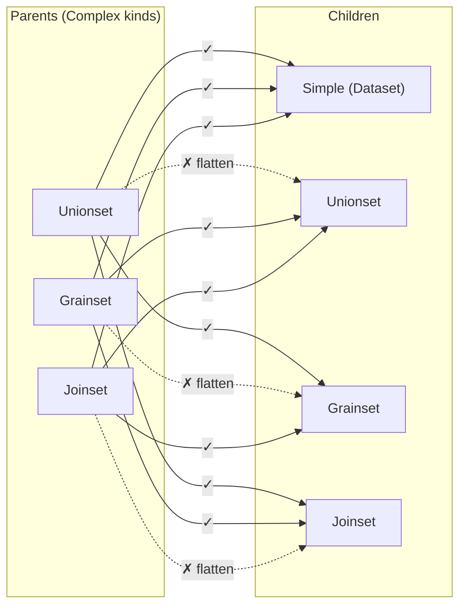

# 12. Nesting Policy

> **Reconciliation (Phase-3 / 2026-04-17 consolidation).** The nesting-matrix rules (§2) are refined by `../data-kinds/26_nesting_matrix.md`, which adds explicit structural rules **R1** (self-nesting bans per-variant), **R2** (no same-variant self-nesting at any depth), and **R3** (every `ComplexDataKind` requires ≥ 2 children). Where body sections cite `ColumnMapping`, read `SemanticMapping` per `./18_entities.md §10`.
>
> **Status:** ratified. All nesting legality, block shape, cardinality, and Precondition rules are authoritative as of this revision. Joinset N-ary support is explicitly deferred as TECH_DEBT (§5.2).

## 1. Purpose and Scope

`12` ratifies the structural rules every `SemanticModel` must obey about **how DataKinds nest**. It is the second foundations document after `11` because nesting legality constrains what `12`–`17` and `20`–`25` may assume about the Model's shape.

**What `12` ratifies:**

- The **nesting matrix** (§2) — which Complex parent may contain which child kind.
- The **depth bound** (§2.3) — a consequence of the matrix.
- **Block shape** per Complex strategy (§3 Unionset, §4 Grainset, §5 Joinset).
- **Simple-leaf nesting** (§6) — top-level vs. nested Simple (Dataset) role rules.
- **Cardinality** of children lists (minimum and maximum per Complex).
- **Structural Preconditions** (§7) for nesting-related checks.

**What `12` does NOT ratify** (forward-refs):

- `Grain` axis values, temporal grain variants, cross-grain semantics — `13`, `17`.
- `ExprSource` grammar for join predicates and filter expressions — `14`.
- `Binding` / `ColumnMapping` inside Simple leaves — `15`.
- `Relationship` semantics, `JoinType` axis, `ComposedSemanticInterface` — `16`.
- `TemporalShape` gating of Grainset level eligibility — `17`.
- Per-strategy resolution at plan time (Unionset branch assembly, Grainset level selection, Joinset path walk) — `20–25`.

**Key invariants from `00` / `10` / `11` that `12` directly upholds:**

- **I1** (`00 §8`) — DataKind nesting is always inline; no `ref:` form for children (restated from `11 §2`).
- **I5** — all nesting-shape validation is compile-time work; `plan` receives a structurally legal Model.
- `11 §2`'s tree-shape invariant — `12`'s matrix is the concrete enumeration that enforces it.

## 2. The Nesting Matrix

The authoritative legality table. Rows are parent Complex kinds; columns are child kinds. `✓` means the child kind may appear directly inside the parent's child-list blocks. `✗` means the parser MUST reject it with a structural Diagnostic.

| Parent ↓ / Child → | Simple (Dataset) | Unionset | Grainset | Joinset |
|---|---|---|---|---|
| **Unionset** | ✓ | ✗ | ✓ | ✓ |
| **Grainset** (per-level child) | ✓ | ✓ | ✗ | ✓ |
| **Joinset** (as member) | ✓ | ✓ | ✓ | ✗ |

Top-level DataKinds (Model root children) may be any of `{Simple, Unionset, Grainset, Joinset}` without restriction.

### 2.3 Depth bound (derived)

Because every Complex kind bans self-nesting, no cycle exists in the nesting DAG. The maximum depth of a Complex-wrapped Simple leaf is **bounded by the number of distinct Complex strategies**: three. The longest legal chain under `12`'s matrix is any permutation of `{Unionset, Grainset, Joinset}` wrapping a Simple leaf:

```
Joinset ⊃ Grainset ⊃ Unionset ⊃ Simple
```

`validate` MUST enforce this bound structurally. In practice, the three-deep upper bound is never approached — real Models nest at most one or two levels. `validate` does NOT emit a warning near the bound; it simply rejects illegal same-kind nesting as `ParseError::IllegalNesting`, and the matrix guarantees the rest.

### 2.4 Diagram — the nesting matrix



**Notes on the diagram.**

- Solid arrows: legal parent→child nesting.
- Dashed red arrows: banned same-kind nesting (flatten at authoring).
- The diagram does not depict Simple-as-parent because Simple cannot nest children; it is always a leaf.

## 3. Unionset Shape

A Unionset composes two or more DataKinds that share (or will share, under coverage rules in `15`) a Semantics surface. Each child is a branch; the Unionset's exposed interface is the union of branch coverage.

### 3.1 Block layout

```yaml
- name: paid_media                   # top-level Unionset's Semantics-bearing name
  # ... Unionset's own interface declarations (dimensions / measures / metrics / filters / keys)
  # per 11: only top-level DataKinds declare interfaces
  datasets:                          # Simple children
    - name: adwords_daily
      # binding omitted
    - name: facebook_daily
      # binding omitted
  grainsets:                         # Complex children (any mix of grainsets / joinsets)
    - name: tiktok_rollup
      # ... Grainset body
  joinsets: []                       # empty lists are legal; absent list is equivalent
```

**Rules:**

- Child lists are keyed by canonical container name: `datasets:`, `unionsets:` (always empty / forbidden per matrix), `grainsets:`, `joinsets:`. `unionsets:` present under a Unionset is a structural error (`ParseError::IllegalNesting`).
- Children from any legal container type MAY be mixed freely. A Unionset with one Simple branch, one Grainset branch, and one Joinset branch is legal.
- Each nested child carries its own name (structural label per `11 §10`). Sibling labels must be unique within the Unionset's combined child list (across all container keys).
- Coverage gaps (where a branch does not materialize a Semantics the Unionset exposes) are resolved per `15`'s NULL-fill / coverage rules. `12` does not specify how coverage is computed — only that the structural shape permits heterogeneous branches.

### 3.2 Child cardinality

- **Minimum:** 2 total children across all child lists combined. A single-branch Unionset is `ValidateError::UnionsetMustHaveMultipleChildren` — semantically it's the child itself; authors should replace it directly.
- **Maximum:** unbounded in principle; practical limits come from SemanticManifest size and planner performance (I6 hot path).

### 3.3 Interface source

Per `11 §2` and `11 §10`, nested children do NOT declare Semantics. The Unionset's own (top-level) interface is authoritative. Children contribute Bindings and (for Complex children) nested structural resolution, but not Semantics declarations.

## 4. Grainset Shape

A Grainset stacks the same logical DataKind at multiple `Grain` levels. The planner selects the coarsest level that satisfies the Request's requested grain.

### 4.1 Block layout

```yaml
- name: sales_rollup
  # ... Grainset's own interface declarations (top-level only)
  levels:
    - grain: year                    # coarsest first (see §4.2)
      name: yearly                   # structural label (11 §10.3)
      datasets:
        - name: sales_yearly_agg
          # binding omitted
    - grain: month
      name: monthly
      datasets:
        - name: sales_monthly_agg
          # binding omitted
    - grain: day
      name: daily
      datasets:
        - name: sales_daily
          # binding omitted
```

Each `levels:` entry carries:

- `grain:` — one of `13`'s `Grain` variants (required).
- `name:` — structural label for diagnostics and strategy-internal reference (optional; auto-generated as `<grainset_name>_<grain>` when absent).
- Exactly one of `datasets:` / `unionsets:` / `joinsets:` — the child kind at this level. `grainsets:` is forbidden here (same-kind self-nesting ban, `ParseError::IllegalNesting`).
- `datasets:` list at a level may contain multiple Simple entries; they are treated as alternates at that grain (planner picks). Per-level child kind homogeneity is NOT required (a level may have `datasets:` + `unionsets:` both populated).

### 4.2 Level ordering — coarsest-first

`levels:` MUST be declared in **coarsest-to-finest** order. Rationale:

- Matches how authors reason about hierarchies (year → month → day).
- Gives the planner a deterministic walk order for level selection (start coarsest; descend until one satisfies the Request grain).
- Makes Diagnostic messages about "finer than available" vs. "coarser than needed" readable by pointing at the first or last level.

`validate` enforces the ordering via `ValidateError::GrainsetLevelsNotSortedCoarsestFirst` when adjacent pairs are out of order. The comparison uses `13`'s total order on `Grain` variants; `14`'s expression-level grain arithmetic is not involved at this layer.

### 4.3 Level cardinality

- **Minimum:** 2 levels. A Grainset with 1 level is just the underlying Simple — `ValidateError::GrainsetMustHaveMultipleLevels`.
- **Maximum:** unbounded.

### 4.4 Grain-axis source

The `grain:` value at each level must be a variant of `13`'s `Grain` enum. Temporal grain is the primary axis for initial design. Non-temporal grain axes (geographic, entity) are enum-extensible per I10 but out of scope for v1 Grainset ratification. The Dimension designated as the temporal axis (via `type: temporal` + `grains:`) on the Grainset's interface must list all grains used in `levels:`; mismatch is `CompileError::GrainAxisMismatch` (ratified in `13`).

## 5. Joinset Shape

A Joinset composes members through a declared join path.

### 5.1 Block layout (binary v1)

```yaml
- name: orders_with_customers
  # ... Joinset's own interface declarations (top-level only)
  datasets:                          # two members in v1
    - name: orders
      # binding omitted
    - name: customers
      # binding omitted
  path:
    on:
      left:  orders.customer_id      # structural-label.column_name
      right: customers.customer_id
    join_type: inner                 # 16's JoinType variant
    relationship: orders_to_customers  # optional ref to a Model-root Relationship (9 / 16)
```

**Rules:**

- Exactly **two members** in v1 (see §5.2).
- Members MAY be Simple (`datasets:`), Unionset (`unionsets:`), or Grainset (`grainsets:`). Not Joinset (same-kind ban).
- `path:` is exactly one block per Joinset in v1 — one edge connecting the two members.
- `path.on.left` / `path.on.right` reference sibling members by their structural label (`11 §10.3`) followed by a dotted column name. The dotted form is a parse-level convention specific to Joinset; it is NOT a general Semantics dot-qualification (which is banned by `00 §4.2`).
- `path.join_type` is one of `16`'s `JoinType` variants (`inner`, `left`, `right`, `full`, plus `as_of` if ratified — forward-ref).
- `path.relationship` (optional) names a Model-root `Relationship` declaration (§16). When present, `compile` cross-checks that the named Relationship connects the same two top-level DataKinds the Joinset's members ultimately bind to. When absent, the Joinset's `path:` is self-contained — no Relationship lookup is performed.

### 5.2 v1 arity — binary only; N-ary deferred

Initial design ratifies **binary Joinsets only**. A Joinset has exactly two members; `path:` is one edge.

N-ary Joinsets (three or more members with a spanning-tree `path:` list) are a recognized future extension and are tracked as TECH_DEBT:

- **TD-NESTING-NARY-JOIN** — extend Joinset to accept ≥3 `datasets:` members plus a list of `path:` edges forming a spanning tree. Cardinality inference across the tree (required by `16`) becomes non-trivial; v1 binary case keeps inference mechanical.

Rationale for binary v1: the binary case covers the majority of authored joins, keeps `path:` shape trivial (one edge, two endpoints), and lets `16` define Cardinality inference for a simple case first. Relaxing to N-ary is additive (an extra edge list; binary remains a degenerate spanning tree of one edge).

### 5.3 Member cardinality (v1)

- **Exactly 2** members across all member-bearing lists (`datasets:` + `unionsets:` + `grainsets:`). Any other count is `ValidateError::JoinsetMustBeBinaryV1`.
- **Maximum:** 2, enforced by the same Precondition.

## 6. Simple (Dataset) Nesting

Simple is the leaf. It never contains children. It may appear at two structural positions:

### 6.1 Top-level Simple

A top-level Simple declares its own SemanticInterface (Dimensions / Measures / Metrics / Filters / Keys) and its own Binding. It is queryable directly. This is the canonical case.

### 6.2 Nested Simple

A Simple declared inside a Complex parent is **binding-only**: it provides a `Binding` to one or more `PhysicalSource`s but does NOT declare its own SemanticInterface. The enclosing top-level DataKind's interface is authoritative. Per `11 §2`, nested scopes declare no interface.

```yaml
- name: paid_media                   # top-level Unionset; declares the interface
  measures:
    - name: cost
      data_type: decimal
      agg: sum
  datasets:
    - name: adwords_daily            # nested Simple; binding-only
      binding:
        column_mapping:
          cost: spend_amount         # maps the parent's `cost` to this source's column
```

### 6.3 Interface source for nested Simple

Per `11 §3` global identity and `11 §5` shape unification, a nested Simple's `binding:` block references Semantics that are declared on its **nearest enclosing top-level DataKind**. The nested Simple's own `name:` is a structural label (`11 §10`), not a Semantics name.

This matches the two-role convention from `00 §4.1`: "Dataset" (the consumer-level name for SimpleDataKind) can mean either a queryable top-level surface (with interface + binding) or a nested binding-only leaf (binding only).

### 6.4 Keys and Semantics declarations — not on nested Simples

Direct restatement of `11 §6.5` and `11 §3.4`:

- Keys are declared only on top-level DataKinds. A `keys:` block inside a nested Simple is `ValidateError::KeysAtNestedScope` (covered by `11 §12.1` N-V4).
- Semantics declarations (Dimensions / Measures / Metrics / Filters) at any nested scope (nested Simple OR nested Complex) are `ValidateError::SemanticsAtNestedScope` (N-V4 again).

`12` does NOT redefine these rules; it enforces them at nesting-shape parse time as structural Preconditions (§7).

## 7. Structural Preconditions

Nesting-shape Preconditions. These are checks whose violation is expressible purely from the Model's structural skeleton — no registry lookup needed.

### 7.1 Run by `parse` (structural, fail fast on the offending node)

| ID | Rule | What fails |
|---|---|---|
| NP-P1 | Same-kind self-nesting banned (matrix, §2) | `unionsets:` inside a Unionset, `grainsets:` inside a Grainset level, `joinsets:` inside a Joinset's members |
| NP-P2 | Unknown child container key | e.g. `tables:` inside a Unionset — accepted child container keys are `datasets:` / `unionsets:` / `grainsets:` / `joinsets:` |
| NP-P3 | Top-level key at nested position | `relationships:` inside a Complex body |

NP-P1 and NP-P2 are strict parse-time rejections. They cannot accumulate with other errors beyond the current document node; the parser refuses to build a tree at all for the affected subtree.

### 7.2 Run by `validate` (structural, accumulate per `10 §3.2`)

| ID | Rule | What fails |
|---|---|---|
| NV-V1 | Unionset has ≥ 2 children (§3.2) | zero or one child across all child lists |
| NV-V2 | Grainset has ≥ 2 `levels:` (§4.3) | fewer than 2 levels |
| NV-V3 | Grainset `levels:` in coarsest-first order (§4.2) | any adjacent pair where `levels[i].grain` is finer than `levels[i+1].grain` per `13`'s Grain order |
| NV-V4 | Grainset level has exactly one non-empty child-kind list | a level with zero child containers or (in v1) with `grainsets:` present |
| NV-V5 | Joinset has exactly 2 members in v1 (§5.3) | any other member count across `datasets:` + `unionsets:` + `grainsets:` |
| NV-V6 | Joinset `path:` well-formed (§5.1) | `path.on.left` or `path.on.right` absent, malformed structural-label reference, or referencing a label that is not a sibling member |
| NV-V7 | Structural labels unique within parent (§6.3 restates `11 §10.1`) | two siblings in the same parent's combined child list share a `name:` |
| NV-V8 | No Semantics blocks at nested scope (§6.4) | `dimensions:` / `measures:` / `metrics:` / `filters:` / `keys:` present inside a nested Complex or nested Simple |

### 7.3 Run by `compile` (registry-dependent, fail fast per `10 §3.3`)

| ID | Rule | What fails |
|---|---|---|
| NC-C1 | Grainset grain-axis consistency (§4.4) | a `levels[i].grain` is not declared in the Grainset's temporal Dimension `grains:` list |
| NC-C2 | Joinset `path.relationship` match (§5.1) | the referenced Relationship does not connect the two top-level DataKinds the Joinset's members ultimately bind to |
| NC-C3 | Joinset `path.on.left/right` column resolution | the dotted column name does not resolve through the referenced member's `Binding` `ColumnMapping` (15) |

### 7.4 Mapping to typed error variants

| Precondition | Stage | Typed variant (ratified in `31` / `32` / `33`) |
|---|---|---|
| NP-P1 | parse | `ParseError::IllegalNesting { parent, child, location }` |
| NP-P2 | parse | `ParseError::UnknownContainerKey { parent, key, location }` |
| NP-P3 | parse | `ParseError::TopLevelKeyAtNestedScope { key, location }` |
| NV-V1 | validate | `ValidateError::UnionsetMustHaveMultipleChildren { dataset, count }` |
| NV-V2 | validate | `ValidateError::GrainsetMustHaveMultipleLevels { dataset, count }` |
| NV-V3 | validate | `ValidateError::GrainsetLevelsNotSortedCoarsestFirst { dataset, first_offender_index }` |
| NV-V4 | validate | `ValidateError::GrainsetLevelMalformed { dataset, level_index, reason }` |
| NV-V5 | validate | `ValidateError::JoinsetMustBeBinaryV1 { dataset, member_count }` |
| NV-V6 | validate | `ValidateError::JoinsetPathMalformed { dataset, reason }` |
| NV-V7 | validate | `ValidateError::DuplicateStructuralLabel { parent, name, first_at, second_at }` (shared with `11` N-V3) |
| NV-V8 | validate | `ValidateError::SemanticsAtNestedScope { parent, block, location }` (shared with `11` N-V4) |
| NC-C1 | compile | `CompileError::GrainAxisMismatch { dataset, level_grain, available_grains }` |
| NC-C2 | compile | `CompileError::JoinsetRelationshipMismatch { dataset, declared_relationship, actual_endpoints }` |
| NC-C3 | compile | `CompileError::JoinsetColumnUnresolved { dataset, side, column_ref }` |

All variants produce a `Diagnostic` via `10 §5.1`'s `StageError → Diagnostic` conversion. `Diagnostic::code` follows the kebab-case convention (e.g. `parse.illegal-nesting`, `validate.grainset-levels-not-sorted-coarsest-first`).

## 8. Interaction with Other Docs

- **11** — `12` concretizes `11 §2`'s tree-shape invariant with the explicit matrix (§2) and ratifies per-strategy block shapes that `11` cross-refs from §10 (structural labels) and §6.5 (Keys only on top-level).
- **13** — defines `Grain` variants. Grainset level `grain:` values MUST be `13` variants; NV-V3 uses `13`'s Grain total order.
- **14** — defines `ExprSource`. Joinset `path.on.*` column references and optional branch-level filters on Unionset children use `14`'s grammar; `12` defines only the structural envelope.
- **15** — defines `Binding` / `ColumnMapping` / `PhysicalSource`. NC-C3 resolves through `15`'s column mapping; Unionset coverage (`§3.3`) is specified in `15`.
- **16** — defines `Relationship`, `JoinType`, `ComposedSemanticInterface`. Joinset `path.join_type` is a `16` variant; `path.relationship` refers to `16`'s Relationship objects.
- **17** — defines `TemporalShape`. Grainset level-eligibility gates (e.g. a `Snapshot`-shaped DataKind cannot be rolled up mechanically) are ratified in `17`; `12`'s structural rules apply independently of `TemporalShape`.
- **20–25** — per-strategy resolution at plan time. `12` fixes the shape `plan` sees; `20–25` define what `plan` does with that shape.
