# 14. Expressions

> This document ratifies the expression-model contract at the Semantics layer.
> Function catalog details (`CanonicalFn` newtype, `FunctionRegistry`,
> `FnSignature` polymorphism, BinaryOp promotion lattice) and eager
> resolution mechanics (`ResolvedExprTable`, substitution algorithm) live in
> sibling documents `14a` and `14b` to keep each focused.

## 1. Purpose and Scope

`14` ratifies the **expression model** semstrait uses from YAML authoring through the Manifest boundary. Expressions are how authors declare computed Semantics (`expr:` on a Measure / Metric / Dimension / Filter) and how Bindings map physical columns into Semantic slots (`column_mapping[].expr`).

**What `14` ratifies:**

- A single shared low-level `Expr` AST (§3) — all variants, authoring-facing but not directly a field type outside the expression module.
- Two first-class wrapper types (§2): `SemanticExpr` (semantic-layer composition; `EntityRef` allowed, `Column` forbidden) and `PhysicalExpr` (binding-layer; `Column` allowed, `EntityRef` forbidden, no aggregation). The wrappers enforce their invariants at construction boundaries.
- The `ExprSource` YAML authoring surface (§4) — Inline DSL form (string) and Declarative block form (structured YAML) with identical AST results. Context-aware identifier resolution: bare identifiers are `EntityRef`s in a `SemanticExpr` parse site and `Column`s in a `PhysicalExpr` parse site.
- The **typing contract** outline (§5) — literal typing, column typing (from Binding), EntityRef typing (from referenced Semantics's shape), aggregate typing (from `Aggregation` enum + operand type). The full signature-polymorphism machinery for scalar functions, the BinaryOp promotion lattice, and the `FnSignature`/`ParamType`/`ReturnTypeRule` design live in **`14a`** to keep this document's scope manageable.
- **Computed-Semantics `data_type:` inference** (§6) — when `expr:` is present and `data_type:` is omitted, the type is inferred from the expression tree; when both are present, the inferred type must unify with the declared one.
- The **parse and validate error model** for expressions (§7) — the `ParseError::Expr*` and `ValidateError::*Expr*` variants that feed `10 §5`'s `Diagnostic` stream.

**What `14` does NOT ratify** (forward-refs):

- Function signatures, `FunctionRegistry`, `CanonicalFn` newtype, BinaryOp promotion lattice — `14a`.
- `ResolvedExprTable`, compile-time substitution, cross-DataKind pre-resolution, cycle detection — `14b`.
- Per-engine function mapping — `registry/functions_mapping.md`.
- Physical-column schema validation (does the column exist in the resolved source?) — `15`.
- Plan-time use of `ResolvedExpr`s — `20–25`.

**Key invariants from `00` / `10` / `11` / `13` that `14` directly upholds:**

- **I7** (`00 §8`) — Semantic expressions reference Semantics by name; resolution to physical columns is a compile-time operation (eager) — expressions in the Manifest are fully resolved, with per-Binding physical expressions pre-computed (per `14b`).
- `11 §5.1` — `data_type:` across Semantics occurrences must unify. Inferred types from computed Semantics participate in this unification.
- `11 §6` — element catalog: `expr:` appears on Measures, Metrics, Dimensions, Filters, and `column_mapping[]` entries. Each parse site dictates which wrapper (`SemanticExpr` or `PhysicalExpr`) is produced.
- `13 §2` — expression types draw from the canonical `DataType` set exclusively.

## 2. Expression Contexts: `SemanticExpr` and `PhysicalExpr`

### 2.1 Rationale — why two first-class types

A single `Expr` AST supports every syntactic shape expressions need, but two *structurally distinct* authoring contexts exist in the Model:

- **Semantic-layer composition** — a Measure / Metric / computed Dimension / Filter `expr:` references *other Semantics by name*. Its leaves are `EntityRef`s and literals; aggregations (`SUM(amount)`) are first-class here. Columns are meaningless at this layer — a Semantics doesn't know which Binding it will be evaluated through.
- **Binding-layer terminal expressions** — a `column_mapping[].expr` (and, post-compile, the stored eager-resolution form) references *physical columns by name* from its `PhysicalSource`. Its leaves are `Column`s and literals; aggregations are forbidden (column mappings project per-row, not per-group).

These two contexts have **mutually exclusive allowed leaves** (`EntityRef` vs. `Column`) and **different invariants around aggregation**. Using a single shared type and relying on runtime checks would defeat the purpose of a strongly-typed IR (I4): every function that consumed an `Expr` would need to re-check invariants the compiler could otherwise enforce.

The design therefore introduces two **first-class newtype wrappers** around `Expr`. Construction is the only boundary at which invariants are checked; traversal, display, and pattern-matching all delegate to the inner `Expr`. Invariants:

| Invariant | `SemanticExpr` | `PhysicalExpr` |
|---|---|---|
| `Expr::Column(..)` | forbidden (`ValidateError::ColumnInSemanticExpr`) | allowed |
| `Expr::EntityRef(..)` | allowed | forbidden (`ValidateError::EntityRefInPhysicalExpr`) |
| `Expr::Aggregate(..)` | allowed (at any depth except nested-in-aggregate — `TD-EXPR-NESTED-AGG`) | forbidden (`ValidateError::AggregateInPhysicalExpr`) |
| `Expr::FunctionCall(..)` | allowed (scalar functions; aggregations go via `Expr::Aggregate`) | allowed (scalar functions only) |

This separation also gives the planner a precise type to key on: `ResolvedExprTable` stores `PhysicalExpr`s exclusively (per `14b`), and plan-time rewrites that substitute into existing physical fragments take and return `PhysicalExpr`.

### 2.2 `SemanticExpr` — semantic-layer composition

```rust
pub struct SemanticExpr(Expr);

impl SemanticExpr {
    /// Validates the invariants above, then wraps.
    pub fn new(expr: Expr) -> Result<Self, ValidateError>;

    /// Byte-level access to the inner AST (read-only).
    pub fn as_expr(&self) -> &Expr;

    /// Traversal — delegates to `Expr::walk` / `Expr::transform`.
    pub fn walk<V: Visitor>(&self, visitor: &mut V) -> V::Output;
    pub fn transform<F: FnMut(Expr) -> Result<Expr, ValidateError>>(
        self,
        f: F,
    ) -> Result<Self, ValidateError>;
}
```

**Authoring sites** (per `11 §6` element catalog):

- Measure `expr:` (computed Measures only; a Measure with `agg:` and a physical `column_mapping[].expr` has no `SemanticExpr`)
- Metric `expr:` (always required — a Metric without an `expr` is not a Metric, per `11 §6.3`)
- Dimension `expr:` (computed Dimensions, per `11 §6.1`)
- Filter `expr:` (always required, per `11 §6.4`)

**Forbidden at**: `column_mapping[].expr` (which is `PhysicalExpr`-typed).

### 2.3 `PhysicalExpr` — binding-layer terminal expression

```rust
pub struct PhysicalExpr {
    expr: Expr,
    /// Populated by compile; None pre-compile at authoring sites.
    pub inferred_type: Option<DataType>,
    /// Populated by compile; set of Column names referenced in the expr tree.
    pub referenced_columns: Vec<String>,
}

impl PhysicalExpr {
    /// Parse-site construction (inferred_type: None, referenced_columns: empty).
    pub fn new_authored(expr: Expr) -> Result<Self, ValidateError>;

    /// Compile-time construction from a resolved expr with known type + refs.
    pub fn new_resolved(
        expr: Expr,
        inferred_type: DataType,
        referenced_columns: Vec<String>,
    ) -> Result<Self, ValidateError>;

    pub fn as_expr(&self) -> &Expr;
    pub fn walk<V: Visitor>(&self, visitor: &mut V) -> V::Output;
    pub fn transform<F: FnMut(Expr) -> Result<Expr, ValidateError>>(
        self,
        f: F,
    ) -> Result<Self, ValidateError>;
}
```

**Authoring sites**:

- `column_mapping[].expr` on a `Binding` (per `15`)

**Compile-produced sites**:

- `ResolvedExprTable` entries (one `PhysicalExpr` per `(Semantics, Binding)`, per `14b`)
- Optimizer-introduced projections (e.g. reconciliation casts — §6 below)

**Post-compile enrichment.** `inferred_type` and `referenced_columns` are `None` / empty at parse time and populated by `compile` in two places:

1. Authored `column_mapping[].expr` expressions — `compile` infers types (§5) and collects column refs during `validate`→`compile` traversal.
2. Resolved expressions stored in `ResolvedExprTable` — always populated; `14b` guarantees these fields are `Some` / non-empty before the Manifest is sealed.

### 2.4 Why no `PhysicalMappingExpr` type

An earlier draft considered a third wrapper type distinguishing "authored-but-not-yet-schema-validated" `column_mapping[].expr` from "resolved-and-schema-validated" physical expressions inside `ResolvedExprTable`. That distinction adds type-system noise without buying invariants: schema validation (does `Column("ts")` refer to a real column in the resolved `PhysicalSource`?) is a **check**, not a structural property of the expression tree. A schema-invalid `PhysicalExpr` is still a well-formed `PhysicalExpr` — it just fails the `validate_against_schema(&self, schema: &Schema) -> Result<(), CompileError>` check.

The design therefore collapses both states into a single `PhysicalExpr` type. The difference is observable only through whether `inferred_type.is_some()` and whether the compile-time schema check has been run — both are context-dependent and cannot be lifted into the type system without excessive phantom-typing.

**Consequence:** `PhysicalExpr` values inside `ResolvedExprTable` are a strict refinement of `PhysicalExpr` values at `column_mapping[].expr` authoring sites. Downstream consumers (planner, optimizer, adapters) consume only the refined form; they rely on the Manifest's sealing contract (`14b`) rather than a distinct type.

### 2.5 The single conversion point

The **only** function that produces a `PhysicalExpr` from a `SemanticExpr` is:

```rust
/// Resolve a SemanticExpr into a PhysicalExpr, for a specific target Binding.
/// Called exhaustively by `compile` to populate the Manifest's ResolvedExprTable
/// (per `14b`) — one resolution per (Semantics, Binding) pair.
pub fn resolve_to_physical(
    sem: &SemanticExpr,
    binding: &Binding,
    manifest: &PartialManifest,
) -> Result<PhysicalExpr, CompileError>;
```

**Contract:**

1. **EntityRef substitution.** Every `Expr::EntityRef(name)` in `sem` is replaced with the target Binding's `PhysicalExpr` for `name` (looked up in `manifest.resolved_expr_table[name, binding.id]`). Substitution is recursive — a Semantics that transitively references other Semantics is flattened in one pass.
2. **Cross-kind resolution.** If `name` is declared on a different top-level DataKind than `binding`'s owning kind, the resolution walks the `Relationship` graph per `14b §3`. An unreachable reference (no Relationship path exists) produces `CompileError::UnreachableSemanticsReference`.
3. **Cycle detection.** If the transitive reference graph contains a cycle (A references B, B references A), `CompileError::CircularSemanticsReference` is raised with the full cycle path.
4. **Type inference.** The resolved expression tree is type-inferred bottom-up per §5; the result is stored in `PhysicalExpr.inferred_type`.
5. **Referenced-column collection.** All `Column(name)` leaves of the resolved expression are gathered into `PhysicalExpr.referenced_columns`, enabling predicate-pushdown hints at plan time.
6. **Column-existence validation.** Every referenced column must exist in `binding.source.schema()` — otherwise `CompileError::UnresolvedColumn`. Column-type vs. Semantics-declared-type reconciliation is handled by boundary-reconciliation `Cast` emission (§6.4), not by a validation error.

Full algorithm, ordering, and cycle-detection invariants are specified in `14b`.

### 2.6 Memory map of the expression-type lattice

```mermaid
flowchart LR
    subgraph AUTHORING["YAML authoring layer"]
        M_EXPR["Measure / Metric /<br/>Dimension / Filter<br/><code>expr:</code>"]
        CM_EXPR["<code>column_mapping[].expr</code><br/>on Binding"]
    end

    subgraph PARSE["parse stage (10 §3.2)"]
        ES_S["<code>ExprSource</code><br/>(pre-dispatch)"]
        ES_P["<code>ExprSource</code><br/>(pre-dispatch)"]
        SE["<code>SemanticExpr</code><br/>invariants: no Column"]
        PE_AUTH["<code>PhysicalExpr</code><br/>(authored, inferred_type=None)"]
    end

    subgraph COMPILE["compile stage (10 §3.3)"]
        RESOLVE["<code>resolve_to_physical</code><br/>— EntityRef substitution<br/>— cycle check<br/>— type inference<br/>— schema validation"]
        RET["<code>ResolvedExprTable</code><br/>per (Semantics, Binding)<br/>PhysicalExpr with<br/>inferred_type + referenced_columns"]
    end

    subgraph PLAN["plan / optimize / adapt"]
        LOOKUP["O(1) table lookup<br/>per 14b"]
        OPT["optimizer rewrites<br/>(PhysicalExpr → PhysicalExpr)"]
        ADAPT["adapter rendering<br/>PhysicalExpr → SQL / Substrait"]
    end

    M_EXPR --> ES_S --> SE
    CM_EXPR --> ES_P --> PE_AUTH
    SE --> RESOLVE
    PE_AUTH --> RESOLVE
    RESOLVE --> RET
    RET --> LOOKUP --> OPT --> ADAPT

    classDef authoring fill:#fff4e6,stroke:#d9822b
    classDef parse fill:#e6f3ff,stroke:#2b78d9
    classDef compile fill:#e8f5e9,stroke:#2e7d32
    classDef plan fill:#f3e5f5,stroke:#7b1fa2
    class M_EXPR,CM_EXPR authoring
    class ES_S,ES_P,SE,PE_AUTH parse
    class RESOLVE,RET compile
    class LOOKUP,OPT,ADAPT plan
```



**Reading key:**

- Orange (authoring) — author-visible YAML sites.
- Blue (parse) — in-memory model types produced by `parse` / `validate`.
- Green (compile) — the eager resolution step that bridges Semantic and Physical, producing the Manifest's sealed table.
- Purple (plan/optimize/adapt) — query-time consumers; all read the same sealed `PhysicalExpr`s.

**Invariant:** the only edge from a `SemanticExpr` to a `PhysicalExpr` is through `resolve_to_physical`. No other code path constructs a `PhysicalExpr` from semantic input.

## 3. The Shared `Expr` AST

### 3.1 Variant taxonomy

Eight categories:

  1. **Leaves** — `Column`, `Literal`, `EntityRef`
  2. **Arithmetic / logic / compare** — `BinaryOp`, `Negate`, `Not`
  3. **Flow / structural** — `Case`, `Cast`
  4. **SQL-shaped predicates** — `InList`, `Between`, `IsNull`, `IsNotNull`, `Like`, `ILike`, `RegexpMatch`, `RegexpExtract`
  5. **NULL handling** — `Coalesce`, `NullIf`
  6. **Temporal** — `DateTrunc`
  7. **Aggregation** — `Aggregate` (closed `Aggregation` enum: `Sum`, `Avg`, `Count`, `Min`, `Max`)
  8. **Escape hatch** — `FunctionCall` (open, string-keyed; resolved via `14a`'s registry)

### 3.2 Exhaustive variant catalog

Every `Expr` variant, its fields, and its validity per wrapper context. "S" = valid in `SemanticExpr`, "P" = valid in `PhysicalExpr`.

| Variant | Fields | S | P | Notes |
|---|---|:-:|:-:|---|
| `Column` | `name: String` | ✗ | ✓ | Physical column name from the binding's `PhysicalSource`. Schema-validated at compile. |
| `Literal` | `value: LiteralValue` (`Boolean`/`Integer`/`Float`/`Decimal`/`String`/`Date`/`Time`/`Timestamp`/`Interval`/`Binary`/`Null`) | ✓ | ✓ | Canonical literal kinds — one per `DataType` variant plus `Null`. Context-typed per §5.1. |
| `EntityRef` | `name: String` | ✓ | ✗ | Reference to another Semantics (measure/metric/dimension/filter) by name. Resolved per `11 §7` / `14b`. |
| `BinaryOp` | `op: BinaryOpKind`, `left: Box<Expr>`, `right: Box<Expr>` | ✓ | ✓ | `BinaryOpKind ::= Add \| Subtract \| Multiply \| Divide \| SafeDivide \| Mod \| Eq \| NotEq \| Lt \| LtEq \| Gt \| GtEq \| And \| Or`. Typing per §5.6. |
| `Negate` | `expr: Box<Expr>` | ✓ | ✓ | Unary arithmetic negation. Operand must be numeric or `Interval`. |
| `Not` | `expr: Box<Expr>` | ✓ | ✓ | Logical negation. Operand must be `Boolean`. |
| `Case` | `when: Vec<WhenClause>`, `else_expr: Option<Box<Expr>>` | ✓ | ✓ | `WhenClause { condition: Expr, result: Expr }`. Sole general-purpose conditional. |
| `Cast` | `expr: Box<Expr>`, `target: DataType` | ✓ | ✓ | Explicit author cast. Narrowing casts emit `Diagnostic::Warning` per §5.5. |
| `InList` | `expr: Box<Expr>`, `list: Vec<Expr>`, `negated: bool` | ✓ | ✓ | `negated` encodes `NOT IN`. List elements must unify with `expr` type. |
| `Between` | `expr: Box<Expr>`, `low: Box<Expr>`, `high: Box<Expr>`, `negated: bool` | ✓ | ✓ | `low` and `high` must unify with `expr`. |
| `IsNull` | `expr: Box<Expr>` | ✓ | ✓ | Returns `Boolean`. |
| `IsNotNull` | `expr: Box<Expr>` | ✓ | ✓ | Returns `Boolean`. |
| `Like` | `expr: Box<Expr>`, `pattern: Box<Expr>`, `negated: bool` | ✓ | ✓ | `expr` and `pattern` must be `String`. |
| `ILike` | `expr: Box<Expr>`, `pattern: Box<Expr>`, `negated: bool` | ✓ | ✓ | Case-insensitive variant of `Like`. |
| `RegexpMatch` | `expr: Box<Expr>`, `pattern: Box<Expr>`, `negated: bool` | ✓ | ✓ | `expr` and `pattern` must be `String`. Regex dialect is canonical (RE2-compatible subset); per-engine variance in `registry/functions_mapping.md`. |
| `RegexpExtract` | `expr: Box<Expr>`, `pattern: Box<Expr>`, `group: Box<Expr>` | ✓ | ✓ | Extracts a capture group as `String`. |
| `Coalesce` | `args: Vec<Expr>` | ✓ | ✓ | At least 2 args; all args must unify to a common type. Result type = unified type. |
| `NullIf` | `left: Box<Expr>`, `right: Box<Expr>` | ✓ | ✓ | `left` and `right` must unify. Result type = `left`'s type, nullable. Kept as distinct variant (direct adapter mapping to native `NULLIF`). |
| `DateTrunc` | `expr: Box<Expr>`, `grain: Grain` | ✓ | ✓ | `expr` must be `Date`, `Time`, or `Timestamp`. `Grain` enum from `13`. Return type matches operand. |
| `Aggregate` | `aggregation: Aggregation`, `expr: Box<Expr>`, `distinct: bool` | ✓ | ✗ | `Aggregation ::= Sum \| Avg \| Count \| Min \| Max`. Inner `expr` must not itself contain an `Aggregate` (`TD-EXPR-NESTED-AGG`). `distinct` is carried here at the IR level; `COUNT DISTINCT` (and, where engines support them, `SUM DISTINCT` / `AVG DISTINCT`) are expressed as `Aggregate { aggregation: Count, distinct: true }`. |
| `FunctionCall` | `name: String`, `args: Vec<Expr>` | ✓ | ✓ | Scalar-only. `name` resolved via `FunctionRegistry` at compile (`14a`). Arity and signature checked per `14a`'s `FnSignature`. No `distinct` flag — `distinct` is exclusively an aggregate modifier. |

**Notes on the catalog:**

- **No `Guard` variant.** Authors who want single-branch "filter into a measure" shapes write a `Case` with a single `WhenClause` and no `else_expr` (equivalent to `CASE WHEN cond THEN expr END`). This subsumes the old `GUARD(cond => expr)` sugar at zero cost — no parse-time sugar, no parser reserved word, no ghost AST variant.
- **No `distinct` on `FunctionCall`.** `distinct` is a semantics modifier exclusive to aggregation; scalar function calls never take it.
- **`Aggregation` enum is closed.** Six common aggregates with direct semantic relevance for rollup (`Sum`, `Avg`, `Count`, `Min`, `Max`) — `CountDistinct` does **not** appear as its own variant; it is `Count` with `distinct: true`. Any aggregate outside this closed set (e.g. `PERCENTILE_CONT`, `STDDEV`, `APPROX_COUNT_DISTINCT`) goes through `FunctionCall` with a registry entry of `FunctionCategory::Aggregate`.
- **Variant count:** 20 variants total. Count excludes `WhenClause`, `LiteralValue`, `BinaryOpKind`, `Aggregation`, `Grain` (supporting types, not `Expr` variants).

### 3.3 Design notes per category

**Leaves (`Column`, `Literal`, `EntityRef`).** The three leaf kinds are the only `Expr` variants whose validity is **strictly context-partitioned**: `Column` is physical-only, `EntityRef` is semantic-only, `Literal` is universal. This partitioning is what the two wrapper types encode at their construction boundary. A single `Expr` tree is well-formed in one context if and only if every leaf of that tree satisfies the wrapper's leaf constraint.

**Arithmetic / logic / compare (`BinaryOp`, `Negate`, `Not`).** `BinaryOp` collapses arithmetic, comparison, and logical operators into one variant discriminated by `BinaryOpKind`. This choice keeps the AST compact (14 kinds × 2 operands = 14 entries, not 14 distinct variants) and matches how optimizer rules are written (most rules apply to "any BinaryOp of kind K"). Semstrait's operand-typing posture is pass-through (§5.6): operand-type admissibility and widening are engine concerns, not semstrait concerns.

**Flow / structural (`Case`, `Cast`).** `Case` is the sole general-purpose conditional. A single-branch `Case { when: [{ condition, result }], else_expr: None }` covers every measure-filter / narrow-branch use case that prior drafts had contemplated behind a `Guard` sugar — authors write the `Case` directly, and the planner / adapter emits native `CASE WHEN ... THEN ... END` with an implicit `NULL` default (or a narrower engine-specific form where the adapter finds one). Pushdown decisions live in the planner / optimizer (`30–32`) based on each `Case`'s actual condition-leaf shape at plan time; there is no compile-time pushdown tag on `Case` — carrying one in the AST was analyzed and found to add no value beyond what the optimizer can rediscover on demand, so the field is deliberately absent. `Cast` is explicit author-driven type conversion; its narrowing policy is in §5.5.

**SQL-shaped predicates (`InList`, `Between`, `IsNull`, `IsNotNull`, `Like`, `ILike`, `RegexpMatch`, `RegexpExtract`).** Each has a direct SQL counterpart and a direct `PlanNode::Filter` emission. They are first-class rather than `FunctionCall`s because: (a) every target engine has native operator support, allowing direct rendering without registry lookup; (b) their typing rules differ enough from general functions (e.g. `Between` requires three-way type unification) to warrant dedicated validation. `negated` flags on `InList`, `Between`, `Like`, `ILike`, `RegexpMatch` carry the `NOT X` form inline — simpler than wrapping in `Expr::Not`.

**NULL handling (`Coalesce`, `NullIf`).** Both are widely-used SQL primitives with direct engine support. `Coalesce` is variadic (N ≥ 2); its N-ary shape is worth keeping distinct from a binary-tree desugaring because optimizer rules (e.g. constant folding `COALESCE(NULL, x) → x`) are easier on the natural form. `NullIf` is kept as a distinct variant rather than consolidated into `Case` because every target engine has a native `NULLIF(a, b)` form with simpler plan-shape and adapter-emission cost than the equivalent three-node `Case`.

**Temporal (`DateTrunc`).** The sole member today. `DateTrunc` is called out as a dedicated variant rather than a `FunctionCall` because (a) its `grain: Grain` argument is an enum from `13`, not a string literal — this gives the planner compile-time granularity information used by `Grainset` routing (per `22_grainset.md`); (b) its typing rule (return type = operand type) is regular enough to express without the full `FnSignature` machinery. Other temporal primitives (`date_add`, `extract`, `date_diff`, etc.) live as `FunctionCall`s with entries in the `FunctionRegistry` — see `14a`.

**Aggregation (`Aggregate`).** The `Aggregation` enum is **closed** — `Sum`, `Avg`, `Count`, `Min`, `Max`. Any aggregate outside this set (`PERCENTILE_CONT`, `STDDEV`, `APPROX_COUNT_DISTINCT`, engine-specific exotic aggregates) goes through `FunctionCall` with `FunctionCategory::Aggregate` in the registry. Keeping the enum closed for the five universal aggregates gives the planner precise pattern-matching for rollup semantics (per `20–25` Additivity rules). The `distinct: bool` flag is carried only here — `FunctionCall` is strictly scalar and never takes `distinct`. Semantically, `distinct: true` with `Count` expresses classic `COUNT DISTINCT`; with `Sum` or `Avg` it expresses `SUM DISTINCT` / `AVG DISTINCT` where the target engine supports those forms, and adapters that do not are free to reject the combination at `adapt` time. `TD-EXPR-NESTED-AGG` — validation today rejects `Aggregate` inside `Aggregate`. Window functions (which would allow a form of nested aggregation via `OVER` clauses) are deferred (`TD-EXPR-WINDOW`).

**Escape hatch (`FunctionCall`).** Open, string-keyed, resolved at compile against `FunctionRegistry`. Authors reach for this when the AST doesn't have a dedicated variant — string functions (`upper`, `lower`, `substr`, `concat`), math functions (`round`, `abs`, `sqrt`, `power`), date/time functions (`date_add`, `extract`), conditional helpers (`greatest`, `least`), and any adapter-extended function. The registry defines arity, signatures, portability flags, and adapter rewrite rules (all in `14a`). Complex functions that need structural rewriting (`explode`, `unnest`, `lateral` projections) live here behind `TD-EXPR-COMPLEX-FN` until the adapter-rewrite pipeline grows enough shape-rewriting capability — see `14a` for the rewriter taxonomy.

### 3.4 Traversal contract (`walk`, `transform`)

Traversal logic lives on the shared low-level `Expr` type — every wrapper delegates. This guarantees that any analysis pass (type inference, cycle detection, column-reference collection, pushdown-safety analysis) sees the same traversal order regardless of which wrapper hosts the tree.

```rust
impl Expr {
    /// Pre-order traversal: visitor sees each node before its children.
    pub fn walk<V: Visitor>(&self, visitor: &mut V) -> V::Output;

    /// Bottom-up rewrite: each node is rewritten after its children.
    /// Rewrite may fail (returning Err), aborting the transform.
    pub fn transform<F>(self, f: F) -> Result<Expr, ValidateError>
    where F: FnMut(Expr) -> Result<Expr, ValidateError>;

    /// Iterator-style child access; used by generic tree algorithms.
    pub fn children(&self) -> impl Iterator<Item = &Expr>;
}
```

Wrapper-level delegation: `SemanticExpr::walk` and `PhysicalExpr::walk` call `Expr::walk` directly; `*::transform` calls `Expr::transform` and re-wraps the result, re-checking wrapper invariants at the boundary.

**Invariant**: `transform` MUST preserve wrapper invariants. If a rewrite rule would introduce a `Column` into a `SemanticExpr` context (for example), the wrapper's `transform` returns `Err(ValidateError::ColumnInSemanticExpr)`. This is the only place runtime invariant checking happens outside of construction.

### 3.5 Out-of-scope AST variants (deferred)

  - **TD-EXPR-COMPLEX-FN** — complex / explode / lateral functions: modeled as `FunctionCall` for now; adapter rewrites handle them.
  - **TD-EXPR-ARRAY-LITERAL** — array/struct/map literals (tracking with `13 §2.5` deferred complex types)
  - **TD-EXPR-WINDOW** — window functions (OVER clause)

## 4. `ExprSource` YAML Grammar

### 4.1 Two authoring forms, one AST

  - `Inline(String)` — constrained SQL-like DSL; for simple arithmetic, column/entity refs, basic comparisons
  - `Declarative(ExprBlock)` — structured YAML tree; 1:1 with `Expr` variants; for complex expressions (nested `Case`, multi-argument functions)

### 4.2 Parse-site dispatch

Each YAML site explicitly parses to either `SemanticExpr` or `PhysicalExpr`:

```rust
impl ExprSource {
    pub fn parse_semantic(&self) -> Result<SemanticExpr, ParseError>;
    pub fn parse_physical(&self) -> Result<PhysicalExpr, ParseError>;
}
```

### 4.3 Inline DSL grammar

Lexer rules (strict SQL-style):

  - Identifiers: `[A-Za-z_][A-Za-z0-9_]*`, resolved per parse site:
    - Semantic parse site → `EntityRef(name)`
    - Physical parse site → `Column(name)`
  - String literals: single-quoted `'x'` or double-quoted `"x"` → `Literal::String`
  - Numeric literals: `123`, `3.14`, `1.5e10` — typed per §5.1 (integer literal defaults to `Long`, float literal defaults to `Double`; context-narrowing rules in §5.1)
  - Keyword literals: `true`, `false` → `Literal::Boolean`; `null` → `Literal::Null`
  - **No `@` sigil; no `{{ name }}` escape form.** Identifier ambiguity (reserved words, identifiers that collide with keywords, identifiers with spaces, or columns literally named `true` / `null`) is expressed via **Declarative block tagged forms** — `{literal: ...}`, `{column: ...}`, `{entity_ref: ...}`.

Operator set (minimal, SQL-shaped):

  - Arithmetic: `+`, `-`, `*`, `/`, `%`
  - Comparison: `=`, `<>`, `<`, `<=`, `>`, `>=`
  - Logical: `AND`, `OR`, `NOT`
  - Unary: `-` (negation)
  - Nullability: `IS NULL`, `IS NOT NULL`
  - Function-call form: `name(arg1, arg2, ...)` — `name` resolves against `FunctionRegistry` at compile time
  - Parentheses for grouping

What Inline DSL does NOT accept (author must use Declarative block):

  - `CAST(x AS Type)` → `{cast: {expr, as}}`
  - `CASE WHEN ... THEN ... ELSE ... END` → `{case: {when: [...], else: ...}}`
  - `BETWEEN`, `IN`, `LIKE` / `ILIKE` / `REGEXP_MATCH` / `REGEXP_EXTRACT`, `DATE_TRUNC` → explicit tags
  - Aggregations (`SUM`, `AVG`, etc.) → `{aggregate: {fn: ..., expr, distinct}}`
  - `NULLIF` / `COALESCE` → explicit tags

`ParseError::InlineDslSyntax { location, expected, found }` is raised on any token or production outside the grammar above.

`TD-EXPR-DSL-LEXER` — current `semstrait-core` has no dedicated Inline DSL lexer; parsing today reuses parts of `sqlparser-rs`. `implementation/40_refactor_plan.md` lands a minimal hand-written lexer/parser implementing exactly the grammar here.

#### 4.3.1 Operator precedence (highest-to-lowest)

Precedence mirrors SQL standard; lower-numbered rows bind tighter.

| Prec | Operators | Associativity |
|---|---|---|
| 1 | `(...)` (grouping), `name(...)` (function call) | left |
| 2 | unary `-` (negation), unary `NOT` | right |
| 3 | `*`, `/`, `%` | left |
| 4 | binary `+`, `-` | left |
| 5 | `IS NULL`, `IS NOT NULL` (postfix) | — |
| 6 | `=`, `<>`, `<`, `<=`, `>`, `>=` | non-associative |
| 7 | `AND` | left |
| 8 | `OR` | left |

Grouping with parentheses is always available and encouraged for clarity. The grammar is unambiguous at every precedence level; `InlineDslSyntax` never arises from precedence-tied ambiguity.

### 4.4 Declarative block form

Declarative form is a structured YAML tree. Each block is a single-key map; the key is a **tag** that selects how the block parses. Tags partition into two disjoint sets:

1. **Reserved AST tags** (21 tags, enumerated in §4.4.1). These map 1:1 to the `Expr` variants of §3.2 and carry the variant's fields directly. Their shape is fixed by the grammar; the parser does not consult the `FunctionRegistry` for them.
2. **Function-registry tags** (open set). Any tag **not** in the reserved list is looked up by name in the compile-time `FunctionRegistry` (defined in `14a`). On hit, the block is parsed as a shortcut for `{function_call: {name: <tag>, args: ...}}` using the registry's declared arity / arg-shape. On miss, `ParseError::DeclarativeBlockUnknownTag { tag, location }`.

This dispatch model means **every registered scalar function is authorable as a dedicated top-level tag** (e.g. `{upper: <expr>}` is the registry-dispatched sugar for `{function_call: {name: "upper", args: [<expr>]}}`) without bloating the AST or the parser's reserved-word table — the registry is the single source of truth for what function tags exist. Adapters that extend the registry (e.g. a Spark-specific function) automatically extend the tag vocabulary with no parser change needed.

**Reserved-tag collision policy.** Adapter registry entries for the 21 reserved tags are rejected at compile time (`CompileError::ReservedTagCollision { tag, source: adapter_name }`) — adapters cannot shadow AST-variant tags with function entries.

**Bare-scalar rules** (apply inside a block's field value):

- Bare string `'x'` or `"x"` (explicitly quoted) → `Literal::String`.
- Bare unquoted string `x` at a field that expects an `Expr` → context-resolved like the Inline DSL: `EntityRef` in a `SemanticExpr` parse site, `Column` in a `PhysicalExpr` parse site.
- Bare number → numeric literal per §5.1 (integer → `Long`, float → `Double`, context-narrowed per §5.1).
- Bare `true` / `false` → `Literal::Boolean`; bare `null` → `Literal::Null`.
- To force literal interpretation of an ambiguous string (e.g. the word `"true"` as a string value, not the boolean), use the explicit `{literal: {type: String, value: "true"}}` form.

#### 4.4.1 Reserved AST-tag catalog

Each reserved tag maps 1:1 to an `Expr` variant of §3.2. Field shape below is the YAML surface; the parser produces the corresponding `Expr` node.

| AST variant | Reserved tag | Shape |
|---|---|---|
| `Column(name)` | `column` | `{column: "col_name"}` (physical context only) |
| `Literal(value)` | `literal` | `{literal: {type: <DataType>, value: <scalar>}}` — `type` optional; omitted → context-typed per §5.1 |
| `EntityRef(name)` | `entity_ref` | `{entity_ref: "measure_name"}` (semantic context only) |
| `BinaryOp{op,left,right}` | `binary_op` | `{binary_op: {op: Add, left: <expr>, right: <expr>}}`. `op` ∈ `Add`/`Subtract`/`Multiply`/`Divide`/`SafeDivide`/`Mod`/`Eq`/`NotEq`/`Lt`/`LtEq`/`Gt`/`GtEq`/`And`/`Or` |
| `Negate(expr)` | `negate` | `{negate: <expr>}` |
| `Not(expr)` | `not` | `{not: <expr>}` |
| `Case{when,else_expr}` | `case` | `{case: {when: [{condition: <expr>, result: <expr>}, ...], else: <expr-or-omitted>}}` |
| `Cast{expr,target}` | `cast` | `{cast: {expr: <expr>, as: <DataType>}}` |
| `InList{expr,list,negated}` | `in_list` | `{in_list: {expr: <expr>, list: [<expr>, ...], negated: false}}` — `negated` optional, default `false` |
| `Between{expr,low,high,negated}` | `between` | `{between: {expr: <expr>, low: <expr>, high: <expr>, negated: false}}` |
| `IsNull(expr)` | `is_null` | `{is_null: <expr>}` |
| `IsNotNull(expr)` | `is_not_null` | `{is_not_null: <expr>}` |
| `Like{expr,pattern,negated}` | `like` | `{like: {expr: <expr>, pattern: <expr>, negated: false}}` |
| `ILike{expr,pattern,negated}` | `ilike` | `{ilike: {expr: <expr>, pattern: <expr>, negated: false}}` |
| `RegexpMatch{expr,pattern,negated}` | `regexp_match` | `{regexp_match: {expr: <expr>, pattern: <expr>, negated: false}}` |
| `RegexpExtract{expr,pattern,group}` | `regexp_extract` | `{regexp_extract: {expr: <expr>, pattern: <expr>, group: <expr>}}` |
| `Coalesce(args)` | `coalesce` | `{coalesce: [<expr>, <expr>, ...]}` — ≥ 2 args |
| `NullIf{left,right}` | `nullif` | `{nullif: {left: <expr>, right: <expr>}}` |
| `DateTrunc{expr,grain}` | `date_trunc` | `{date_trunc: {expr: <expr>, grain: Day}}` — `grain` is a `Grain` enum variant |
| `Aggregate{aggregation,expr,distinct}` | `aggregate` | `{aggregate: {fn: Sum, expr: <expr>, distinct: false}}`. `fn` ∈ `Sum`/`Avg`/`Count`/`Min`/`Max`; `distinct` optional default `false`. `COUNT DISTINCT` is expressed as `{fn: Count, distinct: true}`. |
| `FunctionCall{name,args}` | `function_call` | `{function_call: {name: "upper", args: [<expr>, ...]}}` — the explicit / verbose form. Authors typically use the registry-dispatched sugar (e.g. `{upper: <expr>}`) instead. |

#### 4.4.2 Function-registry dispatch

For any tag **not** in §4.4.1, the parser consults `FunctionRegistry`:

```text
parse_block(tag, body):
  if tag in RESERVED_AST_TAGS:                 # §4.4.1
      return parse_reserved_tag(tag, body)
  match FunctionRegistry.lookup(tag):
      Some(spec) => return FunctionCall {
          name: spec.canonical_name,
          args: parse_args_for_spec(body, spec),
      }
      None       => raise ParseError::DeclarativeBlockUnknownTag { tag, location }
```

`parse_args_for_spec` uses the registry entry's `FnSignature` to interpret the block body:

- Single-arg function (arity = 1) — body is a single `<expr>`. Example: `{upper: name}` → `FunctionCall { name: "upper", args: [EntityRef("name")] }`.
- Multi-arg positional function — body is a list of `<expr>`s. Example: `{concat: [a, b, c]}` → `FunctionCall { name: "concat", args: [a, b, c] }`.
- Mixed-arg / named-arg function — body is a map with the registry-declared field names. Example: `{substring: {expr: name, start: 1, length: 3}}` → `FunctionCall { name: "substring", args: [name, 1, 3] }` (arg order from the `FnSignature`).

The registry's `FnSignature` determines which of the three shapes applies per function. Arity / arg-shape mismatches raise `ParseError::DeclarativeBlockArity { tag, expected, got, location }`.

**Consistency with Inline DSL.** The parser produces **identical `Expr` trees** from either form. Three equivalent authoring paths for the same semantics:

```yaml
- name: upper_region
  expr: "upper(region)"                       # Inline DSL

- name: upper_region
  expr:
    upper: region                             # Registry-dispatched sugar

- name: upper_region
  expr:
    function_call: {name: upper, args: [region]}   # Verbose reserved form
```

All three produce the same `SemanticExpr(FunctionCall("upper", [EntityRef("region")]))`.

`ParseError::DeclarativeBlockUnknownTag { tag, location }` covers any tag neither reserved nor registered. `CompileError::ReservedTagCollision { tag, source }` is raised when an adapter's registry registration attempts to shadow a reserved AST tag.

### 4.5 Choice of form — when to use which

Both forms produce the same `Expr` tree and therefore the same runtime behavior. Guidelines (informal, not enforced):

- **Inline** when the expression fits the minimal operator set (arithmetic, comparison, logical, `IS NULL`, function calls) and reads naturally on one line. Examples: `"revenue - costs"`, `"region = 'US'"`, `"upper(name)"`, `"status IS NOT NULL"`.
- **Declarative** when the expression (a) uses anything outside the minimal Inline set — `CAST`, `CASE`, `BETWEEN`, `IN`, `LIKE`, `ILIKE`, `REGEXP_*`, `DATE_TRUNC`, aggregations, `NULLIF`, `COALESCE`; (b) contains nested conditionals; (c) relies on a literal that would be ambiguous in a string form (e.g. a string literal that happens to match an identifier pattern); (d) benefits from multi-line structure for readability.

When in doubt, prefer Inline for readability. Reviewers should not reject an expression for choice of form alone — both are first-class.

## 5. Typing (Outline)

The full signature-polymorphism machinery (`FnSignature`, `ParamType`, `TypeClass`, `ReturnTypeRule`) for scalar functions and the BinaryOp promotion lattice live in **`14a`**. This section establishes the base typing contract for non-function nodes — enough for a reader to understand how `compile` types a non-`FunctionCall` expression end-to-end.

### 5.1 Literal typing

Each `LiteralValue` variant has a canonical default type. Literals are **context-typed**: when the surrounding context has a concrete expected type, the literal adopts it if value-compatible; otherwise it falls back to its default.

| Literal kind | Default type | Context narrowing |
|---|---|---|
| `Boolean(_)` | `Boolean` | — |
| `Integer(n)` | `Integer` | Narrows to `Byte` / `Short` when context demands and `n` fits the target range. Widens to `Long` when context demands. Overflow at narrowing → `CompileError::LiteralOverflow { value, target }`. |
| `Float(f)` | `Double` | Narrows to `Float` when context demands and `f` is exactly representable in `Float` precision. Lossy narrowing → `CompileError::LiteralPrecisionLoss`. |
| `Decimal { value, precision, scale }` | `Decimal { precision, scale }` as authored | Context-narrowing to a different precision/scale succeeds if the literal value fits exactly; otherwise `CompileError::LiteralPrecisionLoss`. Author-declared precision/scale are authoritative — semstrait does not carry an arithmetic promotion lattice. |
| `String(_)` | `String` | — |
| `Date(_)` | `Date` | — |
| `Time { value, precision }` | `Time { precision }` | — |
| `Timestamp { value, precision }` | `Timestamp { precision }` | — |
| `Interval(_)` | `Interval` | — |
| `Binary(_)` | `Binary` | — |
| `Null` | **Untyped** — carries no type until inferred from context | — |

**`Null` handling.** A `Null` literal is **untyped at the leaf**; its final type is inferred from its use-site by the rules below. Semstrait does **not** require authors to wrap every `Null` in a `CAST(NULL AS T)` — local inference handles the common cases:

- **Inside a structural node** (`Case`'s `result` / `else_expr`, `Coalesce`'s args, `NullIf`'s operands, `InList`'s list elements): the `Null` adopts the unified type of its sibling branches. A `Case { when: [{cond, THEN expr}], else_expr: Null }` infers `else_expr: Null` to the type of `expr`; similarly for `Coalesce([x, y, Null])` → `Null` adopts `type_of(x) ⊔ type_of(y)`.
- **At a Semantics boundary** (top of an `expr:` tree): the `Null` adopts the Semantics's declared `data_type:` (when one is declared). If no `data_type:` is declared and local inference cannot derive a type from any sibling or use-site — i.e. the expression's top-level shape is a bare `Null` with nothing else to anchor it — the compile stage raises `CompileError::TypeInferenceFailure { reason: "untyped Null at Semantics boundary with no data_type: declared", location }` (see `10 §5` diagnostics). The fix is either to declare `data_type:` on the Semantics or to write an explicit `{cast: {expr: {literal: null}, as: <DataType>}}`.
- **As a BinaryOp / comparison / function-argument operand**: semstrait does **not** validate the operand's type class (per §5.6). `Null` simply carries `Untyped` through; the engine applies its own SQL NULL semantics at execution time.

**`data_type: null` at a Semantics declaration site** is not legal — the `data_type:` field's value set is the closed canonical `DataType` enum (per `13 §2`), and `Null` is not a member. Writing `data_type: null` raises `ParseError::NullAsDataType { location }`.

### 5.2 Column typing (from Binding)

An `Expr::Column(name)` inside a `PhysicalExpr` draws its type from the resolved `PhysicalSource` schema for the owning `Binding`:

```
type_of(Column(name), binding) := binding.source.schema.column_type(name)
```

**Errors:**

- Column does not exist in schema → `CompileError::UnresolvedColumn { name, binding, location }`.
- Column's physical type is not expressible as any canonical `DataType` (per `13`) → `CompileError::UnrepresentablePhysicalType { engine_type, location }`. The canonical set is authoritative; engine types that fall outside it (rare — mostly bespoke ARRAY/STRUCT/MAP variants today) are flagged per `13 §2.5`.

**Type-mismatch between Binding-declared physical type and the expected type from the Semantics's declared `data_type:`** is not an error at Column-typing time — it surfaces at projection-time reconciliation (§6 CAST emission rule). Full schema-validation details live in `15`.

### 5.3 EntityRef typing (from referenced Semantics)

An `Expr::EntityRef(name)` inside a `SemanticExpr` resolves to the referenced Semantics's `data_type:`:

```
type_of(EntityRef(name), manifest) := manifest.semantics[name].data_type
```

`manifest.semantics[name].data_type` is either (a) the author-declared `data_type:` field, or (b) the inferred type from that Semantics's own `expr:` if no `data_type:` was declared (per §6). For cross-kind references, the lookup traverses the `Relationship` graph per `14b §3`; the resolved `data_type` is unchanged by path traversal (type comes from the referenced Semantics's shape, which `11 §5.1` guarantees is unified across all occurrences).

**Errors:**

- Name not declared anywhere → `CompileError::UnresolvedEntityRef { name, location }`.
- Name declared in a DataKind unreachable from the referencing context (no Relationship path) → `CompileError::UnreachableSemanticsReference { name, from_kind, location }`.
- Reference cycle → `CompileError::CircularSemanticsReference { cycle, location }`.

### 5.4 Aggregate typing

The `Aggregation` enum is closed (`Sum`, `Avg`, `Count`, `Min`, `Max`); return-type per aggregation follows **SQL:2016-style promotion**:

| Aggregation | Input type class | Return type |
|---|---|---|
| `Sum` | `Byte` / `Short` / `Integer` / `Long` | `Long` |
| `Sum` | `Float` / `Double` | `Double` |
| `Sum` | `Decimal(p, s)` | `Decimal(min(p + 10, 38), s)` |
| `Sum` | `Interval` | `Interval` |
| `Avg` | any integer | `Double` |
| `Avg` | `Float` / `Double` | `Double` |
| `Avg` | `Decimal(p, s)` | `Decimal(min(p + 4, 38), min(s + 4, 38))` |
| `Min`, `Max` | any operand type | same as operand |
| `Count` | any (including `Null`-only operand when `distinct: true` — i.e. `COUNT DISTINCT`) | `Long` |

**Canonical rule + registry override.** The table above is the **canonical** semstrait inference rule. Per-engine variance (if any) is documented in `registry/functions_mapping.md`; if a target engine's native return type differs, the adapter emits a reconciliation cast at artifact-emission time. DataFusion, Spark, and DuckDB all match the canonical rule for the aggregates above.

**Operand policy.** `Aggregate.expr` must not itself contain an `Aggregate` (`TD-EXPR-NESTED-AGG` — enforced by `ValidateError::NestedAggregate { outer, inner, location }`). Beyond that, operand-type admissibility is **not** validated at the semstrait layer: if the engine cannot sum a `String` or average a `Boolean`, the engine raises its own error at execution time. This follows the general pass-through policy of §5.6 — semstrait is a semantic interface, not a compute engine, and does not replicate SQL engines' operand-type catalogs.

**`distinct` modifier.** `Aggregate.distinct: true` renders as the engine's native `DISTINCT` form — `COUNT(DISTINCT x)`, `SUM(DISTINCT x)`, `AVG(DISTINCT x)` where supported. Adapters targeting an engine that does not implement `DISTINCT` for a given aggregation raise `AdaptError::UnsupportedAggregateDistinct { aggregation, engine }` at `adapt` time. Semstrait does not statically constrain the combination — validity is an adapter-time concern.

**Wrapper invariant:** `Aggregate` inside a `PhysicalExpr` is `ValidateError::AggregateInPhysicalExpr { location }` — construction-time check per §2.3.

### 5.5 Structural-node typing

Semstrait's typing posture for structural nodes is **shape-validating**, not **operand-admissibility-validating**: structural constraints whose violation would make the `Expr` tree nonsensical (e.g. a `Not` operand that is not `Boolean`-shaped, a `Case` `when[].condition` that is not a predicate) are enforced at compile time; operand-type compatibility rules that SQL engines already enforce natively are **not duplicated** — see §5.6 for the rationale.

| Node | Typing rule |
|---|---|
| `Case { when, else_expr }` | Every `when[].condition` must be `Boolean`-shaped (produces `Boolean` under local inference). `when[].result` and `else_expr` branches are **not required to unify** at the semstrait layer — the engine's `CASE` semantics decides the result type at execution time. Local inference derives the result type by taking the first non-`Null` branch's inferred type (for semstrait-boundary type propagation per §5.1); if all branches are `Null`, the result is `Untyped` until the use-site pins it down. Absent `else_expr` implies an implicit `NULL` branch. |
| `Cast { expr, target }` | Result = `target`. Narrowing casts (target precision < expr precision, target range narrower than expr range) emit `Diagnostic::Warning { code: "EXPR_W_CAST_NARROW", ... }` at compile time; runtime behavior is per-engine. Widening casts silent. String-to-other and other-to-string casts always allowed with no warning. |
| `Coalesce(args)` | ≥ 2 args required (arity check). Result type = first non-`Null`-inferred arg type (for boundary inference). Cross-arg type compatibility is not validated at semstrait layer. |
| `NullIf { left, right }` | Result type = inferred type of `left` (nullable). Operand compatibility not validated. |
| `InList { expr, list, ... }` | List arity ≥ 1. Result = `Boolean`. Element/expr type compatibility not validated. |
| `Between { expr, low, high, ... }` | Result = `Boolean`. Operand type compatibility not validated. |
| `Like` / `ILike` / `RegexpMatch` | Result = `Boolean`. String-ness of operands is not validated by semstrait — the engine reports its own error at execution time if an adapter cannot emit the predicate against a non-string operand. |
| `RegexpExtract { expr, pattern, group }` | Result = `String` nullable. Operand-type compatibility not validated. |
| `IsNull(expr)` / `IsNotNull(expr)` | Any operand type; result = `Boolean`. |
| `Not(expr)` | Result = `Boolean`. Semstrait does not validate that `expr` inferred type is `Boolean` — the shape is trusted from the author / engine. |
| `Negate(expr)` | Result = inferred type of `expr`. Numeric / temporal admissibility is engine-enforced. |
| `DateTrunc { expr, grain }` | Result = inferred type of `expr`. `grain` is a `Grain` enum value from `13`; operand temporal-ness and grain-compatibility are engine-enforced. |

**Shape validations that remain** (enforced; not engine-deferred):

- Arity of variadic nodes (`Coalesce` ≥ 2; `Case.when` ≥ 1; `FunctionCall` / `Aggregate` per registry / enum).
- Wrapper invariants (`Column` in `SemanticExpr`, `EntityRef` in `PhysicalExpr`, `Aggregate` in `PhysicalExpr` — all from §2.3).
- Nested-aggregate rejection (`TD-EXPR-NESTED-AGG`, §5.4).
- `Cast.target` is a valid `DataType` variant.

### 5.6 BinaryOp typing — pass-through posture

Semstrait does **not** validate BinaryOp operand type compatibility. This is a deliberate scope decision:

- Semstrait is a **semantic interface**, not a compute engine. Operand-type admissibility — "can `Integer + String` be computed?", "do both sides of `<` share a comparable type class?", "is the `AND` operand actually `Boolean`?" — is a compute-engine concern. Every target engine already enforces these rules natively at execution time with its own diagnostics.
- Replicating engine-side type-class validation at the semstrait layer would force `semstrait-core` to carry a canonical promotion lattice, a `TypeClass` taxonomy, and a comparison-compatibility matrix — all of which would need per-engine reconciliation tables as soon as engine semantics diverge (Spark vs. DuckDB vs. DataFusion all differ subtly on implicit widening and comparison rules). That is weeks of ongoing maintenance for zero semantic value to semstrait users.
- For the same reason, semstrait emits **no implicit widening CAST** for BinaryOp operands. The engine widens internally per its own rules; the adapter renders the `BinaryOp` directly.

What semstrait **does** for BinaryOp typing:

- **`SafeDivide` runtime contract.** `SafeDivide` is semantically `Divide` except its runtime contract is "return `NULL` on zero divisor" — no `DivideByZero` error. Adapters render this as the engine's native safe-divide form (e.g. `NULLIF(b, 0)` wrapping, or a native `safe_divide` function where available); the registry's `portability` flags record per-engine coverage.
- **Logical shape.** `And`, `Or` are documented as returning `Boolean`; `Not` also returns `Boolean`. Whether the operand is genuinely `Boolean`-typed is an engine concern.
- **Result-type derivation for local inference.** For a `BinaryOp` node, the result type used by semstrait's local inference (only needed at a Semantics-boundary top-level expression per §5.1) is:
  - `Eq` / `NotEq` / `Lt` / `LtEq` / `Gt` / `GtEq` / `And` / `Or` → `Boolean`
  - `Add` / `Subtract` / `Multiply` / `Divide` / `SafeDivide` / `Mod` → take the inferred type of the left operand. If the left operand is `Untyped` (bare `Null`), fall back to the right operand; if both are `Untyped`, the `BinaryOp` itself remains `Untyped` and inference propagates upward.

This minimal result-type rule exists **solely** to satisfy the Semantics-boundary inference contract of §5.1 / §6; it is not a claim about arithmetic semantics. The engine's actual arithmetic behavior (including widening, overflow, precision) is the engine's to define.

### 5.7 Type-inference algorithm (bottom-up, Semantics-local)

Type inference is **only** required at a Semantics boundary where a declared `data_type:` must be reconciled with the inferred type of the expression (per §6). For every other consumer (planner, optimizer, adapter), the expression tree is passed through without further type annotation — the engine does its own typing.

```
infer_boundary_type(expr, context) -> Result<DataType, CompileError>
  post-order traversal of expr:
    for each node n:
      let children_types = [infer_boundary_type(c, context) for c in n.children()]
      match n:
        Literal(v)    => default type per §5.1 literal table, context-narrowed
        Column(name)  => context.binding.schema.column_type(name)     // §5.2
        EntityRef(nm) => context.manifest.semantics[nm].data_type     // §5.3
        Aggregate{..} => SQL:2016 promotion per §5.4
        Case{..}      => first non-Untyped branch's type (§5.5)
        BinaryOp{..}  => per §5.6 minimal result-type rule
        FunctionCall  => signature resolution per `14a §5`
        Cast{target}  => target
        Null          => Untyped (propagates up until a concrete type anchors it)
        ...           => other structural rules per §5.5
      return inferred_type
```

**Context object:**

```rust
pub struct TypingContext<'a> {
    pub binding: Option<&'a Binding>,       // Some for PhysicalExpr; None for SemanticExpr
    pub manifest: &'a PartialManifest,
    pub expected_type: Option<DataType>,    // for context-typed literals
    pub registry: &'a FunctionRegistry,
}
```

Typing is **Semantics-local** — each top-level `SemanticExpr` / `PhysicalExpr` at a Semantics boundary is inferred independently; no whole-program type-inference fixed-point is needed because every reference resolves to an already-determined type (columns from schema, entity refs to another Semantics whose type is either declared up-front or independently inferred at its own boundary). The compile order guarantees that an EntityRef's referent has a resolved type before the referencing expression is inferred — cycles are rejected by `CompileError::CircularSemanticsReference` before type inference even runs.

**Errors raised by boundary inference:**

- `CompileError::TypeInferenceFailure { reason, location }` — no concrete type could be derived for a Semantics-boundary expression (bare untyped `Null`, all-`Null` structural expression, no `data_type:` declared).
- `CompileError::LiteralOverflow { value, target }` — integer literal does not fit a context-narrowed target type.
- `CompileError::LiteralPrecisionLoss { value, target }` — float literal not exactly representable in a context-narrowed target type.
- Name-resolution errors per §5.2 / §5.3 (`UnresolvedColumn`, `UnresolvedEntityRef`, `UnreachableSemanticsReference`, `CircularSemanticsReference`).

Semstrait does **not** raise operand-type-compatibility errors during boundary inference (no `UncomparableTypes`, `UnifyConflict`, `AggregateOperandType`, or `IncompatibleGrain`) — per §5.5 / §5.6, those checks are deferred to the engine at execution time.

## 6. Computed-Semantics `data_type:` Inference

Every Semantics element (Measure, Metric, Dimension, Filter) carries an optional `data_type:` shape field and an optional `expr:` resolution-variant field (per `11 §5`). The combination determines how `compile` establishes that Semantics's authoritative type.

### 6.1 The three author modes

| Mode | `data_type:` | `expr:` | Behavior |
|---|---|---|---|
| **Direct** | present | absent | Type declared by author; `compile` reconciles against the Binding's physical column type (see §6.4 CAST emission). |
| **Inferred** | absent | present | Type inferred from the expression tree via §5.7; `compile` stores the inferred type as the Semantics's authoritative type. A second occurrence of the same Semantics name in another DataKind must produce the same inferred type (shape unification). |
| **Checked** | present | present | Inferred type from `expr:` must unify with author-declared `data_type:` per §6.2. On mismatch: `CompileError::ComputedTypeUnifyConflict { declared, inferred, location }`. |

A Semantics with **neither** `data_type:` nor `expr:` has no way to establish a type. Whether this is well-formed depends on the Semantics kind: Filters and certain Measures with `agg:` default-typed from the aggregation rule may omit both; others require at least one. Per-element requirements live in `11 §6`.

### 6.2 Unification rule (strict)

`data_type:` unification is **strict**: two types unify if and only if they are structurally identical. For parameterized types (`Decimal { precision, scale }`, `Time { precision }`, `Timestamp { precision }`), every parameter must match. `Integer` does NOT auto-widen to `Long` at the declared site — no implicit semstrait-side widening exists for any type pair.

**`Null` handling in unification:**

- `Null` at an expression leaf is **untyped**. Local inference at a Semantics boundary derives the expression's top-level type from the sibling branches per §5.1 / §5.5 (e.g. a `Case`'s first non-`Null` branch's type, a `Coalesce`'s first non-`Null` arg's type); the resulting type is reconciled against any author-declared `data_type:`.
- `Null` as a **declared** `data_type:` is a ParseError (`ParseError::NullAsDataType`) — the `data_type:` field's value set is the closed canonical `DataType` enum and `Null` is not a member.
- An expression whose top-level inference cannot derive any concrete type (bare `Null` at the boundary, or an all-`Null` `Case` / `Coalesce` with no `data_type:` declared) raises `CompileError::TypeInferenceFailure { reason, location }` (per `10 §5`). The author must either declare `data_type:` or cast the result explicitly: `expr: {cast: {expr: {literal: null}, as: Integer}}`.

### 6.3 Interaction with `11 §5.2` shape-vs-resolution split

Per `11 §5.2`, `data_type:` is a **shape field** — it must unify across every occurrence of a Semantics name. `expr:` is a **resolution-variant field** — it may legally differ across occurrences (e.g. two DataKinds compute the same Metric via different formulas). The typing rules reconcile the two:

1. If **any** occurrence declares `data_type:`, that declaration is authoritative for the whole name. All other occurrences' `expr:`s must infer a unifying type.
2. If **no** occurrence declares `data_type:`, every occurrence's `expr:` must infer the same type. The common inferred type becomes the authoritative type stored in the Manifest.
3. If occurrences conflict — one's `expr:` infers `Integer`, another's infers `Decimal(10,2)`, neither declares — that's `CompileError::ShapeInferenceConflict { name, variants: Vec<(DataKind, DataType)>, location }`.

### 6.4 CAST emission sites

`Expr::Cast` nodes appear in the resolved IR at exactly **two** sites:

1. **Author-written casts** — the author wrote `CAST(...)` in Inline DSL or `{cast: {...}}` in Declarative block. Preserved verbatim.
2. **Semantics-boundary reconciliation.** For every `(Semantics, Binding)` pair, if the Semantics has a declared `data_type:` and the resolved `PhysicalExpr`'s top-level inferred type differs from it, the compile stage wraps the resolved expression in a `Cast` targeting the declared type before storing it in `ResolvedExprTable`. Narrowing reconciliations emit `Diagnostic::Warning { code: "EXPR_W_CAST_NARROW", ... }`.

**No other site emits `Cast`.** In particular:

- Operand widening for BinaryOp arithmetic does **not** produce explicit Casts (§5.6 — engine handles arithmetic widening natively).
- Cross-type comparison (`Integer = 'abc'`, `Date < 5`) does **not** produce an implicit Cast (§5.6 — engine enforces comparability at execution time).
- Function-argument coercion does **not** produce implicit Casts (`14a` — registry signatures are non-coercive; either an exact signature matches or `CompileError::NoMatchingSignature` is raised, prompting the author to cast explicitly).

### 6.5 Worked example

Two DataKinds declaring the same Metric `net_amount`, differing in declared type:

```yaml
# DataKind: orders
metrics:
  - name: net_amount
    data_type: Decimal(13, 2)
    expr: "gross_revenue - discounts"      # gross_revenue, discounts both Decimal(12,2) in this binding

# DataKind: returns
metrics:
  - name: net_amount                       # same name — shape must unify
    data_type: Decimal(13, 2)              # identical declaration
    expr: "-abs(amount)"                   # amount is Decimal(12,2) in this binding
```

Semstrait compile-time behavior:

- **Shape check.** Both occurrences declare `data_type: Decimal(13, 2)`. These unify trivially (identical).
- **Boundary reconciliation.** For `orders.net_amount`, the top-level expression `gross_revenue - discounts` locally infers (per §5.6) to the type of the left operand, `Decimal(12, 2)`. This differs from the declared `Decimal(13, 2)` → the compile stage emits a widening `Cast` wrapping the resolved expression (silent — widening, not narrowing).
- **Same for `returns.net_amount`.** `-abs(amount)` locally infers to `Decimal(12, 2)`; a widening `Cast` is emitted.

**What semstrait does NOT do here:**

- It does not compute "the real arithmetic result type" of `Decimal(12,2) - Decimal(12,2)` from a promotion lattice. The engine decides that at execution time per its own arithmetic rules. Semstrait carries only the Semantics-declared type on the Manifest; the engine-computed type at runtime may legally differ and the reconciliation Cast bridges any gap.

**If neither occurrence declares `data_type:`:** the pass-through posture of §5.6 means `compile` has no promotion-lattice rule to derive a common inferred type, and there is nothing to reconcile. The Semantics will not have a Manifest-level type in that case; downstream consumers that require one (e.g. cross-DataKind shape unification at `11 §5.1`) will raise `CompileError::TypeInferenceFailure` at the point of demand, prompting the author to add a `data_type:` declaration.

## 7. Error Model

All expression errors are surfaced via the `10 §5` `Diagnostic` stream. Each error below is a typed variant of its stage's error enum (internal), rendered into a `Diagnostic` at the API boundary. Error codes follow the `{SUBSYSTEM}_{SEVERITY}_{NNNN}` convention; `EXPR_E_*` for errors, `EXPR_W_*` for warnings.

### 7.1 Parse-stage errors (`ParseError::Expr*`)

Per `10 §3.2`, `parse` accumulates errors. Every malformed expression produces a diagnostic; parsing continues past each error to surface as many as possible in one run.

| Variant | Code | When |
|---|---|---|
| `ParseError::InlineDslSyntax { location, expected, found }` | `EXPR_E_0001` | Inline DSL token or production outside the §4.3 grammar. |
| `ParseError::DeclarativeBlockUnknownTag { tag, location }` | `EXPR_E_0002` | Declarative block tag is neither a reserved AST tag (§4.4.1) nor a name registered in `FunctionRegistry` (§4.4.2). |
| `ParseError::DeclarativeBlockArity { tag, expected, got, location }` | `EXPR_E_0003` | Declarative block has wrong number of arguments for its tag (e.g. `{coalesce: [x]}` — coalesce requires ≥ 2; or a registry-dispatched function tag violates its declared arity). |
| `ParseError::DeclarativeBlockShape { tag, reason, location }` | `EXPR_E_0004` | Declarative block's shape is malformed for its tag (e.g. missing required field, wrong value type). |
| `ParseError::LiteralTypeMismatch { expected, got, location }` | `EXPR_E_0005` | Literal type does not match its authored form (e.g. `{literal: {type: Integer, value: "abc"}}`). |
| `ParseError::NullAsDataType { location }` | `EXPR_E_0006` | `data_type: null` at a declaration site — `Null` is not a member of the canonical `DataType` enum. |
| `ParseError::UnquotedIdentifierIsReserved { name, location }` | `EXPR_E_0007` | Bare identifier in Inline DSL collides with a reserved keyword (`TRUE`, `FALSE`, `NULL`, `AND`, `OR`, `NOT`, `IS`, `IN`, `BETWEEN`, `LIKE`, `CASE`, `CAST`). Author must use the Declarative block's tagged form. |
| `ParseError::DistinctOnScalarFunction { tag, location }` | `EXPR_E_0008` | `distinct: true` appears inside a scalar-function block (reserved or registry-dispatched). `distinct` is an aggregate modifier only. |

### 7.2 Validate-stage errors (context invariants)

Per `10 §3.2` / `11 §7`, `validate` accumulates errors. These are checks that require a well-formed AST but no catalog or reference resolution.

| Variant | Code | When |
|---|---|---|
| `ValidateError::ColumnInSemanticExpr { column, location }` | `EXPR_E_0101` | `Expr::Column` inside a `SemanticExpr` context (wrapper invariant §2.2). |
| `ValidateError::EntityRefInPhysicalExpr { name, location }` | `EXPR_E_0102` | `Expr::EntityRef` inside a `PhysicalExpr` context (wrapper invariant §2.3). |
| `ValidateError::AggregateInPhysicalExpr { location }` | `EXPR_E_0103` | `Expr::Aggregate` inside a `PhysicalExpr` context (wrapper invariant §2.3). |
| `ValidateError::NestedAggregate { outer, inner, location }` | `EXPR_E_0104` | `Aggregate` contains another `Aggregate` (TD-EXPR-NESTED-AGG). |
| `ValidateError::ReservedIdentifier { name, kind, location }` | `EXPR_E_0105` | Identifier (EntityRef / Column) uses a reserved name (`path`, `partition`, `occurred_at`, `snapshotted_at`, `valid_from`, `valid_to`, other Metadata-Dimension tokens per `13 §4.7`). |
| `ValidateError::CaseConditionNotBoolean { location }` | `EXPR_E_0106` | `Case`'s `when[].condition` is structurally not a predicate (e.g. a bare column reference with no comparison / `IsNull` / logical wrapper). This is a shape check, not a type check — it rejects `CASE WHEN revenue THEN ...` where the author clearly meant a predicate. |

### 7.3 Compile-stage errors (name + type resolution)

Per `10 §3.3`, `compile` fails fast — the first error aborts the stage. Eager resolution per `14b` cannot proceed past an unresolvable reference or type mismatch without producing downstream cascade noise.

**Name resolution:**

| Variant | Code | When |
|---|---|---|
| `CompileError::UnresolvedEntityRef { name, location }` | `EXPR_E_0201` | Name not declared anywhere in the Model. |
| `CompileError::UnreachableSemanticsReference { name, from_kind, location }` | `EXPR_E_0202` | Name declared in a DataKind unreachable from the referencing context (no Relationship path). |
| `CompileError::CircularSemanticsReference { cycle, location }` | `EXPR_E_0203` | Transitive reference graph contains a cycle. |
| `CompileError::UnresolvedColumn { name, binding, location }` | `EXPR_E_0204` | `Expr::Column(name)` references a column not in the Binding's `PhysicalSource` schema. |

**Function resolution** (full machinery in `14a`):

| Variant | Code | When |
|---|---|---|
| `CompileError::UnknownFunction { name, location }` | `EXPR_E_0301` | `FunctionCall` name not in the `FunctionRegistry`. |
| `CompileError::FunctionArityMismatch { name, expected, got, location }` | `EXPR_E_0302` | Function called with wrong argument count. |
| `CompileError::NoMatchingSignature { name, arg_types, tried_signatures, location }` | `EXPR_E_0303` | No `FnSignature` in the function's spec matches the actual argument types. Semstrait does **not** attempt implicit coercion; the author must add an explicit `CAST`. |
| `CompileError::ReservedTagCollision { tag, source, location }` | `EXPR_E_0304` | Adapter registry registration attempted to shadow a reserved AST tag (§4.4.1). |

**Type resolution:**

| Variant | Code | When |
|---|---|---|
| `CompileError::TypeInferenceFailure { reason, location }` | `EXPR_E_0401` | Top-level type inference at a Semantics boundary cannot derive a concrete type (bare untyped `Null` at the boundary with no `data_type:` declared, or an all-`Null` structural expression with no declared type). |
| `CompileError::ComputedTypeUnifyConflict { name, declared, inferred, location }` | `EXPR_E_0402` | Semantics declares `data_type:` that does not unify with the boundary-inferred type from its `expr:`. |
| `CompileError::ShapeInferenceConflict { name, variants, location }` | `EXPR_E_0403` | Multiple occurrences of a Semantics name infer different boundary types and no occurrence pins the shape via `data_type:`. |
| `CompileError::UnrepresentablePhysicalType { engine_type, location }` | `EXPR_E_0404` | Physical column's engine type has no canonical `DataType` mapping (per `13 §2.5`). |
| `CompileError::LiteralOverflow { value, target, location }` | `EXPR_E_0405` | Integer literal does not fit a narrowed target context (e.g. `{literal: {type: Byte, value: 300}}`). |
| `CompileError::LiteralPrecisionLoss { value, target, location }` | `EXPR_E_0406` | Float literal not exactly representable in the narrowed target context. |

**Notes on what is deliberately absent:**

- There is no `UncomparableTypes`, `TypeClassViolation`, `OperandWideningFailed`, or similar cross-operand validation error. Per §5.6, BinaryOp / comparison / function-argument type compatibility is an engine concern, not a semstrait concern. The engine raises its own diagnostics at execution time.
- There is no `UnifyConflict` across `Case` arms / `Coalesce` args / `InList` elements. Per §5.5, semstrait does not require those branches to unify at the semstrait layer.
- There is no `AggregateOperandType` check (e.g. `Sum` over `String`). Per §5.4, aggregate operand admissibility is engine-enforced.

### 7.4 Compile-stage warnings

Warnings never abort compilation; they accumulate into the `Diagnostic` stream alongside any errors.

| Variant | Code | When |
|---|---|---|
| `Warning::CastNarrowing { from, to, location }` | `EXPR_W_0001` | Narrowing cast (author-written or boundary-reconciliation). Runtime behavior is per-engine. |
| `Warning::AdditivityMismatch { name, declared, inferred_from_shape, location }` | `EXPR_W_0002` | Author-declared `additivity:` differs from what the planner would infer from `TemporalShape` context (per `11 §7` / `17 §4`). |

### 7.5 Error accumulation policy summary

Consistent with `10 §5`:

- **`parse`** — accumulates all expression-level syntax errors. A single run reports every malformed expression.
- **`validate`** — accumulates all expression-level context-invariant violations. A single run reports every wrapper-invariant breach.
- **`compile`** — fails fast. The first name-resolution or type-inference error aborts the stage; eager resolution (`14b`) can't reliably continue past an unresolvable reference without producing unreliable cascade errors. Warnings do not abort.
- **`plan` / `optimize` / `adapt`** — do not produce expression-level errors; expressions are already resolved and typed in the Manifest (per `14b`).

## 8. Interaction with Other Documents

  - **`10` (resolution pipeline)** — §3 defines where expression parsing and typing live; §5 defines the `Diagnostic` channel; `14` errors feed that channel.
  - **`11` (names and scopes)** — `expr:` is a resolution-variant field (§5.2); `data_type:` is a shape field (§5.1); §7 cross-kind references drive the eager substitution in `14b`.
  - **`12` (nesting policy)** — no direct interaction; expressions are scoped at the Semantics declaration level, not the nesting boundary.
  - **`13` (types and grain)** — all expression types draw from the canonical `DataType` set; `DateTrunc` uses the `Grain` enum.
  - **`14a` (function catalog)** — `FunctionRegistry`, `CanonicalFn` newtype, `FnSignature` polymorphism, BinaryOp promotion lattice.
  - **`14b` (expression resolution)** — `ResolvedExprTable`, the eager compile-time substitution contract, cross-DataKind path pre-resolution, plan-time lookup.
  - **`15` (binding)** — `column_mapping[].expr` site uses `PhysicalExpr`; schema validation runs against the resolved physical source.
  - **`16` (composition)** — `SemanticExpr` references that cross DataKind boundaries traverse `Relationship` paths.
  - **`20–25` (data-kind specifications)** — plan-time consumers of `ResolvedExpr`s; expression-rewrite rules at the optimize stage key on `CanonicalFn` constants from `14a`.
  - **`34` / `36` (adapters)** — `PhysicalExpr` rendering to engine-native SQL / Substrait plan fragments.
  - **`registry/functions_mapping.md`** — per-engine mapping of canonical functions to native forms.
