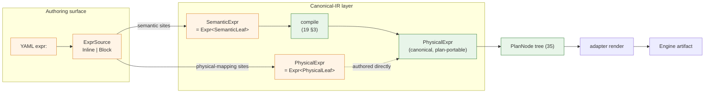
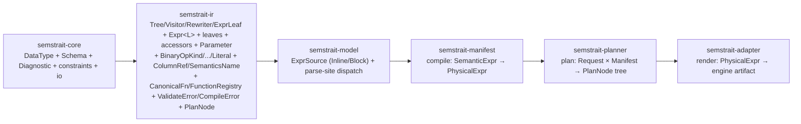

# 14. Expressions

> **Status:** ratified (second refinement landed 2026-05-18; cascade rebases of `19` / `31` / `35` complete per `STATUS.md` item N). This chapter ratifies a **layered expression model** in which one structural tree `Expr<L>` is parameterized over its leaf set, with two canonical leaf sets — `PhysicalLeaf` (canonical-IR leaves) and `SemanticLeaf` (per-kind typed leaves enabled by semantic declarations).
>
> The shape: `SemanticExpr` is sugar on top of `PhysicalExpr` — they share `Expr<L>`'s structural variants, differ only in leaf set. Per-kind typed semantic leaves (`Field`, `Dimension`, `Measure`, `Metric`, `Key`) carry sugar accessors as `Option<XxxAccessor>` fields (no wrapping `Accessor` enum, no `EntityRef`/`Access` indirection). The authoring surface provides six canonical constructors (`col`, `field`, `dim`, `measure`, `metric`, `key`) with exact YAML-tag ↔ Rust-DSL alignment.

---

## 1. Purpose and Scope

`semstrait` is canonical-first per `[00 §3](../00_overview.md)`. Two conversion boundaries exist: YAML → canonical (compile-time) and canonical → engine (adapt-time). Expressions are the unit through which both boundaries operate.

**What `14` ratifies:**

- One structural tree shape `Expr<L>` shared across the pipeline (§3.3).
- Two leaf sets that vary by layer: `PhysicalLeaf` (canonical-IR) and `SemanticLeaf` (per-kind typed) (§3.4 / §3.5).
- The two named layer aliases `PhysicalExpr` and `SemanticExpr` (§3.6).
- The per-kind typed semantic leaves (`Field`, `Dimension`, `Measure`, `Metric`, `Key`) and the optional sugar accessors carried as `Option<XxxAccessor>` fields on each typed leaf (§4).
- The compile-emitted `Parameter` placeholder mechanism with typed `ParameterKey` (§5.1–§5.3).
- The non-coercion / pass-through posture — no implicit type promotion at the canonical layer (§5.4).
- The six canonical authoring-surface constructors (`col`, `field`, `dim`, `measure`, `metric`, `key`) with exact YAML-tag ↔ Rust-DSL alignment (§6).
- The `ExprSource` YAML authoring surface, parse-site dispatch, and bare-identifier rules (§6).
- Per-site shape gates governing which authoring sites admit which expression shapes (§7).
- The auto-mapping synthesis pre-step at compile and the `Column`-under-manual-mapping rejection rule (§8).
- The crate placement of the expression layer (§9).

**What `14` does NOT ratify** (forward-refs):

- `CanonicalFn` newtype, `FunctionRegistry`, `FunctionSpec`, signature polymorphism, return-type rules, function-level `Additivity`, adapter extension API — `[14a](14a_function_catalog.md)`.
- The compile-time resolution algorithm and the Phase A / Phase B pipeline (substitution, cross-DataKind BFS, cycle detection, type inference, Semantics-boundary reconciliation, `ResolvedExprTable` shape, per-`(Semantics, Binding)` keying, auto-mapping synthesis, sugar contract, Phase B placement, advisory channel) — `[19](19_expression_flow.md)`.
- `SemanticMapping` value shape — `[18 §10](18_entities.md)`.
- `Binding` algorithm — `[15](15_mapping_and_binding.md)`.

**Key invariants from `[00 §9](../00_overview.md)` that `14` directly upholds:**

- **I1** — no raw SQL in canonical layers. `Expr<L>` is a typed tree; no `String`-as-SQL fields.
- **I2** — physical types belong to adapters. `Expr<L>` types in canonical `DataType` per `[13](13_types_and_grain.md)`.
- **I3** — no engine/provider branching in canonical crates. Engine specifics live behind `FunctionRegistry` extensions (`14a`) and adapter rewrites.
- **I5** — name resolution at compile time. The per-kind typed `SemanticLeaf` variants (`Field`, `Dimension`, `Measure`, `Metric`, `Key`) carry unresolved names at parse and are resolved at compile; `PhysicalLeaf` carries no semantic references.
- **I7** — strict acyclic crate DAG. The placement in §9 preserves the workspace DAG.
- **I10** — non-exhaustive public sum types. Every leaf set, structural variant, and accessor enum carries `#[non_exhaustive]`.
- **I12** — first-class typed diagnostics by stage. Construction-time validations and compile-time errors flow through `Diagnostic<K>` per `[00 §9](../00_overview.md)`.

---

## 2. Layered Model

### 2.1 Three concerns, one structural tree

The expression layer carries three distinct concerns:

1. **Universal traversal** — children, with-new-children, visitor/rewriter walks. Stage-agnostic.
2. **Canonical IR form** — engine-portable expressions that adapters render. Uses `CanonicalFn` for function identity. References physical columns and compile-emitted parameters.
3. **Authoring sugar** — references to declared semantic entities (Dimensions / Measures / Metrics / Keys per `[18](18_entities.md)`) and per-entity shorthand operators (e.g. `measure.previous`, `metric.delta`). Available only inside a Semantic context.

The design separates these three concerns along **leaf-set boundaries**, with one shared structural skeleton:

- A single `Expr<L>` enum carries every structural operator (arithmetic, comparison, logical, `Case`, `FunctionCall`, `Aggregate`, `Window`, …) recursively over its own leaf type `L`.
- A `PhysicalLeaf` set defines the canonical-IR leaves.
- A `SemanticLeaf` set defines the sugar-enabled leaves.
- Type aliases name the two named layers — `PhysicalExpr = Expr<PhysicalLeaf>` and `SemanticExpr = Expr<SemanticLeaf>`.

This is the **layered model**: `SemanticExpr` borrows the entire structural shape of `PhysicalExpr` and exchanges the leaf set for one that includes sugar. The two named types share their structural variants by construction — declared once, used twice.

### 2.2 Pipeline at a glance



Two boundary crossings:

- **Authoring → canonical**: parse-site dispatch (`semstrait-model`) decides whether the source enters as `SemanticExpr` or `PhysicalExpr`. Semantic sites (Measure `expr:`, Metric `expr:`, computed Dimension `expr:`, DataKind-level Filter `expr:`) parse to `SemanticExpr`. Physical-mapping sites (`semantic_mapping.<x>.expr:`) parse to `PhysicalExpr` directly. Per-site catalog is in §7.
- **Canonical → engine**: adapter rewrites `PhysicalExpr` to engine-native shapes after the planner finalises the `PlanNode` tree per `[35](../apis/35_semstrait_ir.md)`.

`SemanticExpr` is a **transient** form. It exists between parse and compile; it is never persisted in the `SemanticManifest`, never observed by the planner, and never observed by adapters. Only `PhysicalExpr` (modulo `Parameter` leaves bound at plan time per §5) crosses the manifest boundary.

### 2.3 Why "sugar on top of canonical"

The framing matters for clarity:

- The **canonical form is foundational**. `PhysicalExpr` is what every downstream stage consumes. It must be expressible without any reference to semantic declarations (an author writing `semantic_mapping.<x>.expr:` writes `PhysicalExpr` directly with no semantic context).
- **Sugar is opt-in**. `SemanticExpr`'s additional leaves (`Field`, `Dimension`, `Measure`, `Metric`, `Key`) are only meaningful inside a Semantic context — i.e. when at least one Dimension / Measure / Metric is declared. They give authors a shorter, name-driven authoring surface that compiles down to the canonical form.
- **Structural operators are shared**. `BinaryOp`, `Case`, `FunctionCall`, `Aggregate`, etc. carry the same shape in both forms. The compile pipeline does not re-implement structural traversal; it transforms leaves.

This avoids the maintenance burden of duplicating structural variants across two parallel enums while keeping the type system honest about which leaves are legal where.

---

## 3. Type Architecture

### 3.1 The `Tree` trait — universal traversal

The traversal contract is **node-shape-agnostic** — it works for `Expr<L>` regardless of leaf set, and may also be implemented for plan-tree nodes per `[35](../apis/35_semstrait_ir.md)`. The trait is therefore stage-agnostic.

```rust
pub trait Tree: Sized {
    fn children(&self) -> Vec<&Self>;
    fn with_new_children(self, new_children: Vec<Self>) -> Result<Self, ValidateError>;
}
```

Default-derived helpers on `Tree` (no separate trait method required):

```rust
impl<T: Tree> T {
    /// Pre-order read-only walk.
    pub fn apply<V: Visitor<Self>>(&self, v: &mut V) -> V::Output { /* default body */ }
    /// Bottom-up rewrite.
    pub fn transform<F>(self, f: F) -> Result<Self, ValidateError>
    where F: FnMut(Self) -> Result<Self, ValidateError> { /* default body */ }
}
```

`Visitor` / `Rewriter` companion traits follow the `f_down` / `f_up` shape (compatible with the pattern documented for canonical tree-traversal libraries):

```rust
pub trait Visitor<N> {
    type Output;
    fn f_down(&mut self, node: &N) -> ControlFlow<Self::Output>;
    fn f_up(&mut self,   node: &N) -> ControlFlow<Self::Output>;
}

pub trait Rewriter<N> {
    fn f_down(&mut self, node: N) -> Result<N, ValidateError>;
    fn f_up(&mut self,   node: N) -> Result<N, ValidateError>;
}
```

The trait surface stays small. All algorithmic work in the rest of the pipeline (compile, plan, adapt) composes these primitives.

### 3.2 The `ExprLeaf` trait

Each leaf set implements a small trait that exposes the per-leaf metadata the structural layer needs:

```rust
pub trait ExprLeaf: Sized + Clone + Debug {
    /// Canonical logical type carried (or inferred) by this leaf.
    /// Returns `None` only when type cannot be determined locally
    /// (e.g. untyped `Null`, untyped `Field` before resolution).
    fn inferred_type(&self) -> Option<&DataType>;
}
```

`ExprLeaf` is intentionally minimal — leaf-set–specific behaviour (e.g., semantic-ref resolution per `[19 §3](19_expression_flow.md)`, `Parameter` binding at plan time) lives at the site that operates on the leaf, not as a trait method. This keeps the trait surface stable across leaf-set evolution.

### 3.3 `Expr<L>` — structural-variant catalog

The structural variants are declared once and parameterised over `L`. Every structural variant is `#[non_exhaustive]` per I10.

```rust
#[non_exhaustive]
pub enum Expr<L: ExprLeaf> {
    Leaf(L),

    BinaryOp     { op: BinaryOpKind, left: Box<Self>, right: Box<Self> },
    UnaryOp      { op: UnaryOpKind,  operand: Box<Self> },
    FunctionCall { name: CanonicalFn, args: Vec<Self> },
    Cast         { input: Box<Self>, target: DataType, on_failure: CastFailure },
    Case         { whens: Vec<(Self, Self)>, else_: Option<Box<Self>> },
    InList       { value: Box<Self>, list: Vec<Self>, negated: bool },
    Between      { value: Box<Self>, low: Box<Self>, high: Box<Self>, negated: bool },
    Like         { value: Box<Self>, pattern: Box<Self>, kind: LikeKind },
    IsNull(Box<Self>),
    Coalesce(Vec<Self>),
    NullIf       { left: Box<Self>, right: Box<Self> },
    Aggregate    { op: AggregationOp, args: Vec<Self>, distinct: bool, filter: Option<Box<Self>> },
    Window       { function: WindowFn, args: Vec<Self>, partition_by: Vec<Self>, order_by: Vec<Self>, frame: Option<WindowFrame> },
}
```

**Notes on the structural catalog:**

- `BinaryOpKind` covers the canonical arithmetic / comparison / logical operators (`Add`, `Subtract`, `Multiply`, `Divide`, `SafeDivide`, `Mod`, `Eq`, `NotEq`, `Lt`, `LtEq`, `Gt`, `GtEq`, `And`, `Or`). `UnaryOpKind` covers `Negate` and `Not`. Both enums are `#[non_exhaustive]`.
- `CanonicalFn` is the stable canonical function identity per `[14a](14a_function_catalog.md)`; the registry is the single source of truth for which names exist.
- `Aggregate`'s `filter` field carries the canonical `agg(expr) FILTER (WHERE p)` shape; adapter compensation for engines without native `FILTER` is the adapter's concern (not part of the canonical IR).
- `Window` is in the structural catalog (rather than being a leaf) because its inner operands recurse over `Self`. In practice, `Window` is **compile-emitted only** — author-facing parsers do not accept window syntax; `Window` nodes enter the tree exclusively through sugar-accessor elimination during compile (§4.2 — typed leaves with `accessor: Some(_)` lower to `Window`-rooted subtrees).
- Engine-specific operators or function-shaped predicates do **not** add `Expr<L>` variants. They land as `FunctionCall` entries via `FunctionRegistry` extensions per `[14a](14a_function_catalog.md)`.

### 3.4 `PhysicalLeaf` — canonical-IR leaf set

The canonical-IR leaf set carries exactly what the planner and adapters need:

```rust
#[non_exhaustive]
pub enum PhysicalLeaf {
    /// Physical column reference (binding-resolved).
    Column(ColumnRef),

    /// Typed literal value.
    Literal(Literal),

    /// Compile-emitted, plan-bound parameter placeholder.
    /// Replaced with a concrete value during planning (§5).
    Parameter(Parameter),
}

impl ExprLeaf for PhysicalLeaf { /* per-variant inferred_type */ }
```

`PhysicalExpr = Expr<PhysicalLeaf>` is the **canonical IR form**. Adapters render from this form. The `SemanticManifest` stores `PhysicalExpr` per-`(Semantics, Binding)` pair per `[19 §3.2](19_expression_flow.md)`.

Notable invariants on `PhysicalExpr`:

- No `Field` / `Dimension` / `Measure` / `Metric` / `Key` — semantic references are eliminated during compile.
- No sugar accessors — typed-leaf-with-accessor leaves are eliminated during compile (lowered to `Window`-rooted subtrees per §4.2).
- `Parameter` leaves are the only non-resolved state the canonical IR carries; they MUST be substituted before adapt time (§5.3 postcondition).

### 3.5 `SemanticLeaf` — per-kind typed leaf set

The semantic leaf set carries **per-kind typed leaves**, eliminating the bare-identifier ambiguity that previously surfaced under `semantic_mapping: auto` name collisions. Each typed leaf optionally carries a kind-specific sugar accessor (§4).

```rust
#[non_exhaustive]
pub enum SemanticLeaf {
    /// Typed literal value.
    Literal(Literal),

    /// Physical column reference. Type-admissible inside SemanticExpr, but
    /// LEGAL only when the owning binding uses `semantic_mapping: auto`.
    /// Compile rejects this leaf under manual mapping (see §8).
    /// Authored as `col(name)` or via bare identifier in physical-mapping sites.
    Column(ColumnRef),

    /// Untyped semantic reference. Kind resolved at compile by name lookup
    /// against the semantic registry. Authored as `field(name)` or via bare
    /// identifier in semantic sites.
    Field(SemanticsName),

    /// Typed Dimension reference, optionally with sugar accessor.
    /// Authored as `dim(name)` or `dim(name).first()` / `.lag(2)` / etc.
    Dimension { name: SemanticsName, accessor: Option<DimensionAccessor> },

    /// Typed Measure reference, optionally with sugar accessor.
    /// Authored as `measure(name)` or `measure(name).previous()` / `.delta()` / etc.
    Measure { name: SemanticsName, accessor: Option<MeasureAccessor> },

    /// Typed Metric reference, optionally with sugar accessor.
    Metric { name: SemanticsName, accessor: Option<MetricAccessor> },

    /// Typed Key reference, optionally with sugar accessor.
    Key { name: SemanticsName, accessor: Option<KeyAccessor> },
}

impl ExprLeaf for SemanticLeaf { /* per-variant inferred_type — None for unresolved Field */ }
```

`SemanticExpr = Expr<SemanticLeaf>` is the **authoring form** of an expression inside any semantic site.

Notable properties:

- **No `EntityRef` wrapper, no `Access` wrapper, no `Accessor` outer enum.** Every semantic reference is a typed leaf whose variant tag already encodes the entity kind. The per-kind accessor enums (§4) sit as `Option<…>` fields on the typed leaves.
- **`Field` is the untyped fallback.** When the author writes a bare identifier or explicit `field(name)`, the leaf carries no kind hint; compile resolves the kind by registry lookup.
- **`Dimension` / `Measure` / `Metric` / `Key` are kind-pinned.** Compile fails fast if the registered semantic at `name` has a different kind than the authored leaf variant.
- **`Column` is conditionally legal.** Type-admissible (so the parser can construct it), but compile rejects it under manual mapping (§8). Under `semantic_mapping: auto`, compile synthesizes `SemanticMapping` entries for `Column` leaves and the rest of resolution proceeds as with manual mapping.
- **Sugar accessor agreement is type-enforced.** A `Dimension` leaf can only carry a `DimensionAccessor`, not a `MeasureAccessor` — the variant signature prevents mismatched pairings at construction time.
- **No `Parameter`.** Parameters are exclusively compile-emitted and live only in `PhysicalLeaf`.

### 3.6 Type aliases

```rust
pub type PhysicalExpr = Expr<PhysicalLeaf>;
pub type SemanticExpr = Expr<SemanticLeaf>;
```

These are the spelled-out names used throughout downstream docs and APIs. The generic form `Expr<L>` appears in trait bounds and shared algorithmic code.

### 3.7 Forbidden combinations are type-enforced

Because the leaf sets differ structurally:

- `PhysicalExpr` **cannot contain** `Field` / `Dimension` / `Measure` / `Metric` / `Key` — those variants do not exist in `PhysicalLeaf`. All semantic references are eliminated during compile.
- `SemanticExpr` **cannot contain** `Parameter` — `Parameter` is a `PhysicalLeaf`-only variant.
- A `Dimension`-tagged leaf cannot carry a `MeasureAccessor` (or any non-Dimension accessor) — the variant signature `Dimension { name, accessor: Option<DimensionAccessor> }` enforces kind agreement at construction. The same holds for `Measure` / `Metric` / `Key`.

These invariants are upheld at the type level, not by runtime assertion. There is no `try_into_physical` runtime check, no defensive `panic!` for "Field found in PhysicalExpr".

**`SemanticLeaf::Column` is type-admissible but context-validated.** The leaf can be constructed (via `col(name)` or via bare identifier at a physical-mapping site that re-uses the same leaf set), but compile rejects it under manual mapping. The full rule is in §8.

The remaining structural invariants (e.g., `Aggregate` admitted only in aggregate-admitting sites, `Window` author-rejected) are construction-boundary checks; see §7.

---

## 4. Per-Entity Accessor Sugar

### 4.1 The per-kind accessor enums

Per-entity sugar lets authors write shorthand like `measure("revenue").previous()` or `metric("conv_rate").delta()`. The mechanism is a kind-specific accessor enum carried as an `Option<…>` field on the typed semantic leaves (§3.5):

```rust
#[non_exhaustive]
pub enum DimensionAccessor {
    First,
    Last,
    Lag(u32),
    Lead(u32),
}

#[non_exhaustive]
pub enum MeasureAccessor {
    Previous,
    Next,
    Lag(u32),
    Lead(u32),
    Delta,
    PercentChange,
}

#[non_exhaustive]
pub enum MetricAccessor {
    Previous,
    Next,
    Lag(u32),
    Lead(u32),
    Delta,
    PercentChange,
}

#[non_exhaustive]
pub enum KeyAccessor {
    First,
    Last,
    Lag(u32),
    Lead(u32),
}
```

Two structural pairings emerge:

- **`MetricAccessor` mirrors `MeasureAccessor` 1:1**. A Metric is a per-group already-aggregated value at access time, structurally identical to a Measure at the output projection stage.
- **`KeyAccessor` mirrors `DimensionAccessor` 1:1**. A Key is a Dimension-shaped entity for sugar purposes; the windowed accessor surface is symmetric.

There is **no outer `Accessor` wrapping enum**. Each per-kind accessor enum is carried directly on the matching typed leaf (`SemanticLeaf::Dimension { accessor: Option<DimensionAccessor> }`, etc.). The type system enforces kind agreement at construction: a `Dimension` leaf simply has no way to carry a `MeasureAccessor`.

The `Field` leaf carries no accessor — it is the untyped semantic reference whose kind is resolved at compile. To apply sugar, authors use the typed accessor for the matching kind (`measure("x").delta()`, not `field("x").delta()`).

### 4.2 Sugar elimination shape

A typed leaf with `accessor: Some(_)` lowers at compile to a canonical `Window`-rooted subtree:

```text
SemanticLeaf::Measure { name: "revenue", accessor: Some(MeasureAccessor::Previous) }
  ─→ Expr::Window {
       function: <derived from accessor>,
       args:         [<resolved Measure "revenue" expr>],
       partition_by: [Parameter(RequestDimensionsMinusTemporal)],
       order_by:     [Parameter(RequestTemporalAxis)],
       frame:        Some(<derived from accessor>),
     }
```

A typed leaf with `accessor: None` lowers to whatever the registered semantic at `name` resolves to (its own `expr` tree under the binding's `SemanticMapping`), unwrapped — no `Window` is emitted.

Compile substitutes the entity reference (the `name` field) inside `args` via the binding's `SemanticMapping` per `[15](15_mapping_and_binding.md)`. The `partition_by` / `order_by` slots emit `Parameter` leaves whose `ParameterKey`s are bound at plan time (§5).

**Sugar-on-sugar handling.** Some accessors lower to compositions that still contain typed leaves with `accessor: Some(_)` — for example, `Delta` lowers to `operand - operand.Previous`, where `operand.Previous` is still a typed leaf with `Some(Previous)` accessor. The compile pipeline runs sugar elimination **to fixpoint** so that every typed leaf with a non-`None` accessor is eliminated before downstream substeps begin. Detailed substep ordering lives in `[19 §3.1](19_expression_flow.md)`.

---

## 5. Parameter — Compile-Emitted Placeholder

### 5.1 Shape

```rust
pub struct Parameter {
    pub key: ParameterKey,
    pub data_type: DataType,
}
```

`Parameter` carries a typed key (not a stringly identifier) and a mandatory `data_type` at compile-emit time. The `data_type` lets downstream stages reason about the placeholder's eventual concrete shape without re-deriving it.

### 5.2 `ParameterKey` — closed set

```rust
#[non_exhaustive]
pub enum ParameterKey {
    RequestDimensionsMinusTemporal,
    RequestTemporalAxis,
}
```

The closed parameter set is **internal** — adding members is additive per I10 and is not author-extensible. v1 carries exactly the two keys needed by Family-B-sugar elimination (§4.2); future keys land via `#[non_exhaustive]` additions.

### 5.3 Plan-time binding postcondition

Per the canonical pipeline (`[00 §5](../00_overview.md)`), the planner substitutes `Parameter` leaves against the `Request` during plan construction. The postcondition is that **no `Parameter` survives into adapt-time**: a `Parameter` reaching an adapter is a hard error owned by the planner (`PlanErrorKind`), not the adapter.

The planner-level binding mechanics and the exact `Request` shape that supplies the substitution values live in `[19](19_expression_flow.md)` and `[34 / planner contract](../apis/34_semstrait_planner.md)`. This chapter ratifies the placeholder shape and the postcondition only.

### 5.4 Non-coercion posture (pass-through)

semstrait performs **no implicit type coercion or promotion** at the canonical layer:

- **Function calls** — signature matching requires exact `DataType` equality per-argument per `[14a §3.3](14a_function_catalog.md)`. No `Integer → Long` widening, no `String → Date` parsing. On mismatch: `manifest::CompileError::NoMatchingSignature`. Authors insert explicit `Cast` when types differ.
- **Binary operators** — arithmetic return type is `SameAs(left_operand)`. Cross-operand type compatibility (`Integer < String`, `Double + Date`) is **not validated at the semstrait layer** — the engine raises its own diagnostics at execution time. This keeps semstrait's compile deterministic and engine-neutral.
- **Comparison operators** — produce `Boolean` regardless of operand types. No canonical comparison-compatibility matrix in v1.
- **NULL handling** — NULL-in / NULL-out behaviour is engine-delegated. `FunctionSpec` carries no `null_handling` field; the canonical IR expresses structural null-test shapes (`IsNull`, `Coalesce`, `NullIf`) but does not model per-function null-propagation semantics.
- **Join-key compatibility** — deferred to the engine per `[13](13_types_and_grain.md)`.

This posture keeps the canonical layer thin and engine-neutral: semstrait compiles structure, not execution semantics. Engine-specific type compatibility (DataFusion's arrow promotion, DuckDB's implicit casts, Spark's ANSI-strict mode) is the adapter's concern.

---

## 6. ExprSource — YAML Authoring Surface

### 6.1 Two forms, one tree

```rust
#[non_exhaustive]
pub enum ExprSource<L: ExprLeaf> {
    /// Constrained SQL-like DSL string.
    Inline(String),

    /// Structured YAML tree — `Expr<L>` deserialized directly via serde.
    Block(Expr<L>),
}
```

Both forms produce a tree value of the parse-site's expected type — `ExprSource<SemanticLeaf>` at semantic sites (yielding `SemanticExpr`) or `ExprSource<PhysicalLeaf>` at physical-mapping sites (yielding `PhysicalExpr`). The two forms are **interchangeable** in expressive power for everything that fits the Inline DSL's grammar; the Declarative form additionally covers everything the Inline DSL deliberately omits.

The `Block(...)` variant carries an `Expr<L>` value directly. There is **no separate `ExprBlock` parallel AST**: the YAML serde shape *is* `Expr<L>` deserialized, using the serde derives on `Expr<L>` owned by `semstrait-ir` per `[35 §14.1](../apis/35_semstrait_ir.md)`. The reserved-tag catalog of §6.4 is therefore implemented as serde tag-discrimination on `Expr<L>`'s `#[serde(tag = "...")]` derive (structural variants) plus a `FunctionRegistry` look-aside for non-reserved tags — both wired in `semstrait-model`'s `Deserialize` impl for `ExprSource<L>`.

### 6.2 Parse-site dispatch

Parsing produces a typed result per site:

```rust
impl ExprSource {
    /// Parse at a semantic site. Bare identifiers resolve to `Field(name)`.
    pub fn parse_semantic(&self, ctx: &ParseCtx) -> Result<SemanticExpr, ParseErrorKind>;

    /// Parse at a physical-mapping site. Bare identifiers resolve to `Column(name)`.
    /// Semantic tags (`field`, `dim`, `measure`, `metric`, `key`) are rejected.
    pub fn parse_physical(&self, ctx: &ParseCtx) -> Result<PhysicalExpr, ParseErrorKind>;
}
```

The site catalog — which authoring locations parse via which method — is in §7. The owning crate for parse-site dispatch is `semstrait-model` (§9.3).

### 6.3 Inline DSL grammar (outline)

The Inline DSL is a minimal SQL-shaped grammar covering common day-to-day expressions:

- **Identifiers**: `[A-Za-z_][A-Za-z0-9_]*`, resolved per parse site (§6.5).
- **Literals**: integer / float / single- or double-quoted string / boolean / `null`.
- **Operators**: `+`, `-`, `*`, `/`, `%`, comparison (`=`, `<>`, `<`, `<=`, `>`, `>=`), logical (`AND`, `OR`, `NOT`), unary negation, `IS NULL`, `IS NOT NULL`.
- **Function call form**: `name(arg1, arg2, ...)`; `name` resolves against `FunctionRegistry` at compile.
- **Parentheses** for grouping.

What the Inline DSL deliberately does NOT accept (use Declarative block instead):

- `CAST(x AS Type)` — use `{cast: {...}}`
- `CASE WHEN ... THEN ... ELSE ... END` — use `{case: {...}}`
- `BETWEEN`, `IN`, `LIKE`, regex operators, `DATE_TRUNC` — use explicit tags
- Aggregations — use `{aggregate: {...}}` or carry via Measure `agg:` per `[18 §5.2](18_entities.md)`
- `NULLIF` / `COALESCE` — use explicit tags

Operator precedence follows SQL convention; the full table is the implementer's reference and is uncontroversial. v1 may ship without the Inline DSL if Declarative form is sufficient — the carrier enum reserves the variant either way.

### 6.4 Declarative block tags

A Declarative block is a single-key map whose key is a **tag**:

1. **Reserved AST tags** map 1:1 to `Expr<L>` structural variants. The full catalog is in §6.4.1.
2. **Function-registry tags** — any non-reserved tag is looked up in `FunctionRegistry` (`14a`); on hit, the block parses as a shortcut for `FunctionCall { name: <tag>, args }` using the registry's declared arity / arg-shape. On miss, `ParseErrorKind::UnknownTag`.

This dispatch model means **every registered scalar function is authorable as a top-level tag** without bloating the parser or the AST.

#### 6.4.1 Reserved tag catalog

Each reserved tag maps 1:1 to an `Expr<L>` structural variant from §3.3 or to a leaf from §3.4 / §3.5. The leaf-tag names align exactly with the Rust DSL constructor names so YAML and Rust use the same vocabulary.

**Leaf tags** (authoring-surface constructors):

| Tag | Maps to | Site legality | Carries accessor? |
|---|---|---|---|
| `col` | `PhysicalLeaf::Column` (or `SemanticLeaf::Column` under `auto`) | both | no |
| `literal` | `PhysicalLeaf::Literal` / `SemanticLeaf::Literal` | both | no |
| `field` | `SemanticLeaf::Field` | semantic only | no |
| `dim` | `SemanticLeaf::Dimension` | semantic only | yes — optional `DimensionAccessor` |
| `measure` | `SemanticLeaf::Measure` | semantic only | yes — optional `MeasureAccessor` |
| `metric` | `SemanticLeaf::Metric` | semantic only | yes — optional `MetricAccessor` |
| `key` | `SemanticLeaf::Key` | semantic only | yes — optional `KeyAccessor` |

Short forms (no accessor):

```yaml
expr: { dim: region }
expr: { measure: revenue }
expr: { field: conversion_rate }
expr: { col: amount_cents }       # legal in SemanticExpr only under auto mapping (§8)
```

Long forms (with accessor):

```yaml
expr: { measure: { name: revenue, accessor: previous } }
expr: { dim: { name: order_date, accessor: { lag: 2 } } }
```

The Rust DSL mirrors these exactly:

```rust
expr: dim("region"),
expr: measure("revenue"),
expr: measure("revenue").previous(),
expr: dim("order_date").lag(2),
expr: col("amount_cents"),                      // under auto mapping only
```

**Structural tags** (per §3.3 variants):

| Tag | Structural variant |
|---|---|
| `binary_op` | `BinaryOp` |
| `unary_op` | `UnaryOp` |
| `function_call` | `FunctionCall` (explicit; the verbose form) |
| `cast` | `Cast` |
| `case` | `Case` |
| `in_list` | `InList` |
| `between` | `Between` |
| `like` | `Like` |
| `is_null` | `IsNull` |
| `coalesce` | `Coalesce` |
| `nullif` | `NullIf` |
| `aggregate` | `Aggregate` |

`Window` is intentionally **not** authorable — it is compile-emitted only (§3.3 note).

Reserved-tag collisions with function-registry registrations are rejected at registry seal time per `[14a](14a_function_catalog.md)`.

**Site legality**. `dim` / `measure` / `metric` / `key` / `field` are rejected at physical-mapping sites (`semantic_mapping.<x>.expr:`) — a `PhysicalExpr` cannot reference semantics. `col` is legal in either site, but `SemanticLeaf::Column` is conditionally legal at compile per §8.

### 6.5 Bare-identifier resolution per site

Within both Inline DSL and Declarative form's bare-scalar slots:

- At a **semantic site** parse — bare identifier → `SemanticLeaf::Field(name)`. Equivalent to writing `{ field: name }` explicitly. Kind is resolved at compile by registry lookup.
- At a **physical-mapping site** parse — bare identifier → `PhysicalLeaf::Column(name)`. Equivalent to writing `{ col: name }` explicitly.

There is no sigil; the parse site supplies the context. To force a specific accessor when the bare-identifier default isn't what you want — e.g. when a column and a semantic share a name under `semantic_mapping: auto` (see §8) — use the explicit typed constructor:

- `{ col: revenue }` — unambiguously the physical column.
- `{ field: revenue }` — unambiguously the semantic at that name (kind resolved at compile).
- `{ measure: revenue }` — unambiguously the Measure named `revenue`; compile rejects with `KindMismatch` if `revenue` resolves to a Dimension / Metric / Key instead.

To force literal interpretation when an identifier collides with a reserved keyword or a literal-shaped name (e.g. `true` as a string column name), authors use the explicit `{ literal: ... }` tagged form.

---

## 7. Per-Site Shape Gates

Different authoring sites require different expression *shapes* — scalar / Boolean / aggregate-admitting. The gate is a property of the site, not of the expression type.

The site catalog (per-element shape and parse-site dispatch):

| Site | Parses to | Shape required | Aggregate-admitting? |
|---|---|---|---|
| `measures.<m>.expr` | `SemanticExpr` | scalar | no — aggregation carried by `agg:` per `[18 §5.2](18_entities.md)` |
| `measures.<m>.filters[].expr` | `SemanticExpr` | Boolean | no — scalar predicate inlined into the aggregate's `filter` |
| `metrics.<m>.expr` | `SemanticExpr` | scalar | no — `agg:` (optional) at top-level; `expr:` is a scalar formula over already-aggregated values |
| `metrics.<m>.filters[].expr` | `SemanticExpr` | Boolean | no (compile-split per metric semantics) |
| `dimensions.<d>.expr` (computed) | `SemanticExpr` | scalar | no |
| `filters.<f>.expr` (DataKind-level) | `SemanticExpr` | Boolean | yes — HAVING-style predicates may reference aggregated values |
| `extras.semantic_mapping.<x>.expr` | `PhysicalExpr` | scalar | no |

**Structural shape gates** enforced at parse / construction time:

- Author-written `Aggregate { ... }` syntax inside `expr:` is **rejected at all sites except `filters.<f>.expr`**. Aggregation is carried by the structurally separate `agg:` tag on Measures and Metrics per `[18 §5.2](18_entities.md)`.
- A typed leaf carrying `accessor: Some(_)` whose lowered shape contains `Aggregate` or `Window` is gated against sites whose required result is scalar/Boolean and not aggregate-admitting. The check is on the *lowered* shape, not on syntactic surface — sugars carry their own admissibility metadata.
- `filters[].expr` is admitted only on `measures.<m>` and `metrics.<m>`. No `keys` member-level filter slot. No `dimensions.<d>.filter` — DataKind-level filtering uses the `filters:` block.

The full mechanics of how Phase-B placement consumes these shape gates live in `[19](19_expression_flow.md)`.

---

## 8. Compile-Time Resolution (pointer)

`SemanticExpr` → `PhysicalExpr` lowering is owned by `semstrait-manifest::compile`. The full algorithm — substep order, per-leaf-kind substitution rules, cross-DataKind path resolution, cycle detection, type inference, Semantics-boundary reconciliation, per-`(Semantics, Binding)` keying of `ResolvedExprTable`, auto-mapping synthesis pre-step, and the `Column`-under-manual-mapping + `SemanticKindMismatch` error rules — lives in `[19 §3](19_expression_flow.md)`.

**Type-level postcondition (upheld here by `PhysicalLeaf`'s variant set).** `PhysicalExpr` carries no `Field` / `Dimension` / `Measure` / `Metric` / `Key` leaves and no typed leaves carrying `accessor: Some(_)`. Compile rewrites every such leaf; `PhysicalLeaf`'s structural shape makes the postcondition unforgeable (per §3.7).

---

## 9. Crate Placement

The layered model maps onto the workspace DAG as follows. Each crate has exactly one job. Post-second-cascade (`STATUS.md` item Q) placement: the full expression vocabulary lives in `semstrait-ir`; `semstrait-core` keeps only non-expression shared vocabulary.



### 9.1 `semstrait-core`

Owns (non-expression shared vocabulary only):

- The logical-type vocabulary `DataType`, `Grain`, `TypeClass`, `Schema`, `SchemaColumn` per `[13](13_types_and_grain.md)`.
- The constraint-DSL shapes `MeasureConstraints`, `DimensionConstraints`, `AggregationConstraints` per `[11 §8.3](11_constraints.md)` / `§8.4`.
- The cross-cutting diagnostic primitives `Diagnostic<K>`, `Diagnostics<K>`, `Diagnose`, `Severity`, `Location`, `Span`, `SourceId` per `[30 §5](../apis/30_api_contracts.md)`.
- The byte-blob `io` transport per `[31b](../apis/31b_semstrait_core_io.md)`.

Does NOT own (everything tied to the expression tree moved to `semstrait-ir`):

- The traversal trait family — `Tree`, `Visitor<N>`, `Rewriter<N>`, `ExprLeaf` (lives in `semstrait-ir` per §9.2).
- The structural-variant support enums — `BinaryOpKind`, `UnaryOpKind`, `AggregationOp`, `LikeKind`, `CastFailure`, `WindowFn`, `WindowFrame`, `WindowFrameKind`, `WindowBound`, `Literal` (lives in `semstrait-ir`).
- The identifier carriers — `ColumnRef`, `SemanticsName` (lives in `semstrait-ir`).
- The narrow expression-side error kinds — `ValidateError`, `CompileError` (lives in `semstrait-ir`).
- `Expr<L>`, `PhysicalLeaf`, `SemanticLeaf`, accessor enums, `Parameter`, `CanonicalFn`, `FunctionRegistry`, `expr_fn` DSL — all in `semstrait-ir`.

Rationale: `semstrait-core` is the workspace-DAG leaf (I7). The placement rule is precise — a type belongs in core iff it is consumed by two or more crates that do not depend on `semstrait-ir`. Every type tied to expression trees or plan trees is consumed only through `semstrait-ir`, so it belongs there.

### 9.2 `semstrait-ir` — canonical-IR layer

Owns the **full expression vocabulary**:

- The traversal trait family `Tree`, `Visitor<N>`, `Rewriter<N>`, `ExprLeaf` (§3.1 / §3.2) — moved from `semstrait-core` at the second cascade.
- The structural-variant support enums `BinaryOpKind`, `UnaryOpKind`, `AggregationOp`, `LikeKind`, `CastFailure`, `WindowFn`, `WindowFrame`, `WindowFrameKind`, `WindowBound`, `Literal` (rosters per §3.3) — moved from `semstrait-core` at the second cascade.
- The identifier carriers `ColumnRef`, `SemanticsName` (§3.4 / §3.5) — moved from `semstrait-core` at the second cascade.
- The `Expr<L>` structural enum (§3.3).
- The `PhysicalLeaf` and `SemanticLeaf` enums (§3.4 / §3.5), including the per-kind typed semantic leaves (`Field`, `Dimension`, `Measure`, `Metric`, `Key`).
- The `PhysicalExpr` / `SemanticExpr` type aliases (§3.6).
- The per-kind accessor enums (`DimensionAccessor`, `MeasureAccessor`, `MetricAccessor`, `KeyAccessor`) carried as `Option<…>` fields on the typed semantic leaves (§4.1).
- The `Parameter` placeholder + `ParameterKey` closed enum (§5.1 / §5.2).
- The authoring-surface constructors (`col`, `field`, `dim`, `measure`, `metric`, `key`) in `expr_fn` per the layered-DSL pattern (§6.4.1).
- `CanonicalFn` and the `FunctionRegistry` per `[14a](14a_function_catalog.md)`.
- The narrow error kinds `ValidateError` (raised by `Tree::with_new_children` + `Rewriter<N>::f_*`) and `CompileError` (raised by `ReturnTypeRule::Custom` callbacks). Per `[35 §15.1](../apis/35_semstrait_ir.md)` / `[§15.2](../apis/35_semstrait_ir.md)`. The `Kind` suffix is dropped on these two enums per the scoped cleanup tied to the second-cascade landing; downstream stages embed via D.ii kind-nesting.
- `PlanNode` and the canonical plan-tree per `[35](../apis/35_semstrait_ir.md)`.

Rationale: this crate is the **canonical Internal Representation** of the workspace. It carries every type the post-compile pipeline operates on. Adapters consume from here; the manifest produces from here; the planner composes from here. Co-locating the trait family + support enums + literal / identifier carriers + narrow error kinds with their producers (`Expr<L>`, `PlanNode`, `FunctionSpec`) eliminates the cross-crate hop downstream consumers previously paid and is the natural conclusion of Option A.

### 9.3 `semstrait-model`

Owns:

- The `ExprSource` enum (§6.1) — `Inline(String)` and `Block(Expr<L>)`. The `Block(...)` variant carries `Expr<SemanticLeaf>` at semantic sites and `Expr<PhysicalLeaf>` at physical-mapping sites directly, deserialized via the serde derives on `Expr<L>` (`[35 §14.1](../apis/35_semstrait_ir.md)`). There is **no separate `ExprBlock` type** — the YAML serde shape *is* `Expr<L>` deserialized.
- Parse-site dispatch (`parse_semantic` / `parse_physical`) (§6.2).
- The Inline DSL grammar implementation (§6.3) when shipped.
- The reserved-tag catalog used by the `Block(...)` parser to recognize structural-variant tags vs `FunctionRegistry` lookups (§6.4).
- The author-facing entity types (`Dimension`, `Measure`, `Metric`, `Key`, `Filter`, …) per `[18](18_entities.md)`.
- Structural validation that does not require catalog resolution.

Depends on `semstrait-ir` because every parsing entry point produces a typed `Expr<L>` value owned by `semstrait-ir`. The `model::ValidateError` enum embeds `Ir(ir::ValidateError)` via D.ii kind-nesting (`[30 §7.4](../apis/30_api_contracts.md)`) for construction-boundary failures raised by ir types during parse.

### 9.4 `semstrait-manifest`

Owns:

- The `compile` entry point that transforms `SemanticExpr` into `PhysicalExpr` per `[19 §3](19_expression_flow.md)`.
- `ResolvedExprTable` and per-`(Semantics, Binding)` storage per `[19 §3.2](19_expression_flow.md)`.
- The sealed `SemanticManifest` artifact.
- The wider `manifest::CompileError` (resolution-stage errors — `UnknownReference`, `NoRelationshipPath`, `CyclicReference`, `TypeInferenceFailure`, …). Embeds `Ir(ir::CompileError)` via D.ii kind-nesting for function-return-type failures raised by ir.

Depends on `semstrait-ir` for `Expr<L>`, leaves, `FunctionRegistry`, the trait family, and `ir::CompileError`.

Does not invent new expression types — uses the types from `semstrait-ir`.

### 9.5 Downstream

`semstrait-planner` and `semstrait-adapter` consume `PhysicalExpr` and `PlanNode` from `semstrait-ir`. They contribute no new expression types; planner-side `Parameter` substitution and adapter-side engine rewrites operate on `PhysicalExpr`.

---

## 10. Design Invariants Upheld

The following `[00 §9](../00_overview.md)` invariants find concrete realisations here:

| Invariant | Realisation in `14` |
|---|---|
| **I1** — no raw SQL in canonical layers | `Expr<L>` is a typed tree. Authoring strings (`ExprSource::Inline`) are deliberately not canonical — they are parsed into `Expr<L>` before crossing any stage boundary. |
| **I2** — physical types belong to adapters | Every leaf and structural variant types in canonical `DataType` per `[13](13_types_and_grain.md)`. No `arrow::*` / `spark::*` types appear. |
| **I3** — no engine/provider branching in canonical crates | `FunctionCall { name: CanonicalFn, .. }` references canonical identities. Per-engine name remaps and rewrites live in adapters per `[14a](14a_function_catalog.md)`. |
| **I5** — name resolution at compile time | `SemanticLeaf::Field` / `Dimension` / `Measure` / `Metric` / `Key` carry unresolved names at parse; compile substitutes per binding (§8). `PhysicalLeaf` carries no semantic names. |
| **I7** — strict acyclic crate DAG | The placement in §9 preserves the DAG; `semstrait-core` remains the leaf. `semstrait-ir` ↑ `semstrait-model` ↑ `semstrait-manifest` ↑ `semstrait-planner` ↑ `semstrait-adapter`. |
| **I10** — non-exhaustive public sum types | Every public enum in §3–§5 is `#[non_exhaustive]`. Adding a `MeasureAccessor` variant, an `Expr<L>` structural variant, or a `ParameterKey` is additive. |
| **I12** — first-class typed diagnostics | Construction-time invariant violations surface as `Diagnostic<ValidateError>` (`semstrait-ir` for trait-machinery violations; `semstrait-model::ValidateError` for parse-time violations, embedding `Ir(ir::ValidateError)` via D.ii). Compile-time resolution failures surface as `Diagnostic<CompileError>` (`semstrait-manifest::CompileError` for the wider resolution stage, embedding `Ir(ir::CompileError)` for function-return-type failures). |

---

## 11. Out of Scope for v1

Deferred per `[00 §10](../00_overview.md)` and per the workspace's pre-1.0 surface policy:

- **`Window` author surface**. `Window` is compile-emitted only via sugar-accessor elimination on the typed semantic leaves. Direct authoring of window functions (frame clauses, `RANGE BETWEEN`, etc.) is post-v1.
- **Subquery / correlated subquery / lambda / mask expression forms**. Cross-DataKind correlation rides through the per-kind typed semantic leaves + `Relationship` per `[16](16_composition.md)`.
- **Substrait wire emission as a canonical target**. Substrait is one possible adapter output; the canonical IR is not Substrait-isomorphic.
- **Stringly-typed parameter IDs** (`"$1"` style). Superseded by typed `ParameterKey` (§5.2).
- **Type-class-parameterised function signatures**. v1 uses overload-set polymorphism per `[14a](14a_function_catalog.md)`.
- **Full SQL query parsing**. A future optional crate may lower `sqlparser-rs` AST to `SemanticExpr` + `Request` at the boundary; the canonical IR is not extended for this.

---

## 12. Cross-References

Upstream:

- `[00_overview.md](../00_overview.md)` — canonical-first contract, vocabulary, invariants I1–I12.
- `[13_types_and_grain.md](13_types_and_grain.md)` — canonical `DataType` set; `Grain`.
- `[15_mapping_and_binding.md](15_mapping_and_binding.md)` — `SemanticMapping`, the `Binding` process consumed at compile.
- `[16_composition.md](16_composition.md)` — `Relationship` graph; cross-DataKind reference resolution path.
- `[18_entities.md](18_entities.md)` — entity-kind canonical names (Dimension / Measure / Metric / Key); `Measure` / `Metric` `(agg:, expr:)` pairing; model-level `Additivity`; `SemanticMapping` value shape.

Refinement:

- `[14a_function_catalog.md](14a_function_catalog.md)` — `CanonicalFn`, `FunctionRegistry`, signature polymorphism, return-type rules, function-level `Additivity`.
- `[19_expression_flow.md](19_expression_flow.md)` — Phase A / Phase B compile pipeline; resolution algorithm; sugar contract; per-site shape gates; Phase B placement; advisory channel.

Downstream:

- `[../apis/31_semstrait_core.md](../apis/31_semstrait_core.md)` — trait scaffolding + support enums (no expression types).
- `[../apis/32_semstrait_model.md](../apis/32_semstrait_model.md)` — `semstrait-model`'s parse-site dispatch surface.
- `[../apis/33_semstrait_manifest.md](../apis/33_semstrait_manifest.md)` — compile entry point; `ResolvedExprTable` storage; `Provenance`.
- `[../apis/35_semstrait_ir.md](../apis/35_semstrait_ir.md)` — canonical-IR crate (`Expr<L>`, leaf sets, accessors, `Parameter`, `CanonicalFn`/`FunctionRegistry`).
- `[../apis/36_semstrait_adapter.md](../apis/36_semstrait_adapter.md)` — adapter rendering of `PhysicalExpr` to engine artifacts.
