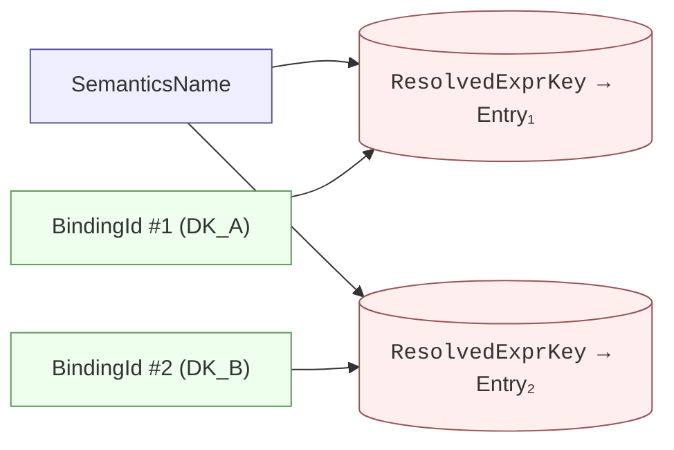
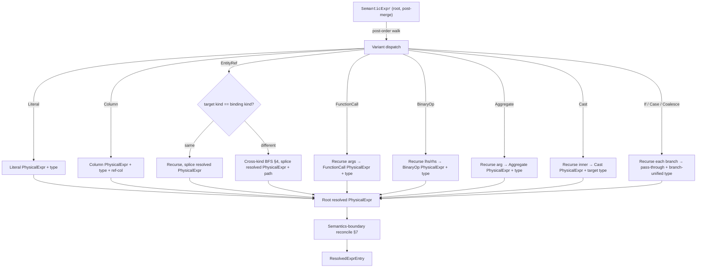

# 14b. Expression Resolution

> **Struct ownership (2026-04-17 consolidation).** `Relationship`, `RelationshipId`, and `SemanticMappingValue` struct shapes are ratified in [`18 §2` / §10](./18_entities.md). This doc owns the *compile-time resolution algorithm* on top — `SemanticExpr → PhysicalExpr` substitution, cross-DataKind BFS over the `Relationship` graph, cycle detection, type inference, `PathSignature` construction, and the `ResolvedExprTable` shape. Where body sections below cite `ColumnMapping` / `column_mapping[].expr`, read `SemanticMapping` / `SemanticMappingValue::Expr` per `18 §10`. The algorithm is unaffected by the rename.
>
> This document ratifies the compile-time expression-resolution pass that turns
> every author-declared `SemanticExpr` into a fully substituted, type-annotated
> `PhysicalExpr` stored in the Manifest's `ResolvedExprTable`. It finalizes
> every forward reference from `14` that points at "compile-time resolution",
> "the `ResolvedExprTable`", "substitution algorithm", "cross-DataKind path
> pre-resolution", or "cycle detection" (`14 §3.2`, `§3.3`, `§4.1`, `§5.4`,
> `§6.4`, `§7.3`).
>
> **Status (Round 1 ratified).** All 18 framework decisions settled per §12's
> Ratified Decisions Index. Four narrower questions on serialization, on
> multi-`EntityRef` path composition, on SCC-vs-linear ordering, and on
> provenance granularity are parked in
> `docs/design/questions/open/14b_questions.md` for later review; each has
> a working default annotated `**Proposed (Round 1):** ...` in the body so
> downstream docs (15, 16, 20–25, 33) have concrete contracts to reference.

## 1. Purpose and Scope

`14b` ratifies **how and when semstrait resolves expressions**. Every `expr:` an author writes — on a Measure, on a Metric, on a Dimension, on a Filter, on a Key member, on a Binding's `column_mapping[].expr` — is authored as a `SemanticExpr` (or, at binding sites, a `PhysicalExpr`) and enters the compile stage as a tree whose leaves may reference **other Semantics** (`EntityRef`) or physical columns (`Column`). The compile stage walks every such tree, substitutes away every `EntityRef`, validates every `Column` against the resolved `PhysicalSource` schema, looks up every `FunctionCall` in the sealed `FunctionRegistry`, and annotates every node with its inferred `DataType`. The output is a `PhysicalExpr` stored verbatim in the Manifest's `ResolvedExprTable`, keyed by `(SemanticsName, BindingId)`.

Per `10 §3.3`'s pipeline, this work lives inside `compile`. Per `00 §6`'s hot-path rule, the entire substitution and lookup work is completed **before** any plan is built, so that `plan` (and every stage downstream) can consume a single `ResolvedExprTable::lookup(name, binding_id)` in O(1) per reference. `14b` is the document that says exactly **what that lookup returns** and **how the compile stage populated it**.

**What `14b` ratifies:**

- The `ResolvedExprTable` — its Rust-level shape, keying discipline, entry structure, ordering invariants, Manifest-level serialization posture (§2).
- The **substitution algorithm** — the post-order `SemanticExpr` walk, per-variant rules, the same-kind vs cross-kind branch point, and the terminal conditions (§3).
- **Cross-DataKind path resolution** — BFS over the `Relationship` graph, the shortest-path rule, ambiguity detection, no-path handling, `PathSignature` construction (§4).
- **Cycle detection** — the Tarjan-SCC pass over the reference DAG, the reportable cycle path, the worked example, and the relationship between cycle detection and the substitution order (§5).
- **Type inference** — bottom-up, per-variant rules, function-registry consultation for `FunctionCall`, promotion rules for `BinaryOp` and `Aggregate`, `Cast` handling, and the guarantee that every `PhysicalExpr` node in every entry carries a populated `inferred_type` (§6).
- **Semantics-boundary reconciliation** — how `14b` implements `14 §6.4`'s declared-vs-inferred reconciliation: `Cast(T)` emission at the Semantics boundary, widening / narrowing diagnostic policy, interaction with `14 §6.5` and `13 §2.2` (§7).
- **Per-Binding keying** — why `SimpleDataKind` yields exactly one entry per Semantics and `ComplexDataKind` (Unionset / Grainset / Joinset) yields one entry per `(SemanticsName, BindingId)` pair, and how the planner consumes both shapes (§8).
- **Ordering of compile sub-passes** — where 14b sits within `compile`, between `validate` (`10 §3.2`), catalog fetch, function-registry seal check, and relationship-graph build (§9).
- **Referenced-column harvesting** — how the per-entry `referenced_columns` list is collected during substitution and what downstream consumers (binding validation, adapter column projection) use it for (§10).
- **Error model** — compile-stage error variants specific to resolution, their stable codes in the `EXPR_E_02xx` sub-range, the mapping between 14b's canonical variant names and 14 §7.3's predecessor draft names (§11).

**What `14b` does NOT ratify** (forward-refs):

- Parse-stage expression errors (`ParseError::Expr*`) or validate-stage structural errors (`ValidateError::*Expr*`) — `14 §7.1` / `§7.2`.
- The `Expr` AST itself (variants, invariants on `SemanticExpr` / `PhysicalExpr`) — `14 §3`.
- The `FunctionRegistry` API or the canonical function catalog — `14a`.
- Plan-time use of the `ResolvedExprTable` entries and `PathSignature`s — `16` and `20–25`.
- The on-disk serialization format of the Manifest (concrete encoding choices, versioning) — `33`. §2.4 below ratifies the shape-level contract only; `33` binds the byte-level encoding.
- Adapter-time rendering of the resolved `PhysicalExpr` to engine-native forms — `34` / `36`.

**Key invariants from `00` / `10` / `14` that `14b` upholds:**

- **I4** (deterministic Manifest) — `ResolvedExprTable` uses an ordered map keyed by `(SemanticsName, BindingId)`; substitution is pure; path ambiguity resolves by hard error rather than by arbitrary tie-break (§4.3). The same input `SemanticModel` therefore produces the byte-identical `ResolvedExprTable`.
- **I5** (compile-time resolution only) — every `EntityRef` is substituted away at compile time; `PhysicalExpr` values stored in `ResolvedExprTable` are `EntityRef`-free by `14 §3.6`'s structural invariant; plan-time lookups are O(1) map accesses (§2.3).
- **I6** (sync hot path) — resolution is a **pure, sync** transformation over already-loaded inputs (parsed Model, fetched catalog, sealed `FunctionRegistry`). `compile` is async-permitted at its outer boundary (`10 §3.3`) solely because of catalog I/O; the resolution sub-pass itself performs no I/O and is synchronous per `10 §3.3`'s table.
- **I8** (planner-complete Manifest) — after `compile` seals, every `(name, binding_id)` combination that plan / optimize / adapt might demand is already in the `ResolvedExprTable`; the planner never triggers a re-resolution (§2.3).
- **I10** (non-exhaustive public sum types) — `CompileError` (§11), `PathSignature` (if it becomes an enum in a later round), and any other public sum type this document introduces are `#[non_exhaustive]`.
- **I12** (fail-fast compile) — every compile-stage error in §11 is fail-fast per `10 §3.3` — the first `CompileError` terminates the compile call with a `Diagnostic::Error`; 14b never buffers multiple resolution errors for the same Manifest.

Concretely:

- Resolution is sync inside the compile body; compile's async wrapper is for catalog fetch only.
- Resolution is pure: same Model + same catalog + same sealed registry ⇒ same `ResolvedExprTable` bytes.
- Resolution populates every `(SemanticsName, BindingId)` pair that any DataKind exposes; the planner never has to ask "is this entry here?" — `14 §6.3` guarantees `lookup` returns `Some(...)` for every well-typed plan-time demand.

## 2. The `ResolvedExprTable`

### 2.1 Shape

```rust
pub struct ResolvedExprTable {
    entries: BTreeMap<ResolvedExprKey, ResolvedExprEntry>,
}

#[derive(Clone, Debug, Eq, PartialEq, Ord, PartialOrd, Hash)]
pub struct ResolvedExprKey {
    pub semantics_name: SemanticsName,
    pub binding_id: BindingId,
}

#[derive(Clone, Debug)]
pub struct ResolvedExprEntry {
    pub physical_expr: PhysicalExpr,
    pub inferred_type: DataType,
    pub referenced_columns: Vec<String>,
    pub path_signature: Option<PathSignature>,
    pub provenance: Provenance,
}
```

**Q1 decision (ordering).** Storage is `BTreeMap`, not `HashMap`. This guarantees deterministic iteration order for Manifest serialization and for any derived artifacts (e.g. adapter-side column-projection lists). Lookups cost `O(log n)` in the number of entries — acceptable because (a) the hot path per `10 §3.3` is plan-time and the table is immutable there, (b) typical Manifests have `n` on the order of hundreds to low thousands, (c) plan-time lookup amortized cost is dominated by expression tree traversal anyway, not table access.

Alternative considered: a `HashMap` with a separate sorted key-index for serialization. Rejected — single storage is simpler and cheaper in memory; `log n` lookups are not measurable compared to plan-time expression handling.

**Q2 decision (`BindingId`).** `BindingId` is a newtype over `u32`, assigned by the compile stage when it registers each Binding in the Manifest:

```rust
#[derive(Copy, Clone, Debug, Eq, PartialEq, Ord, PartialOrd, Hash)]
pub struct BindingId(pub u32);
```

Assignment policy: IDs are assigned in the Manifest-level iteration order of top-level DataKinds and their constituent Bindings (per `11 §11.3`'s name-resolution order — root-declared order, stable across compiles because the parsed Model preserves insertion order). IDs are **not stable across Model edits** — if a new DataKind is inserted upstream of an existing one, the ID of every downstream Binding shifts. This is acceptable because: (a) IDs are internal to the Manifest and never surface in user-facing diagnostics (which quote `DataKind.name / Binding.name` paths, per `10 §5`), (b) Manifests are always re-compiled on source change, (c) no downstream component caches BindingIds across compile runs.

`BindingName` (the author-visible identifier) is **not** used as the map key because: (a) `Binding.name` is unique only within its owning SimpleDataKind, not globally, so a composite key is already unavoidable; (b) `u32` ID is cheaper to hash / compare than the author-visible `(DataKindName, BindingName)` pair; (c) it shields downstream consumers from author renames inside the compile call.

**Q3 decision (`SemanticsName`).** `SemanticsName` is the canonical identity newtype ratified in `11 §4`:

```rust
#[derive(Clone, Debug, Eq, PartialEq, Ord, PartialOrd, Hash)]
pub struct SemanticsName(pub String);
```

Unified global namespace across the whole Model per `11 §4`. No separate `DimensionName` / `MeasureName` species — one opaque name slot.

### 2.2 Ordering and determinism

`BTreeMap<ResolvedExprKey, _>` orders lexicographically by `(semantics_name, binding_id)`. Since (a) `SemanticsName` wraps `String` with its natural byte-lexicographic `Ord`, (b) `BindingId` is `u32`, the full ordering is a total order with no locale sensitivity.

**Determinism check.** Given a frozen input (parsed Model, catalog snapshot, sealed `FunctionRegistry`, source of truth for physical schemas), the compile stage's substitution algorithm is deterministic per §3's algorithm:

- Reference graph build order follows the parsed Model's DataKind / Semantics iteration order.
- Substitution is a pure post-order walk — no hash-based shortcuts that would introduce order dependence.
- BFS in cross-kind path resolution explores neighbors in a deterministic Relationship iteration order (see §4.2).
- Multiple shortest paths surface as `AmbiguousRelationshipPath` (a hard error); there is no tie-break that would cause output variance.

The result: identical compile calls against identical inputs produce byte-identical `ResolvedExprTable`s. This is the compile-layer evidence for `00 §9`'s I4 invariant.

### 2.3 Lookup contract

```rust
impl ResolvedExprTable {
    pub fn lookup(
        &self,
        name: &SemanticsName,
        binding_id: BindingId,
    ) -> Option<&ResolvedExprEntry>;

    pub fn lookup_all(
        &self,
        name: &SemanticsName,
    ) -> impl Iterator<Item = (BindingId, &ResolvedExprEntry)>;

    pub fn iter(
        &self,
    ) -> impl Iterator<Item = (&ResolvedExprKey, &ResolvedExprEntry)>;
}
```

- `lookup(name, binding_id)` — O(log n) map access. Returns `None` only if the caller asks for a combination that 14b's compile-stage completeness check did not populate; `14 §6.3` commits that this will not happen for any `(name, binding_id)` the planner materializes through legal paths.
- `lookup_all(name)` — iterates every `(BindingId, Entry)` for a given Semantics, useful for planner source selection over `ComplexDataKind`s where multiple Bindings can satisfy the same Semantics. Implementation: `BTreeMap::range` on the half-open range `[(name, BindingId(0)), (name_next, BindingId(0)))`.
- `iter()` — full iteration in `(name, binding)` lex order, used by serialization (`33`), adapter column planning (`34` / `36`), and debug tooling.

**Immutability after seal.** Once `compile` returns a `Manifest`, the contained `ResolvedExprTable` is `Arc`-wrapped and never mutated. All public methods take `&self`; there is no `insert` / `remove` / `update` at the public API. `14b` does not expose constructors for `ResolvedExprTable` — only the compile internals build it, and they consume the table as owned before wrapping.

### 2.4 Serialization posture

The Manifest (`33`) binds the byte-level encoding. `14b` ratifies only the shape-level contract that `33` must respect:

- `entries` is encoded in the `BTreeMap`'s natural iteration order — no per-serializer re-sort needed.
- Each `ResolvedExprEntry` is encoded inline — `physical_expr` is not interned into a separate expression pool in v1.
  - **Proposed (Round 1):** no interning. An entry's `physical_expr` is a standalone `PhysicalExpr` tree. Rationale: (a) ~all resolved expressions are small (1–20 nodes) and duplication across entries is moderate; (b) interning introduces a second layer of ID-based indirection that every planner pass must chase; (c) Manifests are produced once and consumed many times, so decode-time simplicity beats encode-time size reduction.
  - Future extension `[TD-14B-EXPR-INTERN]` (tracked in `14b_questions.md`) covers opt-in interning if Manifest sizes grow past comfortable budgets.
- `PhysicalExpr` serialization itself is `14` / `33`'s concern; `14b` only requires that whatever `14` and `33` choose is byte-stable.

### 2.5 Why `(SemanticsName, BindingId)` (not `SemanticsName` alone)

A Semantics can be defined once in author text and **still** produce multiple resolved PhysicalExpr variants, one per Binding that can source it. This happens structurally in two ways:

1. **ComplexDataKind unionset** (`22`): multiple SimpleDataKinds expose the same Semantics name; each has its own Binding; each Binding can produce a different `PhysicalExpr` (different `SemanticMapping`, different physical source). Planner picks among them at source selection time.
2. **Per-Binding `expr:` override on Semantics occurrences** (`11 §6`): the same Semantics name appearing on two SimpleDataKinds can carry different author-declared `expr:` trees on each occurrence; each occurrence's Binding contributes its own resolved entry.

A single-key table `SemanticsName → PhysicalExpr` cannot represent either case without losing information. The two-dimensional key is therefore the minimal faithful encoding.

Compact view:



Entry₁ and Entry₂ may share `inferred_type` (almost always do) but differ in `physical_expr`, `referenced_columns`, and possibly `path_signature`.

### 2.6 The `Provenance` record

```rust
#[derive(Clone, Debug)]
pub struct Provenance {
    pub declared_at: Vec<Location>,
    pub contributing_occurrences: Vec<OccurrenceRef>,
    pub resolved_from_variant: Option<OccurrenceRef>,
}

#[derive(Clone, Debug)]
pub struct OccurrenceRef {
    pub data_kind: DataKindName,
    pub occurrence_role: OccurrenceRole,
}

#[derive(Copy, Clone, Debug)]
pub enum OccurrenceRole {
    Tier1Default,
    LocalVariant,
    NestedKindLocal,
}
```

- `declared_at` — every source Location in author text that contributed material to this entry (the Tier-1 default, any local variants, nested-kind locals when relevant). Non-empty.
- `contributing_occurrences` — the parsed Semantics occurrences whose `expr:` / `data_type:` the resolver actually merged (per `11 §6.3`'s Tier-1 / Tier-2 contract).
- `resolved_from_variant` — when a local variant overrode the Tier-1 default for this Binding, this is the variant's occurrence; otherwise `None` (Tier-1 default was used).

**Purpose.** `Provenance` never leaves the Manifest — no plan-time or adapt-time consumer reads it. It exists purely for diagnostics: when an error fires against an entry, the reporter can quote every Location that contributed, giving authors precise finger-pointing without re-walking the parse tree. It is also used by the `--explain` tooling `[TD-EXPLAIN-COMPILED]`.

**Proposed (Round 1):** granularity per above. The open question asks whether we also record per-`EntityRef`-site location trails (useful for diagnosing cross-kind path errors inside a deep expression). Default for Round 1: no — we rely on the expression tree's own `Location` nodes (from `14`) for that. Tracked in `14b_questions.md`.

## 3. The Substitution Algorithm

### 3.1 Top-level contract

For every `(SemanticsName, BindingId)` pair that the Model exposes, compile invokes:

```rust
pub(crate) fn resolve_to_physical(
    semantics: &Semantics,
    binding: &Binding,
    cx: &ResolveContext<'_>,
) -> Result<ResolvedExprEntry, CompileError>;

pub(crate) struct ResolveContext<'a> {
    pub registry: &'static FunctionRegistry,
    pub relationship_graph: &'a RelationshipGraph,
    pub scope_chain: &'a ScopeChain,
    pub all_semantics: &'a SemanticsIndex,
    pub all_bindings: &'a BindingIndex,
    pub schemas: &'a SchemaIndex,
    pub recursion: &'a mut RecursionState,
}
```

Inputs are all read-only except `recursion`, which carries the DFS visited-set used by §5's cycle detection. The function is **pure** in the input-model sense (no I/O, no time dependence, no RNG); the only mutation is bookkeeping for cycle detection, which is scoped to a single `resolve_to_physical` invocation tree.

`resolve_to_physical` is a `pub(crate)` internal — authors never call it and adapters never call it. The public Manifest surface is `ResolvedExprTable::lookup`. `14b`'s contract is the input-output behavior of this function; §3 describes the algorithm.

### 3.2 Algorithm overview

1. Start from the Semantics's merged `expr:` tree (per `11 §6.3`'s occurrence merge). This tree is a `SemanticExpr`.
2. Walk the tree **post-order**. For each node, call the variant-specific rule in §3.3–§3.9. Each rule returns a `PhysicalExpr` subtree annotated with an `inferred_type` and a list of `referenced_columns` contributed by that subtree.
3. At `EntityRef { name }` sites, consult §3.6: either recurse in-place (same kind) or trigger cross-kind resolution (§4), splicing the target's resolved `PhysicalExpr` at the call site.
4. At `Column(name)` sites, validate against the binding's `SemanticMapping` / physical schema (§3.5).
5. At `FunctionCall { name, args }` sites, consult the `FunctionRegistry` (§3.8, §6.3).
6. When the post-order walk returns a fully-substituted `PhysicalExpr` at the root, compute the Semantics-boundary reconciliation (§7) — possibly wrapping the root in a `Cast`.
7. Emit a `ResolvedExprEntry` containing the resolved expression, its `inferred_type`, its flat `referenced_columns`, its `path_signature` (if any cross-kind walks occurred), and its `provenance`.

Diagram:



### 3.3 `Literal(lit)`

Contract:

- `PhysicalExpr::Literal(lit)` (unchanged; `14 §3.6` allows `Literal` in `PhysicalExpr`).
- `inferred_type`: per `14 §5.2` / `13`, the literal's canonical type — `{literal: {type: T, value: v}}` specifies `T` explicitly; bare forms (`{literal: 42}`, etc.) follow `14 §5.2` defaults (`Integer` / `Double` / `String` / `Boolean` / `Null → Any-unless-contextualized`).
- `referenced_columns`: empty.
- `path_signature_contrib`: empty.

**Untyped `Null` handling.** If a bare `Null` literal lands at a node whose type cannot be fixed by context (e.g. the root of the Semantics expression with no declared `data_type:`), `14 §5.2`'s boundary rule fires a `CompileError::TypeInferenceFailure` at the **root-level** reconciliation step (§7), not during the node-local walk. Mid-tree untyped `Null`s flow as `DataType::Unknown` placeholders and either unify with siblings (in `Case` / `Coalesce` / `BinaryOp` comparisons) or propagate out to the root and surface there.

### 3.4 `Column(name)`

This variant appears in a `PhysicalExpr` authored inside a Binding's `column_mapping[].expr`. It never appears in a Semantic-side `expr:` (the author writes `EntityRef` there, or `Column` only at binding sites — `14 §3.6` invariant).

Contract:

- Look up `name` in `binding.resolve_column(name)` — the binding's `SemanticMapping` indexes its exposed semantic-slot names over the physical source's schema.
- If `name` is not a semantic slot name exposed by the binding: this is a compile-stage error `CompileError::UnknownReference { name, scope: Scope::Binding(binding.name) }` (§11.1).
- If `name` is a semantic slot, substitute per its `SemanticMapping` entry (for `SemanticMappingValue::Expr`, the carried `PhysicalExpr`):
  - Simple column form (`expr: column_name`): becomes `PhysicalExpr::Column(physical_col_name)`, with `inferred_type` looked up in `binding.source.schema()[physical_col_name].data_type`.
  - Computed form (`expr: {sum: [...]}`, etc.): the binding's `expr:` is itself a PhysicalExpr authored inline, already compiled by §9's ordering; the referenced subtree is cloned and spliced.
- If the physical column does not exist in the binding's `PhysicalSource` schema: `CompileError::UnresolvedColumn { name, binding: binding.name }` (§11.4).
- `referenced_columns` for a leaf `Column` is a one-element vector `[physical_col_name]`; for a computed form it is the union of the subtree's referenced columns.

**Q4 decision (leaf vs. computed disambiguation).** A `SemanticMappingValue::Expr(PhysicalExpr)` carries a `PhysicalExpr` per `14 §3.6` and `18 §10`. 14b resolves that subtree eagerly during the same pass — there is no separate "bind-later" mode. Rationale: (a) keeps I5 tight (all resolution at compile time), (b) one resolution algorithm handles both Semantic-side and binding-side expressions uniformly, (c) ordering constraints (a binding's `SemanticMapping` `Expr` entry can reference only that binding's own columns) are enforced by the scope chain (§3.5).

### 3.5 Scope and identifier resolution at the walk

`14b` does not re-derive name-resolution rules — it consumes `11 §11.1`'s lookup algorithm verbatim. At every leaf that carries an identifier (`EntityRef`, `Column`):

- Build a scope chain for the current resolution site (Root, owning DataKind, nested-kind if any, current Binding).
- Walk the chain from innermost outward using `11 §11.1`'s order: Binding → Nested-kind (if inside one) → Kind → Root (global Semantics registry).
- Success: identifier resolves to either a Semantics slot (→ treat as EntityRef, §3.6) or a Binding column (→ treat as Column, §3.4). Resolution is unambiguous because `11 §4`'s name unification fixes a single identity per name in the global registry.
- Failure: `CompileError::UnknownReference { name, scope: Scope::of(site) }`.

The `Scope` in the error's payload is the innermost scope where the walk started — author-friendly, matches `10 §5`'s `Diagnostic::location`.

### 3.6 `EntityRef { name }`

The core compile-time substitution site.

Step 1 — resolve `name` in the current scope chain (§3.5). The resolved target is **always** a Semantics (`EntityRef` specifically resolves through the Semantics registry per `11 §4`).

Step 2 — determine whether the target's owning DataKind is the same as the current Binding's owning DataKind:

- **Same kind**: recurse into the target Semantics's `expr:` using the current Binding. Splice the resolved subtree in-place. No `path_signature_contrib`.
- **Different kind**: trigger cross-kind path resolution (§4). BFS over the `Relationship` graph finds the shortest Relationship path from the current Binding's kind to the target Semantics's owning kind. The target's `expr:` is resolved against one of its own Bindings (the one that the planner will pick when materializing the join; see §4.4 for the discipline). The resolved subtree is spliced in, and the path is appended to `path_signature_contrib` for this entry.

Step 3 — mark `name` as visited in the DFS recursion state (§5) for the duration of the recursive call; unmark after return. Cycles surface as `CompileError::CyclicReference` (§11.3) before any expression rewriting happens.

Step 4 — `inferred_type` of the substituted subtree is the root `inferred_type` of the target's resolved expression (type-checking rule §6.7).

Step 5 — contribute the target's `referenced_columns` to the current entry's cumulative list, prefixed by any alias walk that crossed a Relationship (needed when two different bindings can contribute the same physical column name — disambiguation is the planner's job at join materialization, not 14b's).

The `EntityRef` variant is **not** present in the output `PhysicalExpr` per `14 §3.6`. The structural invariant of `PhysicalExpr` enforces this at the Rust type level: there is no `PhysicalExpr::EntityRef` variant. The substitution algorithm therefore cannot leave one behind — it rewrites the node into the target's resolved expression.

### 3.7 `Column(name)` in a Semantic-side tree

Per `14 §3.6`, `SemanticExpr` does not contain `Column` — the author writes bare identifiers that parse as `EntityRef` in Semantic context. This means the post-order walk never encounters a Semantic-side `Column` node. If one appears by construction (compile bug, test fixture), it's an `unreachable!` assertion — not an author-facing error.

### 3.8 `FunctionCall { name, args }`

Contract:

- Recurse into each `arg` (post-order), yielding a resolved `PhysicalExpr` + `inferred_type` for each.
- Look up `name` in `cx.registry` per `14a §2.3`:
  - Unknown name: `CompileError::UnknownFunction { name }` (code `EXPR_E_0301`, per `14 §7.3` — 14b reuses).
  - Arity mismatch: `CompileError::FunctionArityMismatch`.
  - No signature matches the actual arg types: `CompileError::NoMatchingSignature`.
- Successful match returns a `FunctionSpec + FnSignature` pair. Compute the call's return type per `14a §3.4`'s `ReturnTypeRule`:
  - `Fixed(dt)` → return `dt`.
  - `SameAs(i)` → the i-th resolved arg's `inferred_type`.
  - `Promoted(&[i, j, ...])` → the promotion of the specified args' types per the table the adapter contributed (14a §5.2 defers this; 14b consumes whatever 14a ratified).
  - `Custom(fn)` → the registered function pointer, given resolved arg types.
- Output: `PhysicalExpr::FunctionCall { name, args: resolved_args }` with `inferred_type` set to the computed return type.
- `referenced_columns`: union of all args' referenced columns.

**Per-call registry lookup, not per-call cost.** The registry is an `&'static` static; lookup is `HashMap::get` on a `&'static str`. 14b does not memoize repeated calls to the same name inside one expression — the cost is below noise.

### 3.9 `BinaryOp { lhs, op, rhs }`

Contract:

- Recurse into `lhs` and `rhs` (post-order).
- `inferred_type`: per `14 §5.6` — pass-through. The operator does not coerce arg types; if the engine-native behavior promotes one side (e.g. `Integer + Double → Double`), that behavior is the adapter's concern. 14b records whatever the lhs / rhs types happen to be and defers promotion to the planner or the adapter.
  - For arithmetic operators (`+ - * /`), the convention is: the resulting type is `lhs_type` (i.e. `SameAs(0)`-style), and the adapter is expected to promote at render time if necessary. This matches `14 §5.6`'s "no implicit promotion at the compile boundary" stance and `14a §5.2`'s rationale.
  - For comparison operators (`=`, `!=`, `<`, `<=`, `>`, `>=`), the resulting type is `Boolean` regardless of operand types; operand-type compatibility is the adapter's concern (per `14 §5.6` — no compile-time coercion validation).
  - For logical operators (`AND`, `OR`, `NOT`), operand types must be `Boolean`; result is `Boolean`. If an operand is not `Boolean` at the compile boundary, 14b raises `CompileError::TypeInferenceFailure { node, reason }` with the concrete message "operand of `AND` / `OR` / `NOT` is not `Boolean`".

**Proposed (Round 1) detail.** The arithmetic `SameAs(0)` convention is the minimal, compile-boundary-stable choice. An author who wants explicit widening writes `{cast: {expr: lhs, as: Double}} + rhs`. The alternative — a canonical promotion lattice at the 14b boundary — conflicts with `14 §5.6` and `14a §5.2`'s non-coercion decisions. Tracked in `14b_questions.md` if we revisit.

### 3.10 `Aggregate { fn, arg }`

Contract (Semantic-side only; `PhysicalExpr` forbids `Aggregate` per `14 §3.6`):

Wait — correction. Per `14 §3.6`, `Aggregate` is a variant of `SemanticExpr` only. During resolution, an `Aggregate` node in the `SemanticExpr` input becomes, in the output `PhysicalExpr`, a `PhysicalExpr::FunctionCall` whose `name` is the Aggregate's canonical name (e.g. `"sum"` / `"count"` / `"avg"`) and whose args are the resolved arg subtree. This lifts the author-facing `Aggregate` construct to a uniform `FunctionCall` on the physical side. The `FunctionRegistry` has an entry for each canonical aggregate (`14a §4.4`), so the lookup and type-inference path is the same as §3.8.

Rationale:

- The author-facing `Aggregate` shape (`{sum: [expr]}` in DSL, `{aggregate: {fn: sum, arg: ...}}` in declarative form) is ergonomic for Semantic-side composition.
- The physical-side representation uniforms aggregate and scalar into one variant — simpler for adapters to pattern-match and for plan-time rewrites to traverse.
- Aggregate-specific metadata (grain, additivity) is preserved on the Semantics itself (per `13 §3` on grain, `11 §6.2` on additivity), not inside the `PhysicalExpr`. The physical tree is engine-agnostic; context-ful metadata lives in the Manifest's Semantics records.

**Q5 decision.** `Aggregate` → `FunctionCall` rewrite at the 14b boundary, with a canonical name chosen from `14a §4.4`'s aggregate catalog. No `PhysicalExpr::Aggregate` variant. `14 §3.6`'s structural invariant is therefore tight — `PhysicalExpr` has exactly the ratified variants (`Literal`, `Column`, `FunctionCall`, `BinaryOp`, `Cast`, `If`, `Case`, `Coalesce`, `Null`).

### 3.11 `Cast { expr, as }`

Contract:

- Recurse into the inner expression.
- `inferred_type`: `as` (the target cast type).
- Emits `PhysicalExpr::Cast { expr: resolved_inner, as }`.
- No type-compatibility check at compile time (per `14 §5.5` — adapter concern). If the cast is logically invalid for the engine (e.g. `String → Geography` on an engine that lacks it), `adapt` raises `AdaptError::UnsupportedCast`; 14b does not preempt.
- `referenced_columns`: inherit from inner.

### 3.12 `If { cond, then, else_ }`, `Case { branches, else_ }`, `Coalesce { args }`

Contract:

- Recurse into each subtree (post-order).
- `cond` (in `If`) must have `inferred_type = Boolean`; otherwise `CompileError::TypeInferenceFailure { reason: "If condition is not Boolean" }`.
- Branch types must unify per `14 §5.7`:
  - All branches identical → that type.
  - Branches are `Null` + one concrete `T` → `T`.
  - Mismatched concrete types: `CompileError::TypeInferenceFailure { reason: "branch types do not unify: {lhs}, {rhs}" }`.
- Output: the corresponding `PhysicalExpr` variant with resolved subtrees and unified `inferred_type`.
- `referenced_columns`: union of all subtree columns.

**Null-only-branch handling.** If all branches are `Null`, and the enclosing Semantics has a declared `data_type: T`, the root-level reconciliation (§7) fixes the type. If no `data_type:` is declared either, 14b raises `CompileError::TypeInferenceFailure` at reconciliation time.

### 3.13 Summary table of the per-variant rules

| Variant | Output | `inferred_type` | Recurses into |
|---|---|---|---|
| `Literal(lit)` | `PhysicalExpr::Literal(lit)` | literal's canonical type | — |
| `Column(name)` (Semantic ctx) | error — doesn't occur | — | — |
| `Column(name)` (Physical ctx) | `PhysicalExpr::Column(name)` | schema lookup | — |
| `EntityRef { name }` | recurse target; splice | target's root `inferred_type` | target's `SemanticExpr` |
| `FunctionCall { name, args }` | `PhysicalExpr::FunctionCall { name, resolved_args }` | `FnSignature::return_type_rule` | each `arg` |
| `BinaryOp { lhs, op, rhs }` | `PhysicalExpr::BinaryOp { lhs, op, rhs }` | per §3.9 | `lhs`, `rhs` |
| `Aggregate { fn, arg }` | `PhysicalExpr::FunctionCall { fn_name, [resolved_arg] }` | `FnSignature` of the aggregate | `arg` |
| `Cast { expr, as }` | `PhysicalExpr::Cast { resolved, as }` | `as` | `expr` |
| `If`, `Case`, `Coalesce` | corresponding `PhysicalExpr` variant | per-branch unification | each branch |
| `Null` | `PhysicalExpr::Null` | `DataType::Unknown` at node; root-level reconciliation | — |

## 4. Cross-DataKind Path Resolution

### 4.1 Why BFS

When an `EntityRef { name }` inside Semantics `S_owner` on DataKind `DK_owner` resolves to a target Semantics on DataKind `DK_target` (with `DK_target ≠ DK_owner`), the compile stage must determine **which chain of `Relationship`s** joins the two kinds. This chain becomes the `PathSignature` stored on the entry — the planner consumes it at plan time (`16`) to materialize a join subgraph.

Requirements on the pathfinding algorithm:

- **Shortest path** — the canonical "simplest" join is preferred. Two-hop paths that pass through intermediate DataKinds are only chosen when no one-hop Relationship exists.
- **Ambiguity detection** — if **two or more** distinct shortest-length paths exist, compile must fail rather than silently pick one. Authors correct the Model by either adding a disambiguating join hint (future work) or by writing the reference differently.
- **No-path detection** — if no chain exists, compile must fail with a clear error naming the two kinds.
- **Determinism** — the neighbor iteration order during BFS must be stable so that ambiguity detection is stable.

BFS satisfies all of these: shortest-path semantics by construction, duplicate-depth detection for ambiguity, visited-set for termination.

### 4.2 The `RelationshipGraph`

```rust
pub struct RelationshipGraph {
    kinds: BTreeMap<DataKindName, DataKindNode>,
    relationships: Vec<Relationship>,
    by_kind: BTreeMap<DataKindName, Vec<RelationshipId>>,
}

pub struct DataKindNode {
    pub name: DataKindName,
    pub incident_relationships: Vec<RelationshipId>,
}

// RelationshipId: ratified in `18 §2.1` as `pub struct RelationshipId(pub u32)`
// with `#[non_exhaustive]` + `#[derive(Debug, Clone, Copy, PartialEq, Eq, Hash)]`.
```

- Built once at `compile` time, after `validate` (so all Relationship endpoints are known-valid).
- `incident_relationships` is sorted by `RelationshipId` (ascending) so neighbor iteration is stable.
- `by_kind` is a pre-computed adjacency, keyed by `DataKindName`, values sorted by `RelationshipId`.

**Q6 decision.** `RelationshipId` is a newtype over `u32` per `18 §2.1`, assigned in parsed-Model iteration order. Stable within a compile; not stable across edits (same rationale as `BindingId`, §2.1). The `Ord` / `PartialOrd` derivations `14b` relies on for deterministic path ordering are compatible with the `18 §2.1` roster (the struct's `u32` payload gives natural lex order).

### 4.3 The BFS

```rust
fn resolve_path(
    graph: &RelationshipGraph,
    from_kind: &DataKindName,
    to_kind: &DataKindName,
) -> Result<Vec<RelationshipId>, CompileError> {
    if from_kind == to_kind {
        return Ok(Vec::new());
    }

    let mut frontier: VecDeque<(DataKindName, Vec<RelationshipId>)> =
        VecDeque::from([(from_kind.clone(), Vec::new())]);
    let mut depth_reached: Option<usize> = None;
    let mut hits: Vec<Vec<RelationshipId>> = Vec::new();
    let mut visited: BTreeMap<DataKindName, usize> = BTreeMap::new();
    visited.insert(from_kind.clone(), 0);

    while let Some((node, path)) = frontier.pop_front() {
        if let Some(d) = depth_reached { if path.len() > d { break; } }

        for &rid in graph.neighbors(&node) {
            let next_kind = graph.other_endpoint(rid, &node);
            let mut next_path = path.clone();
            next_path.push(rid);

            if &next_kind == to_kind {
                depth_reached.get_or_insert(next_path.len());
                if next_path.len() == *depth_reached.as_ref().unwrap() {
                    hits.push(next_path);
                }
                continue;
            }

            if let Some(&seen_depth) = visited.get(&next_kind) {
                if seen_depth <= next_path.len() { continue; }
            }
            visited.insert(next_kind.clone(), next_path.len());
            frontier.push_back((next_kind, next_path));
        }
    }

    match hits.len() {
        0 => Err(CompileError::NoRelationshipPath {
            from: from_kind.clone(),
            to: to_kind.clone(),
        }),
        1 => Ok(hits.into_iter().next().unwrap()),
        _ => Err(CompileError::AmbiguousRelationshipPath {
            from: from_kind.clone(),
            to: to_kind.clone(),
            paths: hits,
        }),
    }
}
```

Discussion of invariants:

- **Determinism** — `graph.neighbors(&node)` returns `RelationshipId`s in ascending `u32` order. Combined with `VecDeque` FIFO, all hits at the shortest depth are collected in a deterministic order. The `paths` vector in `AmbiguousRelationshipPath` therefore has stable content for a given input.
- **Correctness of ambiguity window** — once the first hit's depth `d` is recorded, the loop continues until every path of depth `d` is explored, then breaks. Any hit at `d+1` or deeper is ignored (shortest-path wins).
- **Termination** — the visited-depth map prevents re-visits; the frontier is bounded by `|kinds|`.

### 4.4 Binding selection for the spliced subtree

When BFS returns a one-or-more-hop path, the target Semantics's resolution happens against **one of its own Bindings** — the Semantics may be exposed by multiple Bindings (if the target DataKind is a ComplexDataKind). 14b's rule:

**Q7 decision.** The target Semantics is resolved against **every** available Binding on the target DataKind, producing one `ResolvedExprEntry` per target binding — but **stored separately** in the `ResolvedExprTable` under `(target_name, target_binding_id)`. When the current expression substitutes an `EntityRef`, it splices in the target's `PhysicalExpr` from **one specific** target binding, selected by the enclosing Binding's composition context (§8).

In practice:

- For `from_kind` = SimpleDataKind `A` with Binding `A_B1` referencing `target_semantics` on SimpleDataKind `B` with Binding `B_B1`, the substitution splices `ResolvedExprTable[(target_semantics, B_B1.id)].physical_expr`.
- For `from_kind` = ComplexDataKind composing A and B with multiple bindings, the substitution happens per `(SemanticsName, BindingId)` pair per `11 §6.3`'s composition discipline; each composed entry gets its own path signature.

This keeps the `ResolvedExprTable` populated with per-binding-pair entries and lets the planner pick sources independently of path resolution.

### 4.5 `PathSignature`

```rust
#[derive(Clone, Debug, Eq, PartialEq)]
pub struct PathSignature {
    pub paths: BTreeSet<RelationshipPath>,
}

#[derive(Clone, Debug, Eq, PartialEq, Ord, PartialOrd)]
pub struct RelationshipPath(pub Vec<RelationshipId>);
```

- `paths` is a set — identical relationship chains contributed by multiple `EntityRef` sites dedupe.
- Ordering: `RelationshipPath` compares lexicographically by the `Vec<RelationshipId>` it wraps. Since `RelationshipId` is deterministic, `BTreeSet` iteration is deterministic.

**When `path_signature: Option<PathSignature>` is `None`** — no cross-kind walks occurred during substitution. Every `EntityRef` resolved within the current DataKind; no join is needed at plan time.

**When `Some(ps)`** — one or more distinct paths were walked. The planner reads `ps.paths`, takes the union of the path endpoints, and materializes a join subgraph covering every path. Path-graph materialization is `16`'s concern; 14b only populates `PathSignature`.

**Proposed (Round 1) — multi-EntityRef composition.** If a single expression contains two `EntityRef`s each requiring a different path (e.g. `{sum: [{order.amount}, {customer.credit_limit}]}` where the expression belongs to `returns`, `order` is one hop away, and `customer` is two hops away via `order`), `path_signature.paths` will contain both paths; the planner materializes both joins (possibly with shared intermediate nodes).

The open question covers whether to **intersect** paths that share intermediate relationships or to keep them distinct as-is. Default for Round 1: keep them distinct; the planner de-dupes join-node materialization internally (`16 §4.2`). Tracked in `14b_questions.md` — the decision depends on how `16` models join subgraph canonicalization.

### 4.6 Worked example

Model fragment:

```yaml
data_kinds:
  - kind: Event
    name: orders
    primary_key: [order_id]
    ...
  - kind: Event
    name: order_items
    primary_key: [order_item_id]
    ...
  - kind: Entity
    name: customers
    primary_key: [customer_id]
    ...

relationships:
  - from: order_items
    to: orders
    join_keys: [[order_id, order_id]]
  - from: orders
    to: customers
    join_keys: [[customer_id, customer_id]]
```

Semantics on `order_items`:

```yaml
on: order_items
measures:
  - name: high_value_item_revenue
    expr: {case: [{when: {gt: [customer.lifetime_value, {literal: 1000}]}, then: line_total}], else: {literal: 0}}
```

Resolution walk:

- Start post-order traversal of `case` at the root on the `order_items` binding.
- First-branch `when`-expression recurses into `gt(customer.lifetime_value, 1000)`.
- `customer.lifetime_value` parses as `EntityRef { name: "customer.lifetime_value" }` per `11 §5.2`'s dotted-path convention. Resolution:
  - `customer` is a DataKindName reference (→ look up `customers`).
  - `lifetime_value` is a Semantics on `customers`.
  - The target kind is `customers`, not `order_items`; BFS triggers.
- BFS from `order_items`:
  - Depth 0: `order_items`.
  - Depth 1 neighbors: `orders`.
  - Depth 2 neighbors: `customers`. One hit, path `[R(order_items↔orders), R(orders↔customers)]`.
- BFS exhausts depth 2 with only one hit — no ambiguity.
- The target `customers.lifetime_value` is resolved via its own Binding (the SimpleDataKind `customers`'s Binding) producing a `PhysicalExpr` subtree.
- Splice the subtree at `customer.lifetime_value`'s site; `path_signature.paths` now contains `{[R1, R2]}`.
- Second branch `then: line_total` — `line_total` is on `order_items` (same kind as the owning Binding); no BFS.
- Third `else: {literal: 0}` — pure literal.

Final entry has `path_signature: Some(PathSignature { paths: {[R1, R2]} })`.

### 4.7 No-path example

If the author removes the `orders ↔ customers` relationship, BFS from `order_items` exhausts without reaching `customers`:

```
CompileError::NoRelationshipPath {
  from: DataKindName("order_items"),
  to:   DataKindName("customers"),
}
```

Error code `EXPR_E_0202` (§11.2).

### 4.8 Ambiguity example

If the author introduces two independent relationships between `orders` and `customers`:

```yaml
relationships:
  - from: orders
    to: customers
    join_keys: [[customer_id, customer_id]]
    role: buyer
  - from: orders
    to: customers
    join_keys: [[billing_customer_id, customer_id]]
    role: billing
```

BFS from `order_items` finds two depth-2 paths to `customers`:

```
path A: [R(order_items↔orders), R_buyer(orders↔customers)]
path B: [R(order_items↔orders), R_billing(orders↔customers)]
```

Both of depth 2; both are hits. `AmbiguousRelationshipPath` fires with both paths in its payload.

The fix is author-side: either remove the unused relationship, or introduce a disambiguating reference form (future work `[TD-14B-RELATIONSHIP-ROLE-HINTS]`).

## 5. Cycle Detection

### 5.1 Why it runs before type inference

`14 §6.2`'s computed-Semantics type inference requires every referenced Semantics's type to be known before the referencing Semantics can be typed. A cycle in the reference graph means no inference-fixpoint without extra machinery, and more importantly no **semantic** fixpoint — `A = B + 1` and `B = A + 1` is undefined regardless of the types.

14b therefore detects cycles **before** substitution begins, treating the reference graph as a DAG constraint.

### 5.2 The reference DAG

Build step: after `validate` (structural preconditions) and before `resolve_to_physical` is called for any Semantics, compile walks every Semantics's merged `SemanticExpr` tree and collects every `EntityRef { name }` (immediately reachable, at any depth in the tree). This yields a directed graph:

- Nodes: `SemanticsName` (global — per `11 §4`).
- Edges: `A → B` if `A`'s `expr:` contains `EntityRef { name: B }` (anywhere in the tree).

### 5.3 Algorithm

Tarjan's strongly-connected-components:

```rust
fn detect_cycles(index: &SemanticsIndex) -> Result<Vec<SemanticsName>, CompileError> {
    let graph = build_reference_graph(index);
    let sccs = tarjan_scc(&graph);
    for scc in sccs {
        if scc.len() > 1 || has_self_loop(&scc[0], &graph) {
            return Err(CompileError::CyclicReference {
                cycle: scc,
            });
        }
    }
    Ok(topological_sort(&graph))
}
```

Outputs:

- On success: a topological order of `SemanticsName`s. Substitution processes Semantics in this order so that every `EntityRef` target is already resolved before its referrer runs. This also lets §6's type inference be a strictly bottom-up pass with no fixpoint.
- On failure: the first SCC of size > 1 (or any self-loop) produces `CompileError::CyclicReference { cycle }` — the `cycle` vector is the SCC's members in a canonical order (lexicographic by `SemanticsName`).

**Q8 decision.** Tarjan SCC + topological sort is the Round-1 approach. Rationale: (a) detects every cycle in a single pass, (b) the topological order is a free side-product reused for resolution ordering, (c) stable order is easy to pin down, (d) well-understood algorithm.

**Proposed (Round 1) — single-cycle reporting.** 14b reports the **first** cycle encountered (lexicographically smallest SCC name). Authors fix one cycle at a time and re-run. Alternative: aggregate all cycles in one pass. Round-1 default is single-cycle per I12 (fail-fast); tracked in `14b_questions.md` for a future batch-diagnostic mode `[TD-14B-BATCH-DIAGS]`.

### 5.4 Worked example

Author writes:

```yaml
on: orders
measures:
  - name: a
    expr: {plus: [b, {literal: 1}]}
  - name: b
    expr: {plus: [a, {literal: 1}]}
```

Reference graph:

- `a → b`
- `b → a`

Tarjan finds a 2-member SCC `{a, b}`.

```
CompileError::CyclicReference { cycle: vec!["a", "b"] }
```

Error code `EXPR_E_0203` (§11.3).

Fix: the author breaks the cycle by rooting one of the two in a physical column or a literal. E.g. `a: {plus: [line_total, {literal: 1}]}`.

### 5.5 Self-loop

```yaml
measures:
  - name: a
    expr: {plus: [a, {literal: 1}]}
```

Reference graph: `a → a`. Self-loop detected; same error.

### 5.6 Cross-kind cycles

Cycles span the global Semantics namespace — they are **not** restricted to one DataKind. A Measure on `orders` that references a Measure on `customers` that references the original Measure on `orders` is a cross-kind cycle, detected by the same Tarjan pass (the graph is global).

## 6. Type Inference

### 6.1 Ordering

Per `14 §6.2` and 14b §5.3, type inference is a **strictly bottom-up** pass over the reference DAG:

1. Topological sort the reference DAG (already computed by cycle detection, §5.3).
2. Process Semantics in topological order. For each Semantics:
   a. Walk its `SemanticExpr` post-order.
   b. Every `EntityRef { name }` leaf's `inferred_type` is looked up from already-resolved entries.
   c. Other nodes follow the per-variant rules below.
   d. At the root, reconcile with any declared `data_type:` (§7).

No fixpoint iteration is needed because cycles are rejected before type inference starts.

### 6.2 Per-variant type-inference rules

| Variant | Rule |
|---|---|
| `Literal(lit)` | `14 §5.2` / `13 §2.1–2.4` — the literal's canonical type (`Integer`, `Double`, `String`, `Boolean`, `Decimal{p,s}`, `Timestamp`, etc.). Bare `Null` → `DataType::Unknown` at the node; reconciliation handles the boundary. |
| `Column(name)` | `binding.source.schema()[name].data_type`, mapped to canonical via `13 §2` / `registry/types_mapping.md`. Missing column → `CompileError::UnresolvedColumn`; unrepresentable engine type → `CompileError::UnrepresentablePhysicalType`. |
| `EntityRef { name }` | The root `inferred_type` of the target's resolved entry (`ResolvedExprTable[(name, target_binding_id)].inferred_type`). Because of §5.3's topological order, this is already populated. |
| `FunctionCall { name, args }` | `14a §3.4`'s `ReturnTypeRule` applied to `args` `inferred_type`s. See §3.8 above. |
| `BinaryOp { lhs, op, rhs }` | `14 §5.6` — pass-through for arithmetic (`SameAs(lhs)`); `Boolean` for comparison / logical. See §3.9. |
| `Aggregate { fn, arg }` (Semantic-side) | `14a §4.4`'s aggregate-return-type — looked up after the §3.10 rewrite to `FunctionCall`. E.g. `sum(Integer) → Integer`, `avg(Integer) → Double`. |
| `Cast { expr, as }` | The `as` target type. No compile-time compatibility check. |
| `If { cond, then, else_ }` | Unified type of `then` and `else_`; `cond` must be `Boolean` or `TypeInferenceFailure`. |
| `Case { branches, else_ }` | Unified type across all `then` and `else_` branches; each `when` must be `Boolean`. |
| `Coalesce { args }` | Unified type across all args. |

### 6.3 Unification rules

14b's Round-1 unification is minimal — it is **not** a full Hindley-Milner-style inference. It handles only the `null-or-T` case and the `identical-types` case:

- Two `DataType`s are unifiable iff:
  - Both are identical (ignoring precision/scale variants on `Decimal`, which must match exactly).
  - One is `DataType::Unknown` (i.e. an untyped `Null` at a mid-tree node) and the other is any concrete type — unifies to the concrete type.
- Otherwise, the compile stage raises `CompileError::TypeInferenceFailure { node: site, reason: "branch types do not unify: {lhs} vs {rhs}" }`.

**Q9 decision (no promotion at unification).** 14b does not carry an integer-width or decimal-precision promotion lattice at unification time. `Integer` and `Long` do not auto-unify; the author must write `{cast: {expr: ..., as: Long}}` explicitly. Rationale: matches `14 §5.6` and `14a §5.2`'s non-coercion posture; keeps the inference deterministic and small.

### 6.4 The `inferred_type` annotation contract

**Every node in the stored `PhysicalExpr`** carries an `inferred_type` annotation. Per `14 §3.6`:

```rust
pub struct PhysicalExpr {
    pub node: PhysicalExprNode,
    pub inferred_type: DataType,
}

pub enum PhysicalExprNode {
    Literal(Literal),
    Column(String),
    FunctionCall { name: String, args: Vec<PhysicalExpr> },
    BinaryOp { lhs: Box<PhysicalExpr>, op: BinaryOp, rhs: Box<PhysicalExpr> },
    Cast { expr: Box<PhysicalExpr>, as_: DataType },
    If { cond: Box<PhysicalExpr>, then_: Box<PhysicalExpr>, else_: Box<PhysicalExpr> },
    Case { branches: Vec<(PhysicalExpr, PhysicalExpr)>, else_: Box<PhysicalExpr> },
    Coalesce { args: Vec<PhysicalExpr> },
    Null,
}
```

(The exact field-naming choice — `node` vs. variant-level fields — is 14's concern; 14b specifies only that every node carries a resolved `DataType`.)

The entry-level `inferred_type` duplicates the root node's `inferred_type` for fast lookup. Plan-time consumers typically need only the root type and read `entry.inferred_type` directly; deep consumers (adapters rendering to engine-native forms, optimizer rewrites) traverse the tree and read per-node `inferred_type`.

### 6.5 Interaction with the function registry

The registry consultation in §3.8 drives type inference for `FunctionCall`s. 14b never extends the registry — it only consumes it read-only per `14a §2.1`'s `&'static` contract. If a function's registered `ReturnTypeRule` requires information 14b does not have (e.g. `Custom(fn)` that inspects arg-literal values), 14b still calls the function; the registry contract in 14a guarantees the function is pure and deterministic.

## 7. Semantics-Boundary Reconciliation

### 7.1 The contract

Per `14 §6.4`, when a Semantics declares `data_type: T` explicitly **and** the resolved root `inferred_type` differs from `T`, compile reconciles by wrapping the root in an explicit `Cast(T)` before storing the entry.

```rust
fn reconcile_boundary(
    resolved: PhysicalExpr,
    declared: Option<DataType>,
) -> (PhysicalExpr, Option<Diagnostic>) {
    let inferred = resolved.inferred_type.clone();
    match declared {
        None => (resolved, None),
        Some(t) if t == inferred => (resolved, None),
        Some(t) => {
            let diag = reconciliation_diagnostic(&inferred, &t);
            let casted = PhysicalExpr {
                node: PhysicalExprNode::Cast {
                    expr: Box::new(resolved),
                    as_: t.clone(),
                },
                inferred_type: t.clone(),
            };
            (casted, diag)
        }
    }
}
```

### 7.2 Widening vs. narrowing

Classification per `13 §2.6` (the canonical widening lattice):

- **Widening** (safe: `Integer → Long`, `Integer → Double`, `Decimal(10,2) → Decimal(18,2)`, any `T → T`): no diagnostic.
- **Narrowing** (potentially lossy: `Long → Integer`, `Double → Integer`, `Decimal(18,2) → Decimal(10,2)`): `Diagnostic::Warning { code: "EXPR_W_CAST_NARROW", message: "narrowing cast from {inferred} to {declared}" }`. The compile still succeeds and the entry is stored — the author's explicit `data_type:` is honored, per `14 §6.4`.
- **Orthogonal** (no lattice relationship, e.g. `String → Integer`, `Timestamp → Decimal`): treated as narrowing for diagnostic purposes. If the author wants it, 14b allows it; the adapter may reject it at render time (`AdaptError::UnsupportedCast`).

### 7.3 Interaction with `14 §6.5` shape inference

`14 §6.5`'s shape inference handles the case where two occurrences of the same Semantics on different DataKinds don't agree on type. 14b runs **after** shape inference (per `10 §3.3` and `11 §6.3`'s unified-shape guarantee); if the shape-inference pass didn't produce a consistent declared type, it has already raised `CompileError::ShapeInferenceConflict` and 14b never reaches reconciliation.

When `14 §6.5` succeeds, it pins the Semantics's `data_type:` to a single value; 14b reads that value as `declared` in §7.1's function.

### 7.4 `Null`-at-boundary

If the resolved root has `inferred_type: DataType::Unknown` (unresolved `Null`) and the Semantics declares no `data_type:`, 14b raises `CompileError::TypeInferenceFailure { reason: "untyped Null at Semantics boundary with no data_type: declared" }`. This is the compile-time realization of `14 §5.2`'s untyped-Null rule at the boundary.

If the Semantics declares `data_type: T`, the `Null` is wrapped in `Cast(T)` and typed accordingly; no diagnostic.

### 7.5 When `Cast` is the outer node

If the author's `expr:` already roots in a `Cast(T_outer)` and declares `data_type: T_decl`:

- If `T_outer == T_decl`: no extra cast emitted; the author's cast is already at the boundary.
- If `T_outer != T_decl`: emit a **second** `Cast(T_decl)` wrapping the first. This is a surgical correctness decision: the author's cast is respected internally, and the declared type is respected at the boundary. Narrowing diagnostic fires on the outer cast per §7.2.

## 8. Per-Binding Keying

### 8.1 SimpleDataKind

Per `11 §2` and `15`, a `SimpleDataKind` owns exactly one `Binding` at any given resolution site. `ResolvedExprTable` therefore has **one entry per Semantics per SimpleDataKind** — keyed by `(SemanticsName, the_binding_id)`.

### 8.2 ComplexDataKind (Unionset)

A `Unionset` (per `22`) composes N `SimpleDataKind`s. The composition exposes a union of their Semantics: a Semantics named `cost` present on both `A` and `B` is exposed once (by name) on the Unionset, and any Semantics present only on one of A / B is also exposed.

Binding mapping:

- The Unionset does not carry its own Binding; it composes the Bindings of its members.
- For each member SimpleDataKind `Mi` with Binding `Mi_Bj`, the Unionset re-exposes `Mi_Bj` as a source option.
- A Semantics `cost` exposed on both A and B produces `(cost, A_B1.id)`, `(cost, A_B2.id)`, …, `(cost, B_B1.id)`, `(cost, B_B2.id)`, … — one entry per constituent Binding.

The planner picks among these entries per the Unionset's source-selection rule (`22 §3`).

### 8.3 ComplexDataKind (Grainset)

A `Grainset` (per `21`) composes N `SimpleDataKind`s at different grains. Semantics exposure varies by grain: a `line_total` defined at the line-item grain is exposed on the line-level Bindings only, while an aggregated `order_total` (derived from `line_total`) is exposed on order-level Bindings.

Binding mapping:

- Same principle: one entry per `(SemanticsName, constituent_binding_id)` pair.
- Cross-grain `EntityRef`s (e.g. an order-level Semantics referencing a line-level Semantics) trigger §4's cross-kind BFS. The path signature records the Relationship chain traversed across grains.

### 8.4 ComplexDataKind (Joinset)

A `Joinset` (per `23`) stitches N `SimpleDataKind`s via declared Relationships. The Joinset exposes every constituent's Semantics, each keyed by its constituent's Binding.

Plan-time join materialization reads `path_signature` + the Joinset's declared join chain to produce the full physical join graph. 14b only pre-resolves per-binding entries; the Joinset's join chain is the planner's concern (`23 §3`).

### 8.5 Nested-kind Bindings

Per `12 §4`, nested kinds carry their own Bindings (locally scoped inside the outer kind). 14b treats nested-kind Bindings as first-class: each contributes its own `BindingId` and produces its own `ResolvedExprTable` entries.

Scope resolution (§3.5) handles nested-kind visibility correctly: a nested-kind Semantics referencing an outer-kind column uses the outer Binding's `SemanticMapping` (visible via the scope chain); an outer-kind Semantics referencing a nested-kind Semantics uses the nested Binding.

### 8.6 Table-size summary

| DataKind shape | # entries per Semantics name |
|---|---|
| `SimpleDataKind` | 1 |
| `Unionset` over N members | 1 per constituent Binding that exposes the Semantics (≤ total # of bindings across N members) |
| `Grainset` over N members | 1 per constituent Binding that exposes the Semantics at its grain |
| `Joinset` over N members | 1 per constituent Binding that exposes the Semantics |
| Nested kind inside an outer kind | 1 per nested-kind Binding + 1 per outer-kind Binding that re-exposes it |

Totals are bounded by `Σ (# bindings per DataKind) × (# Semantics exposed per binding)` — modest for realistic Models (on the order of 10³–10⁴ entries total).

## 9. Ordering of Resolution Sub-Passes Inside `compile`

### 9.1 Per `10 §3.3`'s stage-internal contract

The `compile` stage is the only place where name resolution, catalog I/O, function-registry consultation, expression resolution, and Manifest construction happen. Per `10 §3.3`:

1. Entry: a validated `SemanticModel` (parse + validate complete).
2. Exit: a sealed `Manifest` or a `CompileError`.

Within `compile`, 14b fixes the ordering of the resolution-specific sub-passes:

```mermaid
flowchart TD
  A["Entry: validated SemanticModel"]:::entry
  B[1. Fetch catalog info<br/>per-source schemas]:::io
  C[2. Build RelationshipGraph<br/>§4.2]:::pure
  D[3. Build SemanticsIndex<br/>Tier-1 merge, §11.6.3]:::pure
  E[4. Reference-graph build + cycle detection<br/>§5]:::pure
  F[5. Topological sort → resolution order<br/>§5, §6.1]:::pure
  G[6. Per-(Semantics, Binding) resolve_to_physical<br/>§3, §6, §7]:::pure
  H[7. Boundary-reconciliation Cast emission<br/>§7]:::pure
  I[8. Populate ResolvedExprTable<br/>§2]:::pure
  J[9. Seal Manifest]:::seal
  K["Exit: sealed Manifest"]:::exit

  A --> B --> C --> D --> E --> F --> G --> H --> I --> J --> K

  classDef entry fill:#fef,stroke:#959
  classDef io fill:#fde,stroke:#a53
  classDef pure fill:#efe,stroke:#595
  classDef seal fill:#fee,stroke:#a33
  classDef exit fill:#fef,stroke:#959
```

### 9.2 I/O discipline

Step 1 (catalog fetch) is the **only** I/O step inside `compile`'s body. Once schemas are loaded, steps 2–9 are pure in-memory transformations. Per `10 §3.3`:

- `compile` is marked `async` because of step 1.
- Steps 2–9 are a contiguous sync block. 14b is authoritative for the ordering within that block.
- Any error in steps 2–9 raises a `CompileError`; step 1's errors become `CompileError::CatalogFetchFailed` per `10 §5` (not 14b's concern).

### 9.3 Relationship with `validate`

`validate` (`10 §3.2`) runs upstream of `compile` and enforces structural preconditions:

- Every `DataKind.name` is unique.
- Every `Relationship` endpoint references an existing DataKind.
- Every `Binding` references an existing PhysicalSource.
- Every Semantics has a valid `expr:` or a valid column-to-slot binding.

14b **presumes** all of these and does not re-check them. A structural failure that somehow leaks past `validate` surfaces as an `unreachable!` internal assertion, not a compile-stage error.

### 9.4 Interaction with `14` and `14a`

- `14` owns the `Expr` AST and the parse-stage `ExprSource → Expr` compilation. By the time 14b runs, every `SemanticExpr` / `PhysicalExpr` value is already constructed; 14b treats them as trusted inputs.
- `14a` owns the `FunctionRegistry`. It is sealed before step 2. 14b consults it read-only in step 6.
- `14 §6.5`'s shape-inference pass runs as part of step 3 (`SemanticsIndex` build). Its output — one `data_type:` per Semantics name — is the `declared` value 14b reconciles against in step 7.

### 9.5 No re-entry

14b's algorithm is single-pass per `(SemanticsName, BindingId)`. Once an entry is populated, it is not revisited. The topological sort from step 5 guarantees this — no later pass can require a re-resolution.

## 10. Referenced Column Harvesting

### 10.1 Purpose

Each `ResolvedExprEntry` carries a `referenced_columns: Vec<String>` — the flat list of physical column names the resolved `PhysicalExpr` references. This list is used by:

1. **Binding validation** (§3.4) — every referenced column must exist in the binding's schema; missing columns surface as `CompileError::UnresolvedColumn`.
2. **Plan-time column projection** — the planner selects the minimum set of physical columns to pull from a source, via `referenced_columns` unions across the Semantics selected in the query.
3. **Adapter column-list rendering** (`34` / `36`) — the adapter emits `SELECT {referenced_columns}` rather than `SELECT *`; critical for columnar sources where unnecessary columns are expensive.
4. **Query planning optimizations** — column pruning, projection pushdown, predicate pushdown all key off this list.

### 10.2 Collection rules

During the post-order walk:

- `Column(name)` leaves contribute `[name]`.
- `EntityRef { name }` that resolves within the same DataKind contributes the target's `referenced_columns` (already computed via topological ordering).
- `EntityRef { name }` that resolves cross-kind contributes the target's `referenced_columns` **plus** the join-key columns required to traverse each hop in the path (those are Relationship-level column names — exposed by the Relationship spec, not by 14b).
- All other variants (`Literal`, `FunctionCall`, `BinaryOp`, `Cast`, `If`, `Case`, `Coalesce`, `Null`) recurse into children and contribute the union.

The final list is **de-duplicated** but **not sorted** — the planner sorts as needed. Deduplication uses a `BTreeSet<String>` intermediate, then `.into_iter().collect::<Vec<_>>()`.

### 10.3 Qualification

Column names are the **binding-native** physical names — not qualified by source or schema. Per `14 §3.6`, `Column(name)` carries only the name; the binding's `PhysicalSource` supplies the qualification at adapt time.

When two bindings expose columns of the same name (possible if a Unionset composes disparate sources), 14b's entries live under distinct `BindingId`s and each entry's `referenced_columns` is unqualified relative to **its** binding. The planner qualifies at source-selection time; adapters qualify at render time.

### 10.4 Cross-kind join-key contribution

When cross-kind resolution traverses a Relationship, the join-key columns on **both** endpoints are contributed to `referenced_columns` for each endpoint's Binding:

- The current Binding receives the Relationship's endpoint columns (needed to materialize the outer side of the join at plan time).
- The target's entry — already computed — receives the other-endpoint columns.

14b records both, so the planner never has to re-derive join-key requirements.

**Proposed (Round 1).** Join-key columns are recorded inline in `referenced_columns`. Alternative: keep them separate in a `required_join_keys` field. Default for Round 1 is inline; if plan-time column pruning needs the split (e.g. the planner wants to know which columns are "payload" vs. "join-keying"), the `Relationship` metadata is the source of truth. Tracked in `14b_questions.md`.

## 11. Error Model

### 11.1 Variants and codes

`CompileError` is `#[non_exhaustive]` per I10 and lives in `semstrait::errors::CompileError` (or the equivalent crate path per `10 §5`). The variants 14b introduces or finalizes:

| Variant | Code | When |
|---|---|---|
| `CompileError::UnknownReference { name, scope }` | `EXPR_E_0201` | An identifier at an `EntityRef` site or an ambiguous binding-column site does not resolve in any visible scope per `11 §11.1`. Supersedes 14 §7.3's draft `UnresolvedEntityRef`. |
| `CompileError::NoRelationshipPath { from, to }` | `EXPR_E_0202` | Cross-kind BFS exhausted without reaching the target DataKind. Supersedes 14 §7.3's draft `UnreachableSemanticsReference`. |
| `CompileError::CyclicReference { cycle }` | `EXPR_E_0203` | Reference-DAG Tarjan pass detected a cycle (SCC of size > 1 or self-loop). Supersedes 14 §7.3's draft `CircularSemanticsReference`. |
| `CompileError::UnresolvedColumn { name, binding }` | `EXPR_E_0204` | A `Column(name)` in a resolved `PhysicalExpr` references a name not in the binding's `PhysicalSource` schema. Reused from 14 §7.3 verbatim. |
| `CompileError::AmbiguousRelationshipPath { from, to, paths }` | `EXPR_E_0205` | Cross-kind BFS found two or more shortest-length paths between the owning and target DataKinds. New in 14b. |
| `CompileError::TypeInferenceFailure { node, reason }` | `EXPR_E_0206` | Per-node type-inference rule in §6 could not derive a concrete type (untyped `Null` at boundary, mismatched `Case`/`If`/`Coalesce` branches, non-`Boolean` logical operand, etc.). Narrower and renumbered from 14 §7.3's draft `EXPR_E_0401` — 14b claims this code inside the `02xx` sub-range to keep name-resolution errors contiguous. See §11.2 below. |

| Variant (delegated; listed for cross-ref) | Code | Owner |
|---|---|---|
| `CompileError::UnknownFunction { name }` | `EXPR_E_0301` | `14a §8` |
| `CompileError::FunctionArityMismatch { name, expected, got }` | `EXPR_E_0302` | `14a §8` |
| `CompileError::NoMatchingSignature { name, arg_types, tried_signatures }` | `EXPR_E_0303` | `14a §8` |
| `CompileError::ReservedTagCollision { tag, source }` | `EXPR_E_0304` | `14a §8` |
| `CompileError::UnrepresentablePhysicalType { engine_type }` | `EXPR_E_0404` | `13 §2.5`, surfaced by 14b's `Column` node |
| `CompileError::ComputedTypeUnifyConflict { declared, inferred }` | `EXPR_E_0402` | `14 §6.2` boundary check, surfaced by 14b's reconciliation |
| `CompileError::ShapeInferenceConflict { variants }` | `EXPR_E_0403` | `14 §6.5`, detected before 14b runs |
| `CompileError::LiteralOverflow { value, target }` | `EXPR_E_0405` | `14 §5.2`, surfaced during 14b's Literal node typing |
| `CompileError::LiteralPrecisionLoss { value, target }` | `EXPR_E_0406` | `14 §5.2`, surfaced during 14b's Literal node typing |

**14b's canonical sub-range** is `EXPR_E_02xx` for resolution-specific errors — variant names reflect the resolution-focused vocabulary of this document. The delegated errors in the second table are surfaced (fired) by 14b's algorithm but ratified (variant-named, documented) in their respective authoritative docs.

### 11.2 Mapping: 14 §7.3 draft names → 14b canonical names

For implementers coming from 14's draft table:

| 14 §7.3 draft | 14b canonical | Code |
|---|---|---|
| `UnresolvedEntityRef { name, location }` | `UnknownReference { name, scope }` | `EXPR_E_0201` |
| `UnreachableSemanticsReference { name, from_kind, location }` | `NoRelationshipPath { from, to }` | `EXPR_E_0202` |
| `CircularSemanticsReference { cycle, location }` | `CyclicReference { cycle }` | `EXPR_E_0203` |
| `UnresolvedColumn { name, binding, location }` | `UnresolvedColumn { name, binding }` (unchanged) | `EXPR_E_0204` |
| (none — new variant) | `AmbiguousRelationshipPath { from, to, paths }` | `EXPR_E_0205` |
| `TypeInferenceFailure { reason, location }` @ `EXPR_E_0401` | `TypeInferenceFailure { node, reason }` @ `EXPR_E_0206` (in the resolution sub-range); the boundary-check variants `ComputedTypeUnifyConflict` / `ShapeInferenceConflict` remain at `EXPR_E_0402` / `EXPR_E_0403` per `14 §7.3` |

**Q10 decision.** 14b renames for canonical vocabulary alignment: `UnresolvedEntityRef` is reference-specific — it leaks implementation vocabulary (`EntityRef`); the user-facing vocabulary is "unknown reference". Similarly `UnreachableSemanticsReference` conflates the two failure modes (no path / ambiguous path) that 14b separates. `CircularSemanticsReference` → `CyclicReference` drops the redundant `Semantics` prefix (all resolution-stage cycles are through Semantics references).

All codes are preserved. The `Diagnostic::location` field from 10 §5 subsumes the per-variant `location` in 14's draft; 14b's shape drops it from the payload since `Diagnostic` carries it uniformly.

### 11.3 Error surfacing

Every variant is surfaced as a `Diagnostic::Error` per `10 §5`:

```rust
Diagnostic {
    severity: Severity::Error,
    code: DiagnosticCode::from(compile_error.code()),
    message: compile_error.to_string(),
    location: compile_error.location(),
    suggestion: compile_error.suggestion(),
}
```

- `code()`: returns the `EXPR_E_02xx` string for each variant.
- `location()`: reconstructed from the triggering node's `Location` (every expression tree node carries a `Location` per `14 §3.6`) or the Semantics declaration's `Location` for boundary errors.
- `suggestion()`: variant-specific, author-facing. E.g. for `NoRelationshipPath`, suggest declaring a Relationship between the two kinds; for `AmbiguousRelationshipPath`, quote all discovered paths and suggest removing one or introducing a role hint (future work).

### 11.4 Fail-fast

Per I12, 14b fails fast. The first error in the resolution pass (first cycle detected, first cross-kind ambiguity, first missing function, first type-inference failure) terminates `compile` with a `Diagnostic::Error`. 14b does not aggregate diagnostics across the Model.

### 11.5 Warnings

One narrowing reconciliation warning:

| Diagnostic | Code | When |
|---|---|---|
| `Diagnostic::Warning { code: "EXPR_W_CAST_NARROW", ... }` | `EXPR_W_0201` | Boundary reconciliation wraps the root in a narrowing `Cast` per §7.2. The compile succeeds; the entry is stored. |

14b emits warnings but does not block compile on them. `10 §5`'s `Diagnostic` transport is the carrier.

## 12. Ratified Decisions Index (Round 1)

| Q | Decision | § |
|---|---|---|
| Q1 | `ResolvedExprTable` storage: `BTreeMap<ResolvedExprKey, ResolvedExprEntry>` — deterministic iteration, O(log n) lookup. No separate hash index in v1. | §2.1 |
| Q2 | `BindingId = u32` newtype — assigned in parsed-Model iteration order; stable within a compile, not stable across edits. Not author-visible. | §2.1 |
| Q3 | `SemanticsName` is the `11 §4` canonical newtype — unified global namespace, no per-species splits. | §2.1 |
| Q4 | Binding's `column_mapping[].expr` resolves eagerly in the same pass as Semantics-side `expr:` — uniform algorithm, no separate "bind-later" mode. | §3.4 |
| Q5 | `Aggregate` → `PhysicalExpr::FunctionCall` rewrite at the compile boundary; no `PhysicalExpr::Aggregate` variant. | §3.10 |
| Q6 | `RelationshipId = u32` newtype, assigned in parsed-Model iteration order. | §4.2 |
| Q7 | Cross-kind target Semantics is resolved against every available target Binding; `ResolvedExprTable` stores one entry per `(target_name, target_binding_id)`. Substitution splices the specific entry for the enclosing composition context. | §4.4 |
| Q8 | Cycle detection is Tarjan SCC + topological sort over the global reference DAG. Topological order doubles as the resolution order. | §5.3 |
| Q9 | No implicit promotion at BinaryOp / Cast / Coalesce unification. Same-kind-only (with `Unknown` unifying to concrete). Arithmetic `BinaryOp` uses `SameAs(lhs)` for result type per `14 §5.6`. | §6.3, §3.9 |
| Q10 | Error-variant renaming from 14 §7.3 drafts: `UnresolvedEntityRef → UnknownReference`, `UnreachableSemanticsReference → NoRelationshipPath`, `CircularSemanticsReference → CyclicReference`. Codes `EXPR_E_0201` / `0202` / `0203` preserved. New variants `AmbiguousRelationshipPath` (`EXPR_E_0205`) and `TypeInferenceFailure` (`EXPR_E_0206`, moved into the 02xx sub-range). | §11 |
| Q11 | `PathSignature.paths: BTreeSet<RelationshipPath>` — deduped paths, deterministic iteration. `Option<PathSignature>`: `None` = local-only resolution; `Some(ps)` = one or more cross-kind walks. | §4.5 |
| Q12 | Join-key columns from traversed Relationships are recorded inline in `referenced_columns` alongside payload columns. Planner-level split into "join vs. payload" is the planner's concern, driven by `Relationship` metadata. | §10.4 |
| Q13 | Every `PhysicalExpr` node stored in `ResolvedExprTable` carries a populated `inferred_type`. The entry-level `inferred_type` duplicates the root node's for fast lookup. | §6.4 |
| Q14 | Semantics-boundary `Cast` emission per `14 §6.4` — widening silent, narrowing emits `Diagnostic::Warning { code: "EXPR_W_CAST_NARROW" }`. The cast wraps the root unconditionally when `declared != inferred` (including cases where the author already cast internally). | §7.1, §7.2, §7.5 |
| Q15 | Resolution-sub-pass order inside `compile`: catalog fetch → relationship graph → semantics index (Tier-1 merge) → reference-DAG cycle detection → topological order → per-pair resolution → boundary reconciliation → table populate → Manifest seal. | §9.1 |
| Q16 | Manifest-level serialization: inline `PhysicalExpr` per entry, no interning in v1. `BTreeMap` natural order is the serialization order. | §2.4 |
| Q17 | Provenance granularity per-entry: source Locations, contributing occurrences, optional `resolved_from_variant` marker. Per-`EntityRef`-site provenance deferred to `[TD-14B-EXPR-PROVENANCE-SITES]`. | §2.6 |
| Q18 | Fail-fast per-error: first detected resolution error terminates compile with a `Diagnostic::Error`. No multi-error aggregation in v1. | §11.4 |

### 12.1 Tech-debt / deferred extensions referenced above

- **`[TD-14B-EXPR-INTERN]`** — opt-in `PhysicalExpr` interning for large Manifests; requires a separate expression pool and ID-based serialization.
- **`[TD-14B-RELATIONSHIP-ROLE-HINTS]`** — disambiguating role hints at `EntityRef` call sites when multiple Relationships exist between the same two DataKinds.
- **`[TD-14B-BATCH-DIAGS]`** — multi-error aggregation mode that collects every resolution-stage error in one pass before terminating.
- **`[TD-14B-EXPR-PROVENANCE-SITES]`** — per-`EntityRef`-site provenance trails for deep cross-kind resolution diagnostics.
- **`[TD-14B-PATH-UNIFICATION]`** — planner-side canonicalization policy for multiple `PathSignature.paths` that share intermediate relationships. Tied to `16`'s join-subgraph canonicalization.
- **`[TD-14B-TYPECLASS-UNIFY]`** — richer unification if `14a`'s `[TD-REGISTRY-TYPECLASS]` lands.

### 12.2 Round 2 scope

- Finalize serialization encoding choices in concert with `33` (Manifest).
- Finalize multi-`EntityRef` path composition in concert with `16` (composition).
- Wire the provenance-site extension when the `--explain` tooling lands.

## 13. Interaction with Other Documents

- **`00` (overview)** — I4 / I5 / I6 / I8 binding invariants; vocabulary (`SemanticsName`, `Binding`, `Relationship`, `Manifest`, `ResolvedExprTable`) all originate there. 14b is one of the load-bearing compile-stage documents that realize I4 / I5 / I8.
- **`10` (resolution pipeline)** — `compile` stage host, `Diagnostic` transport, error-surfacing contract, sync/async posture. 14b's ordering (§9.1) fits within `10 §3.3`'s per-stage contract.
- **`11` (names and scopes)** — name resolution algorithm (`§11.1`), Tier-1 / Tier-2 occurrence merge (`§6.3`), shape inference for cross-occurrence type unification (`§5.1`). 14b consumes §11.1 verbatim at every identifier site; `§6.3`'s Tier-1 merge is the precondition for §3.1's per-pair invocation.
- **`13` (types and grain)** — canonical `DataType` set, widening / narrowing lattice, literal typing. 14b's §6 and §7 both read from `13`'s type vocabulary.
- **`14` (expressions)** — the `Expr` AST, `SemanticExpr` / `PhysicalExpr` wrapper invariants, boundary-reconciliation policy (§6.4), parse-and-validate errors. 14b resolves every `14` forward reference pointing at "compile-time resolution", "`ResolvedExprTable`", "substitution algorithm", "cross-DataKind path pre-resolution", "cycle detection". §7.3's draft error variants are renamed here per Q10 in §12.
- **`14a` (function catalog)** — `FunctionRegistry` API, `FnSignature` polymorphism, `ReturnTypeRule`. 14b consumes the sealed registry at every `FunctionCall` node and propagates the five function-resolution error variants (`EXPR_E_0301`–`0303`, `0304`–`0306`) without extending them.
- **`15` (binding)** — `SemanticMapping` compile-time Binding process, `Expr`-variant semantics, physical-schema validation. 14b realizes the validation: every `Column(name)` in a resolved `PhysicalExpr` is checked against the binding's schema in §3.4 / §10.
- **`16` (composition)** — plan-time join-subgraph materialization. `PathSignature` from 14b is its input; the planner composes join nodes from `path_signature.paths` per `16 §4`.
- **`20–25` (data-kind specifications)** — plan-time consumers. Each DataKind spec uses `ResolvedExprTable::lookup(name, binding_id)` at plan time and relies on 14b's completeness contract (`§2.3`).
- **`33` (manifest)** — Manifest's on-disk encoding. 14b binds the shape of `ResolvedExprTable` and its entries; `33` binds the byte-level encoding including versioning and backward-compat rules.
- **`34` / `36` (adapters)** — `adapt` stage consumers. Adapters read resolved `PhysicalExpr` trees and render to engine-native SQL / Substrait. 14b's `referenced_columns` list drives adapter column projection; 14b's `inferred_type` per node drives per-node rendering (casting, aggregate pattern matching).
