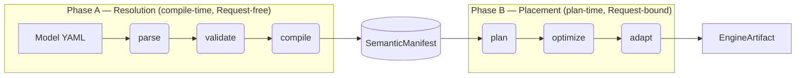
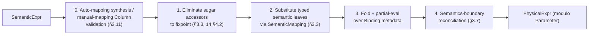
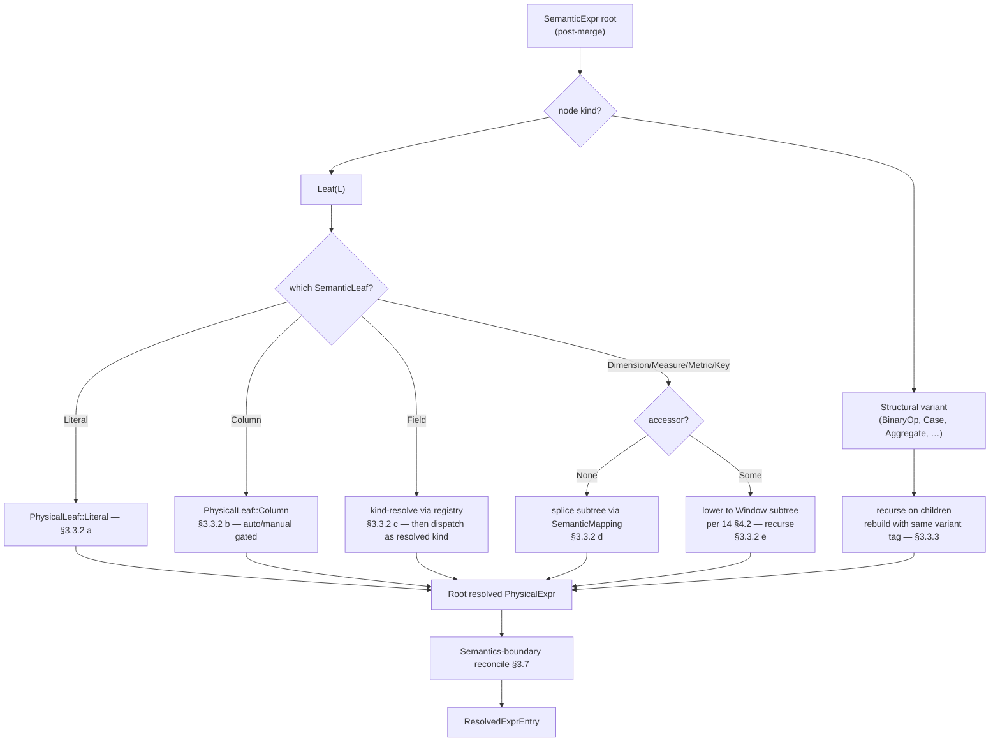
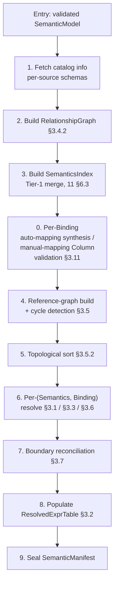

# 19. Expression Flow — Compile Pipeline

> **Status:** ratified. Vocabulary throughout is the typed-leaf model from `[14](14_expressions.md)`.
>
> **Code samples are illustrative.** Exact field names, method signatures, and enum-vs-struct shape may be refined during implementation. The spec asserts the architectural design (two-phase boundary, conversion direction, substep ordering, placement contracts), not the precise Rust spelling.

---

## 1. Purpose and Scope

`19` ratifies the **end-to-end compile pipeline for expressions** in semstrait — from authored `SemanticExpr` through compile-time resolution into canonical `PhysicalExpr`, into the planner's `Strategy` for placement into a `PlanNode` tree, up to the canonical engine-portable form an adapter consumes. `14` ratifies the bare type architecture (`Expr<L>`, leaf sets, type aliases, sugar accessors); `14a` ratifies function identity; this chapter layers the pipeline mechanics on top.

**What `19` ratifies:**

- The two-phase pipeline (§2): Phase A compile-time, `Request`-free, produces `PhysicalExpr` modulo `Parameter`; Phase B plan-time, `Request`-bound, produces a `PlanNode` tree.
- The Phase A algorithm (§3): `resolve` substep order, `ResolvedExprTable` shape, per-leaf substitution, cross-DataKind path resolution, cycle detection, type inference, Semantics-boundary reconciliation, per-Binding keying, sub-pass ordering inside `compile`, referenced-column harvesting, auto-mapping synthesis.
- The sugar contract (§4): Family A constant folding; Family B accessor lowering to `Window`-rooted subtrees.
- Per-site shape gates (§5).
- The Phase B placement contract (§6): filter placement, `group_by` handoff, computed-Dimension placement, Metric semantics, function-tag axis `Additivity`, advisory channel.
- Aggregation handling at the Phase A/B boundary (§7).
- The error model (§8).

**What `19` does NOT ratify** (forward-refs):

- The bare `Expr<L>` AST, `SemanticLeaf` / `PhysicalLeaf` shapes, `ExprSource` YAML grammar — `[14](14_expressions.md)`.
- Canonical function identity, `FunctionRegistry`, `FnSignature` polymorphism — `[14a](14a_function_catalog.md)`.
- `SemanticMapping` shape and the binding algorithm — `[15](15_mapping_and_binding.md)` + `[18 §10](18_entities.md)`.
- The `Relationship` shape itself (this chapter consumes it for path resolution) — `[18 §2](18_entities.md)`.
- Cross-DataKind advisory specialisation roots (e.g. Unionset's `MissingMetadataDisjointnessProof`) — owning chapter (`[23](../data-kinds/23_unionset.md)`).
- The `Strategy` algorithm bodies that consume `PhysicalExpr` for actual plan construction — `[34](../apis/34_semstrait_planner.md)`.
- Engine-specific function and operator rewrites — `[36](../apis/36_semstrait_adapter.md)`, `registry/functions_mapping.md`.
- The on-disk serialization format of the `SemanticManifest` — `[33](../apis/33_semstrait_manifest.md)`.

**Key invariants from `00 §9` that `19` directly upholds:**

- **I1 / I2 / I3** — canonical layers carry no raw SQL, physical types, or engine branching; `PhysicalExpr` is engine-neutral; `FunctionCall` references `CanonicalFn` identities.
- **I4** — deterministic `SemanticManifest`. `ResolvedExprTable` uses an ordered map keyed by `(SemanticsName, EntityId)`; substitution is pure; path ambiguity resolves by hard error rather than tie-break (§3.4.3).
- **I5** — name resolution at compile time only. Every typed semantic leaf is substituted away at compile time; `PhysicalExpr` values stored in `ResolvedExprTable` carry no `Field` / `Dimension` / `Measure` / `Metric` / `Key` by `14 §3.7`'s structural invariant; plan-time lookups are O(log n) map accesses.
- **I6** — sync hot path. Phase A resolution is a pure, sync transformation over already-loaded inputs; `plan → optimize → adapt` is synchronous and free of hidden I/O.
- **I8** — planner-complete `SemanticManifest`. After `compile` seals, every `(name, binding_id)` combination the planner might demand is already in the `ResolvedExprTable`.
- **I10** — non-exhaustive public sum types.
- **I12** — first-class typed diagnostics by stage; numeric codes serve as spec-cross-reference indices, never as canonical runtime data.

---

## 2. Two-Phase Pipeline

Slices the canonical pipeline (`[00 §5](../00_overview.md)`) into the two expression-relevant phases. Phase A spans `parse → validate → compile`; Phase B spans `plan → optimize → adapt`. The `SemanticManifest` carries `PhysicalExpr` (modulo `Parameter`) across the phase boundary.



Phase A is **compile-time, synchronous, `Request`-free**: `SemanticExpr::resolve` runs inside `compile`, consumes authored `SemanticExpr`, and emits `PhysicalExpr` carrying `Parameter(...)` leaves wherever a value must defer to the `Request`. The resulting `PhysicalExpr` is persisted in the `SemanticManifest`'s `ResolvedExprTable` per-`(Semantics, Binding)` pair.

Phase B is **plan-time, `Request`-bound**: `Strategy` (`[34](../apis/34_semstrait_planner.md)`) runs inside `plan`, binds `Parameter` leaves against the `Request`, lifts `Aggregate` nodes into `PlanNode::Aggregate`, and places the residual `PhysicalExpr` into the plan tree.

The `plan → optimize → adapt` hot path is synchronous and free of hidden I/O per `[00 §5](../00_overview.md)`.

### 2.1 Phase boundary contract

A single public Phase A entry point converts `SemanticExpr` to `PhysicalExpr`:

```rust
impl SemanticExpr {
    /// Compile-time lowering. Synchronous, pure, Request-free.
    /// Runs once per `(Semantics, Binding)` pair during `compile`.
    pub fn resolve(self, ctx: &LoweringCtx<'_>) -> Result<ResolvedExprEntry, CompileError>;
}
```

The output `PhysicalExpr` is fully resolved **modulo `Parameter` placeholders** (`14 §5`); Phase B substitutes those against the `Request`. Detailed substep mechanics live in §3.

Phase B does two things Phase A does not:

- **`Aggregate` lift.** `Aggregate` nodes in `PhysicalExpr` are extracted into `PlanNode::Aggregate` slots; the residual `PhysicalExpr` substitutes column refs to the lifted slots (§7).
- **`Parameter` binding.** Compile-emitted `Parameter` leaves are substituted with concrete values from the `Request` per `[14 §5.3](14_expressions.md)`. A `Parameter` reaching the adapter is a hard error per `[34 §<Strategy>](../apis/34_semstrait_planner.md)` postcondition.

---

## 3. Phase A — Compile-Time Resolution

Phase A is the compile-time, synchronous, `Request`-free pass that turns every author-declared `SemanticExpr` into a fully substituted, type-annotated `PhysicalExpr` stored in the `SemanticManifest`'s `ResolvedExprTable`. It finalizes every forward reference from `[14](14_expressions.md)` that points at "compile-time resolution", "the `ResolvedExprTable`", "substitution algorithm", "cross-DataKind path resolution", "cycle detection", or "semantics-boundary reconciliation" (cf. `14 §3.7`, `§4.2`, `§5.3`, `§7.5`, `§8`).

Per `[00 §5](../00_overview.md)`, this work lives inside `compile`. Per `[00 §9](../00_overview.md)`'s **I5** and **I6** invariants, the entire substitution and lookup work completes **before** any plan is built, so that `plan` (and every stage downstream) can consume a single `ResolvedExprTable::lookup(name, binding_id)` in O(log n) per reference. Phase A is the algorithm that says exactly **what that lookup returns** and **how the compile stage populated it**.

The Phase A pass is built on the layered expression model ratified in `[14 §3](14_expressions.md)`:

- The structural skeleton (`Expr<L>` per `14 §3.3`) is shared between `SemanticExpr = Expr<SemanticLeaf>` and `PhysicalExpr = Expr<PhysicalLeaf>`.
- The semantic leaf set carries **per-kind typed leaves** (`Literal`, `Column`, `Field`, `Dimension`, `Measure`, `Metric`, `Key`) per `14 §3.5`, with per-kind accessor enums (`DimensionAccessor`, `MeasureAccessor`, `MetricAccessor`, `KeyAccessor`) sitting as `Option<…>` fields on the typed leaves per `14 §4.1`.
- The physical leaf set carries `Column`, `Literal`, and the compile-emitted `Parameter` placeholder per `14 §3.4`.

The transformation is therefore a leaf-rewrite, not a structural rewrite: every structural variant of `Expr<L>` (`BinaryOp`, `Case`, `FunctionCall`, `Aggregate`, `Window`, …) passes through with its children recursively transformed, while each `SemanticLeaf` variant carries its own per-kind rule (§3.3). Sugar accessors carried on typed leaves lower to canonical `Window`-rooted subtrees per `14 §4.2`. The output `PhysicalExpr` is fully resolved modulo `Parameter` placeholders that Phase B binds against the `Request`.

### 3.1 Top-level contract: the `resolve` entry point and substep order

Phase A is one public entry point with internal substeps:

```rust
impl SemanticExpr {
    /// Compile-time lowering from `SemanticExpr` to `PhysicalExpr`.
    ///
    /// Synchronous, pure, Request-free. Runs once per `(Semantics, Binding)` pair
    /// during `compile`. Returns `PhysicalExpr` modulo `Parameter` placeholders
    /// bound at Phase B (§2.1).
    pub fn resolve(
        self,
        ctx: &LoweringCtx<'_>,
    ) -> Result<ResolvedExprEntry, CompileError>;
}
```

`LoweringCtx` carries the read-only inputs the substeps need plus the bookkeeping a single `resolve` call mutates:

```rust
pub(crate) struct LoweringCtx<'a> {
    pub registry:           &'static FunctionRegistry,
    pub relationship_graph: &'a RelationshipGraph,
    pub scope_chain:        &'a ScopeChain,
    pub all_semantics:      &'a SemanticsIndex,
    pub all_bindings:       &'a BindingIndex,
    pub schemas:            &'a SchemaIndex,
    pub semantic_mapping:   &'a SemanticMapping,        // for the current binding
    pub recursion:          &'a mut RecursionState,
}
```

All fields are read-only at the input-model sense except `recursion`, which carries the DFS visited-set used by §3.5's cycle detection. The function is **pure**: no I/O, no time dependence, no RNG; the only mutation is bookkeeping for cycle detection, scoped to a single `resolve` invocation tree.

**Precondition.** The incoming `SemanticExpr` already carries an `Aggregate` root if a Measure or Metric authored it via the `(agg:, expr:)` dual-field surface — that wrapping happens at parse time per `[32 §5.4](../apis/32_semstrait_model.md)`.

The substep order is load-bearing:



**Why this order.**

- Sugar elimination **before** substitution — a typed leaf with `accessor: Some(_)` lowers to a `Window` whose `args` still reference the original entity; substitution must see the lowered shape, not the sugared leaf.
- Sugar elimination **to fixpoint** — `Delta` / `PercentChange` lower into compositions containing more accessor-bearing typed leaves; iteration converges.
- Substitution **before** fold — metadata-static branches the fold collapses (per-Binding source markers in a `Case`) only become visible after `SemanticMapping` substitutes the gating typed leaves.
- Reconciliation **last** — the root's `inferred_type` is only stable after substitution and folding settle.

Compile orchestrates `resolve` per `(Semantics, Binding)` pair during the per-binding resolution sub-pass (§3.9 step 6). Authors and adapters never call it directly.

### 3.2 The `ResolvedExprTable`

#### 3.2.1 Shape

```rust
pub struct ResolvedExprTable {
    entries: BTreeMap<ResolvedExprKey, ResolvedExprEntry>,
}

pub struct ResolvedExprKey {
    pub semantics_name: SemanticsName,
    pub binding_id:     EntityId,
}

pub struct ResolvedExprEntry {
    pub physical_expr:      PhysicalExpr,
    pub layer:             ExprLayer,    // applicability layer (§3.2.6); persisted on the manifest expr (33 §7.2)
    pub inferred_type:      DataType,
    pub referenced_columns: Vec<String>,
    pub path_signature:     Option<PathSignature>,
    pub provenance:         Provenance, // shape owned by 33; see §3.2.5
}
```

**Why `BTreeMap`.** Deterministic iteration order for `SemanticManifest` serialization and downstream artifacts (adapter column-projection lists); O(log n) lookup is acceptable because the plan-time hot path is dominated by expression-tree traversal, and typical manifests carry `n` in the low thousands.

**The binding key is an `EntityId`** (the binding's durable id per `15 §2.2` — a deterministic UUIDv5 generated at compile, `33 §9.1`). It is globally unique and stable across Model edits that don't change the binding. Author-facing diagnostics still quote `DataKind.name / Binding.name`; `BindingName` is not the key (unique only within its owning `Dataset`, not globally). The retired `EntityId` u32 handle is no longer used.

**`SemanticsName`** is the canonical identity newtype from `[11 §4](11_names_and_scopes.md)` — one unified global namespace. The **kind** of a Semantics (Dimension / Measure / Metric / Key) is encoded in the variant tag of the authored `SemanticLeaf` and reconciled against the registry during substitution (§3.3).

#### 3.2.2 Determinism

`BTreeMap<ResolvedExprKey, _>` orders lexicographically by `(semantics_name, binding_id)` (the latter an `EntityId`). Given frozen inputs, substitution is a pure post-order walk; BFS in §3.4 explores neighbors in deterministic **relationship-name order**; multiple shortest paths surface as `AmbiguousRelationshipPath` (no tie-break). Identical inputs → byte-identical `ResolvedExprTable` (compile-layer evidence for `00 §9` **I4**).

#### 3.2.3 Lookup contract

```rust
impl ResolvedExprTable {
    pub fn lookup(&self, name: &SemanticsName, binding_id: EntityId) -> Option<&ResolvedExprEntry>;
    pub fn lookup_all(&self, name: &SemanticsName) -> impl Iterator<Item = (EntityId, &ResolvedExprEntry)>;
    pub fn iter(&self) -> impl Iterator<Item = (&ResolvedExprKey, &ResolvedExprEntry)>;
}
```

`lookup` is O(log n); `lookup_all` ranges `BTreeMap` over a single `SemanticsName` (used by `ComplexDataKind` source selection over multiple Bindings). Sealed manifests are `Arc`-wrapped and immutable — no `insert`/`remove`/`update` on the public API.

#### 3.2.4 Serialization posture and the compile-time / persisted split

`ResolvedExprTable` is the **compile-time working set**; its persisted form is owned by `[33](../apis/33_semstrait_manifest.md)`. The two are not identical, and the split follows what is content-derived vs binding-context-dependent:

- **`physical_expr` + `layer` are interned into the content-deduped pool** `ManifestExpressions.physical: BTreeMap<PhysicalExprId, ManifestExpression { expr, layer }>` (`33 §7.2`). The `layer` is a pure function of the tree (§3.2.6), so it rides on the deduped entry. (This supersedes any earlier "stored inline, no interning pool" wording.)
- **The per-`(SemanticsName, binding EntityId)` context fields** — `inferred_type`, `referenced_columns`, `path_signature` — are **not** functions of the expression tree alone (a shared tree bound to different sources may infer different types / traverse different paths), so they do **not** belong on the deduped pool entry. They are persisted on the manifest's per-binding expression reference (the on-disk counterpart of `ResolvedExprKey -> {PhysicalExprId, inferred_type, referenced_columns, path_signature}`). The exact on-disk shape of that per-binding record is part of the pending `19`↔`33` reconciliation (`STATUS.md`); `19` ratifies the field set, `33` ratifies the persistence container.

Shape-level contract: `entries` encodes in `BTreeMap`'s natural iteration order.

#### 3.2.5 `Provenance`

Per-entry diagnostic-reporter carrier (which source `Location`s contributed which occurrences during Tier-1 / Tier-2 merge per `[11 §6.3](11_names_and_scopes.md)`). Never leaves the manifest, never read at plan time or adapt time. **Shape owned by `[33 §<ResolvedExprEntry>](../apis/33_semstrait_manifest.md)`** (it is a manifest-storage concern, not a Phase-A algorithm concern); `19` only requires that `compile` populates it.

#### 3.2.6 Layer classification

After substeps 0–4 produce the `PhysicalExpr`, Phase A classifies its `ExprLayer` (`[14 §3.8](14_expressions.md)`; type at `[35 §5.5](../apis/35_semstrait_ir.md)`) as a **pure function of the resolved tree** — `classify(tree)`:

```text
classify(t):
  if no Aggregate node occurs anywhere in t          -> Scalar
  else if the root node of t is an Aggregate          -> Aggregate
  else                                                -> PostAggregate   # Aggregate(s) strictly below a non-Aggregate root
```

- **`Window` is not a layer of its own.** A `Window` whose argument subtree contains an `Aggregate` (an *aggregation-relative window* — e.g. a `measure.previous` accessor lowered over the aggregated grain) makes the tree fall into `PostAggregate` by the rule above (the root is the `Window`, an `Aggregate` is below it). A `Window` over raw columns only (e.g. `dimension.lag`, no `Aggregate` descendant) classifies as `Scalar`. No separate `Windowed` layer exists in v1 (reserved, `35 §5.5`).
- Classification runs on the **Phase A** tree (before Phase B's aggregate-lift, `§7`); the lift does not change the classification, it consumes it.

The layer is independent of the authoring `SemanticRole`: a Dimension whose `expr` resolves to a subtree containing an `Aggregate` is `PostAggregate`. It is recorded on `ResolvedExprEntry.layer` and persisted with the physical expression (`33 §7.2`); CX1 re-validates `layer == classify(expr)` at load. This is the single piece of "extra data" that lets Phase B (`§6`) place each expression onto the correct `PlanNode` layer (pushdown vs aggregate vs post-aggregate) without re-walking semantic provenance.

### 3.3 The substitution algorithm — per-leaf-kind rules

#### 3.3.1 Overview

For every `(SemanticsName, EntityId)` pair the Model exposes, compile calls `SemanticExpr::resolve` against the Semantics's merged `expr:` tree (the post-Tier-1-merge `SemanticExpr` per `[11 §6.3](11_names_and_scopes.md)`). The implementation is a **post-order walk** over the `Expr<SemanticLeaf>` tree:

1. For each `Expr<L>::Leaf(leaf)` node, dispatch to the per-leaf-kind rule (§3.3.2). The rule returns either a `PhysicalLeaf` (wrapped in `Expr::Leaf`) or a structural subtree (e.g. an accessor-sugared typed leaf lowers to a `Window`-rooted subtree, which then recurses).
2. For each structural variant of `Expr<L>` (`BinaryOp`, `Case`, `FunctionCall`, `Aggregate`, `Cast`, `InList`, `Between`, `Like`, `IsNull`, `Coalesce`, `NullIf`, `Window`, `UnaryOp`), recurse on the children, then rebuild the same variant with the resolved children. The structural shape passes through unchanged (§3.3.3).
3. At the root, run Semantics-boundary reconciliation (§3.7) — possibly wrapping the root in a `Cast`.
4. Emit a `ResolvedExprEntry` with the resolved expression, root `inferred_type`, flat `referenced_columns`, optional `path_signature`, and `provenance`.



#### 3.3.2 Per-leaf-kind rules

##### a. `SemanticLeaf::Literal(lit)`

Trivial:

- Output: `Expr::Leaf(PhysicalLeaf::Literal(lit))`.
- `inferred_type`: per `14 §3.5` / `[13 §2.1–2.4](13_types_and_grain.md)` — the literal's canonical type. `{literal: {type: T, value: v}}` specifies `T` explicitly; bare forms (`{literal: 42}`, etc.) follow `14 §5.2` defaults (`Integer` / `Double` / `String` / `Boolean`; bare `Null` → `DataType::Unknown` at the node, reconciled at root).
- `referenced_columns`: empty.
- `path_signature_contrib`: empty.

**Untyped `Null` handling.** A bare `Null` literal at a node whose type cannot be fixed by context flows as `DataType::Unknown` and either unifies with siblings (in `Case` / `Coalesce` / `BinaryOp` comparisons) or propagates to the root, where §3.7's reconciliation either pins it via the Semantics's declared `data_type:` or raises `CompileError::TypeInferenceFailure`.

##### b. `SemanticLeaf::Column(name)` — conditionally legal

Per `14 §3.5`, `SemanticLeaf::Column` is **type-admissible** (the parser can construct it) but **context-validated** at compile. Its legality depends on the owning binding's `semantic_mapping` mode:

- **Under `semantic_mapping: auto`** — legal. Step 0 of compile (§3.11) has already synthesized a `SemanticMapping` entry for `name`. The leaf rewrites to `Expr::Leaf(PhysicalLeaf::Column(ColumnRef(name)))`, with `inferred_type` looked up in `binding.source.schema()[name].data_type` mapped to canonical `DataType` via `[13 §2](13_types_and_grain.md)`.
- **Under manual `semantic_mapping`** — rejected. Per §3.11, step 0 has already raised `CompileError::ColumnInSemanticExprUnderManualMapping { binding, location }` and resolution never reaches this leaf. If it does (compile bug, test fixture), an `unreachable!` assertion fires.

If the physical column does not exist in the binding's `PhysicalSource` schema under `auto`: `CompileError::UnresolvedColumn { name, binding }`.

- `referenced_columns`: one-element vector `[name]`.
- `path_signature_contrib`: empty.

##### c. `SemanticLeaf::Field(name)` — kind-resolved untyped fallback

Per `14 §3.5`, `Field` is the untyped semantic reference whose kind is resolved at compile by registry lookup. The dispatcher:

1. Looks up `name` in `ctx.all_semantics` to determine its declared kind (`Dimension` / `Measure` / `Metric` / `Key`).
2. If `name` does not resolve in any visible scope per `[11 §11.1](11_names_and_scopes.md)`, raises `CompileError::UnknownReference { name, scope: Scope::of(site) }`.
3. If `name` resolves to a kind, **re-dispatch** the leaf as if the author had written the corresponding typed leaf (`Dimension { name, accessor: None }`, `Measure { name, accessor: None }`, etc.). The substitution then proceeds per §3.3.2.d.
4. Under `semantic_mapping: auto`, name lookup may resolve to a physical column rather than a declared semantic. In that case the leaf re-dispatches as `Column(name)` per §3.3.2.b. The §3.11 step 0 has already synthesized the appropriate `SemanticMapping` entry.

The `Field` variant therefore does not survive into `PhysicalExpr` by construction — it is always either a `Column` (under auto, when the name maps to a physical column) or a substituted typed-semantic subtree.

##### d. `SemanticLeaf::Dimension { name, accessor: None }` (and `Measure / Metric / Key` analogous)

The core compile-time substitution site for kind-pinned typed leaves. Steps:

1. **Resolve `name`** via the binding's `SemanticMapping` per `[15](15_mapping_and_binding.md)` and the visible scope chain per `[11 §11.1](11_names_and_scopes.md)`. The lookup yields the registered Semantics for `name`.
2. **Kind-check.** If the registered Semantics's declared kind differs from the leaf's variant tag (e.g. `Dimension { name: "x" }` but `x` is registered as a Measure), raise `CompileError::SemanticKindMismatch { authored_kind, registered_kind, name, location }`. The leaf was authored with a specific kind contract (`dim("x")` vs `measure("x")` etc.); a registry disagreement is an author error.
3. **Same-DataKind vs cross-DataKind.** If the target Semantics's owning DataKind is the same as the current Binding's owning DataKind, recurse into the target's merged `expr:` using the current Binding. Splice the resolved `PhysicalExpr` subtree in-place. No `path_signature_contrib`. If different, trigger cross-DataKind path resolution per §3.4. The target's `expr:` is resolved against one of its own Bindings (picked per §3.4.4). The resolved subtree is spliced in, and the path is appended to `path_signature_contrib`.
4. **Cycle bookkeeping.** Mark `name` as visited in the DFS recursion state (§3.5) for the duration of the recursive call; unmark after return. Cycles surface as `CompileError::CyclicReference` before any expression rewriting happens.
5. **`inferred_type`** of the substituted subtree is the root `inferred_type` of the target's resolved entry (per §3.6's bottom-up rule; the topological order from §3.5 ensures the target is already resolved).
6. **`referenced_columns`** contribute the target's columns, prefixed by join-key columns required to traverse each hop in any cross-DataKind path (§3.10).

The typed-semantic leaves are **not** present in the output `PhysicalExpr` per `14 §3.7`: `PhysicalLeaf` has no `Field` / `Dimension` / `Measure` / `Metric` / `Key` variants. The substitution algorithm therefore cannot leave one behind — it rewrites the leaf into the target's resolved expression.

##### e. `SemanticLeaf::{Dimension | Measure | Metric | Key} { name, accessor: Some(acc) }` — sugar elimination

A typed leaf carrying `accessor: Some(acc)` is sugar that lowers at compile to a canonical `Expr::Window`-rooted subtree per `14 §4.2`:

```text
SemanticLeaf::Measure { name: "revenue", accessor: Some(MeasureAccessor::Previous) }
  ─→ Expr::Window {
       function:     <derived from accessor — e.g. Lag(1) for Previous>,
       args:         [Expr::Leaf(SemanticLeaf::Measure { name: "revenue", accessor: None })],
       partition_by: [Expr::Leaf(PhysicalLeaf::Parameter(Parameter {
                       key:       ParameterKey::RequestDimensionsMinusTemporal,
                       data_type: DataType::Unknown, // late-bound by Phase B
                     }))],
       order_by:     [Expr::Leaf(PhysicalLeaf::Parameter(Parameter {
                       key:       ParameterKey::RequestTemporalAxis,
                       data_type: DataType::Unknown,
                     }))],
       frame:        Some(<derived from accessor>),
     }
```

After lowering, the inner `Expr::Leaf(SemanticLeaf::Measure { accessor: None })` recurses through §3.3.2.d.

**Fixpoint behaviour.** Some accessors (`Delta`, `PercentChange` on `MeasureAccessor` / `MetricAccessor`) lower to compositions that still contain typed leaves with `accessor: Some(_)`. For example, `Measure { accessor: Some(Delta) }` lowers to `op - op.Previous`, where `op.Previous` is itself a typed leaf with `Some(Previous)`. The Phase A sugar-elimination substep runs to fixpoint so every typed leaf with a non-`None` accessor is eliminated before the substitution substep begins.

The per-kind accessor enums (`DimensionAccessor`, `MeasureAccessor`, `MetricAccessor`, `KeyAccessor`) define a closed set of lowerings; the per-kind mapping table lives in `14 §4` and is not re-ratified here.

#### 3.3.3 Structural variants — recurse and rebuild

For every non-`Leaf` variant of `Expr<L>` (per `14 §3.3`), the algorithm recurses on the children, then rebuilds the same variant tag with resolved children. Variant tag and non-child fields are preserved verbatim (this is the `Tree::with_new_children` contract from `[31 §3.2](../apis/31_semstrait_common.md)`).

**Three structural notes:**

- **`Aggregate` passes through.** `Expr::Aggregate { op, args, distinct, filter }` is a structural variant in both `SemanticExpr` and `PhysicalExpr` per `14 §3.3`; the typed-leaf model leaves it intact. Aggregate-specific metadata (grain, additivity) stays on the Semantics per `[18 §5.2](18_entities.md)`, never inside the expression node.
- **`Window` is compile-emitted only.** Author-facing parsers reject window syntax (`14 §6.4.1`); `Window` nodes enter exclusively via sugar elimination (§3.3.2.e). The algorithm constructs them, never receives them from authors, then recurses into their child slots.
- **`FunctionCall` triggers registry lookup.** Per `[14a §3](14a_function_catalog.md)`, unknown name → `UnknownFunction`; bad arity → `FunctionArityMismatch`; no matching signature → `NoMatchingSignature`; return type computed by `ReturnTypeRule`. Consumed read-only.

#### 3.3.4 Scope and identifier resolution at the walk

Phase A does not re-derive name-resolution rules — it consumes `[11 §11.1](11_names_and_scopes.md)`'s lookup algorithm verbatim. At every leaf that carries an identifier (`Field`, `Dimension`, `Measure`, `Metric`, `Key`, or — under auto-mapping — `Column`):

- Build a scope chain for the current resolution site (Root, owning DataKind, nested-kind if any, current Binding).
- Walk the chain from innermost outward: `Binding → Nested-kind (if applicable) → Kind → Root` (global Semantics registry).
- Success: identifier resolves to a Semantics slot (typed leaves dispatch to §3.3.2.c–e), to a Binding column (auto-mapping `Column` per §3.3.2.b), or to nothing (`UnknownReference`).
- Failure: `CompileError::UnknownReference { name, scope }` where `scope` is the innermost scope where the walk started.

#### 3.3.5 Per-leaf-kind summary table

| `SemanticLeaf` variant | Output | `inferred_type` | Recurses into | Notes |
|---|---|---|---|---|
| `Literal(lit)` | `Expr::Leaf(PhysicalLeaf::Literal(lit))` | literal's canonical type | — | bare `Null` flows as `DataType::Unknown` until reconciliation |
| `Column(name)` (auto mapping) | `Expr::Leaf(PhysicalLeaf::Column(ColumnRef(name)))` | schema lookup | — | conditionally legal — see §3.11 |
| `Column(name)` (manual mapping) | rejected | — | — | `ColumnInSemanticExprUnderManualMapping` (§3.11) |
| `Field(name)` | re-dispatch as resolved kind | resolved kind's `inferred_type` | target's `SemanticExpr` (or `Column` under auto) | registry kind-resolve, then per §3.3.2.d |
| `Dimension { name, accessor: None }` | splice resolved subtree | target's root `inferred_type` | target's `SemanticExpr` | `SemanticKindMismatch` if registry kind differs |
| `Measure { name, accessor: None }` | splice resolved subtree | target's root `inferred_type` | target's `SemanticExpr` | as above |
| `Metric { name, accessor: None }` | splice resolved subtree | target's root `inferred_type` | target's `SemanticExpr` | as above |
| `Key { name, accessor: None }` | splice resolved subtree | target's root `inferred_type` | target's `SemanticExpr` | as above |
| `{Dimension|Measure|Metric|Key} { name, accessor: Some(acc) }` | lower to `Expr::Window`-rooted subtree | `Window`'s `inferred_type` | recursively (fixpoint) | per `14 §4.2` |
| structural variant (`BinaryOp`, `Case`, `Aggregate`, `Window`, `FunctionCall`, `Cast`, …) | same variant tag, resolved children | per §3.6 | each child | shape shared between `SemanticExpr` and `PhysicalExpr` per `14 §3.3` |

### 3.4 Cross-DataKind path resolution

#### 3.4.1 The contract

When a typed semantic leaf (`Dimension` / `Measure` / `Metric` / `Key` with `accessor: None`, or a `Field` that resolves to one of those kinds) targets a Semantics whose owning DataKind differs from the current Binding's owning DataKind, Phase A's substitution substep triggers **cross-DataKind path resolution**: a BFS over the `Relationship` graph from the current Binding's DataKind to the target's DataKind.

The path is recorded in the entry's `PathSignature` for plan-time join-subgraph materialization (`[16 §4](16_composition.md)`).

#### 3.4.2 The `RelationshipGraph`

Built once at `compile` time after `validate` (so endpoints are known-valid):

```rust
pub struct RelationshipGraph {
    kinds:         BTreeMap<DataKindName, DataKindNode>,
    relationships: BTreeMap<EntityId, Relationship>,
    by_kind:       BTreeMap<DataKindName, Vec<EntityId>>, // relationship EntityIds, name-ordered
}
```

A relationship is referenced by its `EntityId` (`18 §2.1`) — durable and stable across edits. The `by_kind` adjacency vectors are ordered by relationship **name** so neighbor iteration (and thus path enumeration) is deterministic and author-meaningful.

#### 3.4.3 The BFS algorithm

Shortest-path BFS over the `RelationshipGraph` from `from_kind` to `to_kind`. Returns the path's `Vec<EntityId>` on a unique hit. The walk records the shortest depth `d` on first reach, then exhausts every path of depth `d`; deeper paths are ignored.

- 0 hits → `CompileError::NoRelationshipPath { from, to }`.
- 1 hit  → success.
- ≥ 2 hits at depth `d` → `CompileError::AmbiguousRelationshipPath { from, to, paths }` (hard error; no tie-break).

**Why shortest-path + hard ambiguity, not tie-break.** A tie-break (declaration order, lex order) would silently pick one path when the Model expressed two equally-valid intentions; that violates `00 §9` **I4** (determinism) and surprises authors. Ambiguity is an authoring defect that demands explicit relationship-graph disambiguation. Neighbor iteration uses relationship-name order to keep the `paths` vector content stable across compiles (and stable across edits, since it no longer rides a compile-counter). Termination follows from the visited-depth map and the bounded `|kinds|` frontier.

#### 3.4.4 Binding selection for the spliced subtree

The target Semantics is resolved against **every** available Binding on the target DataKind, producing one `ResolvedExprEntry` per target binding (stored separately under `(target_name, target_binding_id)`). When the current expression substitutes a typed semantic leaf, it splices in the target's `PhysicalExpr` from one specific target binding selected by the enclosing Binding's composition context (§3.8).

#### 3.4.5 `PathSignature`

```rust
pub struct PathSignature {
    pub paths: BTreeSet<RelationshipPath>,
}

pub struct RelationshipPath(pub Vec<EntityId>); // chain of relationship EntityIds
```

`paths` is a `BTreeSet` so identical relationship chains contributed by multiple leaf sites dedupe deterministically. `path_signature` is `None` when no cross-kind walk occurred (every typed semantic leaf resolved within the current DataKind; no plan-time join needed); `Some(ps)` carries one or more distinct paths whose union the planner materializes as the join subgraph per `[16 §4](16_composition.md)`. Phase A only populates the structure.

When a single expression contains multiple typed leaves with different paths (e.g. one to `customer` via `order`, another directly to `order`), all paths are recorded; whether the planner intersects paths sharing intermediate relationships or keeps them distinct is the planner's join-subgraph canonicalization concern per `[16 §4.2](16_composition.md)`.

### 3.5 Cycle detection

#### 3.5.1 The reference DAG

Built after `validate` (structural preconditions) and after Tier-1 / Tier-2 occurrence merge (`[11 §6.3](11_names_and_scopes.md)`), but **before** `resolve` is called for any Semantics. Compile walks every Semantics's merged `SemanticExpr` tree and collects every typed semantic leaf reference and every `Field` reference (at any depth in the tree). For `Field` leaves whose kind resolves to a column (under auto-mapping), the leaf is a terminal — no outbound edge in the reference graph. For all other typed leaves, the edge points to the referenced Semantics.

This yields a directed graph:

- **Nodes**: `SemanticsName` (global — per `[11 §4](11_names_and_scopes.md)`).
- **Edges**: `A → B` if `A`'s `expr:` contains any typed semantic leaf (or kind-resolved `Field`) targeting `B`, anywhere in the tree.

Sugar accessors do not change the graph: a typed leaf with `accessor: Some(_)` still references the same name, just with a wrapped lowering. The cycle detector treats sugar and non-sugar references uniformly.

#### 3.5.2 Algorithm — Tarjan SCC

Tarjan SCC over the reference graph; on success returns a topological sort (Semantics in dependency order); on first SCC of size > 1 (or self-loop) returns `CompileError::CyclicReference { cycle }` with members in lexicographic order.

**Why Tarjan + topological sort.** Single pass detects every cycle; the topological order is a free side-product reused by §3.6's bottom-up type-inference pass (no fixpoint needed); stable order is easy to pin down per `00 §9` **I4**.

**Single-cycle reporting.** Phase A reports the first cycle (lexicographically smallest SCC name) per `00 §9` **I12** fail-fast posture; batch-diagnostic mode is a future extension.

#### 3.5.3 Cross-kind cycles + self-loops

Cycles span the global Semantics namespace — not restricted to one DataKind. A Measure on `orders` referencing one on `customers` that references back is detected by the same pass. A trivial self-loop (`measure a` whose `expr` references `measure a`) yields `a → a` in the graph; detected as the SCC `{a}` with a self-loop.

### 3.6 Type inference

#### 3.6.1 Ordering

Strictly bottom-up over the reference DAG: process Semantics in §3.5.2's topological order; for each, walk its `SemanticExpr` post-order; typed-leaf children look up the already-resolved target's `inferred_type`; reconcile the root with any declared `data_type:` per §3.7. No fixpoint — cycles are rejected upstream.

#### 3.6.2 Per-variant rules

- **Leaves.** `Literal` → literal's canonical type per `[13 §2.1–2.4](13_types_and_grain.md)` (bare `Null` → `DataType::Unknown`, reconciled at boundary). `Column` (under auto) → schema lookup; missing → `UnresolvedColumn`. `Field` → §3.3.2.c kind-resolve then re-dispatch. `{Dim|Measure|Metric|Key} { accessor: None }` → target's root `inferred_type` (already populated by topological order). `{…} { accessor: Some(_) }` → eliminated to `Window` before type inference reaches it.
- **`FunctionCall`** → `ReturnTypeRule` per `[14a §3.4](14a_function_catalog.md)`. **`Aggregate`** → registry-driven return type for the canonical five (`Sum`/`Avg`/`Count`/`Min`/`Max`) per `[14a §4.7](14a_function_catalog.md)` + SQL:2016 promotion. **`Window`** → window function's return type per `14a`.
- **`BinaryOp`** → arithmetic: `SameAs(0)` (left operand's type, per `14 §5.4` pass-through); comparison: `Boolean` regardless of operand types; logical (`And`/`Or`): both operands `Boolean`, returns `Boolean` else `TypeInferenceFailure`.
- **`UnaryOp`** → `Negate` preserves operand type; `Not` requires + returns `Boolean`.
- **`Cast { target, … }`** → `target`. No compile-time compatibility check; adapter may reject at render.
- **`Case` / `Coalesce`** → unified type across branches; each `Case.when` must be `Boolean`.
- **`NullIf`** → left operand's type.
- **`InList` / `Between` / `Like` / `IsNull`** → `Boolean`.

#### 3.6.3 Unification

Minimal: two types unify iff (a) identical (including `Decimal` precision/scale) or (b) one is `DataType::Unknown` (untyped `Null`) and the other is concrete (unifies to the concrete). Otherwise `CompileError::TypeInferenceFailure { node, reason }`. **No implicit promotion at unification** — `Integer` and `Long` do not auto-unify; authors write explicit `Cast`. This matches `14 §5.4`'s non-coercion posture and keeps inference deterministic.

#### 3.6.4 The annotation contract

Every leaf carries `ExprLeaf::inferred_type() -> Option<&DataType>` per `[14 §3.2](14_expressions.md)`; structural nodes derive type from children per §3.6.2. The entry-level `inferred_type: DataType` duplicates the root for O(1) plan-time access without tree traversal.

### 3.7 Semantics-boundary reconciliation

When a Semantics declares `data_type: T` explicitly and the resolved root's `inferred_type` differs, compile wraps the root in `Expr::Cast { target: T, on_failure: Error }` before storing. The author's declared type is authoritative at the boundary.

- **Widening** (`Integer → Long`, `Integer → Double`, `Decimal(10,2) → Decimal(18,2)`, …, per `[13 §2.6](13_types_and_grain.md)`) — silent.
- **Narrowing** (`Long → Integer`, `Double → Integer`, …) — emits `CompileWarning::NarrowingCast { inferred, declared }`; compile succeeds.
- **Orthogonal** (`String → Integer`, …) — treated as narrowing for diagnostic purposes; adapter may reject at render time.

**Interaction with shape inference.** `[11 §6.3](11_names_and_scopes.md)` runs upstream and pins a single `data_type:` across multi-DataKind Semantics occurrences (or raises `ShapeInferenceConflict`). Phase A reads the pinned value.

**Untyped `Null` at boundary.** `inferred_type: DataType::Unknown` with no declared `data_type:` → `CompileError::TypeInferenceFailure`. With a declared `data_type: T` → wrap `Null` in `Cast(T)`, no diagnostic.

**Author-written outer `Cast`.** When `expr:` already roots in `Cast(T_outer)` and declares `data_type: T_decl`: same `T` → no extra cast; different `T` → emit an additional outer `Cast(T_decl)` and apply the narrowing-diagnostic rule against it.

### 3.8 Per-Binding keying

The `ResolvedExprTable` carries one entry per `(SemanticsName, EntityId)` pair the Model exposes:

| DataKind shape | # entries per Semantics name | Notes |
|---|---|---|
| `Dataset` | 1 | single Binding per Dataset (`[11 §2](11_names_and_scopes.md)`, `[15](15_mapping_and_binding.md)`) |
| `Unionset` over N members | 1 per constituent Binding exposing the Semantics | source-selection rule per `[23 §3](../data-kinds/23_unionset.md)` |
| `Grainset` over N members | 1 per constituent Binding at its grain | cross-grain references trigger §3.4 BFS; path signature records the chain |
| `Joinset` over N members | 1 per constituent Binding exposing the Semantics | plan-time join graph from `path_signature` + the Joinset's declared chain (`[24](../data-kinds/24_joinset.md)`) |
| Nested kind inside outer kind | 1 per nested-kind Binding + 1 per outer-kind Binding re-exposing it (`[12](12_nesting_policy.md)`) | scope-chain resolution per §3.3.4 |

Total bound: `Σ (# bindings per DataKind) × (# Semantics exposed per binding)` — typically 10³–10⁴ entries for realistic Models.

### 3.9 Ordering of sub-passes inside `compile`



- **Step 1 is the only I/O step** inside `compile`. Steps 0 and 2–9 are pure in-memory transformations forming a contiguous sync block (`compile` is `async` only because of step 1, per `[10 §3.3](10_resolution_pipeline.md)`).
- **Step 0 runs between `SemanticsIndex` build and reference-graph build** so the cycle detector sees the post-auto-mapping state. Mechanics: §3.11.
- **`validate` preconditions** (unique DataKind names, valid Relationship endpoints, valid `PhysicalSource`, valid `expr:`/column binding per `[10 §3.2](10_resolution_pipeline.md)`) are presumed; structural leakage past `validate` is `unreachable!`.
- **Sealed registry** (`[14a §2.1](14a_function_catalog.md)`) consulted read-only in step 6.
- **Shape inference** from `[11 §6.3](11_names_and_scopes.md)` runs in step 3 and pins the `data_type:` value step 7 reconciles against.
- **No re-entry.** Topological sort from step 5 guarantees each `(SemanticsName, EntityId)` is resolved exactly once.

### 3.10 Referenced-column harvesting

Each `ResolvedExprEntry.referenced_columns: Vec<String>` is the flat, de-duplicated list of physical columns the resolved `PhysicalExpr` reads. Consumers: binding validation (missing column → `UnresolvedColumn`), plan-time column projection, adapter `SELECT` rendering, predicate / projection pushdown.

**Collection during post-order walk.**

- `Column(name)` (auto) and `Field(name)` resolving to a column (auto) contribute `[name]`.
- `{Dim|Measure|Metric|Key} { accessor: None }` same-DataKind → contributes target's `referenced_columns` (already computed via topological order). Cross-kind → also contributes the join-key columns on both endpoints of every Relationship hop traversed.
- `{…} { accessor: Some(_) }` → after sugar elimination, only the lowered subtree's typed-leaf children contribute (`Parameter` leaves contribute nothing — bound at plan time).
- Structural variants recurse and union.

Output is de-duplicated (via a `BTreeSet<String>` intermediate) but unsorted — the planner sorts as needed. Column names are **binding-native** (no source / schema qualification); qualification is supplied by the binding's `PhysicalSource` at adapt time. Distinct `EntityId`s keep `Unionset`-style name collisions naturally segregated.

### 3.11 Auto-mapping synthesis pre-step

A per-Binding pre-step that handles the conditional legality of `SemanticLeaf::Column` per the binding's `semantic_mapping` mode. **The only place** in Phase A where auto-vs-manual is consulted; after step 0, the rest of the substeps see a uniform normalized state.

**Under `semantic_mapping: auto`** — walk every `SemanticExpr` resolved against this Binding:

- For each `Column(name)` not already in the mapping, synthesize `name → Column(name)` (structurally identical to an authored `<name>: <name>` entry).
- For each `Field(name)` that doesn't resolve to a declared semantic but does match a `PhysicalSource` schema column, same synthesis (this is the "bare-identifier resolves to physical column under auto" case from `[14 §6.5](14_expressions.md)`).
- If `name` resolves to neither a declared semantic nor a physical column → `CompileError::UnknownReference { name, scope: Binding(b) }`.

After synthesis the binding's `SemanticMapping` is indistinguishable from an explicit one; downstream substeps (`15` binding resolution, adapter column projection, …) reuse the same code path for both modes.

**Under manual `semantic_mapping`** (any explicit `semantic_mapping:` block, even empty) — reject every `SemanticLeaf::Column(name)` in the walked `SemanticExpr` with `CompileError::ColumnInSemanticExprUnderManualMapping { binding, location }`. Manual mapping requires every physical reference to flow through the explicit mapping; inline `col(…)` would bypass that discipline. Remediation: rewrite the leaf as `field(…)`/`measure(…)`/`dim(…)`, add an explicit `SemanticMapping` entry, or switch to `auto`.

**Companion rule — `SemanticKindMismatch`** (fired during §3.3.2.d's kind-check step). A typed semantic leaf with an explicit kind contract (e.g. `measure("x")`) that disagrees with the registry's kind for `name` (e.g. `x` is a Dimension) → `CompileError::SemanticKindMismatch { authored_kind, registered_kind, name, location }`. `Field` leaves never trigger this — they carry no kind contract.

**Idempotent.** Re-running the pre-step on an already-normalized binding is a no-op (synthesis skips covered columns; rejection already terminated). Simplifies test fixtures and `--explain` re-tracing.

---

## 4. Sugar Contract

All sugars are `SemanticExpr`-only and desugar at compile time. The pipeline distinguishes two sugar families.

### 4.1 Family A — Constant folding / partial evaluation

Family A has **no AST variant**. Author writes plain `Case` / `BinaryOp` / `FunctionCall` / `Like`; the fold substep (§3.1 substep 3) collapses subtrees whose value is fully determined by Manifest-static state (per-`Binding` metadata literals, source-tagged Dimensions). Partial folds leave a residual that translation passes through to `PhysicalExpr`.

**Fold language (v1).** Reduction applies to nodes whose operands fold to a foldable value (`Literal` or metadata-substituted typed leaf):

| Class      | Members                       | Folding rule                                                                                |
|------------|-------------------------------|---------------------------------------------------------------------------------------------|
| Comparison | `=` `!=` `<` `>` `<=` `>=`    | both sides foldable → `Literal(bool)`                                                       |
| Logical    | `AND` `OR` `NOT`              | short-circuit; partial residual otherwise                                                   |
| Null check | `IsNull` `IsNotNull`          | metadata-substituted leaf non-null → `Literal(false)` / `Literal(true)`                     |
| Arithmetic | `+` `-` `*` `/` `%`           | numeric foldable → `Literal(N)`                                                             |
| Composite  | `IN` `NOT IN` `BETWEEN`       | desugar to comparison + logical, then fold                                                  |
| Structural | `Case`                        | short-circuit on first true `when`; drop false-`when` branches                              |
| Cast       | `Cast(Literal, T)`            | literal cast applied if successful; failures resolve per `on_failure`; column cast deferred |
| Pattern    | `Like(_, Literal(_))`         | ANSI-strict canonical (`%` zero-or-more, `_` one char); `LikeKind` is the operator discriminator `{ Like, NotLike, ILike, NotILike }` per `35 §3.4`; case-sensitive for `Like` / `NotLike` |

**`Like` canonicalisation.** Bracket classes / POSIX classes / `ILike` / `RLike` / regex extensions are **not** in v1 fold scope. Adapters emitting to engines with looser defaults (e.g. MySQL collation-driven case-folding) compensate during `PhysicalExpr` → engine-AST translation.

**Out of v1 fold scope.** `FunctionCall` (no purity flag in `14a §3.1` yet — `[TD-REGISTRY-DETERMINISM]`); regex operators; user-defined functions.

**Per-`Binding` materialisation.** Each `Binding`'s `PhysicalExpr` is independently folded against its own metadata literals; multi-source Datasets produce per-`Binding` distinct results.

### 4.2 Family B — Per-kind typed-leaf accessor sugar

A typed leaf with `accessor: Some(_)` lowers at compile to a canonical `Window`-rooted subtree per `[14 §4.2](14_expressions.md)`; the lowering shape and elimination semantics are defined there. Phase A's substep 1 runs the lowering to fixpoint over the whole `SemanticExpr` so every accessor-bearing leaf is eliminated before substitution begins (§3.1 / §3.3.2.e). Sugar-on-sugar cases (`Delta` lowers into `op - op.Previous`, where `op.Previous` is itself a sugared leaf) converge naturally — no nesting depth limit on the author surface.

Kind agreement between leaf and accessor is type-enforced at construction per `[14 §4.1](14_expressions.md)`; the algorithm here never has to validate it.

### 4.3 Worked example — metadata fold

Given a Dataset with two source bindings (per `[15 §10](15_mapping_and_binding.md)` / `[21 §10](../data-kinds/21_dataset.md)`) and one filter:

```yaml
filters:
  - name: data_quality_window
    expr: |
      case
        when year_dir = 'year=2024' then ordered_at >= '2024-03-15'
        else true
      end
```

At `resolve`, substep 1 is identity (no typed leaves with `accessor: Some(_)`). Substep 2 substitutes `year_dir` and `ordered_at` per binding. Substep 3 folds the resulting `Case` per binding's metadata:

| Binding | `PhysicalExpr`                                                     |
|---------|--------------------------------------------------------------------|
| **B₁**  | `BinaryOp(>=, Column("ordered_at"), Literal::Date("2024-03-15"))`  |
| **B₂**  | `Literal(true)`                                                    |

Phase-B observable: Strategy places B₁'s filter; B₂'s `Literal(true)` is a no-op and its `Filter` is elided. This is the canonical per-binding divergence pattern.

---

## 5. Per-Site `expr:` Shape Gates

`14 §7` defines which sites carry `SemanticExpr` versus `PhysicalExpr`. This chapter ratifies the **shape gate** — what each site requires of `resolve`'s output:

| `expr:` site                       | Required result | Aggregate-function-call syntax in `expr:` |
|------------------------------------|-----------------|--------------------------------------------|
| `measures.<m>.expr`                | scalar          | no — aggregation is carried by the separate `agg:` tag (`18 §5.2`) |
| `measures.<m>.filters[].expr`      | Boolean         | no — scalar predicate; conditional aggregation per §6.1 |
| `metrics.<m>.expr`                 | scalar          | no — `agg:` (optional) at top-level; `expr:` is a scalar formula over already-aggregated values |
| `metrics.<m>.filters[].expr`       | Boolean         | no (compile-split per §6.1) |
| `dimensions.<d>.expr` (computed)   | scalar          | no |
| `filters.<f>.expr`                 | Boolean         | yes — HAVING-style predicates may reference aggregated values |
| `keys` members                     | n/a in v1       | no per-member `expr:` authoring slot is ratified (`18 §9`) |
| `extras.semantic_mapping.<x>.expr` | scalar          | no (parses to `PhysicalExpr`) |

**Structural shape gates** enforced at parse / construction time:

- Author-written `Aggregate { ... }` syntax inside `expr:` is **rejected at all sites except `filters.<f>.expr`**. Aggregation is carried by the structurally separate `agg:` tag on Measures and Metrics per `[18 §5.2](18_entities.md)`. A Measure `agg: sum, expr: amount` resolves to `Aggregate { op: Sum, args: [Column("amount")], ... }` at Phase A, where the `Aggregate` node is *synthesised* by `agg:` and `expr:` together, not by author-written aggregate-function call syntax.
- A typed leaf carrying `accessor: Some(_)` whose lowered shape contains `Aggregate` or `Window` is gated against sites whose required result is scalar/Boolean and not aggregate-admitting. The check is on the *lowered* shape, not on syntactic surface — sugars carry their own admissibility metadata.
- `filters[].expr` is admitted only on `measures.<m>` and `metrics.<m>`. No `keys` member-level filter slot. No `dimensions.<d>.filter` — DataKind-level filtering uses the `filters:` block per §6.1.

---

## 6. Phase B — Placement

Phase B is the contract between Phase A's output (per-`Binding` `PhysicalExpr` persisted in the `SemanticManifest`) and the planner's `Strategy` (placement of `PhysicalExpr` into the `PlanNode` tree). By the time Phase B begins, the typed semantic leaves of `[14 §3.5](14_expressions.md)` have been eliminated — typed leaves carrying `accessor: Some(_)` have lowered to `Window`-rooted subtrees per `[14 §4.2](14_expressions.md)`, and `Field` / `Dimension` / `Measure` / `Metric` / `Key` leaves have substituted to their resolved expressions per §3. Only `PhysicalLeaf`-shaped operands remain (modulo compile-emitted `Parameter` placeholders bound during placement). The placement rules in this section specify where each authored expression *lands* in the `PlanNode` tree — filter scope, `GROUP BY` axis, aggregate slot, output projection — together with the two-source `Additivity` axis that drives lossy-reaggregation advisories.

Phase B does two things Phase A does not:

- **`Aggregate` lift.** `Aggregate` nodes embedded in `PhysicalExpr` are extracted into `PlanNode::Aggregate` slots; the residual `PhysicalExpr` substitutes `Column` refs to the lifted slots (§7).
- **`Parameter` binding.** Compile-emitted `Parameter` leaves are substituted with concrete values from the `Request` per `[14 §5.3](14_expressions.md)`. A `Parameter` reaching the adapter is a hard error owned by the planner.

#### 6.0 Placement is keyed on `ExprLayer`

Each persisted expression carries its applicability layer (`ManifestExpression.layer`, `33 §7.2`; `ExprLayer` at `[35 §5.5](../apis/35_semstrait_ir.md)`), assigned at compile (`§3.2.6`). Strategy reads it directly — it does **not** re-derive placement by re-walking the tree or the semantic registry:

| `ExprLayer` | Plan-tree placement |
|---|---|
| `Scalar` | pre-aggregation `Project` (and pushdown-eligible toward `Scan`); grouping-key Dimensions/Keys materialise here and feed `GROUP BY` (§6.2). |
| `Aggregate` | the expression's `Aggregate` node is lifted into `PlanNode::Aggregate` (§7); pre-/re-aggregation across complex DataKinds is governed by its `Additivity` (§6.5). |
| `PostAggregate` | the post-aggregate residual lands in a `Project` **above** the final `Aggregate` (and above any union/join re-aggregation). Ratio Metrics and Measure-referencing Dimensions land here. |

This is the single piece of metadata that lets the planner allocate expressions optimally across the plan tree and across complex-DataKind composition without reconstructing the semantic layering that lowering would otherwise erase.

### 6.1 Filter placement

Placement is determined by **where the filter is authored**, then by **what the predicate references** for filters that admit mixed-scope predicates. References inside the authored `SemanticExpr` are characterised by their resolved kind — a typed `Dimension` / `Key` leaf (or a `Field` leaf whose name resolves to a Dimension / Key in the registry) is a *grouping-key reference*; a typed `Measure` / `Metric` leaf (or a `Field` leaf resolving to a Measure / Metric) is an *aggregated reference*. Phase A resolution preserves this distinction in the lowered `PhysicalExpr` shape — grouping-key references lower to `Column` leaves over the grouping axis; aggregated references lower to subtrees containing `Aggregate` nodes.

| Authoring site                       | Placement contract |
|--------------------------------------|--------------------|
| `measures.<m>.filters[].expr`        | Inlined into the aggregate via the canonical `Aggregate { filter: Some(p), ... }` form; emits `agg(expr) FILTER (WHERE p)` on engines with native `FILTER`; adapter rewrites to `agg(CASE WHEN p THEN expr END)` on engines without native `FILTER`. |
| `metrics.<m>.filters[].expr`         | Compile-split by reference kind. Dimension / Key references → pushed into every constituent's `Aggregate.filter` (per the measure rule above). Constituent Measure / Metric references → HAVING-like `Filter` node above the Metric's output `Project`. Non-constituent Measure / Metric references → compile error `EXPR_E_xxxx MetricFilterReferencesNonConstituent`. |
| `filters.<f>.expr` (DataKind-level)  | Compile-split by reference kind. Dimension / Key references → WHERE-scope (`Filter` below `Agg`). Measure / Metric references → HAVING-scope (`Filter` above `Agg`). AND-decomposable mixed-scope: split transparently. Non-AND-decomposable mixed-scope (`OR` / `NOT` across scopes): compile error `COMP_E_xxxx MixedScopeFilterUndecomposable`. |
| `keys` members                       | **Structurally rejected.** No grouping-member filter slot. |
| `dimensions.<d>.filter`              | **Structurally rejected.** Use the `filters:` block. |

**Canonical form.** `Aggregate.filter` is the canonical `PhysicalExpr` representation; adapters compensate for engines lacking native `FILTER (WHERE)` via `CASE WHEN` rewrite (`[36 §<rewrite>](../apis/36_semstrait_adapter.md)`). The canonical IR carries the predicate in its original Boolean shape; engine compensation never leaks back into the manifest.

**Reference-kind classification.** The split between WHERE-scope and HAVING-scope is decided at compile time by inspecting the resolved kinds of the leaves reachable from the predicate. A `SemanticLeaf::Field` whose name is registered as a Dimension classifies the same as a `SemanticLeaf::Dimension` leaf at the same site — kind, not authoring vocabulary, is what placement consults.

### 6.2 `group_by` Handoff

`GROUP BY` is built from `Request` context — no `group_by:` author surface:

| Request element | Plan position |
|---|---|
| Dimensions      | `GROUP BY` key (with optional per-Dimension variation) |
| Keys            | `GROUP BY` key |
| Measures        | aggregate (no grouping) |
| Metrics         | aggregate composition (no grouping) |

**Rollup-aware Dimension carrier.** When a Dimension in the Request needs a temporal-rollup wrap (`DATE_TRUNC(grain, axis)` at the `GROUP BY` axis), the planner consumes a structured `RequestDimensionRef { name, variation }` shape per `[34 §<Request>](../apis/34_semstrait_planner.md)`. `DimensionVariation::Temporal { grain }` on a temporal Dimension wraps with `DATE_TRUNC`; `None` is the default identity projection. Type mismatch (non-temporal Dimension with `Temporal` variation) surfaces as a `PlanErrorKind` at the planner boundary. Embedder-level surface (e.g. CLI `name.grain` tokens) is not ratified here.

Computed Dimensions whose `expr` is scalar participate in `GROUP BY` as their materialised column; variation does not apply to computed Dimensions in v1.

### 6.3 Computed Dimension placement

Inline pre-aggregation at the source projection layer. The computed Dimension's `expr` resolves at Phase A to a scalar `PhysicalExpr` over `Column` leaves; Phase B materialises it as a projected column participating in `GROUP BY` like any native-binding Dimension. Aggregate-shaped `expr` is rejected at compile per §5 (per-site shape gates). Any placement question that depends on aggregation behaviour delegates to §6.5 (function-tag axis).

### 6.4 Metric semantics

Metric `expr` references other Semantics via typed leaves (`measure(name)`, `metric(name)`, `dim(name)`, or untyped `field(name)` kind-resolved per §3.3.2.c). Metric elements do **not** bind via `semantic_mapping`; a `SemanticLeaf::Column` reached from a Metric `expr` is `CompileError::MetricExprBindsRawColumn`. Metric is "sugar over Measures" — every reference must traverse another declared Semantic.

Measure / Metric `(agg:, expr:)` shape is owned by `[18 §5.2](18_entities.md)`; per-site shape gates by §5. A Measure with `agg: sum, expr: amount` resolves at Phase A to `Aggregate { op: Sum, args: [<resolved amount>], distinct: false, filter: None }`. A Metric without `agg:` remains a scalar formula over already-aggregated constituent outputs.

**Lowering.** Phase B's Metric decomposer walks the Metric `expr`, lifts every constituent Measure / Metric reference into the plan's `Aggregate` layer (dedup by canonical Semantic name; one aggregate slot per name), and emits the residual scalar `post_agg_expr` into a final `Project`. Because `expr:` syntax never contains inline aggregates (per §5's shape gates), every constituent is a named Semantic — there are no anonymous slots to name.

**`dim` / `field`-resolving-to-Dimension in Metric `expr`.** Evaluates as the **per-group value** (post-aggregate context). Compile emits an advisory listing required Dimensions; plan-time rejects requests omitting them — `PlanErrorKind::MetricRequiresDimensionInRequest { metric, missing_dimension }`.

**Metric → Metric chains.** Unbounded depth, DAG semantics. Compile DFS detects cycles → `CompileError::MetricCycle { path }`. Cycle check runs after kind resolution so `metric("a")` and `field("a")`-resolving-to-Metric-`a` are detected uniformly.

**`agg:` over Dimension- / Key-typed `expr:`.** Admitted aggregations: `min` / `max` / `count` / `count_distinct` / `first` / `last`. Authoring `sum` / `avg` / `median` / `percentile` over a Dimension / Key is rejected by `[14a §3](14a_function_catalog.md)`'s signature lookup. Windowed access uses typed `Dimension` / `Key` leaves with `accessor: Some(…)` per `[14 §4.1](14_expressions.md)` — symmetric with the Measure / Metric accessor surfaces.

### 6.5 Function-tag axis — `Additivity`

Placement decisions that depend on aggregation behaviour are driven by `Additivity` with a **two-source separation of concerns** — the two sources are distinct inputs to Strategy and never conflated:

- **Function-level** — `FunctionSpec.additivity` carried on the canonical function per `[14a §3.6](14a_function_catalog.md)`. Mathematical additivity of the aggregate itself (`SUM` is `Additive`, `AVG` is `NonAdditive`). Not author-declarable in v1.
- **Model-level** — `Measure.additivity` / `Metric.additivity` per `[18 §5.2](18_entities.md)`. Author's semantic declaration that *this specific* Measure / Metric is narrower than its underlying function (e.g. `sum` over snapshot data, semantically non-additive across snapshot points). Author-declarable in YAML.

Both enums share the unified shape `Additive | SemiAdditive { axes } | NonAdditive` ratified in `[14a §3.6](14a_function_catalog.md)`. Phase B Strategy reads both sources, then composes the **effective additivity** by restriction:

| Function-level     | Model-level         | Effective                    |
|--------------------|---------------------|------------------------------|
| `Additive`         | unset               | `Additive`                   |
| `Additive`         | `Semi { axes }`     | `Semi { axes }`              |
| `Additive`         | `Non`               | `Non`                        |
| `Semi { axes_fn }` | `Semi { axes_md }`  | `Semi { axes_fn ∩ axes_md }` |
| `Non`              | (any)               | `Non`                        |

Rule: function-level `Non` is dominant; model-level may narrow `Additive`; `Semi`-with-`Semi` intersects the axis sets. Model cannot relax math the function disallows.

**v1 scope — function-only.** In v1 the only source is function-level additivity, accessed through the `AdditivitySource` abstraction (`[14a §3.6.2](14a_function_catalog.md)`) with the aggregate op as the source; model-level `Measure.additivity` / `Metric.additivity` is **deferred** (the `Semi`/`Non` model rows above are the reserved extension point). Effective additivity therefore equals the function-level value, and `SemiAdditive { axes }` is not produced in v1 (it requires model-level axes). Strategy is written generically over `A: AdditivitySource`, so promoting model-level/composite additivity later is additive with no call-site change. The branching itself (`pre_aggregatable` / `reaggregation`) lives once on `Additivity` (`14a §3.6.1`).

**Strategy behaviour per effective additivity:**

| Effective              | Multi-source branch | Cross-grain JOIN / rollup | Model-level consequence (per `17` / `18`) |
|------------------------|---|---|---|
| `Additive`             | pre-aggregate per branch + re-aggregate final | safe | none |
| `SemiAdditive { axes }`| pre-aggregate per branch when `axes` preserved | advisory if `axes` crossed | may require auto-`FIRST` / `LAST` projection if request rolls up across `axes` |
| `NonAdditive`          | no pre-aggregate; single full-input aggregate | engine-defined; advisory emitted | may require temporal-shape filter to disambiguate snapshot timing |

Auto-projection and snapshot-timing-filter mechanics live in `17` / `18` / `34`; this chapter declares the composition contract and consumes the result.

### 6.6 Advisory channel

Semantic advisories use typed `Diagnostics<PlanErrorKind>` per `[30 §6](../apis/30_api_contracts.md)`; the `tracing` channel is reserved for system-level observability and is orthogonal (configured independently by embedders).

**Emission rule.** When Strategy detects a known-lossy combination from the **effective** additivity (§6.5), emit a `PLAN_W_*` advisory and proceed (warn, not refuse). The unified cross-DataKind variant is `PlanErrorKind::LossyReaggregation { data_kind, … }` (`PLAN_W_2101`); examples include `NonAdditive Avg` under cross-grain JOIN and `SemiAdditive` axis crossed by request rollup. DataKind-specific advisories remain only when the root cause is structurally distinct and owned by that chapter (e.g. Unionset's `MissingMetadataDisjointnessProof` per `[23](../data-kinds/23_unionset.md)`).

**Rust encoding convention.** `PLAN_W_*` / `COMP_E_*` / `EXPR_E_*` numeric codes are **spec cross-reference indices** for grep-ability; the runtime API surfaces typed enum variants only. The numeric code appears as a comment adjacent to the variant declaration, never as a runtime field. Project-wide convention codified in `[30 §6](../apis/30_api_contracts.md)`.

---

## 7. Aggregation handling

`Expr::Aggregate { op, args, distinct, filter }` is a structural variant shared by `SemanticExpr` and `PhysicalExpr` per `[14 §3.3](14_expressions.md)`. Phase A's substitution preserves the variant tag, translating operands structurally (§3.3.3). Phase B's Strategy lifts `Aggregate` nodes into `PlanNode::Aggregate` slots and substitutes column refs to the lifted slots in the residual `PhysicalExpr` — lift mechanics in `[34](../apis/34_semstrait_planner.md)`, not in `resolve`.

`Aggregate` is admitted only at aggregate-admitting sites (Measure / Metric `expr:`, `filters.<f>.expr`). Outside those sites: `ValidateError::AggregateInScalarContext`.

**`Avg` posture.** Canonical `AggregationOp`, not sugar — no internal `Sum`/`Count` rewrite. Lossy combinations under cross-grain surface as `LossyReaggregation` advisories per §6.6, never refusals.

---

## 8. Error Model

All expression compile-pipeline errors surface as `Diagnostic<CompileError>` per `[10 §5](10_resolution_pipeline.md)` and `[30 §5](../apis/30_api_contracts.md)`. Numeric codes are spec cross-reference indices; runtime identification is by variant identity.

### 8.1 Resolution-stage errors

| Variant | Code | When |
|---|---|---|
| `UnknownReference { name, scope }` | `EXPR_E_0201` | Identifier at a typed-semantic-leaf or `Field` site does not resolve in any visible scope per `[11 §11.1](11_names_and_scopes.md)`. |
| `NoRelationshipPath { from, to }` | `EXPR_E_0202` | Cross-DataKind BFS exhausted without reaching the target (§3.4.3). |
| `CyclicReference { cycle }` | `EXPR_E_0203` | Reference-graph Tarjan SCC detected a cycle (size > 1 or self-loop) (§3.5). |
| `UnresolvedColumn { name, binding }` | `EXPR_E_0204` | `Column(name)` references a name not in the binding's `PhysicalSource` schema (§3.3.2.b). |
| `AmbiguousRelationshipPath { from, to, paths }` | `EXPR_E_0205` | BFS found two or more shortest-length paths (§3.4.3). |
| `TypeInferenceFailure { node, reason }` | `EXPR_E_0206` | Per-node rule could not derive a concrete type (untyped `Null` at boundary, mismatched `Case` / `Coalesce` branches, non-`Boolean` logical operand). |
| `ColumnInSemanticExprUnderManualMapping { binding, location }` | `EXPR_E_0207` | `SemanticLeaf::Column` authored under manual `semantic_mapping` (§3.11). |
| `SemanticKindMismatch { authored_kind, registered_kind, name, location }` | `EXPR_E_0208` | Typed leaf's variant tag disagrees with the registry's kind for `name` (§3.11). |

### 8.2 Function-resolution errors

Delegated to `[14a §8](14a_function_catalog.md)`: `UnknownFunction`, `FunctionArityMismatch`, `NoMatchingSignature`, `ReservedTagCollision`.

### 8.3 Boundary-reconciliation warning

`CompileWarning::NarrowingCast { inferred, declared }` (`EXPR_W_0201`) — emitted by §3.7 when boundary reconciliation wraps the root in a narrowing `Cast`. Compile succeeds.

### 8.4 Fail-fast policy

Phase A is fail-fast per `[00 §9](../00_overview.md)` **I12**: the first error terminates `compile`. Warnings (`EXPR_W_*`) accumulate alongside errors in the `Diagnostic` stream per `[10 §5](10_resolution_pipeline.md)` without aborting.

---

## 9. Naming Discipline

- New enum coinages avoid the `Kind` suffix when a lighter spelling works (e.g. `Accessor`, not `AccessorKind`; `Parameter`, not `ParameterKey`).
- Established `*Kind` names (`DataKind`, `CompositionKind`, `*ErrorKind`) stay — `*ErrorKind` follows the `std::io::ErrorKind` convention.
- `FunctionCategory` (existing in `14a §3.2`) is the canonical category-axis name; reuse, do not parallel-coin.

---

## 10. Out of Scope for v1

- Runtime `evaluate(&RecordBatch) -> ColumnarValue` expression machinery (DataFusion-style) — `semstrait` is compile-time, not runtime.
- Subquery / Lambda / MaskExpression expression forms — correlated needs ride per-kind typed semantic leaves + `Relationship` (`16 §2`).
- Stringly-typed parameter IDs (`"$1"` style) — superseded by typed `ParameterKey` (`14 §5.2`).
- Substrait (or other canonical-consumer) wire-portable plan emission — architecturally reserved as a capability-driven adapter path owned by `30` / `36` (`[TD-30-ADAPTER-CAPABILITY]`); no concrete canonical-consumer adapter ships in v1.
- UDF surface for author-declarable function-level `Additivity` — function-level `Additivity` is hardcoded in `14a §3.6` per built-in aggregate in v1.
- Per-DataKind advisory specialisation beyond `PLAN_W_2101 LossyReaggregation` — see `[TD-19-ADVISORY-SPECIALISATION]`.

---

## 11. Cross-References

Upstream:

- `[00_overview.md](../00_overview.md)` — canonical pipeline (§5), design invariants I1–I12 (§9).
- `[10_resolution_pipeline.md](10_resolution_pipeline.md)` — stage contracts, `Diagnostic` stream.
- `[11_names_and_scopes.md](11_names_and_scopes.md)` — name resolution algorithm, Tier-1 / Tier-2 occurrence merge, shape inference.
- `[13_types_and_grain.md](13_types_and_grain.md)` — canonical `DataType` set, widening / narrowing lattice.
- `[14_expressions.md](14_expressions.md)` — `Expr<L>` AST, leaf sets, per-kind typed `SemanticLeaf`, sugar accessors, `Parameter`, `ExprSource`, per-site shape gates, crate placement.
- `[14a_function_catalog.md](14a_function_catalog.md)` — `CanonicalFn`, `FunctionRegistry`, `FunctionSpec.additivity`, signature polymorphism, return-type rules, function-resolution error variants.
- `[15_mapping_and_binding.md](15_mapping_and_binding.md)` — `SemanticMapping` and the `Binding` process consumed at compile.
- `[16_composition.md](16_composition.md)` — `Relationship` graph; plan-time join-subgraph materialization consuming `PathSignature`.
- `[17_temporal_shape.md](17_temporal_shape.md)` — temporal-axis semantics consumed by `Parameter::RequestTemporalAxis` and `DimensionAxis::Temporal`.
- `[18_entities.md](18_entities.md)` — canonical entity types, `Measure` / `Metric` `(agg:, expr:)` pairing, `SemanticMapping` value shape.

Downstream:

- `[../data-kinds/21_dataset.md](../data-kinds/21_dataset.md)`, `[../data-kinds/22_grainset.md](../data-kinds/22_grainset.md)`, `[../data-kinds/23_unionset.md](../data-kinds/23_unionset.md)`, `[../data-kinds/24_joinset.md](../data-kinds/24_joinset.md)` — consume per-site `expr:` shape rules and advisory cross-refs from §6.6.
- `[../apis/30_api_contracts.md](../apis/30_api_contracts.md)` — codifies the Rust encoding convention for numeric diagnostic codes (§6.6); owns the `Adapter` capability surface that drives canonical-plan-to-canonical (Path A) vs canonical-plan-to-engine (Path B) dispatch (`[TD-30-ADAPTER-CAPABILITY]`).
- `[../apis/33_semstrait_manifest.md](../apis/33_semstrait_manifest.md)` — on-disk serialization shape of `ResolvedExprTable` (§3.2.4).
- `[../apis/34_semstrait_planner.md](../apis/34_semstrait_planner.md)` — `Strategy` consumes `PhysicalExpr`; performs `Aggregate` lift, `Parameter` binding, and `PLAN_W_*` emission per §2.1 and §6.6.
- `[../apis/36_semstrait_adapter.md](../apis/36_semstrait_adapter.md)` — engine-specific `FILTER (WHERE)` ↔ `CASE WHEN` rewrites, function mapping, and adapter mechanics for both dispatch paths (`[TD-30-ADAPTER-CAPABILITY]`).
- `[../apis/38_semstrait_api.md](../apis/38_semstrait_api.md)` — orchestration/API layer context; CLI syntax remains embedder-owned (§6.2).
